# AI本地部署教程

## Deepseek本地部署-Web端

第一步，下载安装Ollama。网址：https://ollama.com/

第二步，傻瓜式安装。

第三步，下载安装deepseek。

​	在Ollama中，直接搜索deepseek-r1.之后选择相应的类型模型：

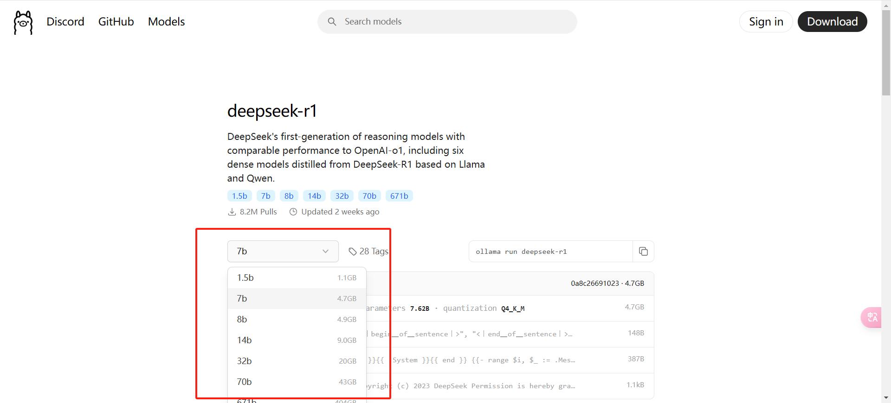

​	同时在选择版本的右侧还有具体的命令，复制命令直接在cmd中运行即可。

第四步，安装WebUI。

如果觉得命令太难看了，喜欢像ChatGPT一样进行可视化页面的提问，webUI是非常不错的。

一、安装Python3.11（一定要安装3.11以上的版本，否则不兼容）

链接：https://www.python.org/ftp/python/3.11.9/python-3.11.9-amd64.exe

二、安装的时候记得选择[Add python 3.11 to Path]选项，否则加不到系统变量里边去。

如果已经存在2版本的Python，需要将这个3.11版本的Python提到最前方，或者直接将Python2删除也可。

三、安装open-webui

```shell
pip install open-webui
```

等待安装。。。

之后搜索到open_webui.exe的地址，写入到Path路径。

确定之后，执行：

```shell
open-webui serve
```

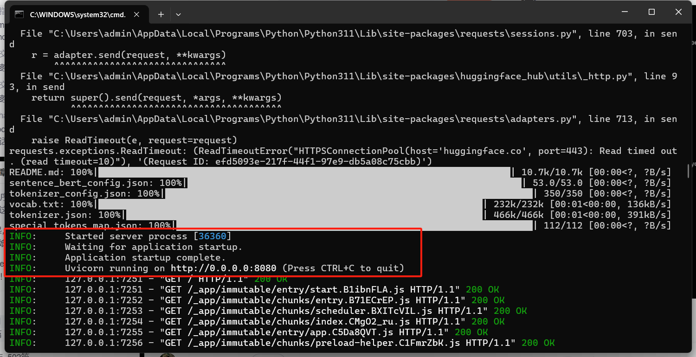

等待出现上述的Application startup complete说明已经成功启动，直接在浏览器中访问localhost:8080/即可。

之后就是注册什么管理员账号，随便写就行了。

进入页面之后，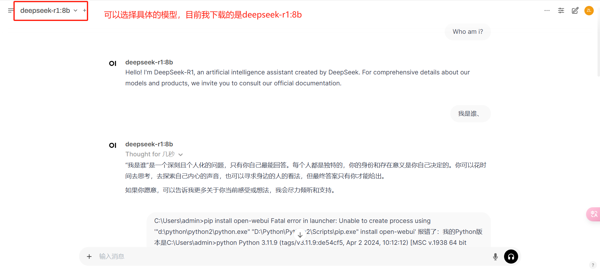

此时，Web端的模型已经成功结束。

## Deepseek部署-chatbox端（桌面端）

此处的就需要先进行API的申请了，下载chatbox之后输入API Key、secret即可使用。无需多言。

由于官网的API地址已经被关闭了，所以我们使用的是`硅基流动`的API。示例如图：

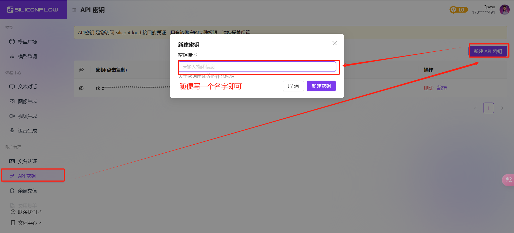

之后在chatbox中填入具体的API 。【设置】---> 【模型】 ---> 【API秘钥】 ---> 【保存】。

> 此处的是需要联网的，不是本地部署！！！

## LM studio部署安装

第一步，下载LM Studio，随便安装到哪一个盘中，我安装的是E盘。

之后打开这个工具，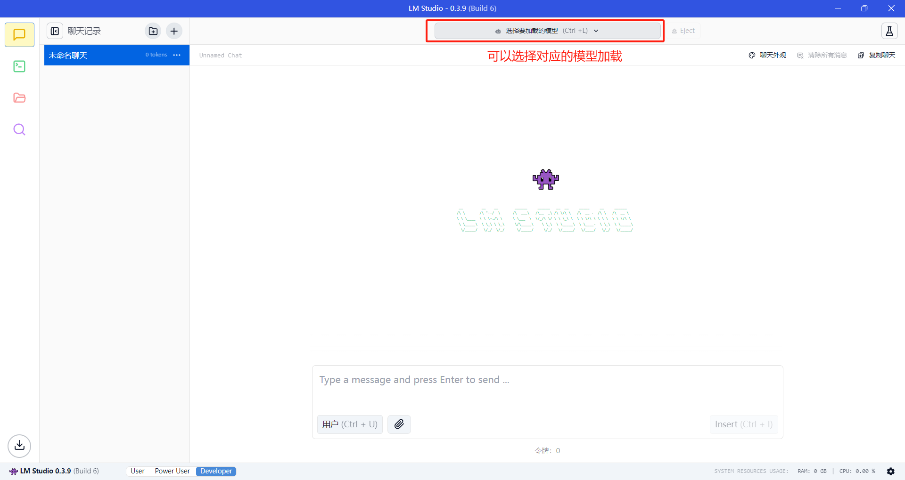

第二步，搜索对应的模型：deepseek。

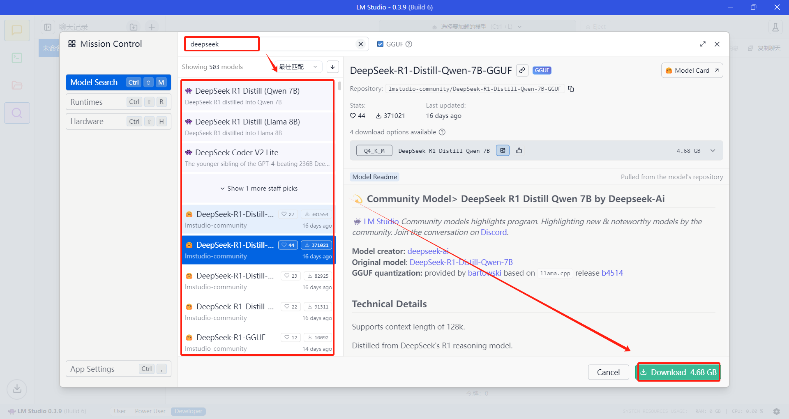

下载即可。

需要注意，默认下载的是使用的huggingface进行检索安装的，需要翻墙，我们需要将所有的文件中的`huggingface.co`替换成`hf-mirror.com`国内的镜像源。

> 直接在VSCode 中将整个下载的LM Studio打开，将所有的huggingface.co替换成hf-mirror.com即可。重新打开LM Studio即可。


等待下载安装成功。

此处很可能出现下载不了的情况或者是下载中断的情况，所以我们需要本地下载，并且将下载的模型导入到LM Studio。

怎么做呢？

第一步，点击Model Card，跳转到网页中的地址：

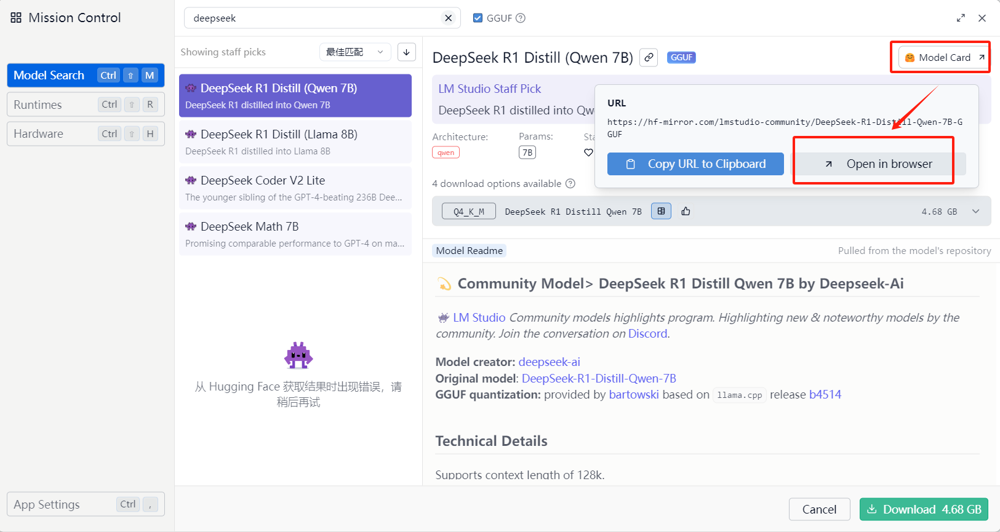

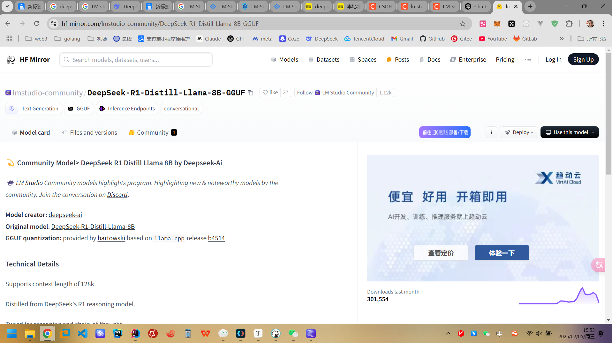

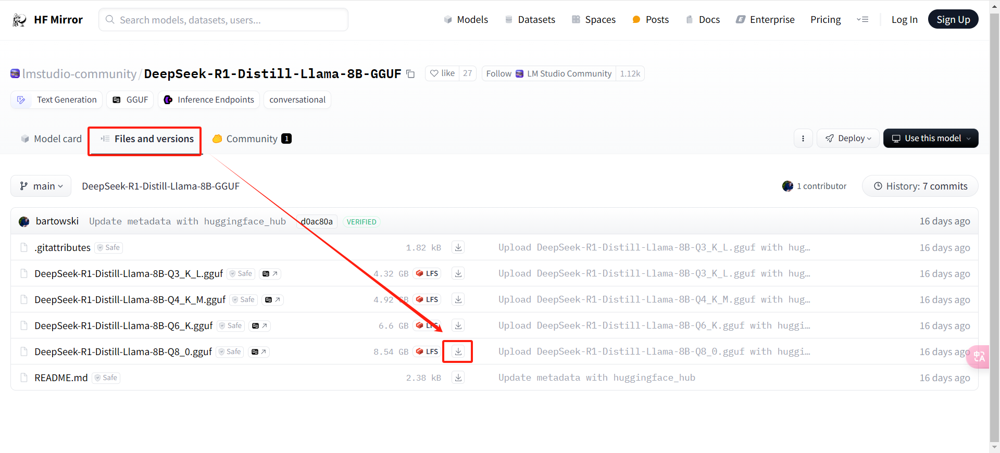

以我的这个8B的模型为例子，Files and versions 中选择相应的进行下载。

推荐使用IDM进行下载，多线程下载的更快。

下载完成之后放到模型对应的位置即可。

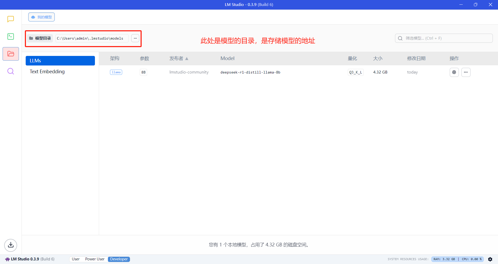

创建目录的时候需要将目录设置成具体的模型的名称：

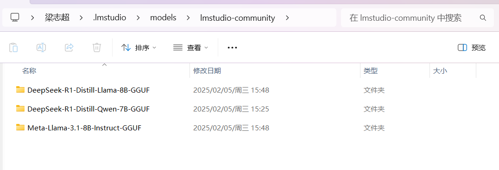

跟

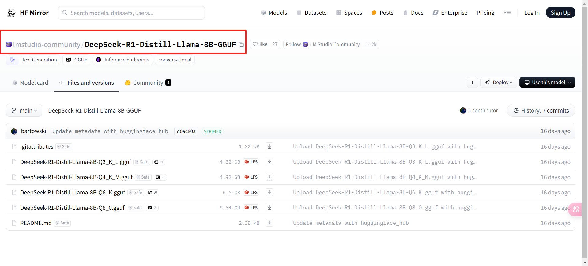

名称是对应的，之后将下载的模型添加到对应名称的文件夹中即可。

文件位置如下：

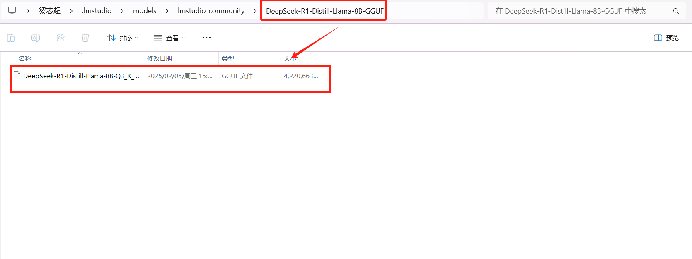

第二步，返回LM Studio中，选择对应的模型就可以进行聊天了。

我的是3050Ti，选择的模型是8B已经很慢了。所以如果慢的话最好的办法就是升级装备（有钱直接上A100，4090）。