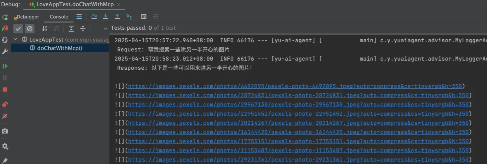
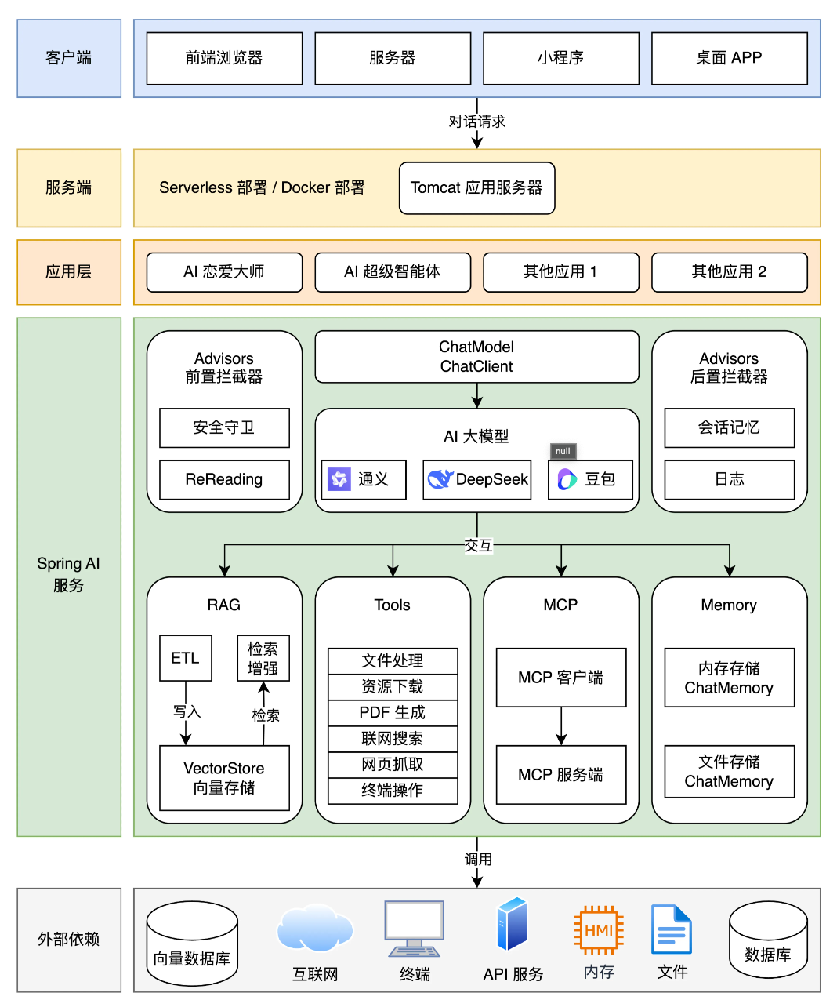

# Ai 超级智能体

## 项目介绍

### 大纲-项目优势

掌握知识:

- AI 应用平台的使用
- 接入AI大模型
- AI开发框架（SpringAI + LangChain4j）
- AI大模型本地部署
- Prompt工程和优化技巧
- 多模态特性
- SpringAI 核心特性：自定义拦截器、上下文持久化、结构化输出
- RAG知识库和向量数据库
- Tool Calling 工具调用
- MCP模型上下文协议和服务开发
- AI智能体Manus原理和自主开发
- AI服务化和Serverless部署

除此之外，还有其他的优势：

- AI云平台和编程双端实战，不仅仅会用AI服务，还要会自己写。
- 基于官方文档讲解最新的AI技术，细致入微，手撕文档和源码。
- 分享大量的AI扩展知识和编程技巧，掌握最佳实践

### 项目功能梳理

我们开发一个AI恋爱智能应用、一个拥有自主规划能力的超级智能体，以及一系列的工具Tools和MCP服务。

具体的需求如下：

- AI恋爱大师应用：用户在恋爱过程中难免会遇到各种各样的问题，我们可以让AI为用户提供贴心、友爱、有用的情感以及其他指导。支持多轮对话、对话记忆持久化、RAG知识库检索、工具调用、MCP服务调用。
- AI超级智能体：可以根据用户的需求，自主推理和行动、直到完成目标。
- 提供给AI的工具：联网搜索、文件操作、网页抓取、资源下载、终端操作、PDF生成。
- AI MCP服务：可以从特定的网站搜索。

### 技术选型

项目以SpringAI开发框架为核心，涉及到多种主流的AI客户端和工具库的使用。

- java21 + SpringBoot 3框架
- RAG知识库
- PGvector向量数据库
- Tool Calling工具调用
- MCP 模型上下文协议
- React Agent智能体的构建
- ServerLess计算服务
- AI 大模型开发平台百炼
- Cursor AI代码生成 + MCP 
- 第三方接口：如SearchAPI/Pexels API（后者是一个免费的图片素材网，原图素材）
- Ollama大模型部署
- Kryo高性能序列化
- Jsoup网页抓取
- iText PDF生成
- Knife4J 接口文档

### 架构图

