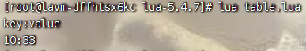
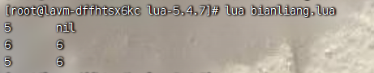

# LUA

## 基本使用

### 环境安装

#### Linux 中安装LUA

```shell
sudo yum install epel-release
sudo yum install lua
```

#### Windows安装LUA

下载地址：https://github.com/rjpcomputing/luaforwindows/releases

安装之后就可以在这个环境中使用lua了。

### 基本语法

在使用lua的时候我们直接在Linux中进行了（centos7.9）

启用lua程序：

```shell
lua -i
```

第一个Helloworld

```shell
>print("Hello World!")
Hello World!
```

脚本式lua,假设我们已经存在一个文件：hello.lua，内容如下

```shell
print("hello world")
print("你好世界")
```

之后执行：

```shell
lua hello.lua
```

#### 注释

```shell
--[[ 这是注释内容 
1111
--]]
```

#### 全局变量

在默认的情况下，变量总是认为全局的。全局的变量不需要声明，访问一个没有初始化的全局变量也不会出错，而是会显示nil。

```shell
>print(b)
nil
> b=10
>print(b)
10
```

如果想要删除一个变量，直接将这个变量设置成nil即可。

### 数据类型

| 数据类型 | 描述                                                         |
| -------- | ------------------------------------------------------------ |
| nil      | 只有值nil属于该类，表示一个无效值，在boolean中表示false      |
| boolean  | 包含false、true                                              |
| number   | 表示双精度类型的实浮点数                                     |
| string   | 字符串由一对双引号或者单引号来表示                           |
| function | 由C或者lua编写的函数                                         |
| userdata | 表示任意存储在变量中的C数据结构                              |
| thread   | 表示执行的独立线路，用于执行协同程序                         |
| table    | 是一个关联数组，数组的索引可以是数字、字符串或者表类型。最简单的构造表达式是{} |

```shell
> print(type("hello"))
string
> print(type(12.3))
number
> print(type(print))
function
> print(type(type))
function
> print(type(true))
boolean
> print(type(nil))
nil
> print(type(type(x)))
string
```

#### nil

##### nil比较的时候需要加上string类型

```shell
> print(type(x))
nil
> print(type(x)==nil)
false
> print(type(x)=="nil")
true
```

> 出现以上原因是因为type(x)实质上返回的是"nil"字符串，是一个string类型

#### boolean

lua 可以将false和nil看成false，其他的都是true，数字0也是true。

```sehll
print(type(true))
print(type(false))
print(type(nil))
 
if false or nil then
    print("至少有一个是 true")
else
    print("false 和 nil 都为 false")
end

if 0 then
    print("数字 0 是 true")
else
    print("数字 0 为 false")
end
```

输出结果：

```shell
boolean
boolean
nil
false 和 nil都是false
数字0是true
```

#### number

```shell
> print(type(2))
number
> print(type(2.3))
number
> print(type(0.3))
number
> print(type(2e+1))
number
> print(type(0.2e-1))
number
```

#### string

基本使用方式是双引号来表示：""。

如果是一大段字符串，需要使用[[]]。

在对一个数字字符串进行算术运算的时候，Lua会尝试将这个数字字符串转换成一个数字。

字符串进行拼接使用的是：..

使用#来表示字符串的长度。

```shell
> print("2" + 6)
8.0
> print("2" + "6")
8.0
> print("2 + 6")
2 + 6
> print("-2e2" * "6")
-1200.0
> print("error" + 1)
stdin:1: attempt to perform arithmetic on a string value
stack traceback:
        stdin:1: in main chunk
        [C]: in ?
> print("a" .. 'b')
ab
> print(157 .. 428)
157428
> len = "www.runoob.com"
> print(#len)
14
> print(#"www.runoob.com")
14
```

#### table

lua中，table创建是通过“构造表达式”来进行的，最简单的表达式就是{}，用来创建一个空的表。

```shell
-- table_test.lua 脚本文件
a = {}
a["key"] = "value"
key = 10
a[key] = 22
a[key] = a[key] + 11
for k, v in pairs(a) do
    print(k .. " : " .. v)
end
```

执行结果：



与其他语言不同，Lua不能将0作为初始索引，默认的初始索引一般是1.

```shell
-- table_test2.lua 脚本文件
local tbl = {"apple", "pear", "orange", "grape"}
for key, val in pairs(tbl) do
    print("Key", key)
end
```

执行结果：

key     1
key     2
key     3
key     4

table不是定长的，可以自由的增加长度。

#### function

```shell
function fun1(n) 
        if n==0  then 
                return 1
        else 
                return  n * fun1(n - 1)
        end 
end 
print(fun1(5))
fun2 = fun1
print(fun2(5))
```

执行结果：

[root@lavm-dffhtsx6kc lua-5.4.7]# lua function.lua 
120
120

function还可以以匿名的方式进行参数传递。

```shell
-- function_test2.lua 脚本文件
function testFun(tab,fun)
        for k ,v in pairs(tab) do
                print(fun(k,v));
        end
end


tab={key1="val1",key2="val2"};
testFun(tab,
function(key,val)--匿名函数
        return key.."="..val;
end
);
```

执行结果：

key1=val1
key2=val2

#### thread

Lua中，最主要的线程是协同程序（coroutine），它跟线程差不多，拥有自己独立的栈、局部变量和指令指针。

可以跟其他协同程序共享全局变量和其他大部分东西。

#### userdata

是用户自定义数据，用于表示一种由C/C++语言库所创建的类型。可以将任意的C/C++数据类型的数据存储到Lua变量中调用。

### 变量

使用变量需要进行声明，

直接看代码实例：

```shell
a = 5
local b = 5

function joke() 
	c=5
	local d = 6
end 

joke()
print(c, d)

do 
	local a = 6
	b = 6
	print(a, b)
end 
print(a, b)
```

执行结果：



lua赋值，可以对多个变量同时进行赋值，变量列表和值列表分别使用逗号隔开，赋值语句右边的值会依次赋值给左边的变量。如果变量个数和值的个数不相同的话，会采取以下措施：

> 1. 变量个数 > 值的个数					按照变量个数补充nil
> 2. 变量个数 < 值的个数           多余的值会被忽略掉
>
> > 尤其需要注意：a,b,c = 0不是ABC都是0 ， 而是只有a会被赋值为0

### 循环

##### while

语法:

```shell
while(condition)
do 
	statements
end
```

##### for

语法

```shell
for var=exp1, exp2, exp3 do
	<执行体>
end
```

var 值从exp1变化到exp2，每一次变化以exp3为步长递增。执行依次执行体。

```shell
for i=10,1,-1 do
    print(i)
end
```

泛型for循环

```shell
a = {"one", "two", "three"}
for i, v in ipairs(a) do
	print(i, v)
end
```

i是数组索引，v是对应索引数组的属性值，ipairs是Lua提供的迭代器函数，用来迭代数组。

基础学习先到此结束。之后再继续补充！


# Redis结合Lua

参考文章：https://blog.csdn.net/qq_39093474/article/details/134914831

## 在Redis中调用Lua脚本


## 进阶

> 注意：在写Lua脚本的时候会区分大小写，KEYS和ARGV必须是大写的。

```shell
127.0.0.1:6379> eval "return {keys[1], argv[1], argv[2]}" 1 key1 one two
(error) ERR user_script:1: Script attempted to access nonexistent global variable 'keys' script: 300bc2cd7772cfb13991321c45b106e65893bd1e, on @user_script:1.
```

```shell
127.0.0.1:6379> eval "return {KEYS[1], ARGV[1], ARGV[2]}" 1 key1 one two
1) "key1"
2) "one"
3) "two"
```


## 案例

redis整合LUA脚本的案例。限流指的是应用模块要限制指定的IP在单位时间内的访问次数。

lua脚本：

**limit.lua**

```shell
local obj=KEYS[1]
local limitNum=tonumber(ARGV[1])
local curVisitNum=tonumber(redis.call('get',obj) or '0')
if(limitNum == curVisitNum) then
	return 0
else
	redis.call('incrby',obj,'1')
	redis.call('expire',obj,ARGV[2])
	return curVisitNum+1
end
```

- KEYS[1]用来接收待限流的对象

- ARGV[1]表示限流的次数

- ARGV[2]表示限流的时间单位

**LuaConrtoller.java**

```java
@RequestMapping("/lua")
@RestController
public class LuaController {
    private DefaultRedisScript<Long> limitScript;

    @Autowired
    private RedisTemplate<String, Object> redisTemplate;

    @PostConstruct
    public void init() {
        limitScript = new DefaultRedisScript<>();
        limitScript.setResultType(Long.class);
        limitScript.setScriptSource(new ResourceScriptSource(new ClassPathResource("limit.lua")));
    }

    @GetMapping("/testLimit")
    public String testLimit() {
        Boolean aBoolean = canVisit("limit", 3, 10);
        if (aBoolean) {
            return "可以访问";
        } else {
            return "不可以访问";
        }
    }

    public Boolean canVisit(String key, int oldValue, int newValue) {
        List<String> keys = new ArrayList<>();
        keys.add(key);
        Long execute = redisTemplate.execute(limitScript, keys, String.valueOf(oldValue),String.valueOf(newValue));
        System.out.println(execute);
        return !(0==execute);
    }
}
```

**RedisConfig.java**

```java
@Configuration
public class RedisConfig {

    @Bean
    public RedisTemplate<String, Object> redisTemplate(RedisConnectionFactory redisConnectionFactory) {
        RedisTemplate<String, Object> template = new RedisTemplate<>();
        template.setConnectionFactory(redisConnectionFactory);

        // 使用StringRedisSerializer 来序列化Redis的key
        template.setKeySerializer(new StringRedisSerializer());
        template.setValueSerializer(new StringRedisSerializer());

        return template;
    }
}
```


