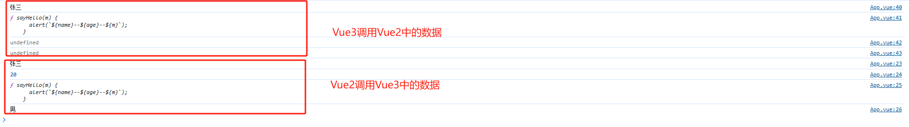
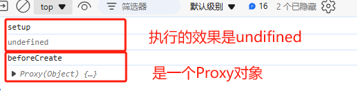

# Vue3

## 1. vue3的简介

### 1.1 性能的提升

- 打包大小减少41%
- 初次渲染块55%，更新渲染块133%。
- 内存减少54%。

### 1.2 原码的升级

使用代理Proxy代替defineProperty实现响应式。

重写虚拟DOM的实现和Tree-Shaking。

### 1.3 拥抱TS

Vue3可以更好的支持TS。

### 1.4 新的特性

组合API

## 2. 创建Vue3工程

### 2.1 基于Vite创建

Vite是新一代的前端构建工具，优势如下：

- 轻量快速的热重载。能够实现急速服务启动。
- 对TypeScript、JSX、CSS支持开箱即用。
- 真正的按需编译。


## 3. Vue3的核心语法

### 3.1 OptionsAPI和CompositionAPI

Vue2的API设计是Option风格的。

Vue3的API设计是CompositionAPI风格的。

#### 3.1.1 Option API的弊端

Options类型的API，数据、方法、计算属性等，是分散在：data、methods、computed中的，如果想要新增或者修改一个需求，就分别要修改data、methods、computed，不便于维护和复用。

#### 3.1.2 CompositionAPI的优势

可以使用函数式的代码，更加优雅的组织代码，让相关功能的代码更加的紧凑。

### src目录

**main.ts文件**

createApp：是类似于种花时候的盆子。

App：是类似于植物的根

createApp(App).mount('#app')：创建根组件，并且挂载到app的div标签中，也就是index.html中的div标签。

所以说index.html中就需要有app为id的组件并且需要将main.ts引入到index.html中。

#### Vue的结构

总体上分成3种结构，

```vue
<template>
	<!-- 写HTML结构 -->
</template>

<script lang = 'ts'>
	//写JS或者TS
</script>

<style>
	/*写CSS样式*/
</style>
```

### 3.2 setup

#### setup 概述

setup 是VUE3 中的一个新的配置项，他的返回值是一个函数。所有组合式API方法都写在setup函数中。是我们组合式API的最基本的东西。

```vue
<template>
  <div class="person">
    <h2>姓名: {{ name }}</h2>
    <h2>年龄: {{ age }}</h2>
    <button @click="changeName"> 修改名字 </button>
    <button @click="changeAge"> 修改年龄 </button>
    <button @click="showTel">查看联系方式</button>

    <button @click="b">点击B</button>
  </div>

</template>

<script lang="ts">
export default {
  name:'Person',
  
  // VUE2 的语法可以与VUE3的语法共存，但是setup的生命周期会更早
  // data中的数据可以从setup中取到，但是setup中的数据不能从data中取出。主要讲究的就是一个推陈出新
  data(){
    return {
      a:100,
      c:this.name
    }
  },

  methods: {
    b(){
      console.log('b')
      console.log(this.c)
    }
  },

  setup() {
    // console.log('@@',this) //setup 中的this是undifined
    // 数据
    let name = '张三' //注意此时的name不是响应式的
    let age = 180  // 此时的age 不是响应式的
    let tel = '10000000000' // 此时的tel也不是响应式的

    // 方法
    function changeName(){
      console.log(1)
      name = 'zhang-san'
      console.log(name)
    }
    function changeAge() {
      console.log(2)
      age += 1
      console.log(age)
    }
    function showTel() {
      console.log(3)
      alert(tel)
      console.log(tel)
    }
    return {name, age, tel, changeName, changeAge, showTel}
  }
}
</script>

<style scoped>
  .person{
    background-color: skyblue;
    box-shadow: 0 0 10px;
    border-radius: 10px;
    padding: 20px;
  }

  button {
    margin: 0 5px;
  }
</style>
```

##### 注意：setup函数尽量不要和VUE2混合使用

> 1. vue2中的(data,methods,computed)可以访问到setup中的属性和方法。
> 2. 在setup中不能访问到vue2中的配置的数据和方法(data、methods、computed)
>
> ```vue
> <template>
>   <div>
>     <p>姓名:{{ name }}</p>
>     <p>年龄:{{ age }}</p>
>     <p @click="sayHello(10)">说话</p>
>     <p>{{ height }}</p>
>   </div>
>   <div @click="test1">vue2中的事件test1</div>
>   <div @click="test2">vue3中的事件test2</div>
> </template>
> 
> <script>
> export default {
>   name: "App",
>   data() {
>     return {
>       sex: '男',
>       height: 186
>     }
>   },
>   methods: {
>     test1() {
>       console.log(this.name);
>       console.log(this.age);
>       console.log(this.sayHello);
>       console.log(this.sex);
>     }
>   },
>   setup() { //为一个函数
>     //定义变量 
>     let name = "张三";
>     let age = 20;
>     let height = 176;
>     // 定义方法
>     function sayHello(m) {
>       alert(`${name}--${age}--${m}`);
>     }
> 
>     function test2() {
>       console.log(this.name);
>       console.log(this.sayHello);
>       console.log(this.sex);
>       console.log(this.test1);
>     }
>     return { //setup函数返回值为一个对象
>       name,
>       age,
>       sayHello,
>       test2,
>       height // setup变量
>     };
>   },
> };
> </script>
> 
> <style scoped>
> header {
>   line-height: 1.5;
> }
> 
> .logo {
>   display: block;
>   margin: 0 auto 2rem;
> }
> 
> @media (min-width: 1024px) {
>   header {
>     display: flex;
>     place-items: center;
>     padding-right: calc(var(--section-gap) / 2);
>   }
> 
>   .logo {
>     margin: 0 2rem 0 0;
>   }
> 
>   header .wrapper {
>     display: flex;
>     place-items: flex-start;
>     flex-wrap: wrap;
>   }
> }
> </style>
> 
> ```
>
> 

##### setup执行时间

setup执行时间在beforeCreate()之前，

```vue.js
<script>
export default {
  name: "App",
  beforeCreate() {
    console.log('beforeCreate');
    console.log(this);
  },
  setup() { //为一个函数
    console.log('setup');
    console.log(this);
  },
};
</script>
```

效果：



#### setup语法糖

我们需要先添加一个插件：

```shell
npm i vite-plugin-vue-setup-extend -D
```

然后在vite.config.ts文件中添加插件

```ts
import VueSetupExtend from 'vite-plugin-vue-setup-extend'

export default defineConfig({
  plugins: [
    vue(),
    VueSetupExtend()
  ],
  resolve: {
    alias: {
      '@': fileURLToPath(new URL('./src', import.meta.url))
    }
  }
})
```

在原本的script标签的基础上修改，将data部分和Function部分单独分离出来。

```vue
<script lang='ts' setup name="Person123">
    // console.log('@@',this) //setup 中的this是undifined
    // 数据
    let name = '张三' //注意此时的name不是响应式的
    let age = 180  // 此时的age 不是响应式的
    let tel = '10000000000' // 此时的tel也不是响应式的

    // 方法
    function changeName(){
      console.log(1)
      name = 'zhang-san'
      console.log(name)
    }
    function changeAge() {
      console.log(2)
      age += 1
      console.log(age)
    }
    function showTel() {
      console.log(3)
      alert(tel)
      console.log(tel)
    }
</script>
```

将原本的 <script lang='ts'></script>删除即可。

效果：

#### ref

可以将值直接展示在页面上，直接渲染。

可以接受基础类型或者是对象类型。如果是基础类型的话就是Object.defineProperty()。如果是对象类型的话就是使用的Proxy。

```vue
<script lang='ts' setup name = "Person123">
    import {ref} from 'vue'
    
    let name = ref('张三')
    let age = ref(18)
    let address = '北京市海淀区'
    let tel = '17343601491'
    
    function changeName() {
        console.log(1)
        name.value = 'zhang-san'
        console.log(name)
    }
    function changeAge() {
        console.log(2)
        age.value = 20
        console.log(age)
    }
    function showTel() {
        console.log(3)
        alert(tel)
        console.log(tel)
    }

</script>
```

效果展示：


修改之后：


ref =======> 基本数据类型

reactive ======>对象基本类型

#### reactive

```vue
<script lang='ts' setup name="Person123">
import {reactive} from 'vue'
// 数据
  let car = reactive({brand:'奔驰', price:100})

  let games = reactive([
    {id:'kjsdhfjdshf01',  name:"原神"},
    {id:'kjsdhfjdshf02',  name:"王者荣耀"},
    {id:'kjsdhfjdshf03',  name:"Elden Ring"},
  ])

  // 方法
  function changePrice() {
    car.price += 10
  }
  //修改第一个游戏
  function changeFirstGame() {
    games[0].name = '幻兽帕鲁'
  }
</script>
```

reactive 包裹的是对象类型的数据可以进行响应式。

#### 再说ref

ref 其实不仅仅可以包裹基本类型，同时对象类型也是完全可以包裹的。

```vue
<script lang='ts' setup name="Person123">
import {ref} from 'vue'
// 数据
  let car = ref({brand:'奔驰', price:100})

  let games = ref([
    {id:'kjsdhfjdshf01',  name:"原神"},
    {id:'kjsdhfjdshf02',  name:"王者荣耀"},
    {id:'kjsdhfjdshf03',  name:"Elden Ring"},
  ])

  // 方法
  function changePrice() {
    car.value.price += 10
  }
  //修改第一个游戏
  function changeFirstGame() {
    games.value[0].name = '幻兽帕鲁'
  }
</script>
```

我们可以直接使用对象的value来将对象的属性值进行展示，同时使用ref进行包裹，将最终的值进行响应式展示。

#### ref和reactive比较

> 1. ref 用来定义：基本类型、对象数据类型
> 2. reactive用来定义：对象数据类型

- 区别：

> 1. ref 创建的变量必须使用.value来进行输入（可以使用volar插件自动添加.value）
> 2. reactive 重新分配一个新的对象，会失去响应式（可以使用OBject.assign去整体替换）

- 使用原则

> 1. 如果使用基本类型，只能使用ref。
> 2. 如果是对象类型，那么可以使用ref和reactive两种
> 3. 如果是层级关系的响应式对象，并且层级不深，更加推荐使用reactive。

> 一个对象的例子：如果我们的对象是Car，其中包含两个属性：brand和price，
>
> ```vue
> <button @click="changeCar">点击换车</button>
> <script lang = 'ts' setup name = "Person">
> 	import {reactive} from 'vue'
>     let car = reactive({brand:'奔驰', price:100})
>     function changeCar() {
>     Object.assign(car, {brand:'奥拓', price:1})
>   }
> </script>
> ```
>
> 和
>
> ```vue
> <button @click="changeCarByRef">点击换车</button>
> <script lang = 'ts' setup name = "Person">
>     import {ref} from 'vue'
>     let car = ref({brand:'奔驰', price:100})
>     function changeCarByRef() {
>     car.value = {brand:"奥拓", price:2}
>   }
> </script>
> ```
>
> 展示的效果其实是相同的。

#### vue3响应式原理

##### vue2响应式原理

通过Object.defineProperty()对属性读取，修改进行拦截。对数据操作进行监听。

```vue.js

```

##### vue3响应式

相较于Vue2，还是先比较问题：

对象数据新增属性和删除属性，不会存在vue2的问题。

```vue.js
<template>
  <div>
    <p>{{ person.name }}</p>
    <p>{{ person.age }}</p>
    <p>{{ person.sex }}</p>
    <button @click="addSex">添加属性</button>
    <button @click="deleteSex">删除属性</button>
  </div>
</template>
 
<script>
import { reactive } from "vue";
export default {
  name: "App",
  components: {},
  setup() {
    let person = reactive({
      name: "张三",
      age: 20,
    });
    console.log(person);
    //定义添加属性
    function addSex() {
      person.sex = "男";
      console.log(person);
    }
    // 定义删除属性
    function deleteSex() {
      delete person.sex;
      console.log(person);
    }
    return {
      person,
      addSex,
      deleteSex,
    };
  },
};
</script>
```

数组数据直接通过修改下标，修改数组，不会存在vue2的问题。

```vue.js
<template>
  <div>
    <p v-for="(item, index) in person.like" :key="index">{{ item }}</p>
    <button @click="change">修改数组的值</button>
  </div>
</template>

<script>
import { reactive } from 'vue';
export default {
  name: 'App',
  components: {},
  setup() {
    let person = reactive({
      name: '张三',
      age: 20,
      like: ["打篮球", "敲代码"]
    });

    console.log(person);

    function change() {
      person.like[0] = '看电影'
    }

    return {
      person,
      change
    }
    
  }
};
</script>

<style scoped>
</style>

```

##### vue3具体的原理实现

通过Proxy的代理，拦截对象中任意属性的变化，包括读取、删除、修改、设置。

通过Reflect反射对被代理对象的属性进行操作。

```vue
let person = {
      name: '张三',
      age: 20
    };

    console.log(Proxy);

    // 使用p对象代理data, Proxy是Window的内置的代理函数
    let p = new Proxy(person, {
      // 读取属性
      get(target, propName) { // target就是data
        console.log(`读取p上个${propName}属性`);
        return Reflect.get(target, propName)
      },

      // 设置属性
      set(target, propName, value) {
        console.log(`修改p的${propName}属性`);
        Reflect.set(target, propName, value)
      },

      // 删除属性
      deleteProperty(target, propName) {
        console.log(`删除p上的${propName}属性`);
        return Reflect.deleteProperty(target, propName)
      }
    })
```

### 3.3 toRefs和toRef属性

一个是单数，另一个是可以操作多个属性。

```vue
<script lang='ts' setup name="Person">
import { reactive, toRef } from 'vue'
import { toRefs } from 'vue'
// 数据
let person = reactive({
  name: '张三',
  age: 18
})

// 这里改的是Person对象中的属性，一旦修改了原本对象中的属性也会修改
let { name, age } = toRefs(person)
// 这里改的是单个属性的值，同Refs的区别就是这个是单数，只能修改一个对象中的某一个属性的值
let nl = toRef(person, 'age')

function changeName() {
  name.value += '~'
  console.log(name, person.name)
}

function changeAge() {
  age.value += 1
  console.log(age, person.age)
}

function changeNL() {
  nl.value += 10
  console.log(nl)
}
</script>
```

很明显，一个是基于整个Person进行修改，可以修改属性，同时toRef的属性是基于person的单个属性进行赋值操作。

### 3.4 计算属性

computed属性，

```vue
<template>
  <div class="person">
    姓：<input type="text" v-model="firstName"> <br>
    名：<input type="text" v-model="lastName"> <br>
    全名：<span>{{ firstName }}-{{ lastName }}</span>
    全名：<span>{{ fullName2() }}</span>
    全名：<span>{{ fullName2() }}</span>
    全名：<span>{{ fullName2() }}</span>
    全名：<span>{{ fullName2() }}</span>
    全名：<span>{{ fullName2() }}</span>
  </div>
</template>

<script lang='ts' setup name="Person">
import { ref, computed } from 'vue'

let firstName = ref('张')
let lastName = ref('三')

function fullName2() {
  console.log(2)
  return firstName.value.slice(0, 1).toUpperCase() + firstName.value.slice(1) + '-' + lastName.value
}


let fullName = computed(() => {
  console.log(1)
  return firstName.value.slice(0, 1).toUpperCase() + firstName.value.slice(1) + '-' + lastName.value
})

</script>
```

> 我们使用computed和Function的区别是方法没有缓存，会执行很多次，但是我们的computed只会执行一次，所以说使用场景会有区别。

同时此时的computed属性只是只读的，而我们所需要的效果是可以直接修改全名，因为我们的全名现在是通过修改firstName和lastName进行修改的。

```vue
let fullName = computed({
  get() {
    return firstName.value.slice(0, 1).toUpperCase() + firstName.value.slice(1) + '-' + lastName.value
  },

  set(val) {
    val.split('-')
    console.log('set', val)
    const [str1, str2] = val.split('-')
    firstName.value = str1
    lastName.value = str2
  }
})

function changeFullName() {
  fullName.value = 'li-si'
}
```

通过实现get、set方法便可以将数据进行修改展示。

OVER!!

### 3.5 watch

- 作用：监视数据的变化
- Vue3中的Watch只能监视一下的四种数据：

> 1. ref 定义的数据
> 2. reactive 定义的数据
> 3. 函数返回一个值（getter函数）
> 4. 一个包含上述内容的数据

#### 情况一：监视【Ref】定义的 【基本数据类型】数据

```vue
<template>
  <div class="person">
    <h1>情况一：监视【Ref】定义的【基本类型】数据</h1>
    <h2>当前求和为: {{ sum }}</h2>
    <button @click="changeSum">点我数据加一</button>
  </div>
</template>

<script lang='ts' setup name="Person">
import { ref, watch } from 'vue'
// 数据
let sum = ref(0)
// 方法
function changeSum() {
  sum.value++
}
// 监视：情况一：监视【Ref】定义的【基本类型】数据
const stopWatch = watch(sum, (newValue, oldValue) => {
  console.log('sum变化了', newValue, oldValue)
  if (newValue >= 10) {
    stopWatch()
  }
})
</script>


<style scoped>
.person {
  background-color: skyblue;
  box-shadow: 0 0 10px;
  border-radius: 10px;
  padding: 20px;
}

li {
  font-size: 0 5px;
}

button {
  margin: 0 5px;
}
</style>
```

效果：

#### 情况二：监视【Ref】定义的 【对象数据类型】数据

> 注意：
>
> - 若修改的是Ref定义的对象中的属性，newValue和oldValue都是新的值，因为他们是同一个对象。
> - 若修改的是Ref定义的对象，newValue是新值，oldValue是旧值，因为不是同一个对象了。

```vue
<template>
  <div class="person">
    <h1>情况二：监视【Ref】定义的【对象类型】数据</h1>
    <h2>姓名：{{ person.name }}</h2>
    <h2>年龄：{{ person.age }}</h2>
    <button @click="changName">修改名字</button>
    <button @click="changAge">修改年龄</button>
    <button @click="changPerson">修改人</button>
  </div>
</template>

<script lang='ts' setup name="Person">
import { Agent } from 'http';
import { ref, watch } from 'vue'

let person = ref({
  name: '张三',
  age: 18
})

function changName() {
  person.value.name += '~'
}

function changAge() {
  person.value.age += 1
}

function changPerson() {
  person.value = {
    name: '李四',
    age: 90
  }
}

// 监视, 情况二：监视的是ref的对象类型，监视的是对象的地址值，若要监视对象内部属性的 属性 变化，需要手动开启deep
watch(person, (newValue, oldValue) => {
  console.log('person变化了', newValue, oldValue)
}, { deep: true})
</script>


<style scoped>
.person {
  background-color: skyblue;
  box-shadow: 0 0 10px;
  border-radius: 10px;
  padding: 20px;
}

li {
  font-size: 0 5px;
}

button {
  margin: 0 5px;
}
</style>
```

#### 情况三：监视【reactive】定义的【对象类型】的数据

监听reactive定义的【对象类型】数据，并且默认开启了深度监视。

```vue
<template>
  <div class="person">
    <h1>情况三：监视【reactive】定义的【对象类型】数据</h1>
    <h2>姓名：{{ person.name }}</h2>
    <h2>年龄：{{ person.age }}</h2>
    <button @click="changName">修改名字</button>
    <button @click="changAge">修改年龄</button>
    <button @click="changPerson">修改人</button>
  </div>
</template>

<script lang='ts' setup name="Person">
import { Agent } from 'http';
import { reactive, watch } from 'vue'

let person = reactive({
  name: '张三',
  age: 18
})

function changName() {
  person.name += '~'
}

function changAge() {
  person.age += 1
}

function changPerson() {
  Object.assign(person, {
    name: '李四',
    age: 99
  })
}

//watch
watch(person, (newValue, oldValue) => {
  console.log('person变化了', newValue, oldValue)
})
</script>


<style scoped>
.person {
  background-color: skyblue;
  box-shadow: 0 0 10px;
  border-radius: 10px;
  padding: 20px;
}

li {
  font-size: 0 5px;
}

button {
  margin: 0 5px;
}
</style>
```

#### 情况四：监视Ref或者reactive定义的【对象类型】数据中的某一个属性

1. 若该属性值不是【对象类型】，需要写成函数类型。
2. 若该属性值依然是【对象类型】，可以直接遍，也可以写成函数，建议直接写成函数。

结论：监视的如果是对象里的属性，最好就是直接写成函数式，如果对象监视的是地址值，需要关注对象内部，需要手动开启深度监视。

```vue
<template>
  <div class="person">
    <h2>姓名：{{ person.name }}</h2>
    <h2>年龄：{{ person.age }}</h2>
    <h2>汽车：{{ person.car.c1 }}、{{ person.car.c2 }}</h2>
    <button @click="changeName">修改名字</button>
    <button @click="changeAge">修改年龄</button>
    <button @click="changeC1">修改第一台车</button>
    <button @click="changeC2">修改第二台车</button>
    <button @click="changeCar">修改整个车</button>
  </div>
</template>

<script lang='ts' setup name="Person">
import { reactive, watch } from 'vue'

//数据
let person = reactive({
  name: '张三',
  age: 18,
  car: {
    c1: '奔驰',
    c2: '宝马'
  }
})

//方法
function changeName() {
  person.name += '~'
}

function changeAge() {
  person.age += 1
}

function changeC1() {
  person.car.c1 = '奥迪'
}

function changeC2() {
  person.car.c2 = '大众'
}

function changeCar() {
  person.car = {
    c1: '雅迪',
    c2: '艾玛'
  }
}

// 监听响应式对象的某一个属性，并且该属性是基本类型吗，要写成函数式
watch(() => person.name, (newValue, oldValue) => {
  console.log('person.name发生变化', newValue, oldValue)
}
watch(() => person.age, (newValue, oldValue) => {
  console.log('person.age发生变化', newValue, oldValue)
})

// 监听
watch(() => person.car, (newValue, oldValue) => {
  console.log('person.car发生变化', newValue, oldValue)
}, { deep: true })
</script>


<style scoped>
.person {
  background-color: skyblue;
  box-shadow: 0 0 10px;
  border-radius: 10px;
  padding: 20px;
}

li {
  font-size: 0 5px;
}

button {
  margin: 0 5px;
}
</style>
```


