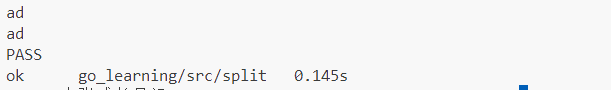
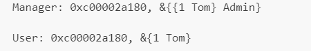

# GO学习

## 开发环境

### Go的安装

Mac上的GO语言环境安装在/usr/local/go文件夹下。从终端进去就看到了。安装不做过多介绍。可以查看教程：https://blog.csdn.net/m0_46185271/article/details/142203709。

配置环境变量：配置~/.bash_profile文件。

```shell
#注意=号前后不能有空格
export GOPATH=/Users/maoheidan/Documents/Go_Works/my_Golang  #请改成你的项目路径
export GOBIN=$GOPATH/bin   #GOLANG运行目录一般不可修改
export PATH=$PATH:$GOBIN 
```

最后执行：source ~/.bash_profile。

如果出现情况：不支持相对路径的话，使用命令执行代码的话需要加上：

```shell
GO111MODULE=off go run main.go
```

### 不同平台的编译

默认我们go build的可执行文件都是当前操作系统可执行的文件，Go语言支持跨平台编译----在当前平台（例如Windows）下编译其他平台的可执行文件。

#### Windows编译Linux可执行文件

只需要在编译时指定目标操作系统的平台和处理器架构即可。

如果Windows用的是cmd，按照如下方式指定环境变量。

```shell
SET CGO_ENABLED=0 # 禁用CGO
SET GOOS=linux    # 目标平台是Linux
SET GOARCH=amd64  # 目标处理器架构是amd64
```

如果Windows是PowerShell终端，设置环境变量的语法是:

```shell
$ENV:CGO_ENABLED=0
$ENV:GOOS="linux"
$ENV:GOARCH="amd64"
```

执行完成之后，再执行下面的命令，得到的是能够在Linux平台运行的可执行文件了。

```shell
go build
```

#### Mac 编译Linux可执行文件

```shell
CGO_ENABLED=0 GOOS=linux GOARCH=amd64 go build
```

#### Mac编译Windows可执行文件

```shell
CGO_ENABLED=0 GOOS=windows GOARCH=amd64 go build
```

#### Linux编译Mac可执行文件

```shell
CGO_ENABLED=0 GOOS=darwin GOARCH=amd64 go build
```

#### Linux编译Windows可执行程序

```shell
CGO_ENABLED=0 GOOS=windows GOARCH=amd64 go build
```

### 目前流行的项目结构

GO语言中也是通过包来组织代码文件，我们可以通过引入别人的包也可以发布自己的包，为了防止不同的包名冲突，通常使用顶级域名进行包名的前缀。

开发者不一定存在自己的顶级域名，那么就可以使用GitHub来进行：

例如：

```go
import "github.com/zhangsan/studygo"
```

和

```go
import "github.com/lisi/studygo"
```

用来区分两个人张三和李四的包。

主要的项目结构是三层：bin（存放编译后的二进制文件）、pkg（存放编译后的库文件）、src（存放源码文件）。

## GO基础

### golang简介

#### 历史

盘古开天辟地的时候，有一个不出名的小IT公司，名字叫Google，他们允许员工有自己的时间开发实验性项目。在2007年的某一天，公司的几个大牛，正在使用C++开发一些比较繁琐的工作，包括庞大的分布式集群，大牛觉得很闹心，后来C++委员会来公司演讲，说到C++又新加了几十种新的特性，这几个大牛哟一个人：Rob Pike，听完之后心中一顿输出：Your motherFucker，Little ass bitch....。于是被整疯了的Rob和同事们商量利用时间开发一个新的开发语言，于是GO语言出来了。

#### 思想

Less can be more。

#### 优点

自带GC。

静态编译，编译好了之后直接扔到服务器中，直接运行。

简单的思想，没有继承、多态、类等。

语法层支持并发，拥有同步并发的channel类型，使得并发开发变得十分简单。

#### 主要特性

```shell
1. 自动垃圾回收
2. 丰富的内置类型
3. 函数多返回值
4. 错误处理
5. 匿名函数和闭包
6. 类型和接口
7. 并发编程
8. 反射
9. 语言交互性
```

#### go语言命名

函数、常量、变量、自定义类型、包命名遵循 : 首字符可以是任意的Unicode或者下划线；剩余的字符可以是Unicode字符、下划线、数字等；字符长度不限制。

### Golang内置类型和函数

#### 内置类型

##### 值类型

```golang
bool、int、int8、int16、int32、int64、uint8、uint16、uint32、uint64、float32、float64、string、complex64、complex128、array（固定长度的数组）
```

##### 引用类型

```golang
slice（序列数组、最常用的）、map（映射）、chan（管道）
```

#### 内置函数

GO语言拥有一些不需要进行导入操作就可以使用的内置函数。

```golang
append          -- 用来追加元素到数组、slice中,返回修改后的数组、slice
    close           -- 主要用来关闭channel
    delete            -- 从map中删除key对应的value
    panic            -- 停止常规的goroutine  （panic和recover：用来做错误处理）
    recover         -- 允许程序定义goroutine的panic动作
    imag            -- 返回complex的实部   （complex、real imag：用于创建和操作复数）
    real            -- 返回complex的虚部
    make            -- 用来分配内存，返回Type本身(只能应用于slice, map, channel)
    new                -- 用来分配内存，主要用来分配值类型，比如int、struct。返回指向Type的指针
    cap                -- capacity是容量的意思，用于返回某个类型的最大容量（只能用于切片和 map）
    copy            -- 用于复制和连接slice，返回复制的数目
    len                -- 来求长度，比如string、array、slice、map、channel ，返回长度
    print、println     -- 底层打印函数，在部署环境中建议使用 fmt 包
```

#### 内置接口error

```go
type error interface {
  Error()   String
}
```

### Init函数和main函数

#### init函数

go语言中`init`函数用于包（package）的初始化，有以下的特性：

1. init函数适用于程序执行前做包的初始化函数，比如初始化包里边的变量。
2. 每个包都可以拥有多个init函数。
3. 包的每一个源文件都可以拥有多个init函数
4. 同一个包中的多个init函数的执行顺序go语言没有特殊的定义
5. 不同包的init函数按照包导入的依赖关系决定初始化函数的执行顺序。
6. init函数不可以被其他函数调用，而是在main函数之前被自动执行。

#### main函数

go语言的默认入口函数（主函数）：func main() {

 // 函数体

}

#### init函数和main函数的异同

相同点：二者在函数定义时不能有任何的参数和返回值，并且GO程序自动调用。

不同点：init函数可以应用于任意包中，并且可以重复定义多个。main函数只能定义在main包中，且只能定义一个。

### GO命令

- go env：用于打印GO语言的环境信息。
- go run：编译并运行命令源码文件。
- go get：从互联网上进行下载或者更新指定的代码包机器依赖包，并进行编译安装。
- go build：编译我们指定的源码文件或代码包及其依赖包。
- go install：编译并安装指定的代码包及依赖包。
- go clean：删掉或者执行其他命令产生的文件或者目录。
- go doc：打印go语言程序实体上的文档。
- go test：对go语言编写的程序进行测试。
- go list：列出指定的代码包的信息。
- go fix：会把指定代码包的所有go语言源码文件中的旧版本代码修正成新版本的代码。
- go vet：检查go语言源码中静态错误的简单工具。
- go tool pprof： 交互式的访问概要文件的内容。


### 下划线

"_"是特殊标识符，用来忽略结果。

#### 下划线在import中

在import中的时候，当导入一个包的时候，该包下的所有init方法都会被执行，有时候并不是所有的包都需要，仅仅是需要init函数，使用import _"./hello"代表只是调用init()函数。

hello包下的

```go
package Hello

import "fmt"

func init() {
	fmt.Println("imp-init() come here.")
}

func Print() {
	fmt.Println("Hello,this is Print function.")
}
```

Main.go

```go
package main

import _ "./hello"

func main() {
    // hello.Print() 
    //编译报错：./main.go:6:5: undefined: hello
}
```

输出结果：

```
    imp-init() come here.
```

#### 下划线在代码中

```go
package main

import (
	"os"
)
func main()  {
	buf := make([]byte, 1024)
	f,_ := os.Open("/Users/a1234/Desktop/1111.txt")
	defer f.Close()
	for {
		n,_ := f.Read(buf)
		if n == 0 {
			break
		}
		os.Stdout.Write(buf[:n])
	}
}
```

下划线指的是忽略掉这个变量。比如os.Open，返回值为*os.File, error。普通写法是：f, err := os.Open("xxxxx")；如果此时不需要这个错误信息，那么就可以直接简写：f, _ := os.Open("xxxxx")

### 变量

#### 变量声明

go语言中的变量需要声明之后才能使用，同意作用域不支持重复声明，Go语言的变量声明之后必须使用。

#### 标准声明

变量声明以var开头。

```go
var 变量名  变量类型
```

变量声明以关键字var开头，变量类型放在变量的后面，行尾无需分号。

```go
var name string
var age int
var isOk bool
```

#### 批量声明

```go
var (
	a string
  b int
  c bool
  d float32
)
```

#### 变量初始化

整型和浮点型变量默认值是0，字符串变量默认值是空字符串，布尔值类型变量默认是false，切片、函数、指针变量默认值是nil。

当然我们也可以在声明变量的时候为其制定默认值。变量初始化的标准格式为：

```go
var 变量名 类型  =  表达式
```

例如：

```go
var name string = "zhangsan"
var age int = 20
```

或一次初始化多个变量：

```go
var name, age = "lisi", 29
```

类型推导

有时候我们可以将变量的类型省略，编译器会根据右边的值的类型完成初始化。

```go
var name  ="zhangsan"
var sex = 2
```

##### 短变量声明

**在函数内部**，可以使用更为简单的`:=`方式声明并且初始化变量。

```go
package main

import (
    "fmt"
)
// 全局变量m
var m = 100

func main() {
    n := 10
    m := 200 // 此处声明局部变量m
    fmt.Println(m, n)
}
```

##### 匿名变量

在使用多重赋值，如果想要忽略掉某一个值，可以使用匿名变量。用一个下划线_表示。

```go
package main

import (
	"fmt"
)

func foo() (int, string)  {
	return 10, "Q1mi"
}
func main()  {
	x,_ := foo()
	_,y := foo()
	fmt.Println("x=", x)
	fmt.Println("y=", y)
}
```

#### 常量

相较于变量，常量是恒定不变的值，就是使用const关键字修饰的，常量在定义的时候必须赋值。

```go
const pi = 3.1415

const p = 2.4444
```

多个常量可以一起声明：

```go
const (
	pi =3.142
    e = 2.4454
)
```

### 基本类型

#### 基本类型介绍

| 类型          | 长度 | 默认值 | 说明                                  |
| ------------- | ---- | ------ | ------------------------------------- |
| bool          | 1    | false  |                                       |
| byte          | 1    | 0      | uint8                                 |
| rune          | 4    | 0      | Unicode Code Point, int32             |
| int, uint     | 4或8 | 0      | 32或者64位                            |
| Int8,uint8    | 1    | 0      | -128~127,0~255,byte是uint8的别名      |
| Int16,uint16  | 2    | 0      | -32768~32767,0~65535                  |
| int32 uint32  | 4    | 0      | -21亿~21亿，0~42亿，rune是int32的别名 |
| Int64, uint64 | 8    | 0      |                                       |
| Float32       | 4    | 0.0    |                                       |
| float64       | 8    | 0.0    |                                       |
| complex64     | 8    |        |                                       |
| Complex128    | 16   |        |                                       |
| Uintptr       | 4或8 |        | 存储指针的uint32或者uint64整数        |
| array         |      |        | 值类型                                |
| Struct        |      |        | 值类型                                |
| string        |      | ""     | UTF-8字符串                           |
| Slice         |      | nil    | 引用类型                              |
| map           |      | nil    | 引用类型                              |
| Channel       |      | nil    | 引用类型                              |
| Interface     |      | Nil    | 接口                                  |
| function      |      | nil    | 函数                                  |

空指针值是nil，不是null。

##### 整型

整型分成一下两个大类：按照长度分成：`int8`、`int16`、`int64`对应的无符号整型：`uint8`、`uint16`、`uint64`。其中`uint8`是`byte`类型，`int16`指的是常用的`short`类型，`int64`对应着C语言中的`long`类型。

##### 浮点型

支持两种浮点类型：`float32`、`float64`，`float32`的浮点数最大范围约是`3.4e38`，可以使用常量定义：`math.MaxFloat32`。`float64`的浮点数最大范围约为`1.8e308`，可以使用一个常量表示：`math.MaxFloat64`。

##### 复数

`complex64`的实部和虚部都是32位，`complex128`实部和虚部都是64位。

##### 布尔值

true和false老生常谈。

##### 字符串

除了语法不同之外，定义的方法完全一样。

```go
s1 = "hello"
s2 ="你好nigger"
```

##### 字符串转义符

| 转义 | 含义   |
| ---- | ------ |
| \r   | 回车符 |
| \n   | 换行符 |
| \t   | 制表符 |
| \'   | 单引号 |
| \"   | 双引号 |
| \    | 反斜杠 |

```go
package main
import (
	"fmt"
)
func main() {
  fmt.Println("str := \"D:\\study_document\\go\\go.md\"")
}
```

如果要定义一个多行字符串的话，必须使用`反引号`字符。

```go
s1 := `第一行
第二行
第三行
.......
`
fmt.Println(s1)
```

##### 字符串的常用操作

| 方法                                | 介绍           |
| ----------------------------------- | -------------- |
| Len(str)                            | 长度           |
| + 或者 fmt.Sprintf                  | 拼接字符串     |
| strings.Split                       | 分割           |
| strings.Contains                    | 判断是否包含   |
| strings.HasPrefix,strings.HasSuffix | 前缀/后缀判断  |
| strings.Index(),strings.LastIndex() | 子串出现的位置 |
| strings.Join(a[]string, sep string) | join操作       |

##### rune类型

当需要处理Unicode字符时，Go语言需要使用rune类型来处理.

```go
func traversalString()  {
	s := "abcdefg谢谢";
	for i := 0; i < len(s); i++ {
		fmt.Printf("%v(%c) ", s[i], s[i])
	}
	fmt.Println()
	for _,r := range s {
		fmt.Printf("%v(%c) ", r, r)
	}
	fmt.Println()
}
```

输出：

```shell
97(a) 98(b) 99(c) 100(d) 101(e) 102(f) 103(g) 232(è) 176(°) 162(¢) 232(è) 176(°) 162(¢) 
97(a) 98(b) 99(c) 100(d) 101(e) 102(f) 103(g) 35874(谢) 35874(谢) 
```

> 上述代码中，string的底层也是一个byte数组，所以可以和[]byte数组进行相互转换，字符串是不能修改的，如果需要获取到Unicode字符，需要进行转换，使用range 进行转换成rune类型，

##### 修改字符串

要修改字符串，需要先将其转换成`[]rune`或者`[]byte`，完成后再转换成`string`。无论那种转换方式，都会进行重新分配内存、并复制字节数组。

```go
func changeString() {
	s1 := "hello"
	byteS1 := []byte(s1)
	byteS1[0] = 'H'
	fmt.Println(string(byteS1))
	fmt.Println()
	s2 := "你好"
	runeS2 := []rune(s2)
	runeS2[0] = '狗'
	fmt.Println(string(runeS2))
}
```

##### 类型转换

Go语言只有强制类型转换，没有隐式类型转换。

```go
func sqrtDemo() {
	var a, b = 3,4
	var c int
	c = int(math.Sqrt(float64(a * a + b * b)))
	fmt.Println(c)
}
```

输出结果：

```shell
5
```

### 数组Array

Go语言的数组和以往的数组有很大的不同：

1. 数组：同一种数据类型的固定长度的序列。
2. 数组定义：var a[len] int，比如：var a [5]int，数组长度必须是常量，且是类型的组成部分，一旦定义，长度不可变。
3. 长度是数组类型的一部分， var a[5] int和var a[10] int是不同的类型。
4. 数组可以通过下标访问，下标是从0开始的，最后一个元素的下标是：len - 1;

``` go
for i := 0; i < len(a); i++ {
  
}
for index, v := range a {
  
}
```

5. 访问越界，如果下标在数组合法范围之外，则触发访问越界，会panic。
6. 数组是值类型，赋值和传参会复制整个数组，而不是指针。因此改变副本的值，本身不会改变自身的值。
7. 支持"=="或者"!="操作符，内存总是被初始化过的。
8. 指针数组 [n]*T，数组指针 *[n]T。

#### 数组初始化

**一维数组**

```go
package main

import (
	"fmt"
)

var arr0 [5]int = [5]int{1, 2, 3}
var arr1 = [5]int{1,2,3,4,5}
var arr2 = [...]int{1,2,3,4,5,6}
var str = [5]string{3: "helloword", 4: "jack"} // 将3和4的位置分别换成写入的字符串

func main() {
	a := [3]int{1,2}
	b := [...]int{1,2,3,4}
	c := [5]int{2: 100, 4: 100}
	d := [...]struct {
		name string
		age uint8
	} {
		{"user1", 10},
		{"user2", 20},// 此处需要,
	}
	fmt.Println(a,b,c,d)
	fmt.Println(arr0, arr1, arr2, str)
}
```

输出结果：

```shell
[1 2 0] [1 2 3 4] [0 0 100 0 100] [{user1 10} {user2 20}]
[1 2 3 0 0] [1 2 3 4 5] [1 2 3 4 5 6] [   helloword jack]
```

**多维数组**

```go
package main

import (
	"fmt"
)

var arr0 [5][3]int
var arr1 [2][3]int = [...][3]int{{1,2,3}, {4,5,6}}

func main() {
	a := [2][3]int{{1,2,3}, {4,5,6}}
	b := [...][2]int{{1,1}, {2,2}, {3,3}, {4,4}}
	fmt.Println(arr0, arr1)
	fmt.Println(a,b)
}
```

输出结果：

```shell
[[0 0 0] [0 0 0] [0 0 0] [0 0 0] [0 0 0]] [[1 2 3] [4 5 6]]
[[1 2 3] [4 5 6]] [[1 1] [2 2] [3 3] [4 4]]
```

值拷贝的行为会造成性能问题，通常建议使用sclice或者数组指针。

**多维数组遍历**

```go
package main

import (
	"fmt"
)

func main() {
	var arr [2][3]int = [...][3]int{{1,2,3}, {7,8,9}}

	for k1, v1 := range arr {
		for k2, v2 := range v1 {
			fmt.Println()
			fmt.Printf("看一下v1指的是什么:%d", v1)
			fmt.Println()
			fmt.Printf("(%d, %d) = %d", k1, k2, v2)
		}
	}
}
```

#### 数组练习

```go
package main

import (
	"fmt"
	"math/rand"
	"time"
)

/**
 * @Author: zxh
 * @Date: 2020/4/14 14:06
 * @Desc: 求和函数
 */
 func sumArr(arr [10]int) int {
	var sum int
	for i := 0 ;i < len(arr); i++ {
		sum += arr[i]
	}
	return sum
 }

func main() {
	// 做一个真正的随机数
	rand.Seed(time.Now().Unix())
	var b [10]int

	for i := 0; i < len(b); i++ {
		// 产生一个0到1000的随机数
		var randNum int = rand.Intn(1000)
		fmt.Printf("产生的随机数是:%d", randNum)
		fmt.Println()
		b[i] = randNum
	}

	sum := sumArr(b)

	fmt.Println()
	fmt.Printf("和为：%d", sum)

}
```

### 切片Slice

需要注意：slice并不是数组或者数组指针。他是通过内部指针和相关属性引用数组片段，已实现变长方案。

1. 切片是数组的一个引用，因此切片是引用类型。但是自身是结构体，值拷贝传递。
2. 切片的长度可以改变，切片是一个可变的数组。
3. 切片的遍历方式和数组一样，可以使用len()函数求长度，表示可用的元素数量，读写操作不可以超过该限制。
4. Cap可以求出slice最大扩张容量，不能超出数组限制。0 <= len(slice) <= len(array)，其中Array是slice引用的数组。
5. 切片的定义：var 变量名 []类型，比如：var str []string, var arr []int。
6. 如果slice == nil，那么len、cap结果都等于0.

#### 切片初始化

| 操作            | 含义                                                         |
| --------------- | ------------------------------------------------------------ |
| s[n]            | 切片s中索引位置为n的项                                       |
| s[:]            | 从切片s的索引位置0到len(s)-1的位置                           |
| s[low:]         | 从切片s的索引位置low到len(s)-1的位置                         |
| s[:high]        | 从切片s的索引位置0到high的位置                               |
| s[low:high]     | 从切片low到high(不包含high位置)的位置                        |
| s[low:high:max] | 从切片s的索引位置low到high处所获得的切片，len=high-low,cap=max-low |
| len(s)          | 切片s的长度，总是<=cap(s)                                    |
| cap(s)          | 切片s的容量，总是>=len(s)                                    |

#### 通过make来创建切片

```go
var slice []type = make([]type, len)
slice := make([]type, len)
slice := make([]type, len, cap)
```

```go
package main

import (
	"fmt"
)

var slice0 []int = make([]int, 10)
var slice1  = make([]int, 10)
var slice2 = make([]int, 10, 10)// 这是一个len, 一个cap

func main() {
	fmt.Printf("make全局变量slice0：%v\n", slice0)
	fmt.Printf("make全局变量slice1：%v\n", slice1)
	fmt.Printf("make全局变量slice2：%v\n", slice2)
	fmt.Println()

	slice3 := make([]int, 10)
	slice4 := make([]int, 10)
	slice5 := make([]int, 10, 10)
	fmt.Printf("make局部变量slice3：%v\n", slice3)
	fmt.Printf("make局部变量slice4：%v\n", slice4)
	fmt.Printf("make局部变量slice5：%v\n", slice5)
}
```

输出结果：

```shell
make全局变量slice0：[0 0 0 0 0 0 0 0 0 0]
make全局变量slice1：[0 0 0 0 0 0 0 0 0 0]
make全局变量slice2：[0 0 0 0 0 0 0 0 0 0]

make局部变量slice3：[0 0 0 0 0 0 0 0 0 0]
make局部变量slice4：[0 0 0 0 0 0 0 0 0 0]
make局部变量slice5：[0 0 0 0 0 0 0 0 0 0]
```

#### 用append内置函数操作切片（切片追加）

```go
package main

import (
	"fmt"
)

func main() {
	var a = []int{1,2,3}
	fmt.Printf("slice a: %v\n", a)
	
	var b = []int{4,5,6}
	fmt.Printf("slice b: %v\n", b)

	c := append(a, b...)
	fmt.Printf("slice c: %v\n", c)

	d := append(c, 7)
	fmt.Printf("slice d: %v\n", d)

	e := append(d, 8,9,10);
	fmt.Printf("slice e: %v\n", e)
}
```

输出结果:

```shell
slice a: [1 2 3]
slice b: [4 5 6]
slice c: [1 2 3 4 5 6]
slice d: [1 2 3 4 5 6 7]
slice e: [1 2 3 4 5 6 7 8 9 10]
```

append: 向slice尾部添加数据，返回新的slice对象。

##### 超出原本的slice.cap限制之后，就会重新分配底层数组，即使原数组没有填充完。

代码：

```go
package main

import (
	"fmt"
)

func main() {
	data := [...]int{0,1,2,3,4,10:0}
	fmt.Printf("data:%v\n",data)

	s := data[:2:3]
	fmt.Printf("s:%v\n",s)

	s = append(s, 100, 200)

	fmt.Println(s, data)
	fmt.Println(&s[0], &data[0])
}
```

如果`s = append(s, 100, 200)` 是注释掉的，那么`fmt.Println(&s[0], &data[0])`输出的结果就是相同的。

如果打开了注释，那么s是超过了gap值，所以会重新分配底层数组，最后的输出结果就不是相同的了。

输出前后比较：

未超过：

```shell
data:[0 1 2 3 4 0 0 0 0 0 0]
s:[0 1]
[0 1] [0 1 2 3 4 0 0 0 0 0 0]
0x14000134000 0x14000134000
```

已超过cap：

```shell
data:[0 1 2 3 4 0 0 0 0 0 0]
s:[0 1]
[0 1 100 200] [0 1 2 3 4 0 0 0 0 0 0]
0x1400012a000 0x14000122000
```

append后的s重新分配了底层数组，并且复制数据。如果只是追加一个值，不会超过cap的限制，也就不会重新进行分配。通常是以2倍的容量重新分配底层数组。在大批量添加数据的时候，建议一次性分配足够大的空间，减少内存分配和数据复制的开销。

#### 切片拷贝

函数copy在两个slice之间复制数据，复制的长度以len小的为准。两个slice可以指向同一个底层数组，允许元素之间进行区间重叠。

```go
package main

import(
	"fmt"
)

func main() {
	s1 := []int{1,2,3,4,5}
	s2 := make([]int, 10)
	fmt.Printf("s1: %v\n", s1)
	fmt.Printf("s2: %v\n", s2)
	// copy 
	// copy(s2, s1)
	s1099 := copy(s1, s2)
	fmt.Printf("copy slice s1 : %v\n", s1)
	fmt.Printf("copy slice s2 : %v\n", s2)

	fmt.Printf("slice s1 len: %d\n", len(s1))
	fmt.Println()
	fmt.Printf("slice s2 len: %d\n", len(s2))

	fmt.Println()
	fmt.Printf("s1099的长度: %d\n", s1099)
	fmt.Println()
	// fmt.Printf("s1099：%v\n", s1099)
	
	s3 := []int{1,2,3}
	fmt.Printf("slice s3: %v\n", s3)
	s3 = append(s3, s2...)
	fmt.Printf("slice s3: %v\n", s3)
	s4 := append(s3, 4,5,6)
	fmt.Printf("slice s4: %v\n", s4)
}
```

### 指针

区别于C/C++的指针，Go语言中的指针不能进行便宜和运算，是安全指针。

包含3个概念：指针地址、指针类型、指针取值。

#### Go语言中的指针

Go语言中的指针都是值拷贝，当我们想要修改某一个变量的时候，我们可以创建一个指向该变量的指针，传递数据使用指针，无需拷贝变量。

##### 指针地址和指针类型

每个变量在运行时都拥有一个地址，这个地址代表变量在内存中的地址。Go语言使用&符号放在变量前边对变量进行“取地址”操作，Go语言中的值类型（int、float、bool、string、array、struct）都有对应的指针类型，如：`*int、*float、*bool`等。

取指针变量的语法：

```go
ptr := &x
```

```go
func main() {
  a := 10
  b := &a
  fmt.Printf("a:%d, ptr: %p\n", a, &a)
  fmt.Printf("b:%p type: %T\n", b, b);// b:0x126372 type: *int
  fmt.Println(&b)
}
```

##### 指针取值

在对普通变量使用&取符地址会获得这个变量的指针，然后使用*进行操作，也就是指针取值。

```go
func main() {
  a := 10
  b := &a// 取变量a的地址，将指针保存到b中
  fmt.Printf("type of b:%T\n", b)
  c := *b// 指针取值
  fmt.Printf("type of c:%T\n", c)
  fmt.Printf("value of c: %v\n", c)
}
```

> %T代表类型，%v代表value。

##### 空指针

- 当一个指针被定义之后没有分配到任何变量的时候，他的值是nil。
- 空指针的判断

```go
func main() {
  var p *string
  fmt.Println(p)
  fmt.Printf("p的值是%s\n", p)
  if p != nil {
    fmt.Println("非空")
  }else {
    fmt.Println("空指针")
  }
}
```

##### new 和 make

现在看一个例子：

```go
func main() {
  var a *int
  *a = 100
  fmt.Println(*a)
  
  var b map[string] int
  b["测试"] = 100
  fmt.Println(b)
}
```

###### new 

new 是一个内置的函数，他的函数签名如下：

```go
func new(Type) *Type
```

其中：

1. Type表示类型，new函数只接受一个参数，这个参数是一个类型。
2. *Type表示类型指针，new函数返回一个指向该类型内存地址的指针。

new函数其实并不常用，使用new函数得到的是一个类型的指针，并且该指针对应的值为该类型的零值。举个例子：

```go
func main() {
  a := new(int)
  b := new(bool)
  fmt.Printf("%T\n", a)
  fmt.Printf("%T\n", b)
  fmt.Println(*a)
  fmt.Println(*b)
}
```

本节一开始的示例代码中`var a *int`只是声明一个指针变量，但是没有进行初始化，指针作为引用变量需要初始化之后才会拥有内存空间，才可以给他进行赋值。应该按照如下方式使用内置的new函数对a进行初始化。

```go
func main() {
  var a *int
  a = new(int)
  *a = 10
  fmt.Println(*a)
}
```

###### make函数

make也是用于内存分配的，区别于new，他只用于slice、chan、map的内存创建，返回的就是这三种类型本身，不是他们的指针类型，因为这三种类型就是引用类型，所以就没有必要返回他们的指针了，make函数签名是：

```go
func make(t Type, size ...IntegerType) Type
```

make函数是无可替代的，我们在使用slice、map以及channel的时候，都需要使用make进行初始化，然后才可以对他们进行操作。

```go
func main() {
  var b map[string]int
  b = make(map[string]int, 10)
  b["测试"] = 100
  fmt.Println(b)
}
```

make只用于slice、map、channel的初始化，返回的还是这三个引用类型本身；

new用于类型的内存分配，并且内存对应的值为类型零值，返回的是指向类型的指针。

### Map

map是一种无序的基于key-value的数据结构，Go语言中的map的应用类型，必须要初始化之后才能使用。

#### map定义

```go
map[KeyType] valueType
```

map类型的变量默认初始值是nil，需要使用make()函数来分配内存。

```go
make(map[KeyType] valueType, [cap])
```

其中cap代表的是map的容量，该参数虽然不是必须的，但是我们应该在初始化map的时候就为其制定一个合适的容量。

#### map的基本使用

map中的数据都是承兑出现的，map的基本使用示例如下：

```go
func main() {
  scoreMap := make(map[string]int, 8)
  scoreMap["张三"] = 90
  scoreMap["小明"] = 100
  fmt.Println(scoreMap)
  fmt.Println(scoreMap["小明"])
  fmt.Printf("type of a:%T\n", scoreMap)
}
```

输出：

```shell
map[小明:100 张三:90]
100
type of a: map[string]int
```

map也支持在声明的时候填充元素，例如：

```go
func main() {
  userInfo := map[string]int {
    "name": 100,
    "age": 20, // 注意，此处的,不能丢！！！
  }
}
```

输出：

```go
map[name: 100, age: 20]
```

#### 判断某一个键是否存在

map中有一个判断map中键是否存在的特殊写法，格式如下：

```go
value, ok := map[key]
```

实例：

```go
func main() {
	scoreMap := map[string]int {
		"username": 100,
		"password": 123456,
	}
	// 如果key存在，那么
	value, ok := scoreMap["username"]
	if ok {
		fmt.Printf("Key存在: %d", value)
	} else {
		fmt.Println("Key不存在")
	}
}
```

输出：

```shell
Key存在: 100
```

#### map的遍历

Go中使用for range遍历map集合

```go
func main() {
	scoreMap := map[string]int {
		"username": 100,
		"password": 123456,
	}
	scoreMap["李白"] = 200
	scoreMap["李逵"] = 2000
	// 遍历
	 for k, value := range scoreMap {
	 	fmt.Println(k, value)
	 }

	// 如果我们只想遍历key的话
	for k := range scoreMap {
		fmt.Println(k)
	}
}
```

#### 使用delete()函数删除键值对

```go
delete(map, key)
```

map表示要删除的map，key对应着要删除map中的key。

#### 按照指定顺序遍历map

```go
package main

import (
	"fmt"
	"time"
	"math/rand"
	"sort"
)

func main() {
	rand.Seed(time.Now().UnixNano())

	var scoreMap = make(map[string]int, 200)

	for i:=0; i< 100; i++ {
		key := fmt.Sprintf("stu%02d", i)
		value := rand.Intn(100)// 生成0~99的随机数
		scoreMap[key] = value
	}

	// 将map中的所有的key存入切片keys
	var keys = make([]string, 0, 200)
	for key := range scoreMap {
		keys = append(keys, key)
	}

	sort.Strings(keys)
	// 按照排序之后的key 进行遍历map
	for _, key := range keys {
		fmt.Println(key, scoreMap[key])
	}
}

```

#### 元素为map类型的切片

```go
func main() {
	var mapSlice = make([]map[string]string, 3)
	for index, value := range mapSlice {
		fmt.Printf("index: %d, value: %v\n", index, value)
	}
	fmt.Println("after init.........................")
	mapSlice[0] = make(map[string]string, 10)
	mapSlice[0]["name"] = "王五"
	mapSlice[0]["password"] = "123456"
	mapSlice[0]["address"] = "北京市天桥区"
	for index, value := range mapSlice {
		fmt.Printf("index: %d, value: %v\n", index, value)
	}
}
```

#### 值为切片类型的map

```go
func main() {
	var sliceMap = make(map[string][]string, 3)
	sliceMap["China"] = make([]string, 0, 1)
	sliceMap["China"] = append(sliceMap["China"], "申花")
	fmt.Println(sliceMap)
	fmt.Println("after init......")

	key := "China"
	value, ok := sliceMap[key]
	if !ok {
		value = make([]string, 0, 2)
	}
	value = append(value, "北京", "上海")
	sliceMap[key] = value
	fmt.Println(sliceMap)
}
```

### 结构体

Go语言中没有”类“的概念，也不支持”类“的继承等面向对象的概念。Go语言中通过结构体内嵌再配合接口比面向对象具有更高的扩展性和灵活性。

#### 类型别名和自定义类型

##### 自定义类型

相较于基础数据类型，string、整型、浮点类型等，Go语言中的type关键字来定义自定义类型。

比比如：

```go
type MyInt int
```

就是通过type关键字的定义，MyInt就是一种新的类型，它具有int的属性。

##### 类型别名

是Go语言1.9版本新添加的功能。

```go
type TypeAlias = Type
```

之前看到的rune和byte类型就是类型别名。

```go
type byte = uint8
type rune = int32
```

##### 类型定义和类型别名的区别

类型定义和类型别名看似只有一个=的区别。但是他们的对应的类型其实是不一样的，看如下代码：

```go
package main

import (
	"fmt"
)
type NewInt int
type MyInt = int
func main() {
	var a NewInt
	var b MyInt
	fmt.Printf("type of a: %T\n", a)
	fmt.Printf("type of b: %T\n", b)
	fmt.Println(a, b)
}

```

输出结果：

```shell
type of a: main.NewInt
type of b: int
0 0
```

a显示的是NewInt类型，b显示的是int类型。

MyInt类型只会在代码中存在，编译中的代码并不会存在这个类型。

#### 结构体

使用type和struct关键字来定义结构体，具体的代码格式如下：（其实就是C++的结构体）

```go
type TypeName struct {
  name1 type
  name2 type 
  name3 type
}
```

##### 结构体实例化

只有当结构体实例化的时候，才会真正的分配内存。也就是必须实例化之后才能使用这个结构体的字段。

结构体本身也是一种类型，我们可以使用像声明内置变量一样使用var关键字声明结构体类型。

举个例子吧：

```go
package main

import (
	"fmt"
)

type person struct {
	name string
	city string
	age int8
}
func main() {
	var p1 person
	p1.name = "Tom"

	p1.city = "New York"

	p1.age = 30
	fmt.Printf("p1=%v\n", p1)
	fmt.Printf("p1=%#v\n", p1)
}
```

输出结果：

```shell
p1={Tom New York 30}
p1=main.person{name:"Tom", city:"New York", age:30}
```

#### 匿名结构体

在定义一些临时数据结构场景下，可以使用匿名结构体。

```go
func main() {
  var user struct {Name string; Age int}
  user.Name = "李白"
  user.Age = 10
  fmt.Printf("%#v\n", user)
}
```

##### 创建指针类型结构体

我们还可以通过new关键字对结构体进行实例化，得到的是结构体的地址。

```go
var p2 = new(person)
p2.name = "李白"
p2.age = 18
p2.city = "北京"
fmt.Printf("p2=%#v\n", p2)// p2=&main.person{name: "李白", city: "北京", age: 18}
```

##### 初始化

使用键值对初始化；

```go
p5 := person {
  name: "李白",
  age: 18,
  city: "北京"
}
fmt.Printf("p5=%#v\n", p5) // p5=main.person{name: "李白", city: "北京", age: 18}
```

```go
p6 := &person {
  name: "李逵",
  age: 20,
  city: "上海"
}
fmt.Printf("p6=%#v\n", p6) // p6=&main.person{name: "李逵", city: "上海", age: 20}
```

如果某一些字段没有初始值的时候，这个字段可以不写。此时，没有指定初始值的字段的值就是零值。

```go
p7 := &person{
  name: "韩信"
}
fmt.Printf("p7=%#v\n", p7) // p7=&main.person{name: "韩信", city: "", age: 0}
```

> 结构体的内存布局：
>
> type test struct {
>
> ​	a int8
>
> ​	b int8
>
> ​	c int8
>
> }
>
> n := test{
>
> ​	1,2,3
>
> }
>
> fmt.Printf("n.a type: %p\n", &n.a)
>
> fmt.Printf("n.b type: %p\n", &n.b)
>
> fmt.Printf("n.c type: %p\n", &n.c)
>
> 输出：
>
> ```shell
>  	 n.a 0xc0000a0060
>     n.b 0xc0000a0061
>     n.c 0xc0000a0062
> ```
>
> 是一个排列有序的16进制的地址串。

##### Go语言中构造函数

首先，Go语言是没有构造函数的，我们可以直接实现一个函数用来表示构造函数，因为是一个结构体，结构体中的内容可能会十分的复杂，并且struct是值类型，如果结构体十分复杂的话，值拷贝的消耗的性能十分大，所以我们需要再函数中返回结构体的指针。

```go
func newPerson(name, city string, age int8) *person {
  return &person {
    name: name,
    city: city, 
    age: age,
  }
}
```

调用构造函数

```go
p9 := newPerson("李白", "北京", 90)
fmt.Printf("%#v\n", p9)
```

#### 方法和接收者

##### 方法

方法的定义格式

```go
func (接收者变量 接收者类型) 方法名(参数列表) (返回参数) {
  函数体
}
```

举例子:

```go
type person struct {
	name string
	age int8
}

func NewPerson(name string, age int8) *person {
	return &person {
		name: name,
		age: age,
	}
}

func (p person) Dream() {
	fmt.Printf("%s dreams of becoming a programmer.", p.name)
}

func main() {
	p1 := NewPerson("李白", 25)
	p1.Dream()
}
```

##### 接收者

接收者是由一个结构体的指针组成，由于指针的特性，调用方法时修改接收者指针的任意成员变量，在方法结束之后，修改都是有效的。比如我们给person添加一个setAge方法，修改实例变量的年龄。

```go
// setAge设置p的年龄
// 使用指针接收者
func (p *person) SetAge(newAge int8) {
  p.age = newAge
}
```

调用该方法：

```go
func main() {
  p1 := NewPerson("李白", 25)
  fmt.Println(p1.age)// 25
  p1.SetAge(20)
  fmt.Println(p1.age)// 30
}
```

上述使用的是指针类型的接收者。可以直接对原本的结构体属性值进行修改。但是如果是值类型的接收者呢？

当方法作用于值类型的接收者时，Go语言会在代码运行的时候将接受者的值复制一份，在值类型接收者的方法中可以获取到接收者的成员值，但是修改操作只是针对于副本，无法修改接受者本身的内容。

```go
func (p1 person) SetAge2(newAge int8) {
	p.age = newAge
}

func (p person) Dream() {
  fmt.Printf("%s要学习GO语言", p.name)
}

func main() {
  p1 := NewPerson("李白", 25)
  p1.Dream()
  fmt.Println(p1.age) // 25
  p1.SetAge2(30) 
  fmt.Println(p1.age) // 25
}
```

值是没有改变的。

> 什么时候应该使用指针类型接收者呢？
>
> 1. 需要修改接受者中的值
> 2. 接收者时拷贝代价比较大的大对象
> 3. 保证一致性，如果有某一个方法使用了指针接收者，那么其他方法也要使用指针接收者。

##### 任意类型添加方法

在Go语言中，接收者的类型可以是任何类型，不仅仅是结构体，任何类型都可以拥有方法。举个例子，我们基于内置的int类型使用type关键字可以定义新的自定义类型，之后为自定义类型定义方法。

```go
type MyInt int

func (m MyInt) SayHello() {
  fmt.Println("Hello, I'm speed.")
}

func main() {
  var m1 MyInt
  m1.SayHello()
  m1 = 100
  fmt.Printf("%#v\n   %T\n", m1, m1)
}
```

需要注意，非本地类型的不能定义方法，也就是相当于java中的this关键字，其他包不能用，很好用。


## 流程控制

### 条件语句select

#### select语句

select语句类似于Switch语句，但是select 会随着执行一个可运行的case，如果没有case，那么他将会阻塞。

select是go中的一个控制结构，类似于用于通信switch语句，每一个case必须是一个通信操作。要么是发送要么是接收。select随机执行一个可以运行的case,监听case语句中的channel的读写操作，当case中channel读写操作为非阻塞状态时，将会触发响应的动作。selectcase中的操作必须是一个channel操作。

default语句总是可以运行的。

如果有多个case可以执行，那么会随机选择一个进行执行，其他的不执行。

如果没有case语句，且有default语句，那么就会执行default动作。

如果没有case语句，且没有default语句，那么会阻塞，直到某一个case可以执行。

```go
package main

import (
	"fmt"
)

func main() {
	var c1, c2, c3 chan int
	var i1, i2 int

	select {
	case i1 = <-c1:
		fmt.Printf("received ", i1 , " from c1\n ")
	case c2 <-i2:
		fmt.Printf("sent: ", i2, " to c2\n ")
	case i3, ok := (<-c3):
		if ok {
			fmt.Printf("received ", i3, " from c3\n ")
		} else {
			fmt.Printf(" c3 is closed\n ")
		}
	default:
		fmt.Printf("no communication\n ")
	}
}
```

> 解释：
>
> 第一个case操作是：从channel中取出值赋值给i1。
>
> 第二个case操作是：将i2的值发送到channel2。
>
> 第三个case操作是：从c3通道中取值，并且检测通道是否关闭，如果通道已经关闭，那么OK就是false.

##### 用法

1. 超时判断

```go
var resChan = make(chan int)

func test() {
  select {
    case data := <-resChan:
    doData(data)
    case <- time.After(time.Second * 3) :
    fmt.Println("request time out.")
  }
}
```

2. 退出

```go
// 主线程
var shouldQuit = nake(chan struct{})
func main() {
  select {
    case <-c.shouldQuit:
    cleanUp()
    return 
    default:
  }
}

// 另一个线程中，如果运行遇到非法操作，就向shouldQuit发送数据通知停止运行。
close(shouleQuit)
```

3. 判断channel是否阻塞

```go
ch := make(chan int, 5)
data := 0
select {
  case ch <- data:
  default:
  	// 做出相应操作，比如休憩Data。。。
}
```

### 循环语句range

range类似于其他语言的迭代器，返回（索引，值）或者（键，值）。

For循环的range格式可以对slice、map、数组、字符串进行循环迭代。

```go
for key, value range lodMap {
  newMap[key] = value
}
```

只需要注意一点，就是range会复制对象，

```go
func main() {
	a := [3]int{1,2,3}
	for i, v := range a {
		if i == 0 {
			a[1], a[2] = 999, 999
			fmt.Println(a)
		}

		a[i] = v ;
	}

	fmt.Println(a)
}
```

输出：

```shell
[1 999 999]
[1 2 3]
```

如果想要修改原数组的话，建议使用引用类型，比如切片：

```go
func main() {
  s := []int {1,2,3,4,5}
  for i, v := range s {
    if i ==0 {
      s = s[:3]
      s[2] = 100
    }
    
    fmt.Println(i, v)
  }
}
```

## 函数

### 函数定义

- 无需声明原型
- 支持不定变参
- 支持多返回值
- 支持命名返回参数
- 支持匿名函数和闭包
- 函数也是一种类型，一个函数可以赋值给变量。
- 不支持嵌套（一个包不能有两个名字一样的函数）
- 不支持重载
- 不支持默认参数

#### 函数声明

需要注意，函数是一类对象，可以作为参数传递，建议将复杂签名定义成函数类型。便于阅读。

```go
package main

import (
	"fmt"
)

func test(fn func() int) int {
	return fn()
}

type FormatFunc func(s string, x, y int) string
func format(fn FormatFunc, s string, x, y int) string {
	return fn(s, x, y)
}

func main() {
	a := test(func() int { return 100 })

	b := format(func(s string, x, y int) string{
		return fmt.Sprintf(s, x, y)
	}, "%d, %d", 10, 20)

	fmt.Println(a, b)
}
```

### 参数

定参数就先不介绍了，介绍一下不定参数传值。

golang的可变参数本质上就是slice，只能有一个，且必须是最后一个。

在参数后加上...即可。

```go
func myfunc(args ...int) {
}
func add(a int, args ...int) int {
}
func add(a int, b int, args ...int) int {
}
```

其中args是一个sclice，我们可以通过arg[index]来依次访问所有参数，通过len(arg)来判断传递参数的个数。

如果使用了slice对象作为参数进行传递，那么在参数传递的过程中需要展开，就是sclice...

```go
package main
import (
	"fmt"
)
func test(s string, n ...int) string {
  var x int
  for _, i := range n {
    x += i
  }
  
  return fmt.Sprintf(s, x)
}

func main() {
  s := []int {1,2,3}
  res := test("sum: %d", s...)
  println(res)
}
```

### 返回值

#### 函数返回值

`"_"`标识符，用来忽略函数的某一个返回值。

Go的返回值可以被重新命名。

没有参数的return返回的是各个返回值变量的当前值，这种用法被称为”裸“返回。

```go
package main

import(
	"fmt"
)

/** 
	返回值可以起别名，同时如果return中没有任何的返回值，那么返回的就是返回之中的计算值
*/
func add(a int, b int) (c int) {
	c = a + b
	return
}

func cal(a int, b int) (sum int, avg int) {
	sum = a + b
	avg = (a + b) / 2
	return 
}

func main() {
	var a, b int = 1,1
	c := add(a, b)
	fmt.Println(c)

	sum, avg := cal(a, b)
	fmt.Println(sum, avg)
}
```


### 匿名函数

#### 匿名函数

go语言中，函数可以像普通变量一样被传递或者被使用，Go语言支持随时在代码里边定义匿名函数。

匿名函数是由一个不带函数名的函数声明和函数体组成，优点就是可以直接使用函数内的变量，不必声明。

```go
package main

import (
	"fmt"
	"math"
)

func main() {
	getSqrt := func(a float64) float64 {
		return math.Sqrt(a)
	}
	fmt.Println(getSqrt(16))
}

```

> 输出结果：4

上面的代码中先是定义了一个getSqrt的变量，之后将func类型的方法赋值给了这个变量，那么这个getSqrt就是一个匿名函数定义的变量。

#### 闭包

闭包，按照维基百科来说，指的是一个拥有许多变量和绑定了这些变量的环境的表达式（通常是一个函数），因而这些变量也是表达式的一部分。

```go
package main

import (
	"fmt"
)

func a() func() int {
	i := 0
	b := func() int {
		i++
		fmt.Println(i)
		return i
	}
	return b
}

// 闭包
func main() {
	c := a()
	c()
	c()
	c()

	// 不会输出：a()执行完成之后，b()并没有被返回给a()的外界，只是被a()所引用，a()只被b()引用，所以a()和b()相互吸引但是又不被外界打扰，函数a()和b()就会被
	// GC回收掉，因此此处的a()是不会打印任何信息的。
	a()
}

运行结果：
1
2
3

```

> 由上述代码可以看出，c函数每执行一次，那么结果就会加一，但是如果执行a函数，结果便没有变化，代码注释中已经解释过了。a()执行完成之后，b()并没有被返回给a()的外界，只是被a()所引用，a()只被b()引用，所以a()和b()相互吸引但是又不被外界打扰，函数a()和b()就会被GC回收掉，因此此处的a()是不会打印任何信息的。

### 延迟调用（defer）

#### Golang的延迟调用

##### defer特性

```shell
1. 关键字 defer 用于注册延迟调用
2. 这些调用直到return之前才被调用，可以用来做资源的释放
3. 多个defer的语句，按照先进后出的方式执行
4. defer语句中的变量，在defer声明的时候就决定了
```

##### defer用途

```shell
1. 关闭文件句柄
2. 锁资源释放
3. 数据库连接释放
```

延迟调用参数在注册时求值或者复制，可用指针或闭包“延迟”读取。

```go
package main
func test(){
    x, y := 10, 20
    
    defer func(i int) {
        println("defer:", i, y) // y 闭包引用
    }(x)
    
    x += 10
    y +=100
    println("x=", x, "y=", y)
}

func main() {
    test()
}
```

> 输出结果：
>
> x = 20, y = 120
>
> defer: 10 120

如果滥用defer会导致性能问题，尤其是在一个大的循环里。

```go
package main

import (
	"fmt"
	"sync"
	"time"
)

var lock sync.Mutex

func test() {
	lock.Lock()
	lock.Unlock()
}

func testDefer() {
	lock.Lock()
	defer lock.Unlock()
}

func main() {
	func() {
		t1 := time.Now()

		for i := 0; i < 10000; i++ {
			test()
		}
		elapsed := time.Since(t1)
		fmt.Printf("test elapsed: %d microseconds\n", elapsed.Microseconds())
	}()

	func() {
		t1 := time.Now()

		for i := 0; i < 10000; i++ {
			testDefer()
		}
		elapsed := time.Since(t1)
		fmt.Printf("testDefer elapsed: %d microseconds\n", elapsed.Microseconds())
	}()
}
```

> ```shell
>     test elapsed:  223.162µs
>     testdefer elapsed:  781.304µs
> ```

#### defer陷阱

先看一段代码：

```go
package main

import (
	"errors"
	"fmt"
)

func foo(a, b int) (i int, err error) {
	defer fmt.Printf("first defer err %v\n", err)
	defer func(err error) {
		fmt.Printf("second defer err %v\n", err)
	}(err)
	defer func() {
		fmt.Printf("third defer err %v\n", err)
	}()

	if b == 0 {
		err = errors.New("divided by zero")
		return
	}
	i = a / b
	return
}

func main() {
	foo(2, 0)
}
```

> 运行结果：
>
> third defer err divided by zero
>
> second defer err <nil>
>
> first defer err <nil>
>
> 解释一下：
>
> 由于defer的先进后出的特性，那么third一定会最先执行，同时third是通过闭包的形式对err做了引用，所以可以拿到最新的结果；但是second defer的err是匿名函数内部的err，所以并没有形成闭包，拿不到最新的数据，也就是一开始的未定义的err。同理First也是一样的道理。

##### defer和return

```go
package main
import "fmt"

func foo() (i int) {
    i = 0
    defer func() {
        fmt.Println(i)
    }
    return 2
}

func main() {
    foo()
}
```

输出结果：

```shell
2
```

解释：在有具名返回值的函数中，执行return 2的时候实际上已经将i的值重新赋值成2.

##### 在错误的位置使用defer

```go
package main

import (
	"net/http"
)

func do() error {
	res, err := http.Get("https://www.google.com")
	// 打印一哈res的结果
	println(res)
	defer res.Body.Close()
	if err != nil {
		return err
	}
	return nil
}

func main() {
	do()
}
```

输出结果：panic: runtime error: invalid memory address or nil pointer dereference

因为在此处我们并没有检查我们的请求是否成功执行，当他失败的时候，我们访问了Body中的空变量res，因此会抛出异常。

解决方案：

```go
package main
import (
	"net/http"
)
func do() error {
	res, err := http.Get("http://www.baidu.com")
	if res != nil {
		defer res.Body.Close()
	}
	if err != nil {
		return err
	}
	return nil
}
func main() {
	do()
}
```

解释：上述代码中，当出现错误的时候，err会被返回，否则当整个函数返回的时候，会关闭res.Body。

### 异常处理

Golang没有结构化异常，使用panic抛出错误，recover捕获错误。

使用场景的简单描述：Go中可以抛出一个panic的异常，之后在defer中通过recover捕获到这个异常，之后进行处理。

panic：

```shell
1. 是内置函数
2. 假如函数F中书写了panic语句，会终止其之后要执行的代码，在panic所在函数存在要执行的defer函数列表，按照defer的逆序执行。
3. 返回函数F的调用者G，在G中，调用函数F语句之后的代码不会执行，假如函数G中存在要执行的defer函数列表，按照defer的逆序执行。
4. 直到goroutine整个退出，并报告错误。
```

recover：

```shell
1. 内置函数
2. 用来控制一个goroutine的panicking行为，捕获panic，从而影响应用的行为。
3. 	调用建议：
	a. 在defer函数中，通过recever来终止goroutine的panicking过程，从而恢复正常代码的执行。
	b. 可以获取panic传递的error
```

```go
package main

func main() {
    test()
}

func test() {
    defer func() {
        if err := recover(); err != nil {
            println(err.(string)) // 将 interface{} 转型为具体类型。
        }
    }()

    panic("panic error!")
}  
```

> 1. 利用`recover`处理`panic`指令，`defer`必须放在`panic`之前定义，另外`recover`必须在`defer`调用的函数中才会有作用，否则当发生`panic`时，`recover`无法捕获到`panic`，无法防止`panic`扩散。
> 2. `recover`处理异常之后，逻辑并不会恢复到`panic`那个点上去，函数跑到`defer`之后的那个点。
> 3. 多个`defer`会形成`defer`栈，后定义的`defer`语句会被最先调用。

### 单元测试

不写测试的程序员不是好公民。我个人十分喜欢测试的感觉，但是可惜国内的很多程序员并没有关注测试这一部分。此章主要解释一下Go语言中如何做单元测试和基准测试。

#### go test测试工具

Go语言中的测试依赖`go test`命令。编写测试代码和编写普通代码的Go代码过程是类似的，并不需要学习新的语法、规则或者工具。

在包目录内，所有以_test.go为后缀名的源代码文件都是go test 测试的一部分，不会被go build编译到最终可执行文件中。

`*_test.go`文件中有三种类型函数，单元测试、基准测试、实例函数。

| 类型     | 格式                  | 作用                       |
| -------- | --------------------- | -------------------------- |
| 测试函数 | 函数名前缀是Test      | 测试程序的一些逻辑是否正确 |
| 基准函数 | 函数名前缀是Benchmark | 测试函数的性能             |
| 实例函数 | 函数名前缀为Example   | 提供实例文档               |

单元测试对文件名和方法名有着很严格的要求。

```shell
1. 文件名必须是xx_test.go命名
2. 方法必须是Test[^a-z]开头
3. 方法参数必须是t *testing.T
4. 使用go test执行单元测试
```

格式如下：

```go
go test [-c] [-i] [build flags] [packages] [flags for test binary]
```

> 参数解读：
>
> -c：编译go test 成为可执行的二进制文件，但是不运行测试。
>
> -i：安装测试包依赖的package，但是不运行测试。
>
> 关于build flags，调用go help build，这些是编译运行过程中需要使用到的参数，一般设置成空。
>
> 关于packages，调用go help packages，这些是关于包的管理，一般设置成空。
>
> 关于flags for test binary，调用go help testflag，这些是go test 过程中经常使用到的参数。
>
> -test.v：是否输出全部的单元测试用例（不管成功还是失败），默认没有加上，所以只输出失败的单元测试用例。
>
> -test.run pattern：只跑那一些单元测试用例。
>
> -test.bench pattern：只跑哪些性能测试用例。
>
> -test.benchmem：是否在性能测试的时候输出内存情况。
>
> -test.benchtime t：性能测试试运行的时间，默认是1秒。
>
> -test.cpuprofile cpu.out：是否输出CPU性能分析文件。
>
> -test.memprofile mem.out：是否输出内存性能分析文件。
>
> -test.blockprofile block.out：是否输出内部goroutine阻塞的性能分析文件。
>
> -test.memprofilerate n：内存性能分析的时候有一个分配了多少的时候才打点记录的问题。这个参数就是设置打点的内存分配间隔，也就是profile中一个sample代表的内存大小。默认设置为512 * 1024的。如果设置成1，则每分配一个内存块就会在profile中有个打点，那么生成的profile的sample会非常多，如果设置成0，那么就没有打点了。
>
> 还可以通过memprofilerate = 1和 GOGC=off关闭内存回收，并且对每个内存块的分配进行观察。
>
> -test.blockprofilerate n：基本同上，控制的是goroutine阻塞时候大点的纳秒数。默认不设置就相当于-test.blockprofilerate=1，每一纳秒都打点记录。
>
> -test.parallel n：性能测试的程序并行cpu数，默认等于GOMAXPROCS。
>
> -test.timeout t：如果测试时间超过t，抛出panic。
>
> -test.cpu 1,2,4：程序运行在哪一些CPU上，使用二进制的1所在位代表，和nginx的nginx_worker_cpu_affinity是一个道理。
>
> -test.short：将那些运行时间较长的测试用例运行时间缩短。

#### 测试函数

测试前必须导入`testing`包，测试函数的基本格式是：

```go
func TestName(t *testing.T) {
    // ...
}
```

##### 例子

我们在go_learning包下新建一个包split。

我们需要初始化整个项目。`go mod init example.com/myProject`。

> 解释一下`go mod init ***`命令。
>
> 主要用途是初始化项目的Go模块。Go模块指的是与版本相关联的Go包的集合。定义了项目的依赖和版本，确保项目可以构建。
>
> 进入项目的根路径执行：`go mod init ***`命令。

我们将以split来举例子。

```go
package split

import "strings"

func Split(s, sep string) (result []string) {
	i := strings.Index(s, sep)

	for i > -1 {
		result = append(result, s[:i])
		s = s[i+1:]
		i = strings.Index(s, sep)
	}
	result = append(result, s)
	return
}
```

上述的是我们需要用到的方法。

我们还需要加上一个test测试的split：split_test.go

```go
package split

import (
	"reflect"
	"testing"
)

// 测试函数必须以Test开头，必须接收一个*testing.T类型的参数
func TestSplit(t *testing.T) {
	got := Split("a:b:c", ":")
	want := []string{"a", "b", "c"}
	if !reflect.DeepEqual(want, got) {
		t.Errorf("execepted: %v, got: %v", want, got) // 测试失败输出错误的提示
	}
}
```

> 引入testing依赖。

一个测试用例可能有点单薄，我们再编写一个测试用例使用多个字符切割字符串的例子，在split_test.go中添加如下的测试函数：

```go
func TestMoreSplit(t *testing.T) {
	got := Split("abcd", "bc")
	want := []string{"a", "d"}
	if !reflect.DeepEqual(want, got) {
		t.Errorf("excepted:%v, got:%v", want, got)
	}
	println(strings.Join(got, ""))
	println(strings.Join(want, ""))
}
```

我们想要按照bc进行分割，最终的结果应该是[a, d]，我们的want也是[a, d]。执行发现报错：

```shell
acd
ad
--- FAIL: TestMoreSplit (0.00s)
    split_test.go:22: excepted:[a d], got:[a cd]
FAIL
exit status 1
FAIL    go_learning/src/split   0.513s
```

显而易见，是因为我们之前的Split方法写错了。那么我们做一下修改。

```go
package split

import "strings"

func Split(s, sep string) (result []string) {
	i := strings.Index(s, sep)

	for i > -1 {
		result = append(result, s[:i])
		s = s[i+len(sep):] // 使用len(sep)来获取长度
		i = strings.Index(s, sep)
	}
	result = append(result, s)
	return
}
```

如此一来，结果成功通过。


#### 测试组

我们还想测试一下Split函数对中文字符串的支持，这个时候我们写一个TestChineseSplit函数。

```go
// 测试一下split函数对中文字符串的支持
func TestChineseSplit(t *testing.T) {
	// 定义一个测试用例类型
	type test struct {
		input string
		sep   string
		want  []string
	}

	tests := []test{
		{input: "a:b:c", sep: ":", want: []string{"a", "b", "c"}},
		{input: "a:b:c", sep: ",", want: []string{"a:b:c"}},
		{input: "abcd", sep: "bc", want: []string{"a", "d"}},
		{input: "枯藤老鼠昏鸦", sep: "老", want: []string{"枯藤", "鼠昏鸦"}},
	}

	// 遍历切片，逐一执行测试用例
	for _, tc := range tests {
		got := Split(tc.input, tc.sep)
		if !reflect.DeepEqual(got, tc.want) {
			t.Errorf("excepted:%#v, got:%#v", tc.want, got)
		}
	}
}
```

我们准备的Split函数已经通过中文测试。

结果：

##### 子测试

如果测试用例太多的话，就不好看出那个测试实例失败了。我们想到如下解决方案。

```go
func TestChineseSplit2(t *testing.T) {
	type test struct {
		input string
		sep   string
		want  []string
	}
	tests := map[string]test{
		"simple":      {input: "a:b:c", sep: ":", want: []string{"a", "b", "c"}},
		"wrong sep":   {input: "a:b:c", sep: ",", want: []string{"a:b:c"}},
		"more sep":    {input: "abcd", sep: "bc", want: []string{"a", "d"}},
		"leading sep": {input: "枯藤老树昏鸦", sep: "老", want: []string{"枯藤", "树昏鸦"}},
	}

	for name, tc := range tests {
		got := Split(tc.input, tc.sep)
		if !reflect.DeepEqual(got, tc.want) {
			t.Errorf("name:%s excepted: %#v got: %#v", name, tc.want, got) // 将测试用例的name格式化输出
		}
	}
}
```

同时Go1.7版本新增了子测试，我们可以按照t.Run()执行子函数。

```go
func TestChineseSplit3(t *testing.T) {
	type test struct {
		input string
		sep   string
		want  []string
	}

	tests := map[string]test{
		"simple":      {input: "a:b:c", sep: ":", want: []string{"a", "b", "c"}},
		"wrong sep":   {input: "a:b:c", sep: ",", want: []string{"a:b:c"}},
		"more sep":    {input: "abcd", sep: "bc", want: []string{"a", "d"}},
		"leading sep": {input: "枯藤老树昏鸦", sep: "老", want: []string{"枯藤", "树昏鸦"}},
	}

	for name, tc := range tests {
		t.Run(name, func(t *testing.T) {
			got := Split(tc.input, tc.sep)
			if !reflect.DeepEqual(got, tc.want) {
				t.Errorf("excepted: %#v, got: %#v", tc.want, got)
			}
		})
	}
}
```

我们执行`go test -v`就能更清楚的看到输出内容。

```shell
=== RUN   TestSplit
--- PASS: TestSplit (0.00s)
=== RUN   TestMoreSplit
ad
ad
--- PASS: TestMoreSplit (0.00s)
=== RUN   TestChineseSplit3
=== RUN   TestChineseSplit3/simple
=== RUN   TestChineseSplit3/wrong_sep
=== RUN   TestChineseSplit3/more_sep
=== RUN   TestChineseSplit3/leading_sep
--- PASS: TestChineseSplit3 (0.00s)
    --- PASS: TestChineseSplit3/simple (0.00s)     
    --- PASS: TestChineseSplit3/wrong_sep (0.00s)  
    --- PASS: TestChineseSplit3/more_sep (0.00s)   
    --- PASS: TestChineseSplit3/leading_sep (0.00s)
PASS
ok      go_learning/src/split   0.145s
```

#### 测试覆盖率

测试覆盖率是你的代码被测试套件覆盖的百分比，通常我们使用的都是语句的覆盖率，也就是在测试中至少被运行一次的代码的比例。

Go提供内置的功能检查代码覆盖率，我们可以使用go test -cover来查看测试覆盖率。例如：

```shell
PS D:\小张成长日记\study-document\go_learning\src\split> go test -cover
ad
ad  
PASS
coverage: 100.0% of statements        
ok      go_learning/src/split   0.580s
```

从上面的展示中可以看到我们覆盖了100%的测试用例。

Go还提供了一个额外的`-coverprofile`参数，用来将覆盖率相关的信息输出到一个文件中。例如：

```shell
split $ go test -cover -coverprofile=c.out
```

上面的命令会将覆盖率相关的信息输出到当前文件夹下的c.out文件中，然后我们执行go tool cover -html=c.out，使用cover工具来处理生成的记录信息，该命令会打开本地的浏览器窗口生成一个HTML报告。

#### 基准测试

基准测试就是在一定的工作负载之下检测程序性能的一种方法，基本格式如下：

```go
func BenchmarkName(b *testing.B) {
    // ....
}
```

基准测试必须使用Benchmark为前缀，需要一个`*testing.B`类型的参数B，基准测试必须要执行b.N次，这样的测试才有对照性，b.N的值是系统根据实际情况调整的，从而才能保证测试的稳定性。

## 方法

### 方法定义

Golang方法总是绑定对象实例，并隐式将实例作为第一实参。

> - 只能为当前包内命名类型定义方法。
> - 参数receiver可任意命名，如方法中未曾使用，可省略参数名。
> - 参数receiver类型可以是 T 或者 *T。基类型 T 不能是接口或者指针。
> - 不支持方法重载，receiver只是参数签名的组成部分。
> - 可用实例 value 或 pointer 调用全部方法，编译器自动转换。

一个方法就是一个包含了接收者的函数，接收者可以是命名类型或者结构体类型的一个值或者是一个指针。

```go
func (receiver type) methodName(参数列表)(返回值列表) {
}
// 参数和返回值都可以省略
```

```go
package main

import "fmt"

type User struct {
	Name  string
	Email string
}

// 定义一个方法
func (u User) Notify() {
	fmt.Printf("%v : %v\n", u.Name, u.Email)
}

func main() {
	u1 := User{"BB", "zxh15166423567@gmail.com"}
	u1.Notify()
	u2 := User{"CC", "zxh15166423567@gmail.com"}
	u3 := &u2
	u3.Notify()
}

```

输出结果：

> 解释：以上的例子呢我们定义了一个User的结构体类型，之后定义了一个该类型的方法叫做Notify，该方法的接受者是一个User类型的值，要想调用这个方法，需要一个User类型的值或者是指针。
>
> 在这个例子当中我们使用指针的时候，Go调整和解引用指针使得调用可以被执行。当接受者不是一个指针的时候，该方法操作对应的是操作值的副本。

我们修改Notify方法，让他的接受者使用指针类型：

```go
package main

import "fmt"

type User struct {
	Name  string
	Email string
}

// 定义一个方法
func (u *User) Notify() {
	fmt.Printf("%v : %v\n", u.Name, u.Email)
}

func main() {
	u1 := User{"BB", "zxh15166423567@gmail.com"}
	u1.Notify()
	u2 := User{"CC", "zxh15166423567@gmail.com"}
	u3 := &u2
	u3.Notify()
}
```

输出结果：

查看一下 receiver `T` 和 `*T` 的差别。

```go
package main

import (
	"fmt"
)

type Data struct {
	Name  string
	Email string
}

// 值的方法
func (d Data) ValueTest() {
	fmt.Printf("Value : %p\n", &d)
}

// 指针的方法
func (d *Data) PointerTest() {
	fmt.Printf("Pointer : %p\n", d)
}

func main() {
	d := Data{"李白", "111@123.com"}
	p := &d

	fmt.Printf("Data : %p\n", p)

	d.ValueTest()
	d.PointerTest()

	p.ValueTest()
	p.PointerTest()
}
```

输出：

> 解释：main函数中的Data结构体的地址是：Data: ****。d.ValueTest()拿到的是拷贝的地址，所以与Data是不相同的。
>
> 如果是Pointer的话，由于拿到的是这个d的指针，所以输出的Pointer是相同的。
>
> 对于p，ValueTest的时候，其实拿到的是&d的拷贝地址，所以输出与Data不同；但是指针的情况下呢，其实拿到的就是地址，所以输出的就是和Data一样的值。

#### 普通函数与方法的区别

1. 对于普通函数，接收者为值类型时，不能将指针类型的数据直接传递，反之亦然。
2. 对于方法（如struct的方法），接收者是值类型时，可以直接使用指针类型的变量调用方法，反过来同样也可以。

```go
package main

import (
	"fmt"
)

// 普通函数
func valueIntTest(a int) int {
	return a + 10
}

func pointerIntTest(a *int) int {
	return *a + 10
}

func structTestValue() {
	a := 2
	fmt.Println("valueIntValue:", valueIntTest(a))

	b := 5
	fmt.Println("pointerIntValue:", pointerIntTest(&b))
}

// 方法
type PersonD struct {
	id   int
	name string
}

// 接收者是值类型
func (p PersonD) valueShowName() {
	fmt.Println(p.name)
}

// 接收者为指针类型
func (p *PersonD) pointerShowName() {
	fmt.Println(p.name)
}

func structTestFunc() {
	// 值类型调用方法
	personValue := PersonD{101, "hello world"}
	personValue.valueShowName()
	personValue.pointerShowName()

	// 指针类型调用方法
	personPointer := &PersonD{102, "hello goLang"}
	personPointer.valueShowName()
	personPointer.pointerShowName()
}

func main() {
	structTestValue()
	structTestFunc()
}
```

输出结果：


### 匿名字段

GoLang匿名字段：可以像字段成员那样访问匿名字段方法，编译器负责查找。

```go
package main

import (
	"fmt"
)

type User struct {
	id   int
	name string
}

type Manager struct {
	User
}

func (self *User) ToString() string {
	return fmt.Sprintf("User: %p, %v", self, self)
}

func main() {
	m := Manager{User{1, "Tom"}}
	fmt.Printf("Manager: %p\n", &m)
	fmt.Println(m.ToString())
}
```

输出结果：


通过匿名字段，可以获得类似于`继承`的复用能力。依据编译器查找次序，只需要在外层定义同名方法，就可以实现"override"。

```go
package main

import (
	"fmt"
)

type User struct {
	id   int
	name string
}

type Manager struct {
	User
	title string
}

// 打印User信息
func (user *User) ToString() string {
	return fmt.Sprintf("User: %p, %v\n", user, user)
}

// 打印Manager信息
func (manager *Manager) ToString() string {
	return fmt.Sprintf("Manager: %p, %v\n", manager, manager)
}

func main() {
	m := Manager{User{1, "Tom"}, "Admin"}

	fmt.Println(m.ToString())

	fmt.Println(m.User.ToString())
}
```

输出结果：



> 综上来看，这个匿名字段真是像继承啊，不仅可以拿到父亲的属性，同时支持自己的属性添加。说的是Override,实际上就是继承。

### 方法集

Golang方法集：每个类型都有与之关联的方法集，这会影响到接口实现规则。

- 类型T方法集包含全部receiver T 方法。
- 类型*T方法集包含全部receiver T + *T 方法。
- 如类型S包含匿名字段T，则S和*S方法集包含T方法。
- 如类型S包含匿名字段`*T`，则S和`*S`方法集包含T+*T方法。
- 不管嵌入T或者`*T`,`*S`方法集总是包含T + *T方法。

Go语言内部类型方法集提升的规则：

类型T方法集包含全部receiver T 方法。

```go
package main

import (
	"fmt"
)

type T struct {
	int
}

func (t T) test() {
	fmt.Println("类型 T 方法集包含全部的 receiver T 方法。")
}

func main() {
	t1 := T{1}
	fmt.Printf("t1 is: %v\n", t1)
	t1.test()
}
```

输出结果：

> t1 is: {1}
>
> 类型 T 方法集包含全部的 receiver T 方法。

类型`*T`方法集包含全部的`receiver T + *T`方法。

```go
package main

import (
	"fmt"
)

type T struct {
	int
}

func (t T) testT() {
	fmt.Println("类型 *T 方法集包含全部receiver T 方法。")
}

func (t *T) testP() {
	fmt.Println("类型 *T 方法集包含全部receiver *T 方法。")
}

func main() {
	t1 := T{1}
	t2 := &t1
	fmt.Printf("t2 is : %v\n", t2)
	t1.testT()
	t1.testP()
	t2.testT()
	t2.testP()
}
```

输出结果：

>t2 is : &{1}
>
>类型 *T 方法集包含全部receiver T 方法。
>
>类型 *T 方法集包含全部receiver *T 方法。
>
>类型 *T 方法集包含全部receiver T 方法。
>
>类型 *T 方法集包含全部receiver *T 方法。

当给定一个结构体类型S和一个命名为T的类型，方法提升像下面规定的这样包含在结构体方法集中：

如类型S包含匿名字段T，则S和`*S`方法集包含T方法。

```go
package main

import (
	"fmt"
)

type S struct {
	T
}

type T struct {
	int
}

func (t T) testT() {
	fmt.Println("如果类型S包含字段T，则S和*S方法集包含T方法")
}

func main() {
	s1 := S{T{1}}
	s2 := &s1
	fmt.Printf("s1 is : %v\n", s1)
	s1.testT()
	fmt.Printf("s2 is : %v\n", s2)
	s2.testT()
}
```

输出结果：

> s1 is : {{1}}
>
> 如果类型S包含字段T，则S和*S方法集包含T方法
>
> s2 is : &{{1}}
>
> 如果类型S包含字段T，则S和*S方法集包含T方法

如果类型S包含匿名字段`*T`，则S和`*S`方法集包含`T + *T`方法。

这条规则说的是当我们嵌入一个类型的指针，嵌入类型的接受者为值类型或指针类型的方法将会被提升，可以被外部类型的值或者指针调用。

```go
package main

import (
	"fmt"
)

type S struct {
	T
}

type T struct {
	int
}

func (t T) testT() {
	fmt.Println("如类型S包含匿名字段 *T，则 S 和 *S 方法集包含T方法")
}

func (t *T) testP() {
	fmt.Println("如类型S包含匿名字段 *T，则 S 和 *S 方法集包含 *T 方法")
}

func main() {
	s1 := S{T{1}}
	s2 := &s1
	fmt.Printf("s1 is : %v\n", s1)
	s1.testT()
	s1.testP()
	fmt.Printf("s2 is : %v\n", s2)
	s2.testT()
	s2.testP()
}
```

输出结果：

> s1 is : {{1}}
>
> 如类型S包含匿名字段 *T，则 S 和 *S 方法集包含T方法
>
> 如类型S包含匿名字段 *T，则 S 和 *S 方法集包含 *T 方法
>
> s2 is : &{{1}}
>
> 如类型S包含匿名字段 *T，则 S 和 *S 方法集包含T方法
>
> 如类型S包含匿名字段 *T，则 S 和 *S 方法集包含 *T 方法

### 表达式 

GoLang表达式：根据调用者不同，方法分成两种表现形式：

```go
instance.method(args...) ---> <type>.func(instance, args...)
```

前者是method value，后者是method expression。

两者都可以像普通函数那样赋值和传参，区别是method value绑定实例，而method expression则需要显示传值。


