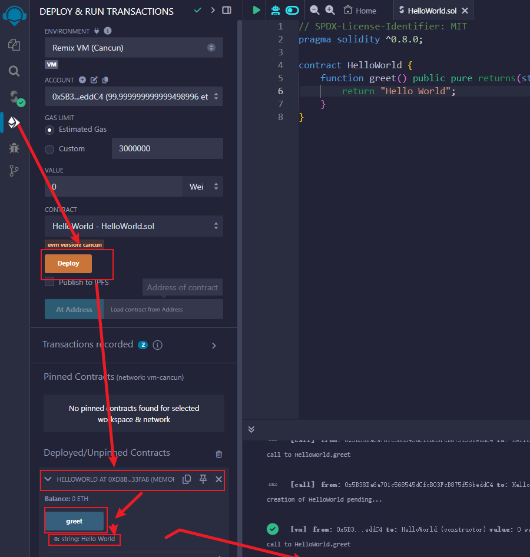
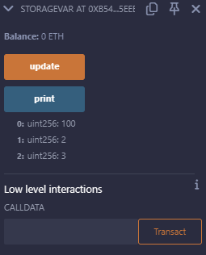
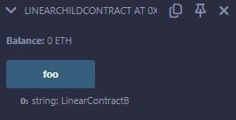

# Solidity

## Solidity基础

### 环境：编译、部署和运行

由于整个语言还是有点像Java的，需要一个以太坊虚拟机（EVM）。运行我们编写的智能合约。在EVM上运行的智能合约代码并不是直接运行的，也是类似于Java最终会转换成二进制代码，字节码。

#### Remix集成环境

地址：**https://remix.ethereum.org/**

国内的地址：**[https://remix.binschool.app](https://remix.binschool.app/)**


##### 文件


##### 编译代码


##### 部署合约



这里的HELLOWORLD AT 0XD88...就是智能合约的地址。greet是运行，运行结果在下方：0:string:Hello World.

```solidity
// SPDX-License-Identifier: MIT
pragma solidity ^0.8.0;

contract HelloWorld {
    function greet() public pure returns(string memory) {
        return "Hello World";
    }
}
```

#### 基本结构

由4个部分组成。分别是声明部分、合约定义部分、状态变量部分和函数部分。

```solidity
// SPDX-License-Identifier: MIT
pragma solidity ^0.8.0;

contract HelloWorld {
    string greeting = "abcdefgh";

    function greet() public view returns(string memory) {
        return greeting;
    }
}
```

##### 版权声明

上述的代码中，其中：// SPDX-License-Identifier: MIT，是一个用于版权声明的注释语句，**MIT**

指的是其他人可以随便使用这个代码，但出现文艺概不负责。

如果智能合约中没有这个注释的话，编译器会提示警告，但是不影响程序运行。

##### 版本声明

```solidity
pragma solidity ^0.8.0;
```

- pragma指令用来指示编译器按照Solidity的那一个版本来编译合约代码。

- Solidity的发展有很多版本，不同版本的差异较大，我们提倡使用比较新的版本，比如0.8.0.

- 声明版本的方法有好多种：

  ```solidity
  pragma solisity >=0.8.8 <0.9 // 表示版本在0.8.0之上0.9.0之下
  pragma solidity >0.8.0 //表示版本在0.8.0之上但是没有上限
  pragma solidity =0.8.0 //表示版本使用只能是0.8.0版本
  pragma solidity 0.8.0 //同上
  pragma solidity ^0.8.0 // 表示版本在0.8.0之上，但是不包括0.9.0以及以上的版本
  pragma solidity ~0.8.0 // 同上
  ```

##### 合约定义

```solidity
contract HelloWorld {
	....
}
```

contract 是一个保留字，用来声明一个合约。contract后面的就是合约的名字。

##### 状态变量

```solidity
string greeting = "Hello world";
```

##### 函数

```solidity
function greet() public view returns(string memory) {
	....
}
```

这个函数没有定义函数的输入，返回值是string。

#### 注释语句

正常的情况下我们一般会使用 // 来表示单行注释， /**/  来表示多行注释，NATSpec格式，也就是以太坊自然语言规范模式。

NATSpec格式使用/// 加上标签的注释方法，进行单行注释，使用`/**....*/`进行多行注释。

```solidity
/// @title 计算器合约
/// @author 作者
/// @notice 这是功能描述
/// @dev 这是实现细节
contract Calculator {

	/// @dev 乘法运算
	/// @param a 乘数
	/// @param b 被乘数
	/// @return c 计算结果
	function multiply(uint a , uint b) public view returns(uint) {
		return a*b;
	}
}
```

##### 注释标签

许多Solidity集成开发环境都是支持注释标签的，可以通过它们方便的生成文档，并且进行代码导航。

| Tag     | 用途                   | 适用对象                      |
| ------- | ---------------------- | ----------------------------- |
| @title  | 描述合约的标题         | contract、interface           |
| @author | 描述作者名字           | contract、interface、function |
| @notice | 描述合约或者函数的功能 | contract、interface、function |
| @dev    | 提供给开发人员实现细节 | contract、interface、function |
| @param  | 提供函数参数说明       | function                      |
| @return | 提供函数返回值说明     | function                      |

##### 如何选择？

完全看个人的喜好，没有必要刻意为之，一般的Java的注释方法就够用了。

## Solidity基本数据类型

### 数据类型

##### 概述

在Solidity中，数据可以分成两种类型：基础类型、复合类型。

基础类型：整型、布尔型、地址型、字节型、浮点型、枚举型。

复合类型：数组、映射、结构体。

另外，数据类型还可以分成值类型和引用类型两大类。

##### 常用的数据类型

与常用的语言不同，Solidity中使用string类型其实不多，由于经常处理数字资产，数字类型使用的最多。最为重要的5种，分别是:整形、布尔型、地址型、映射、数组。

浮点类型一般用不到。

### 整型

由于大多数的智能合约都会涉及到数字资产，因此在Solidity中，整型是使用最为广泛的数据类型。

整型分成两大类：无符号整形、有符号整型。

#### 无符号整型

**uint**关键字，他的取值只能是正整数和零。比如我们在合约中定义一个无符号整型变量：ucount，给它赋值16.

```solidity
uint ucount = 16;
```

**uint**的内部存储的长度是256位，因此，它的取值范围是0--2^256 - 1。

#### 有符号整型

有符号整型使用**int**来表示，可以是正整数、负整数、零。比如定义一个有符号的整型变量count ，赋值位 -1。

```solidity
int count = -1;
```

**int**的内部存储长度是256位，它的取值范围是-2^255 ~ 2^255 -1。

#### 数字分割线

如果要表示的数字太长，或者需要按照特定的位数进行分组，可以使用下划线对数字进行分割。

```solidity
uint num1 = 1000_000_000_000;
uint num2 = 1000_0000_00000;
```

#### 算数运算符

`+`加法、`-`减法、`*`乘法、`/`除法、`%`取余、`**`幂。

由于无符号整数中不允许存在负数，所以如果是**uint**的话会报错：

```solidity
// SPDX-License-Identifier: MIT

pragma solidity ^0.8.0;

/**
@dev 数字错误展示
*/
contract IntegerError {
    uint public a = 2;
    uint public b = 3;

    uint public c = a - b;
}
```

报错展示：


#### 特定长度的整型

除了**uint**和**int**外，Solidity中按照存储长度，还定义了一系列特定长度的整型。它们的长度从8位一直到256位，按照8的倍数递增。

包括：无符号整型uint8、uint16、uint24、uint32、...、uint256。有符号整型int8,int16,int24,...,int256.

##### 极限值

可以通过type()函数和max或者min获取到数据类型的最大值或者最小值。

```solidity
// SPDX-License-Identifier: MIT
pragma solidity ^0.8.0;

contract IntegerLimit {
	uint8 public max = type(uint8).max;
	uint8 public min = type(uint8).min;
}
```

##### 默认值

在智能合约中声明整形变量，如果没有赋值，默认值就是0。

```solidity
// SPDX-License-Identifier: MIT
pragma solidity ^0.8.0;

contract IntegerDefault {
    int public value_int;

    int8 public value_int8;

    uint public value_uint;

    uint8 public value_uint8;
}
```

### bool--布尔型

**bool**就是布尔型。使用方法略过

### 地址型

**address**就是地址型，用来存储以太坊的账户地址。

地址型变量的内部存储长度位160位，也就是20个字节，通常使用一个十六进制字符串来表示，并且以0x开头。

```solidity
address account = 0x4B20993Bc481177ec7E8f571ceCaE8A9e22C02db;
```

#### 地址的生成原理

以太坊的账户地址是通过该账户的公钥，按照一定算法计算得出来的。

**计算过程：**

**首先，将未进行压缩的公钥作为输入值，使用了keccak-256哈希算法，生成了一个256位的哈希值。**

**然后，截取256位哈希值右边的160位作为账户地址。**

**最后，为了便于展示，账户地址使用十六进制字符串来表示，这个字符串长度是40 ，并以0x作为开头。**

#### 地址的比较计算

地址可以进行比较计算，可以使用的操作符为 == 、!= 、<= 、< 、>= 、>

```solidity
// SPDX-License-Identifier: MIT
pragma solidity ^0.8.0;

contract AddressCompare {
    address address1 = 0xB2D02Ac73b98DA8baF7B8FD5ACA31430Ec7D4429;
    address address2 = 0x4B20993Bc481177ec7E8f571ceCaE8A9e22C02db;

    // 比较大小
    function compareAddress() public view returns(bool) {
        return (address1 == address2);
    }
}
```

结果是false。

#### 地址的属性和方法

地址具有.balance属性，用于返回该账户的以太坊余额，这也是地址最常用的方法。

```solidity
// SPDX-License-Identifier: MIT
pragma solidity ^0.8.0;

contract AddressBalance {
    address account = 0x4B20993Bc481177ec7E8f571ceCaE8A9e22C02db;

    function getBalance() public view returns(uint) {
        return account.balance;
    }
}
```

另外，地址也常常用于转账，我们可以使用地址的.transfer()和.send()方法进行转账。

```solidity
// SPDX-License-Identifier: MIT
pragma solidity ^0.8.0;

contract AddressTransfer {
    address account = 0x4B20993Bc481177ec7E8f571ceCaE8A9e22C02db;

    function transferETH() public payable {
        payable(account).transfer(1 ether);
    }
}
```

如果账户中没有余额，会导致转账失败。又不是信用卡是吧。

### 枚举型

**enum**由一组预先定义的常量组成，这些常量在枚举列表中定义。

```solidity
enum gender{male,female}
```

这里的gender是定义的枚举类型的名称，其中的male和female组成了枚举列表。换句话来说，枚举类型gender具有两个可以选择的值，分别是male和female。

```solidity
// 使用枚举类型
gender a = gender.male;
```

#### 枚举类型的本质

枚举类型是一种用户自定义的类型，并不是原声的类型。

枚举类型在编译之后就会转换成无符号整数uint8，在Solidity中，枚举值可以转换成整数，它的第一个成员的默认是0，后面的依次递增。

```solidity
enum status {normal, deleted}
uint8 a = uint8(status.normal);
uint8 b = uint8(status.deleted);
```

#### 枚举类型的作用

主要是为了提高代码的可读性。在代码使用的时候尽可能的避免魔法值。

#### 使用举例

```solidity
// SPDX-License-Identifier: MIT
pragma solidity ^0.8.0;

contract EnumOps {
    // 定义枚举类型
    enum gender {male, female}

    // 使用枚举类型声明状态变量
    gender private myGender = gender.female;

    // 函数内使用枚举类型
    function useEnum() public returns(gender) {
        gender t = myGender;
        myGender = gender.male;
        return t;
    }
    // 函数内使用枚举类型
    function returnEnum() public pure returns(gender) {
        return gender.male;
    }

    // 枚举值转换成整型
    function convertInt() public pure returns(uint) {
        return uint(gender.female);
    }

    // 整型转换成Enum类型
    function convertEnum() public pure returns(gender) {
        return gender(1);
    }
}
```

> 结果：

## Solidity变量

### 变量

分成三种变量类型，分别是状态变量、局部变量、全局变量。

状态变量类似于Java中的类的成员变量。局部变量是定义在function内部的。而全局变量是在合约顶层预先定义的特殊变量，用于提供区块链和交易属性的信息。

注意:全局变量是由Solidity本身提供的，用户无权定义或者修改，但是可以在任意地方使用。

常见的全局变量：

| 名称                                         | 返回                                                     |
| -------------------------------------------- | -------------------------------------------------------- |
| blockhash(uint blockNumber) returns(bytes32) | 指定区块的Hash值                                         |
| block.coinbase(address payable)              | 当前区块的矿工地址                                       |
| block.difficulty(uint)                       | 当前区块的难度值                                         |
| block.gaslimit(uint)                         | 当前区块的gas限制值                                      |
| block.number(uint)                           | 当前区块的区块号                                         |
| block.timestamp(uint)                        | 当前区块的时间戳                                         |
| gasleft() returns(uint256)                   | 当前剩余的gas                                            |
| msg.data(bytes calldata)                     | 完成calldata                                             |
| msg.sender(address payable)                  | 消息发送者的地址，也就是函数调用者的地址                 |
| msg.sig(bytes4)                              | 消息的函数签名，也就是calldata的前四个字节               |
| msg.value(uint)                              | 消息携带的Token数量，也就是函数调用时，同时存入的Token量 |
| tx.gasprice(uint)                            | 交易的gas价格                                            |
| tx.origin(address payable)                   | 交易的发送方地址                                         |

### 可见性

Solidity提供了三种状态变量的可见性修饰符。分别是public   private    internal。

#### public 

如果声明成public，合约内部和外部都可以访问到这个状态变量。在Solidity官方文档中，说明了使用这个public会创建getter()函数，用于获取到这个状态变量的值。

```solidity
// SPDX-License-Identifier: MIT
pragma solidity ^0.8.0;

/// @dev public的修饰符范围
contract PublicVisibility {
    uint256 public delta = 18;

    function addDelta(uint256 num) external view returns(uint256) {
        uint256 sum = num + delta;
        return sum;
    }
}
```

#### private

如果设置成private，合约外部是访问不到这个状态变量的。只有自己才可以访问的到。

```solidity
// SPDX-License-Identifier: MIT
pragma solidity ^0.8.0;

contract PrivateVisibility {
    uint256 private delta = 8;

    function addDelta(uint256 num) external view returns (uint256) {
        uint256 sum = num + delta;
        return sum;
    }
}
```

#### internal

如果设置成internal，可以在当前合约和它的继承合约的内部访问的到，外部无法进行访问。如果没有声明范围，默认就是internal。

```solidity
// SPDX-License-Identifier: MIT
pragma solidity ^0.8.0;

contract InternalVisibility {
    uint256 internal delta = 10;

    function addDelta(uint256 num) external view returns (uint256) {
        uint256 sum = num + delta;
        return sum;
    }
}

// 继承合约InternalVisibility
contract InheritedVisibility is InternalVisibility{
    // 得到继承的delta
    function getDelta() external view returns (uint256) {
        return delta;
    }
}
```

### 默认值

#### 基本类型的默认值

bool类型：false。

int类型：0.

uint类型：0.

address类型：0x0000...，共40个0.

bytes32类型：0x0000...，共64个0.

string类型：""。

Enum类型：第一项。


#### 符合类型的默认值

Solidity中有一些类型是符合类型。比如：

```solidity
struct book {
	string name;
	string author;
	uint price;
}
```

复合类型的默认值就是由每一个数据项的默认值构成。

```solidity
// SPDX-License-Identifier: MIT
pragma solidity ^0.8.0;

// 测试复合类型的默认值 
contract VarDefault {
    // 定义结构体 book
    struct book {
        string name;
        string author;
        uint price;
    }
    book public mybook;
}
```


#### delete操作符

delete操作符可以对变量重新进行赋值。不是对一个变量进行删除。

```solidity
// SPDX-License-Identifier: MIT
pragma solidity ^0.8.0;

contract DeleteVariable {
    uint256 public variable = 10;

    function initVariable() external returns (uint256) {
        delete variable;
        return variable;
    }
}
```

### 常量

在智能合约中，如果一个状态变量的值恒定不变，就可以使用关键字`constant`或者`immutable`进行修饰，定义成常量。

`constant`定义：

```solidity
// SPDX-License-Identifier: MIT
pragma solidity ^0.8.0;

contract ConstType {
    // 定义常量
    string constant SYMBOL = "WETH";
    uint256 immutable TOTAL_SUPPLY = 1000;

    // 得到SYMBOL的值
    function getSymbol() public pure returns (string memory) {
        return SYMBOL;
    }

    // 编译报错：Cannot assign to a constant variable.
    function setSymbol(string memory symbol) public {
        SYMBOL = symbol;
    }
}
```

`immutable`定义：

```solidity
// SPDX-License-Identifier: MIT
pragma solidity ^0.8.0;

contract ConstType {
    // 定义常量
    string public constant SYMBOL = "WETH";
    uint256 public immutable TOTAL_SUPPLY;

    constructor() {
        TOTAL_SUPPLY = 2000;
    }
}
```

> constant 和 immutable区别：
>
> 1. 初始化时机。
>
>    constant修饰的状态变量，必须在声明的时候就立即显式赋值，然后不允许修改了。
>
>    immutable关键字修饰的状态变量，既可以在声明的时候显式赋值，也可以在构造函数中赋值。但是一旦赋值成功之后便不再允许修改。所以说immutable比constant多了一个设置初值的机会，但是它花费的gas费用高一点。
>
>    在ERC20代币合约中，经常将铸造总量totalSupply定义成immutable，这样可以在合约部署的时候，由部署者按照世纪需求填入数量，不用再去修改代码，从而提高合约通用性和灵活性。
>
> 2. 适用数据类型。
>
>    constant可以修饰任何的数据类型。
>
>    immutable只能修饰值类型。比如：int、uint、bool、address等，不能修饰string、bytes等引用类型。

## Solidity函数

### 函数语法

```solidity
function function_name(<parameter list>) <visibility> <state mutability> [returns(<return type>)]{
	...
}
```

比如：

```solidity
function add(uint256 num1, uint256 num2) public pure returns(uint256) {
	return num1 + num2;
}
```

> 注意：函数中的计算操作越多，消耗的gas值越多。

### 可见性

函数的可见性存在4种，分别是public  private internal  external。相较于状态变量而言，多了一种external。

#### public

函数可以被任意地方调用，智能合约的内部和智能合约的外部都可以。

#### private

只能在所在的智能合约中调用。

#### internal

既可以在所属的智能合约内部调用，又可以在继承合约中调用。

#### external

只能从智能合约外部调用，不能在合约内部直接调用。如果一定要在合约内部使用的话，需要加上`this.`

### 状态可变性

包含pure、view、payable或者没有。

**`pure`**：不能读取或修改合约状态。只能做一些自己的逻辑，比如 return 1+ =1;

**`view`**：只能读取状态，不能修改。

**`payable`**：可以接收以太币。

**无修饰符**：允许读取、修改状态，并且可以发送和接收以太币。

> 注意：由于view 和 pure 都是不会进行数据的修改，所以在这两种修饰符修饰的函数中是不会消耗gas值的。只有更改状态的时候会消耗gas值。

### 返回值

可以没有返回值，也可以有一个或者多个。在函数的声明中，需要使用returns关键字指定返回值的类型。

#### 返回形式

在函数体中，可以存在两种方式来返回结果值。

1. 直接使用return关键字指定返回值。
2. 使用返回值的参数名称指定返回值。

```solidity
// SPDX-License-Identifier: MIT
pragma solidity ^0.8.0;

contract FunctionReturn {

    function add1(uint a, uint b) public pure returns (uint) {
        return a + b;
    }

    function add2(uint a, uint b) public pure returns (uint result) {
        result = a + b;
    }
}
```

#### 多返回值

在Solidity中，函数可以存在多个返回值，使用return返回结果时，需要使用`()`包裹。

```solidity
// SPDX-License-Identifier: MIT
pragma solidity ^0.8.0;

contract FunctionMultiReturn {
    function add(uint a, uint b) public pure returns (uint , uint ){
        uint sum = a + b;
        uint product = a * b;

        return (sum, product);
    }
}
```

#### 函数调用

直接使用函数名即可。

#### 函数重载

一个合约中允许定义多个相同名字的函数，但是必须具有不同的参数。

### 构造函数

`constructor`

```solidity
constract FuncConstructor {
	uint256 totalSupply;
	
	constructor(uint256 _totalSupply) {
		totalSupply = _totalSupply;
	}
}
```

#### 可见性和状态可变性

构造函数的可见性不需要设置，可以被任何人使用。

构造函数的状态可变性不能设置pure、view。因为构造函数通常用来初始化状态变量。

如果我们在部署一个合约的时候，同时需要向合约中存入一些比特币，那么就需要将构造函数的可见性设置成payable。

```solidity
// SPDX-License-Identifier: MIT
pragma solidity ^0.8.0;

contract FuncConstructor {
  uint256 totalSupply; // 状态变量

  // 构造函数
  constructor(uint256 _totalSupply) payable {
    totalSupply = _totalSupply;
  }
}
```

#### 案例

```solidity
// SPDX-License-Identifier: MIT
pragma solidity ^0.8.0;

contract FuncConstructor {
    address _owner;

    // 构造函数
    constructor() {
        // 将合约部署者保存到状态变量_owner
        _owner = msg.sender;
    }

    // 只允许合约部署者操作
    function operate() public view {
        require(msg.sender == _owner, "caller is not the owner");
    }

    // 获取合约部署者
    function owner() public view returns (address) {
        return _owner;
    }
}
```

如果我们点击获取owner，会有一个地址。

此时点击operate，可以正确执行。

如果此时修改account，再次点击operate，会出现：


报错原因是：非本人。

### 接收函数receive

#### 账户类型

以太坊区块链中存在两种类型的账户，外部账户和合约账户。

##### 外部账户

外部账户，英文是Externally Owned Account， 简称`EOA`。

外部账户，平常使用的用户账户，用于存储以太币`ETH`。这一些账户可以向其他账户发送以太币，或者是从其他账户接收以太币。

我们在钱包里管理的账户，通常是外部账户。比如，在`MeatMask`里添加或者生成`Account`就是外部账户。

外部账户会有一个与之相关的以太坊地址，这个地址是以一个"0x"开头，长度为20字节的十六进制数。

外部账户都有一个对应的私钥，只有持有私钥的人才能对交易进行签名，所以，外部账户非常适用资金管理。


##### 合约账户

英文是Contract Account，简称`CA`。

在以太坊区块链上部署一个智能合约之后，都会产生一个对应的合约地址，这个地址就是合约地址。

合约账户主要用于托管智能合约，包含了智能合约的二进制代码和状态信息。

合约账户没有私钥，只能由智能合约中的代码逻辑进行控制。

它在一定条件下，也可以用来存储以太币`ETH`。

#### receive函数

在以太坊区块链上部署的智能合约时产生的合约用户，并不都是可以存入到`ETH`的。

一个智能合约如果允许存入以太币，必须实现receive()或者fallback()函数，如果一个智能合约中这两个函数都没有定义，那么它就不能接收以太币。

如果只是想要让合约账户存入以太币，按照Solidity语言的规范，推荐使用reveive()函数。因为receive函数简单明了，目的明确。函数格式如下：

```solidity
receive() external payable{
	...// 处理逻辑，也可以为空
}
```

receive函数特点：

1. 无需使用function声明。
2. 参数为空。
3. 可见性设置成external。
4. 状态可见性必须设置成payable。

当外部地址向智能合约发送以太币时，将会触发receive函数。我们在receive中并不需要写任何逻辑，他依旧可以接收以太币，这也是最常用的方式。

如果在使用receive的时候添加处理语句，最好不要添加太多的业务逻辑。因为外部调用Send和transfer方法进行转账的时候，为了防止重入攻击，gas会限制在2300，如果receive函数逻辑过于复杂，很容易消耗完gas，导致回滚。receive函数中通常会执行一些简单记录日志的动作，比如出发event。

```solidity
// SPDX-License-Identifier: MIT
pragma solidity ^0.8.0;

contract FuncReceive {
    // 定义接收事件
    event Received(address sender, uint amount);

    // 接收ETH的时候，触发Received事件
    receive() external payable {
        emit Received(msg.sender, msg.value);
     }

}
```

##### 部署测试

效果如下：


> 部署过程：
>
> 首先：
>
> value为0 ，
>
> 进行Deploy。
>
> 之后在
>
> 存入100wei，就会将当前的账户的100wei存入到合约中，`Balance`变成0.0000000000000001 `ETH`。同时在控制台可以看到log中Receive事件被触发。

#### fallback回退函数

fallback是一个预定义的特殊函数，用于处理**未知函数**或者**接收以太币`ETH`**使用。

函数格式：

```solidity
fallback() external payable {
	// 处理逻辑，一般是event
}
```

特点：

1. 无需function声明。
2. 参数为空。
3. 可见性设置成external。
4. 状态可变性可以是空，也可以是payable。

##### 调用条件

###### 外部调用调用了不存在的函数

这种情况下，fallback无需设置状态可变性，函数形式如下：

```solidity
fallback() external {

}
```

###### 外部向智能合约中存入以太币，但是当前合约中并没有receive函数

```solidity
fallback() external payable {
...
}
```

如果合约中已经定义了receive函数，那么这个fallback函数便不会被调用。

##### receive和fallback工作流程


##### 测试和实验

###### a) 一

智能合约中只定义 `fallback` 函数，而且状态可变性为 `payable`。

```solidity
// SPDX-License-Identifier: MIT
pragma solidity ^0.8.0;

contract FuncFallback1 {
    event Fallback();

    fallback() external payable { 
        emit Fallback();
    }
}
```

在向合约中存入以太币时，将会执行fallback函数，触发其中的Fallback事件。


###### b) 二

智能合约中同时定义了 `receive` 和 `fallback` 函数，而且两者的状态可变性都为 `payable`。

```solidity
// SPDX-License-Identifier: MIT
pragma solidity ^0.8.0;

contract FuncFallback2 {
    // 定义接收事件
    event Receive();

    // 定义回退事件
    event Fallback();

    // 接收以太币
    receive() external payable { 
        emit Receive();
    }

    // 回退函数
    fallback() external payable {
        emit Fallback();
    }
}
```

在向合约中存入以太币时，将会执行receive函数，触发其中的Receive事件。


###### c) 三

依然使用上面的合约，当我们调用一个不存在的函数，将会触发 `Fallback` 事件。

```solidity
// SPDX-License-Identifier: MIT
pragma solidity ^0.8.0;

contract FuncFallback3 {
    event Receive();

    event Fallback();

    receive() external payable {
        emit Receive();
     }

     fallback() external payable {
        emit Fallback();
    }
}
```

我们在**"calldata"**中填写随意的值`msg.data`，点击**"Transact"**。


成功触发Fallback事件。

##### fallback使用场景

如果只是需要将以太币存入到合约账户，推荐使用receive函数，而不是使用fallback函数。

fallback函数适用的场景：

###### 1. 空投

利用receive函数或者是fallback函数，用户只需要从钱包向空投合约发送0金额的转账，空投合约就可以向这个地址进行空投。

###### 2. 锁仓

用户使用钱包将代币转账到锁仓合约中，锁仓合约利用receive函数或者fallback函数便可以进行锁仓逻辑了。

###### 3. 兑换

在`ERC20`代币`WETH`合约中，利用receive或者fallback函数收到`ETH`之后，自动兑换成`WETH`代币。

## Solidity流程控制语句

### 运算符

绝大多数的内容和其他变成语言相同。不做过多赘述。

### 条件语句

与其他语言相同，不做过多赘述。

### 循环语句

与其他语言相同，不做过多赘述。

### 断言语句

Solidity提供了断言语句，用于在合约执行过程中进行条件检查和错误处理。支持两种断言语句：require和assert。

#### require

require 用于检查函数执行的先决条件，也就是说，确保满足某些特定条件后才能继续执行函数。和java中的断言差不多。如果条件不满足，就会终止当前函数执行，并回滚所有的状态改变。

```solidity
// SPDX-License-Identifier: MIT
pragma solidity ^0.8.0;

contract Require {
    // 转账函数
    function transfer(address to, uint256 amount) public pure {
        require(to != address(0), "address to is zero");

        require(amount > 0, "amount is zero");
    }
}
```

结果：


合约中有一个转账函数，在调用的时候，需要检测接收地址to是否为0，如果是0，就会输出日志: address to is zero。终止转账。

其次检测转账金额amount是否为0， 就会输出：amount is zero。终止转账。

这个require完全可以使用revert代替。比如：

```solidity
require(amount > 0, "amount is zero");
```

可以使用revert 代替:

```solidity
if(amount <= 0) {
	revert("amount is zero");
}
```

#### assert

assert 和	require非常相似，通常用于捕捉合约内部编程错误和异常情况。如果捕捉到异常，中止当前函数的执行，并且回滚所有的状态改变。

```solidity
// SPDX-License-Identifier: MIT
pragma solidity ^0.8.0;

contract Assert {
    
    // 除法计算
    function divide(uint256 a, uint256 b) public pure returns(uint256) {
        assert(b != 0);

        return a / b;
    }
}
```

结果：


#### require和assert的区别

1. require和assert的参数不同，require有说明原因的参数，assert没有这个参数。
2. require通常用于检查外部输入是否满足条件，但是assert用于捕捉内部编程错误和异常情况。
3. require通常位于首部来检查参数，assert通常位于函数内部，出现严重的错误触发。
4. assert是早期遗留，最好使用require或者revert进行代替。

## Solidity符合数据类型

### 数组

Solidity支持`固定长度的数组`和`动态长度的数组`两种类型。

#### 固定长度数组

语法如下：

```solidity
type_name arrayName [length];
```

其中数组长度length必须是一个大于零的整型数字，`type_name`可以是任何数据类型。

例如：

```solidity
uint256 balance [10];
```

举例：

```solidity
// SPDX-License-Identifier: MIT
pragma solidity ^0.8.0;

contract StaticArray {
    uint[3] balance = [uint(1), 2, 3];

    function staticArray() external returns (uint length, uint[3] memory array) {
        uint element = balance[2];

        balance[2] = element * 2;

        return (balance.length, balance);
    } 
}
```


#### 动态长度数组

声明语法：

```solidity
type_name arrayName [];
```

动态长度数组初始化之后，是一个长度为0 的空数组，我们可以使用`push`函数在数组最后追加一个元素，而使用`pop`函数，截掉末尾的最后一个元素。

其中`push`有两种用法，一种是带参数的`push(x)`，第二种是不带参数的`push()`，不过不带参数的会在数组的末尾添加一个具有默认值的元素。

```solidity
// SPDX-License-Identifier: MIT
pragma solidity ^0.8.0;

contract DynamicArray {
    
    // 初始化数组
    uint[] balance = [uint(1), 2, 3];

    // 添加删除
    function dynamicArray() external returns (uint length, uint[] memory array) {
        balance.push(4);
        balance.push(5);

        balance.pop();

        return (balance.length, balance);
    }

    // 删除1的元素，注意Solidity没有提供直接删除的函数。需要按照前移的方法
    function deleteOne() external returns (uint length, uint[] memory array) {
        for (uint i = 0;i < balance.length; i++) {
            if (balance[i] == uint(1)) {
                for(uint j = i ;j < balance.length -1 ; j++) {
                    balance[j] = balance[j + 1];
                }
                // 删除最后一个元素
                balance.pop();
                break;
            } 
        }
        return (balance.length, balance);
    }
}
```

结果：


#### new、delete操作

可以使用new 创建一个数组。

```solidity
// SPDX-License-Identifier: MIT
pragma solidity ^0.8.0;

contract Array {
    
    function newArray() external pure returns (uint[] memory) {
        uint[] memory arr = new uint[](3);
        arr[0] = 1;
        return arr;
    }
}
```

结果：


delete操作符只是用于给数组变成默认值的，并不是删除元素。

```solidity
// SPDX-License-Identifier: MIT
pragma solidity ^0.8.0;

contract DeleteArray {
    uint[] balance = new uint[](3);

    // 初始化数组
    function initArr() external returns (uint[] memory array) {
        balance.pop();
        balance.pop();
        balance.pop();
        
        balance.push(1);
        balance.push(2);
        balance.push(3);

        return balance;
    }

    // 设置默认值
    function deleteArr() external returns (uint[] memory array) {
        delete balance[0];
        return balance;
    }
}
```

结果：初始化的时候：


deleteArr之后：


### 字节和字符串

在学习字符串之前，首先学习`字节型`。`字节型`也是`Solidity`语言重要的数据类型。

`字节型`用于表示特定长度字节序列，分成`固定长度字节型`和`动态长度字节型`两种类型。

`字节型`本质上是一个字节数组，`Solidity`为了方便使用，把它单独定义成一种数据类型。

#### 固定长度字节类型

固定长度的字节型分成了32种小类，使用bytes1、bytes2到bytes32表示，其中bytes32最为普遍。

`固定长度字节型`的变量声明如下：

```solidity
// SPDX-License-Identifier: MIT
pragma solidity ^0.8.0;

contract StaticBytes {
    function staticBytes() external pure returns (uint256, bytes2, bytes1) {
        bytes2 myBytes = 0x1212;
        myBytes = 0x3456;
        bytes1 b = myBytes[0];

        return (myBytes.length, myBytes, b);
    }
}
```

执行结果：


#### 动态长度字节型

动态长度字节类型可以存储人任意长度的字节序列，使用`bytes`关键字来声明，在声明变量的时候，需要指定长度和初始化值。

`动态长度字节型`声明如下：

```solidity
bytes myBytes = new bytes(10);
bytes myBytes = "Hello";
bytes myBytes = hex "1234";
```

```solidity
// SPDX-License-Identifier: MIT
pragma solidity ^0.8.0;

contract DynamicBytes {
    function dynamicBytes() external pure returns (uint256, bytes memory) {
        bytes memory myBytes = new bytes(2);
        myBytes[0] = 0x12;

        myBytes[1] = 0x34;

        return (myBytes.length, myBytes);
    }
}
```

字符串使用string来表示，可以使用"" 或者''。

字符串与固定的byte数组十分类似，他的值在声明之后便不再可变。如果想要对字符串的字符进行操作，需要转换成bytes类型。

#### bytes转换string

可以使用`string()`函数将bytes显示转换成string。

```solidity
// SPDX-License-Identifier: MIT
pragma solidity ^0.8.0;

contract StringConvertor {
    function bytesToString() external pure returns (string memory) {
        bytes memory myBytes = new bytes(2);
        myBytes[0] = 'o';

        myBytes[1] = 'k';

        return string(myBytes);
    }
}
```

#### string 转换bytes

可以使用`bytes()`函数将string转成bytes。

```solidity
// SPDX-License-Identifier: MIT
pragma solidity ^0.8.0;

contract BytesConvertor {
    function stringToBytes() external pure returns(bytes memory) {
        string memory myString = "Hello world";

        return bytes(myString);
    }
}
```

#### 获取字符串的长度

字符串没有直接获取长度的函数，需要先转换成bytes才可以进行。

```solidity
// SPDX-License-Identifier: MIT
pragma solidity ^0.8.0;

contract StringLen {
    function len() external pure returns (uint256) {
        string memory str = "nihao";

        return bytes(str).length;
    }
}
```

#### 支持unicode编码

如果字符串中包含unicode编码，比如表情符号或者中文，需要赋值的时候进行显示声明，否则报错。

```solidity
// SPDX-License-Identifier: MIT
pragma solidity ^0.8.0;

contract StringUnicode {
    function greet() public pure returns (string memory) {

        return unicode"你好我是张德彪";
    }
}
```

结果：

****

### 结构体

结构体定义的是用户自定义的数据类型，通过组合多种不同类型的变量成员来创建一个新的复合类型。

例如：一本书包含了三个属性：

title: 标题

Author: 作者

Book ID：书的id

#### 定义

定义一个结构体`struct`关键字，语法如下：

```solidity
struct struct_name {
	type_name type_name_1;
	
	type_name type_name_2;
	
	type_name type_name_3;
	...
}
```

比如按照上述的描述：

```solidity
struct Book{
	string title;
	string author;
	uint ID;
}
```

#### 使用方法

```solidity
// SPDX-License-Identifier: MIT
pragma solidity ^0.8.0;

contract StructAccess {
    struct Book {
        string title;
        string author;
        uint ID;
    }

    Book book;

    function setBook() public {
        book.title = 'Learn Solidity';
        book.author = unicode"张德彪";

        book.ID = 1;
    }

    function getBookAuthor() public view returns (string memory) {
        return book.author;
    }
}
```

结果：


#### 初始化方法

```solidity
// SPDX-License-Identifier: MIT
pragma solidity ^0.8.0;

contract StructInit {
    struct Book {
        string title;
        string author;

        uint id;
    }

    function getBooks() public pure returns (Book memory, Book memory, Book memory) {
        // 第一种方式
        Book memory book1 = Book('Learn Java', unicode"李白", 2);

        // 第二种方式
        Book memory book2 = Book({title: 'Learning English', author: 'nihao', id: 3});

        // 第三种方式
        Book memory book3;

        book3.title = 'Learning Japanese';
        book3.author = 'run';
        book3.id = 4;

        return (book1, book2, book3);
    }
}
```

结果：


### 映射mapping

`solidity`提供的映射mapping，用来以键值对的形式存储数据，提高查询的效率。

在设置`白名单`的时候，我们可以通过`映射类型`将用户地址映射到一个布尔值，表示哪些地址是被允许的，那些地址是不被允许的，高效的控制访问权限。

#### 定义

语法：

```solidity
mapping(key_type => value_type);
```

mapping类型是将一个键(**key**)映射到一个值(**value**)。

**key_type**可以是任何的基本数据类型，比如uint 、address、bool、enum、bytes、string。

**value_type**可以是任意的数据类型。

#### 使用方法

在智能合约中，mapping是十分重要的。比如在`ERC20`中，经常使用到`mapping`类型的变量作为一个内部的账本，用来记录一个钱包的地址拥有的代币的余额。

我们模拟一个USDT的合约:

```solidity
// SPDX-License-Identifier: MIT
pragma solidity ^0.8.0;

contract USDT {
    mapping(address => uint256) balances;

    // 初始化为部署人的账户所提供的账户余额是100
    constructor() {
        balances[msg.sender] = 100;
    }

    // 得到账户的余额
    function balanceOf(address account) public view returns (uint256) {
        return balances[account];
    }
}
```

结果：如果使用的账户是：**0x5B38Da6a701c568545dCfcB03FcB875f56beddC4**。

那么结果是：

如果使用的账户是另一个，随便找一个：**0xAb8483F64d9C6d1EcF9b849Ae677dD3315835cb2**

此时结果是：

可以发现，使用自己的账户的时候余额是100，如果是别的账户的话，余额是0。

### 值类型和引用类型

这个值类型和引用类型和其他变成语言很相似。

#### 值类型

值类型的数据被独立存储在内存中，每一次进行赋值操作或者作为参数传递时，他们会在内存中复制一份，对这些副本进行修改。并不会影响到原始数据。

```solidity
// SPDX-License-Identifier: MIT
pragma solidity ^0.8.0;

/// @title 值类型
contract ValueOps {
    function update() public pure returns (bytes2) {
        bytes2 data = 0x1234;
        updateValue(data);
        return data;
    }

    function updateValue(bytes2 value) internal pure {
        value = 0x4567;
    }
}
```

结果是：


结果是0x1234，并不是0x4567，说明了原始数据并没有被修改。

#### 引用类型

引用类型，在内存中存储的是数据的引用，而不是实际的数据本身，实际数据存放的是单独的位置。创建引用类型的变量的时候，实际上是分配了一个存储指向数据的地址的内存位置，也就是C语言的指针。

引用类型总共有三种：数组、结构体、mapping。

```solidity
// SPDX-License-Identifier: MIT
pragma solidity ^0.8.0;

/// @title 引用类型
contract ReferenceOps {
    mapping(uint256 => uint256) public map;
    function update() public pure returns (string memory) {
        bytes memory data = '1234';
        updateValue(data);
        return string(data);
    }

    function updateMapping() public {
        map[0] = 1;
        updateMapp();
    }

    function updateValue(bytes memory value) internal pure {
        value[0] = '5';
    }

    function updateMapp() internal {
        map[1] = 2;
    }
}
```

结果：


可以看到，返回的结果是"5234"而不是"1234"。这表明：原始数据被修改了。

### 数据位置

`Solidity`中的数据存储位置有3种，`memory`、`storage`、`calldata`。

#### storage

`storage`指的是永久保存在区块链上的存储，通常用于存储合约的状态变量。

`storage`会随着智能合约一直存在，直到合约被销毁。

由于它保存在区块链上，需要同步到所有区块链节点，而且永久保存，所以它的使用成本高，`gas` 消耗多。

在函数中，**对于引用类型**的变量，我们可以通过storage进行引用。

```solidity
// SPDX-License-Identifier: MIT
pragma solidity ^0.8.0;

contract StorageVar {
    uint[] data = [1,2,3];

    function update() external  {
        uint[] storage dataRef = data;
        // 修改data
        dataRef[0] = 100;
    }

    // 由于此处的dataRef和data指向的是同一个区域，所以说修改dataRef就是修改data
    function print() external view returns (uint, uint, uint) {
        return (data[0], data[1], data[2]);
    }
}
```

结果：一开始输出结果是1，2,3。

之后更新值之后，输出结果变成：



#### memory

`memory`是函数调用期间分配的临时内存，通常用于存储引用类型的局部变量。

`memory`中变量在函数调用结束之后会被销毁。

`memory`使用成本比较低，所以说gas费少。

```solidity
// SPDX-License-Identifier: MIT
pragma solidity ^0.8.0;

contract MemoryVar {
    uint[] data = [1,2,3];

    // 更新状态
    function update() public {
        uint[] memory dataCopy = data;

        dataCopy[0] = 100;
    }

    // 打印状态变量
    function print() external view returns (uint, uint, uint) {
        return (data[0], data[1], data[2]);
    }
}
```

结果：


更新之后，再次打印，发现值还是1,2，3，没有任何变化。

我们在最基础的语法学完之后，部署一个测试的案例，这个测试的案例不是直接使用remix的RemixVM，我们之前不是创建了一个测试用的metamask钱包吗？Account 2是我们用来进行测试的账户，我们就直接连接这个账户。

> 首先，我们在Remix先连接钱包地址。
>
> 
>
> 我们选择这个Injected Provide - MetaMask。之后在弹出的插件中confirm即可。然后Deploy。
>
> 在构建的时候可能会花费一定的时间，先来案例代码：
>
> ```solidity
> // SPDX-License-Identifier: MIT
> pragma solidity ^0.8.21;
> 
> contract SimpleStorage {
>     uint256 favoriteNumer;
> 
>     struct Person {
>         string name;
>         uint256 favoriteNumer;
>     }
> 
>     Person[] public person;
> 
>     mapping (string => uint256) public nameToFavoriteNumber;
> 
>     function store(uint256 number) public {
>         favoriteNumer = number;
>     } 
> 
>     function addPerson(string memory _name, uint256 _favoriteNumber) public {
>         person.push(Person(_name, _favoriteNumber));
>         nameToFavoriteNumber[_name] = _favoriteNumber;
>     }
> 
>     function retrive() public view returns (uint256) {
>         return favoriteNumer;
>     }
> }
> ```
>
> 我们在部署之后会有addPerson、store、nameToFavoriteNumber、person、retrive。之后便可以进行测试了。
>
> 在MetaMask钱包中可以发现交易的记录。

## Solidity面向对象编程

### 合约继承

封装、继承、多态是面向对象的三大特性，其中`solidity`支持继承特性。

#### 语法

在`solidity`中，合约关键字通过`is`进行集成合约操作。

```solidity
// SPDX-License-Identifier: MIT
pragma solidity ^0.8.0;

contract Person {
    string public name;
    uint public age;
    function getSalary() public pure returns (uint) {
        return 1000;
    }
}

contract Employee is Person {
    function getSalary() public pure returns (uint) {
        return 3000;
    }
    
}
```

结果：可以看到子合约中存在父合约中的所有状态变量。

#### virtual 和 override

`Solidity`中引入了`virtual`和`override`进行重写父合约中的函数。父合约中使用`virtual`进行声明，子合约使用`override`进行重写函数。

#### 构造函数的继承

在`solidity`中，如果父合约没有定义构造函数，或者构造函数没有参数，那么子合约可以直接继承父合约，不需要显示的调用父合约的构造函数。

```solidity
// SPDX-License-Identifier: MIT
pragma solidity ^0.8.0;

contract Person{
  constructor() { // 构造函数没有参数
  }
}

contract Employee is Person {
}
```

如果父合约的构造函数带有参数，那么子合约在继承父合约的时候，需要在自己的构造函数中显示的调用父合约的构造函数。

```solidity
// SPDX-License-Identifier: MIT
pragma solidity ^0.8.0;

/// @title 如果父亲合约中有一个有参构造函数，那么子合约中需要进行将这个有参构造函数进行调用父亲的构造函数
contract Parent {
    uint public data;

    constructor(uint _data) {
        data = _data;
    }
}

contract Child is Parent{
    constructor(uint _data) Parent(_data){
    }
}
```

**或者**

```solidity
// SPDX-License-Identifier: MIT
pragma solidity ^0.8.0;

/// @title 如果父亲合约中有一个有参构造函数，那么子合约中需要进行将这个有参构造函数进行调用父亲的构造函数
contract Parent {
    uint public data;

    constructor(uint _data) {
        data = _data;
    }
}

contract Child is Parent(1){
}
```

#### 调用父合约函数

有两种方法：使用`super`关键字或者直接使用合约名称。

```solidity
// SPDX-License-Identifier: MIT
pragma solidity ^0.8.0;

contract ParentPerson {
    function getSalary() public pure virtual returns (uint) {
        return 1000;
    }
}

contract ChildPerson is ParentPerson {
    function getSalary() public pure override returns (uint) {
        return 3000;
    }

    // 通过super调用父亲的函数
    function getPersonBySuper() public pure returns(uint) {
        return super.getSalary();
    } 

    // 直接通过合约名称调用函数
    function getPersonByContract() public pure returns (uint) {
        return ParentPerson.getSalary();
    }
}
```

结果：


### 多重继承

1. 继承的时候按照辈分从最高到最低，比如我们有一个`Eriz`合约，继承`Yeye`和`Baba`合约，同时`Baba`继承自`Yeye`合约，那么就要写成`contract Eriz is Yeye, Baba`，不能写成`contract Eriz is Baba, Yeye`。
2. 如果某个函数在多个合约中都存在，比如例子中的`hip()`和`pop()`函数，在子合约中必须进行重写。
3. 重写在多个父合约都重名的函数时，`overide`后面要加上所有父合约的名字，例如：`overide(Yeye, Baba)`。

```solidity
contract Eriz is Yeye, Baba {
	function hip() public virtual overide(Yeye, Baba) {
		emit Log("Eriz");
	}
	
	function pop() public virtual overide(Yeye, Baba) {
		emit Log("Eriz");
	}
}
```

### 修饰器的继承

`solidity`中的修饰器同样可以继承。同样是使用`virtual`和`overide`关键字。

```solidity
// SPDX-License-Identifier: MIT
pragma solidity ^0.8.7;

contract Base1 {
    modifier mustExistsTwoAndThree(uint _a) virtual {
        require(_a % 2 == 0 && _a % 3 ==0, "Must exists Two and three");
        _;
    }
}

contract Idenfier is Base1 {
    modifier mustExistsTwoAndThree(uint _a) override {
        _;
        require(_a%2 == 0 && _a % 3 == 0, "Sorry, the number must be divisible by two and three!");
    }

    // 计算一个数字分别被2和3整除，传入到必须是2和3的倍数的整数
    function mustExistsTwoAndThreeCall(uint _a) public mustExistsTwoAndThree(_a) pure returns (uint, uint) {
        return getDividedByTwoAndThree(_a);
    }

    function getDividedByTwoAndThree(uint num) private pure returns (uint, uint ) {
        uint result1 = num / 2;
        uint result2 = num / 3;
        return (result1, result2);
    }
    }
```

> 1. 在上述代码中，我们可以在Idenfier合约中调用Base1的mustExistsTwoAndThree修饰器。会先进行require判断条件，之后执行代码。
> 2. 同时，由于我们的`mustExistsTwoAndThree`修饰器已经是`virtual`状态，我们可以将这个修饰器进行重写，之后调用的就是重写 的`mustExistsTwoAndThree`了。

### 抽象合约和接口

#### 抽象合约

`Solidity`语言中抽象的实现合约。

```solidity
// SPDX-License-Identifier: MIT
pragma solidity ^0.8.0;

abstract contract Person {
    string public name;

    uint public age;

    function getSalary() public pure virtual returns (uint);
}

contract Employee is Person {
    function getSalary() public pure override returns (uint) {
        return 4000;
    }
}
```

#### 接口

`Solidity`语言中提供了接口的实现。实现的方式就是`is`，具体见下代码：

```solidity
// SPDX-License-Identifier: MIT
pragma solidity ^0.8.0;
interface IERC20 {
    function name() external view returns (string memory);
    function symbol() external view returns (string memory);
    function decimals() external view returns (uint256);
}

contract ERC20 is IERC20 {
    string _name = unicode"李磊";
    string _symbol = "MYC";
    uint256 _decimals = 20;

    function name() external view returns (string memory) {
        return _name;
    }

    function symbol() external view returns (string memory) {
        return _symbol;
    }
    
    function decimals() external view returns (uint256) {
        return _decimals;
    }
}
```

运行结果：


##### 使用接口

由于以上的代码是实现接口的代码，但是如果我们已经有这么一个实现类，但是我的另一个合约需要用到这个合约，应该怎么办？

`solidity`给我们提供了一个实现方式：就是直接拿着这个已经实现的合约的地址进行重新处理。具体的见代码:

```solidity
// SPDX-License-Identifier: MIT
pragma solidity ^0.8.0;

interface IERC20 {
    function name() external view returns (string memory);
    function symbol() external view returns (string memory);
    function decimals() external view returns (uint256);
}

/// @title 通过传入合约的地址，构造调用接口
contract UseERC20 {
    function getToken() external view  returns (string memory, string memory, uint256) {
        IERC20 token = IERC20(0xb31BA5cDC07A2EaFAF77c95294fd4aE27D04E9CA);
        return (token.name(), token.symbol(), token.decimals());
    }
}
```

结果：

可以看到结果是：李磊、MYC、20，这个和上述的结果是相同的。

> 具体实现的细节：我们需要重新写一个interface ，同时拿到上一个合约的地址，利用这个interface获取到真正的合约，最后便可以拿到这个已经实现的合约结果了。

### 多重继承

`Solidity`支持多重继承，也就是允许一个合约同时继承多个合约，从而将他们的功能和属性组合在一个合约中。

语法：

```solidity
contract child_contract is parent_contract1, parent_contract2 {
	...
}
```

多重继承的实例如下：

```solidity
// SPDX-License-Identifier: MIT
pragma solidity ^0.8.0;

contract ContractA {
    function fooA() public pure returns (string memory) {
        return unicode"这是fooA";
    }
}

contract ContractB {
    function fooB() public pure returns (string memory) {
        return unicode"这是fooB";
    }
}

// @title 子合约继承两个父合约，得到父合约的所有的属性
contract ChildContract is ContractA, ContractB {
    
}
```

结果：


可以发现这个子合约具有父合约的所有内容。

#### 线性继承

```solidity
// SPDX-License-Identifier: MIT
pragma solidity ^0.8.0;

contract LinearContractA {
    function foo() public pure virtual returns (string memory) {
        return "LinearContractA";
    }
}

contract LinearContractB {
    function foo() public pure virtual returns (string memory) {
        return "LinearContractB";
    }
}

/// @title 线性继承
contract LinearChildContract is LinearContractA, LinearContractB {
    function foo() public pure override(LinearContractA, LinearContractB) returns (string memory) {
        return super.foo();
    }
}
```

结果：



线性继承中如果调用super的话，是根据最后的继承关系进行调用的，也就是ContractB。

#### 多重继承分析

##### 一、合约Y继承了合约X，合约Z同时继承了X，Y。

```shell
  X 
/   \
Y   |
\   /
  Z
```

按照线性继承原则，最基本的合约放在最前面，合约的继承顺序应该是:X、Y、Z。

```solidity
contract Z is X, Y {
}
```

##### 二、合约Y继承了合约X；合约A也继承了合约X，合约B又继承了A；合约Z同时继承了Y、B。

```shell
   X 
 /   \
Y     A
|      |
|      B
 \    / 
   Z
```

按照线性的规则，最终的结果是：X、Y、A、B、Z。

```solidity
contract Z is Y, B {
}
```

## Solidity进阶知识

### 修饰器modifier

在`solidity`中，修饰器是一种用于修改函数行为的语法结构。当修饰器作用于一个函数上，可以在这个函数运行前和运行后，执行修饰器中的逻辑，增强他的功能。

常常用于验证输入参数、执行权限检查、记录日志等操作。对函数进行重用和扩展。

#### 定义语法

```solidity
modifier modifier_name(param1, param2, ...) {
	// 在函数执行前的逻辑
	_;
	// 在函数执行后的逻辑
}
```

> **modifier**：关键字，用于修饰一个修饰器。
>
> **modifier_name**：修饰器的名字，可以根据需求自定义。
>
> **(param1, param2, ...)**：可选的修饰器参数列表，用于传递参数给修饰器。
>
> **修饰器逻辑**：在被修饰函数执行前和执行后执行。
>
> **特殊符号_**：表示被执行函数的执行位置。

#### 使用方法

修饰器在合约中使用非常普遍，常常用于验证输入参数、执行权限检查、记录日志等。

比如，一个合约中只有合约本人可以有权限执行。

```solidity
// SPDX-License-Identifier: MIT
pragma solidity ^0.8.0;

contract Modifier {
    address owner;

    mapping(address => bool) blacklist;

    modifier onlyOwner() {
        require(msg.sender == owner, "Only owner can call this function");
        _;
    }

    constructor() {
        owner = msg.sender;
    }

    // 设置进黑名单
    function setBlacklist(address account) onlyOwner external {
        blacklist[account] = true;
    }

    // 得到某一个账户是否在黑名单中
    function isBlacklist(address account) external view returns (bool) {
        return blacklist[account];
    }
}
```

`onlyOwner`是一个函数修改器，用来判断调用者是否为合约的部署者，如果是合约的部署者，就继续执行它所修饰的函数，如果不是就回滚，并返回错误信息。

`setBlacklist`用于将某地址加入到黑名单，这个函数被修饰器`onlyOwner`修饰，所以它只能由合约部署者调用，其他账户无法调用这个函数。

`isBlacklist`用于查询某一个地址是否在黑名单中。由于这个函数没有修饰器，可以被所有人调用。

凡是只有合约部署者能够使用的函数，就可以定义在修饰器中。经常用这个来提高代码的复用性。

#### 带参数的修饰器

先看代码

```solidity
// SPDX-License-Identifier: MIT
pragma solidity ^0.8.0;

contract ModifierWithParam {
    int public counter;

    modifier isPositive(int param) {
        require(param > 0, "The Number must Greater than zero");
        _;
    }

    function add(int x) external isPositive(x) {
        counter += x;
    }
}
```

修饰器`isPositive`用来判断参数是否大于0，如果大于0，就继续执行，否则终止执行。

### 事件event

在`Solidity`中，事件`event`是智能合约一种通知机制，用于向外部程序通知某一个事件的发生。

#### 定义语法

```solidity
event event_name(<parameter list>);
```

比如：

```solidity
event Transfer(address from , address to, uint256 value);
```

#### 使用方法

在`solidity`中，使用`emit`关键字可以来进行事件的触发。语法如下：

```solidity
emit event_name(<parameter list>);
```

例如，触发ERC20代币合约中的Transfer事件。

```solidity
emit Transfer(0xAb...b2, 0x4B...dh, 1000);
```

以下，我们使用一个完整的合约范例来展示事件的定义和使用方法。

```solidity
// SPDX-License-Identifier: MIT
pragma solidity ^0.8.17;

contract Event {
    mapping(address => uint256) balances;

    // 这是转账事件
    event Transfer(address indexed from , address indexed to, uint256 value);

    constructor() {
        balances[msg.sender] = type(uint256).max;
    }

    function transfer(address to, uint256 value) external {
        // 进行转账
        balances[msg.sender] -= value;
        balances[to] += value;

        // 触发Event
        emit Transfer(msg.sender, to, value);
    }
}
```

结果：


#### indexed

在使用`emit`触发的事件中，有一种特殊形式称为索引事件，语法如下：

```solidity
event event_name(type_name indexed parameter-name, ...);
```

例如，在`ERC20`代币合约中，定义了一个用来记录转账的索引事件。

```solidity
event Transfer(address indexed from, address indexed to, uint256 value);
```

外部的应用程序可以根据`indexed`标记过的参数进行高效的过滤和搜索事件，比如，可以应用于以下场景。

1. 过滤事件。外部应用程序可以过滤感兴趣的事件。例如，根据发送者或者接受者地址过滤特定用户的交易事件。
2. 高效搜索。按照特定金额范围搜索交易事件。

> 注意：
>
> 1. 没有使用`indexed`标记过的参数，不能作为过滤或者搜索的字段。
> 2. 一个事件中`indexed`标记的参数最多是3个。
> 3. 记录区块链的日志，也可以使用状态变量，但是事件消耗的`gas`要更低。

### 错误error

在`solidity`中，可以使用`error`来自定义错误类型。当智能合约中发生错误或者异常时，能够`error`定义的描述名称和数据。

我们知道，`event`可以用来输出消息，但它通常是正常状态下输出信息。

`error`是`solidity`0.8.4版本新加的内容，

#### 定义语法

在`solidity`中，使用`error`定义一个错误如下：

```solidity
error error-name(parameter list);
```

例如，在`ERC20`代币合约中，定义了一个转账金额不足的事件，

```solidity
error NotEnoughFunds(uint requested, uint available);
```

其中，`requested`是本次进行请求的转账，`available`是剩余的余额。

#### 使用方法

使用`revert`来触发错误`error`，语法如下：

```solidity
revert error-name(<parameter list>);
```

使用`revert`触发`error`，将会抛出错误信息，同时交易会被回滚`revert`。

```solidity
// SPDX-License-Identifier: MIT
pragma solidity ^0.8.17;
///@dev 定义一个错误事件：余额不够
error NotEnoughFund(uint requested, uint available);
contract ErrorToken {
    mapping (address => uint) balances;

    constructor() {
        balances[msg.sender] = 100;
    }

    // 转账函数
    function transfer(address to, uint amount) public {
        uint balance = balances[msg.sender];
        if(balance < amount){
            revert NotEnoughFund(amount, balance);
        }
        // 否则
        balances[msg.sender] -= amount;
        balances[to] += amount;
    }
}
```

结果：

当输入的余额大于剩余的余额，：

当输入的余额小于剩余的余额。


### 导入合约import

当智能合约开发到一定程度上，通常会按照单一职责原则，将其划分成不同的模块，从而形成多个合约文件。一个`solidity`文件大小是有限制的，是24K。

#### import用法

反正都是会写前端的，直接上代码：

```solidity
// SPDX-License-Identifier: MIT
pragma solidity ^0.8.17;

import "@openzeppelin/contracts/token/ERC20/ERC20.sol";
contract MyCoin is ERC20 {
    constructor() ERC20("MyCoin", "MC"){
        _mint(msg.sender, 100*10**18);
    }
}
```

查看结果：


可以看到，MyCoin具有ERC20标准中的所有方法。

### 异常处理

直接介绍try...catch机制。

```solidity
// SPDX-License-Identifier: MIT
pragma solidity ^0.8.0;

contract Exception {
    function divide(uint256 a, uint256 b) external view returns (uint256) {
        try this.divideInternal(a,b) returns (uint256 result) {
            return result;
        } catch Error(string memory errorMessage) {
            revert(errorMessage);
        } catch {
            revert("Unknown error occurred");
        }
    }

    function divideInternal(uint256 a, uint256 b) external pure returns (uint256) {
        if (b == 0) {
            revert("Division by zero");
        }
        return a/b;
    }
}
```

```solidity
// SPDX-License-Identifier: MIT
pragma solidity ^0.8.0;

contract Exception {
    function divide(uint256 a, uint256 b) external view returns (uint256) {
        try this.divideInternal(a,b) returns (uint256 result) {
            return result;
        } catch Error(string memory errorMessage) {
            revert(errorMessage);
        } catch {
            revert("Unknown error occurred");
        }
    }

    function divideInternal(uint256 a, uint256 b) external pure returns (uint256) {
        if (b == 0) {
            revert("Division by zero");
        }
        return a/b;
    }
}
```


## 崔棉大师视频

### 不太明白的地方

1. https://www.bilibili.com/video/BV1yS4y1N7yu?spm_id_from=333.788.player.switch&vd_source=82b22bf0e0ce3a689bb769d6d6329b89
2. 


