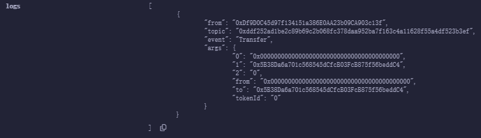

# Solidity应用

## ERC20

这一讲，我们介绍以太坊`ERC20`代币标准，并且发行属于自己的测试代币。

### ERC20

`ERC20`是以以太坊上的代币标准，实现了代币转账的基本逻辑.\

- 账户余额（balanceOf()）
- 转账（transfer()）
- 授权转账（transferFrom()）
- 授权（approve()）
- 代币总供给（totalSupply()）
- 授权转账额度（allowance()）
- 代币信息：名称（name()）、代号（symbol()）、小数位数（decimals()）

### IERC20

`IERC20`是`ERC20`标准的接口合约，规定了`ERC20`需要实现的函数和事件。

#### 事件

`IERC20`定义了两个事件，Transfer和Approval事件，分别在转账和授权时被释放。

```solidity
/** 
* @dev 释放条件：当`value`单位的货币从账户（`from`）转账到另一个账户（`to`）
*/
event Transfer(address indexed from, address indexed to, uint256 value);

/**
* @dev 释放条件：当`value`单位的货币从账户（`owner`）授权给另一个用户（`spender`）
*/
event Approval(address indexed owner, address indexed spender, uint256 value);
```

#### 函数

`IERC20`定义了6个函数，提供了转移代币的基本功能，并且允许代币获得批准，以便于其他链上第三方使用。

- `totalSupply()`返回代币总供给

```solidity
/**
* @dev 返回代币总供给
*/
function totalSupply() external view returns(uint256);
```

- `balanceOf()`返回账户余额

```solidity
/**
* @dev 返回账户的余额
*/
function balanceOf(address account) external view returns(uint256); 
```

- `transfer()`转账

```solidity
/**
* @dev 转账`amount`单位代币，从调用者的账户转到另一个账户`to`上。成功返回true
*/
function transfer(address to, uint256 amount) external returns(bool);
```

- `allowance`返回授权额度

```solidity
/**
* @dev 返回`owner`授权给`spender`账户的额度，默认是0
*/
function allowance(address owner, address spender) external view returns(uint256);
```

- `approve`授权

```solidity
/**
* @dev 调用者账户给`spender`账户授权`amount`数量的代币
*/
function approve(address spender, uint256 amount) external returns(bool);
```

- transferFrom()授权转账

```solidity
/**
* @dev 通过授权机制，从`from`账户向`to`账户转账`amount`数量的代币，转账的部分会从`allowance`中删除
*/
function transferFrom(address from, address to, uint256 amount) external returns(bool);
```

### 实现`ERC20`

现在我们写一个`ERC20`，将`IERC20`规定的函数简单实现。

#### 状态变量

我们需要状态变量来记录账户余额，授权额度好额代币信息，其中`balanceOf`、`allowance`、`totalSupply`为`public`类型，会自动生成一个同名的getter函数，实现`IERC20`规定的`balanceOf()`、`allowance`、`totalSupply`。`name`、`symbol`、`decimals`分别是代币名称、符号、小数位数。

如下便是状态变量:

```solidity
    mapping (address => uint256) public override balanceOf;

    mapping (address => mapping (address => uint256)) public override allowance;

    uint256 public override totalSupply; //代币总供给

    string public name;
    string public symbol;
    uint8 public decimals = 18; // 小数位数
```

#### 函数

构造函数：

```solidity
constructor(string memory _name, string memory _symbol) {
        name = _name;
        symbol = _symbol;
    } 
```

其他的：`transfer()`、`approve()`、`transferFrom()`函数进行重写：

> 注意：transfer()函数中如果是土狗币，会出现transfer函数魔改的现象，加入税收、分红、抽奖等逻辑。
>
> approve()函数：被授权方`spender`可以支配授权方的`amount`数量的代币。`spender`可以是EOA账户，也可以是合约账户，如果你使用uniswap进行交易的时候，你便需要将代币授权给`uniswap`合约。
>
> transferFrom()函数：实现`IERC20`中的`transferFrom`函数，授权转账逻辑。被授权方将授权方`sender`的`amount`数量的代币转账给接收方`recipient`。

```solidity
    function transfer(address recipient, uint amount) public override returns (bool) {
        balanceOf[msg.sender] -= amount;
        balanceOf[recipient] += amount;
        emit Transfer(msg.sender, recipient, amount);
        return true;
    }

    function approve(address spender, uint amount) public override returns (bool) {
        allowance[msg.sender][spender] += amount;
        // 此时发送方先不需要进行余额扣减
        emit Approve(msg.sender, spender, amount);
        return true;
    }

    function transferFrom(address spender, address recipient, uint amount) public override returns (bool) {
        allowance[spender][msg.sender] -= amount;
        balanceOf[spender] -= amount;
        balanceOf[recipient] += amount;
        emit Transfer(spender, recipient, amount);
        return true;
    }
```

还有一些铸造代币的函数:`mint()`函数

```solidity
function mint(uint amount) external {
        balanceOf[msg.sender] += amount;
        totalSupply += amount;
        emit Transfer(address(0), msg.sender, amount);
    }
```

以及一个销毁一定数量的函数:`burn()`函数

```solidity
    function burn(uint amount) external {
        balanceOf[msg.sender] -= amount;
        totalSupply -= amount;
        emit Transfer(msg.sender, address(0), amount);
    }
```

#### 发行代币

部署合约：选择`ERC20`合约，设置`deploy`：


执行。

我们先执行`mint`函数，输入100wei的代币金额。debug之后查看logs:


发现执行了事件：Transfer。

同时值变成100.

输入我们自己合约的地址，点击`balanceOf`函数，

发现余额是100.成功了。我们的代币由此发行成功。

贴一下完整代码：

`IERC20.sol`

```solidity
// SPDX-License-Identifier: MIT
pragma solidity ^0.8.21;

interface IERC20 {

    function totalSupply() external view returns (uint256);

    function balanceOf(address account) external view returns (uint256);

    function transfer(address to, uint256 amount) external returns (bool);

    function allowance(address owner, address spender) external view returns (uint256);

    function approve(address spender, uint256 amount) external returns (bool);

    function transferFrom(address from, address to, uint256 amount) external returns(bool);

    event Transfer(address indexed from, address indexed to, uint256 value);

    event Approve(address indexed owner, address indexed spender, uint256 value);
}
```

`ERC20.sol`

```solidity
// SPDX-License-Identifier: MIT
pragma solidity ^0.8.21;
import "./IERC20.sol";

contract ERC20 is IERC20{
    mapping (address => uint256) public override balanceOf;

    mapping (address => mapping (address => uint256)) public override allowance;

    uint256 public override totalSupply; //代币总供给

    string public name;
    string public symbol;
    uint8 public decimals = 18; // 小数位数

    constructor(string memory _name, string memory _symbol) {
        name = _name;
        symbol = _symbol;
    } 

    function transfer(address recipient, uint amount) public override returns (bool) {
        balanceOf[msg.sender] -= amount;
        balanceOf[recipient] += amount;
        emit Transfer(msg.sender, recipient, amount);
        return true;
    }

    function approve(address spender, uint amount) public override returns (bool) {
        allowance[msg.sender][spender] += amount;
        // 此时发送方先不需要进行余额扣减
        emit Approve(msg.sender, spender, amount);
        return true;
    }

    function transferFrom(address spender, address recipient, uint amount) public override returns (bool) {
        allowance[spender][msg.sender] -= amount;
        balanceOf[spender] -= amount;
        balanceOf[recipient] += amount;
        emit Transfer(spender, recipient, amount);
        return true;
    }

    function mint(uint amount) external {
        balanceOf[msg.sender] += amount;
        totalSupply += amount;
        emit Transfer(address(0), msg.sender, amount);
    }

    function burn(uint amount) external {
        balanceOf[msg.sender] -= amount;
        totalSupply -= amount;
        emit Transfer(msg.sender, address(0), amount);
    }
} 
```

## 代币水龙头

上一讲我们学习了`ERC20`代币标准，这一讲，我们将学习`ERC20`水龙头的智能合约。在这个合约中，用户可以领取到免费的`ERC20`代币。

### 代币水龙头

当人口渴的时候，会去接水喝。如果有人想要免费的代币的时候，就要去代币水龙头领取。代币水龙头就是为了让用户免费领取代币的	网站  /  应用。

最早的代币水龙头是BTC，现在BTC一枚需要$67607，但是在2010年的时候，BTC价格只有不到$0.1，并且持有人很少，比特币社区开发了BTC水龙头，让别人可以免费领取BTC。撸羊毛大家都喜欢，当时就有很多人去撸，一部分变成了BTC的信徒。BTC水龙头一共送出了超过了19700枚BTC，想想现在价值多少。人永远赚不到认知以外的money。

### ERC20水龙头合约

我们在此处实现一个简易版的ERC20水龙头，逻辑十分简单：我们将一些`ERC20`代币转到水龙头合约中，用户可以通过合约的`requestToken()`函数来领取`100`单位的代币，每一个地址只能领取一次。

#### 状态变量

我们在水龙头合约中定义3个状态变量。

- `amountAllowed`设定每一次能领取代币数量（默认为`100`，不是100枚，因为代币有小数位数）。
- `tokenContract`记录发放的`ERC20`代币合约的地址。
- `requestedAddress`记录领取过代币的地址。

```solidity
uint256 public amountAllowed = 100; // 每次领取100单位的代币
address public tokenContract; // token合约地址
mapping(address => bool) public requestedAddress; //记录领取过代币的地址
```

#### 事件

水龙头事件合约中定义了一个`sendToken`事件，记录了每一次领取代币的地址和数量，在`requestTokens()`函数被调用的时候释放。

```solidity
event SendToken(address indexed Receiver, uint256 indexed Amount);//SendToken事件
```

#### 函数

合约中只需要两个函数：

- 构造函数：初始化`tokenContract`状态变量，确定发放的`ERC20`地址。

```solidity
constractor(address _tokenContract) {
	tokenContract = _tokenContract;
}
```

- `requestTokens()`函数，用户调用它可以领取`ERC20`代币。

```solidity
	// 用户领取代币函数
    function requestTokens() external {
        // 如果已经领取过了，返回错误
        require(!requestedAddress[msg.sender], unicode"您已经领取过了,MF");
        // 创建合约对象
        IERC20 token = IERC20(tokenContract);
        // 如果数量不够了，返回错误
        require(token.balanceOf(address(this)) >= amountAllowed, "Faucet Empty!");
        // 转账，设置领取账户状态为true
        token.transfer(msg.sender, amountAllowed);
        requestedAddress[msg.sender] = true;
        // 释放事件
        emit SendToken(msg.sender, amountAllowed);
    }
```

代码综合:

`IERC20.sol`还是用之前的那一个，`ERC20.sol`也还是之前的那一个。此处只写`Faucet.sol`的代码。

```solidity
/// @dev 水龙头合约
contract Faucet {
    uint256 public amountAllowed = 100; // 每次能领取的代币数量（100指的是数量，不是一百枚，因为代币由小数位数）
    address public tokenContract; // 记录发放代币的合约地址
    mapping (address => bool) public requestedAddress; // 记录领取过代币的地址

    event SendToken(address indexed Receiver, uint256 indexed Amount);

    constructor(address _tokenContract) {
        tokenContract = _tokenContract;
    }

    function requestTokens() external {
        // 如果已经领取过了，返回错误
        require(!requestedAddress[msg.sender], unicode"您已经领取过了,MF");
        // 创建合约对象
        IERC20 token = IERC20(tokenContract);
        // 如果数量不够了，返回错误
        require(token.balanceOf(address(this)) >= amountAllowed, "Faucet Empty!");
        // 转账，设置领取账户状态为true
        token.transfer(msg.sender, amountAllowed);
        requestedAddress[msg.sender] = true;
        // 释放事件
        emit SendToken(msg.sender, amountAllowed);
    }
}
```

结果：

首先选择ERC20合约，

初始化金额为10000，

还是保持这个账户，选择`Faucet`合约。

输入的_tokenContract为ERC20的合约地址，部署。


利用`ERC20`代币合约的`transfer()`函数，将1000代币转账到`Faucet`合约地址。


之后会发现logs日志中存在:

我们换一个账户，调用`Faucet`合约`requestTokens()`函数，领取代币，可以看到`SendToken`被释放。


在`ERC20`代币合约上利用`balanceOf`查询领取水龙头账户余额，可以看到余额变成`100`。


#### 总结

这一讲，我们介绍了代币水龙头的历史和`ERC20`水龙头合约。大家觉得下一个`BTC`的水龙头会在哪里呢？是狗狗币，还是你自己发行的货币呢？你是否可以把握住下一次的`BTC`呢？

## 空投合约

### 空投Airdrop

空投是币圈一种营销策略，项目方将代币免费发送给特定的用户群体。为了拿到这个代币，用户通常需要完成一些工作：比如测试产品、分享新闻、介绍朋友等。项目方可以通过空投获得种子用户，而用户可以获取到一笔财富，两全其美。

#### 空投代币合约

空投合约设计非常简单，利用循环，将一笔交易的代币地址发送给多个用户多个地址。合约中包含两个函数：

- `getSum()`函数：返回`uint`数组的和。

```solidity

```

- `multiTransferToken()`函数：发送`ERC20`代币空投，包含3个参数：
  - `_token`: 代币合约地址（address类型）。
  - `_address`: 接收空投的用户地址数组（address[]类型）。
  - `_amounts`：空投数量数组，对应`_address`里每个地址的数量(uint[]类型)。


## ERC721

`BTC`和`ETH`这一类代币都属于同质化代币，矿工挖出的第一枚比特币和第1000枚比特币没有任何区别。但是世界上的很多物品是不同质的，其中包括房产、古董、虚拟艺术品等等。这一类物品无法用同质化代币抽象，因此，以太坊EIP721提出了`ERC721`标准，来抽象非同质化的物品。这一讲，我们将介绍`ERC721`标准，并且基于它发行一款`NFT`。

### EIP与ERC

`EIP`全称`Ethereum Improvement Proposals`（以太坊改进意见），是以以太坊开发者社区提出的改进意见，是一系列以编号排定的文件。

`ERC`全称`Ethereum Request For Comment`（以太坊意见征集稿）。用以记录以太坊上应用级的各种开发标准和协议。如典型的Token标准（`ERC20`、`ERC721`），名字注册（`ERC26`、`ERC13`），URI范式（`ERC67`），Library/Package格式（`EIP82`），钱包格式（`EIP75`、`EIP85`）。

`EIP`包含`ERC`。

### ERC165

通过ERC165标准，智能合约可以声明它支持的接口，供给其他合约检查。简单来说，ERC165 就是检查一个智能合约是不是支持了`ERC721`，`ERC1155`的接口。

`IERC165`接口合约声明了一个`supportsInterface`函数，输入要查询的`interfaceId`接口id，若合约实现了该接口id，则返回`true`。

```solidity
interface IERC165 {
    /**
     * @dev 如果合约实现了查询的`interfaceId`，则返回true
     * 规则详见：https://eips.ethereum.org/EIPS/eip-165#how-interfaces-are-identified[EIP section]
     *
     */
    function supportsInterface(bytes4 interfaceId) external view returns (bool);
}
```

具体的实现:

```solidity
    function supportsInterface(bytes4 interfaceId) external pure override returns (bool)
    {
        return
            interfaceId == type(IERC721).interfaceId ||
            interfaceId == type(IERC165).interfaceId;
    }
```

### IERC721

`IERC721`是`ERC721`标准的接口合约，规定了`ERC721`要实现的基本函数。它利用`tokenId`来表示特定的非同质化的代币，授权或转账都要明确`tokenId`，而`ERC20`只需要明确转账的金额即可。

```solidity
/**
 * @dev ERC721标准接口.
 */
interface IERC721 is IERC165 {
    event Transfer(address indexed from, address indexed to, uint256 indexed tokenId);
    event Approval(address indexed owner, address indexed approved, uint256 indexed tokenId);
    event ApprovalForAll(address indexed owner, address indexed operator, bool approved);

    function balanceOf(address owner) external view returns (uint256 balance);

    function ownerOf(uint256 tokenId) external view returns (address owner);

    function safeTransferFrom(
        address from,
        address to,
        uint256 tokenId,
        bytes calldata data
    ) external;

    function safeTransferFrom(
        address from,
        address to,
        uint256 tokenId
    ) external;

    function transferFrom(
        address from,
        address to,
        uint256 tokenId
    ) external;

    function approve(address to, uint256 tokenId) external;

    function setApprovalForAll(address operator, bool _approved) external;

    function getApproved(uint256 tokenId) external view returns (address operator);

    function isApprovedForAll(address owner, address operator) external view returns (bool);
}
```

#### IERC721事件

`IERC721`包含3个事件，其中`Approval`和`Transfer`函数在`ERC20`中也有。

- `Transfer`事件：在转账时被释放，记录代币的发出地址`from`，接收地址`to`和`tokenId`。
- `Approval`事件：在授权时释放，记录授权地址`owner`，被授权地址`approved`和`tokenId`。
- `ApprovalForAll`事件：在批量授权时释放，记录批量授权的发出地址`owner`，被授权地址`operator`与授权与否的`approved`。

#### IERC721函数

- `balanceOf`：返回某地址的NFT持有量`balance`。
- `ownerOf`：返回某`tokenId`的主人`owner`。
- `transferFrom`：普通转账，参数为转出地址`from`，接收地址`to`和`tokenId`。
- `safeTransferFrom`：安全转账（如果接收方是合约地址，会要求实现`ERC721Receiver`）。参数为转出地址`from`，接收地址`to`和`tokenId`。
- `approve`： 授权另一个地址使用你的NFT，参数为授权地址`approve`和`tokenId`。
- `getApproved`：查询`tokenId`被批准给了那一个地址。
- `setApprovalForAll`：将自己持有的该系列NFT批量授权给某个地址`operator`。
- `isApprovedForAll`：查询某一个地址的NFT是否批量授权给了另一个`operator`地址。
- `safeTransferFrom`：安全转账的重载函数，参数里面包含了`data`。

### IERC721Receiver

如果一个合约没有实现`ERC721`的相关函数，转入的`NFT`就进了黑洞，永远转不出来了。为了防止误转账，`ERC721`实现了`safeTransferFrom()`安全转账函数，目标合约必须实现了`IERC721Receiver`接口才能接收`ERC721`代币，不然会revert。IERC721Receiver接口只包含一个`onERC721Received()`函数。

```solidity
// ERC721接收者接口：合约必须实现这个接口来通过安全转账接收ERC721
interface IERC721Receiver {
    function onERC721Received(
        address operator,
        address from,
        uint tokenId,
        bytes calldata data
    ) external returns (bytes4);
}
```

我们看一下`ERC721`利用`_checkOnERC721Received()`函数来确保目标合约实现了`onERC721Received()`函数（返回`onERC721Received`的`selector`）。

```solidity
function _checkOnERC721Received(
    address operator,
    address from,
    address to,
    uint256 tokenId,
    bytes memory data
) internal {
    if (to.code.length > 0) {
        try IERC721Receiver(to).onERC721Received(operator, from, tokenId, data) returns (bytes4 retval) {
            if (retval != IERC721Receiver.onERC721Received.selector) {
                // Token rejected
                revert IERC721Errors.ERC721InvalidReceiver(to);
            }
        } catch (bytes memory reason) {
            if (reason.length == 0) {
                // non-IERC721Receiver implementer
                revert IERC721Errors.ERC721InvalidReceiver(to);
            } else {
                /// @solidity memory-safe-assembly
                assembly {
                    revert(add(32, reason), mload(reason))
                }
            }
        }
    }
}
```

### IERC721Metadata

`IERC721Metadata`是`ERC721`的拓展接口，实现了3个查询`metadata`元数据的常用函数：

- `name()`：返回代币名称.
- `symbol()`：返回代币的代号。
- `tokenURI()`：通过`tokenId`查询`metadata`的链接`url`,`ERC721`特有的函数。

```solidity
interface IERC721Metadata is IERC721 {
    function name() external view returns (string memory);

    function symbol() external view returns (string memory);

    function tokenURI(uint256 tokenId) external view returns (string memory);
}
```

### ERC721主合约

`ERC721`主合约实现了`IERC721`，`IERC165`和`IERC721Metadata`定义所有的功能，包含4个状态变量和17个函数。实现都比较简单，每一个函数的功能见代码注释：

```solidity
// SPDX-License-Identifier: MIT
// by 0xAA
pragma solidity ^0.8.21;

import "./IERC165.sol";
import "./IERC721.sol";
import "./IERC721Receiver.sol";
import "./IERC721Metadata.sol";
import "./String.sol";

contract ERC721 is IERC721, IERC721Metadata{
    using Strings for uint256; // 使用String库，

    // Token名称
    string public override name;
    // Token代号
    string public override symbol;
    // tokenId 到 owner address 的持有人映射
    mapping(uint => address) private _owners;
    // address 到 持仓数量 的持仓量映射
    mapping(address => uint) private _balances;
    // tokenID 到 授权地址 的授权映射
    mapping(uint => address) private _tokenApprovals;
    //  owner地址。到operator地址 的批量授权映射
    mapping(address => mapping(address => bool)) private _operatorApprovals;

    // 错误 无效的接收者
    error ERC721InvalidReceiver(address receiver);

    /**
     * 构造函数，初始化`name` 和`symbol` .
     */
    constructor(string memory name_, string memory symbol_) {
        name = name_;
        symbol = symbol_;
    }

    // 实现IERC165接口supportsInterface
    function supportsInterface(bytes4 interfaceId)
        external
        pure
        override
        returns (bool)
    {
        return
            interfaceId == type(IERC721).interfaceId ||
            interfaceId == type(IERC165).interfaceId ||
            interfaceId == type(IERC721Metadata).interfaceId;
    }

    // 实现IERC721的balanceOf，利用_balances变量查询owner地址的balance。
    function balanceOf(address owner) external view override returns (uint) {
        require(owner != address(0), "owner = zero address");
        return _balances[owner];
    }

    // 实现IERC721的ownerOf，利用_owners变量查询tokenId的owner。
    function ownerOf(uint tokenId) public view override returns (address owner) {
        owner = _owners[tokenId];
        require(owner != address(0), "token doesn't exist");
    }

    // 实现IERC721的isApprovedForAll，利用_operatorApprovals变量查询owner地址是否将所持NFT批量授权给了operator地址。
    function isApprovedForAll(address owner, address operator)
        external
        view
        override
        returns (bool)
    {
        return _operatorApprovals[owner][operator];
    }

    // 实现IERC721的setApprovalForAll，将持有代币全部授权给operator地址。调用_setApprovalForAll函数。
    function setApprovalForAll(address operator, bool approved) external override {
        _operatorApprovals[msg.sender][operator] = approved;
        emit ApprovalForAll(msg.sender, operator, approved);
    }

    // 实现IERC721的getApproved，利用_tokenApprovals变量查询tokenId的授权地址。
    function getApproved(uint tokenId) external view override returns (address) {
        require(_owners[tokenId] != address(0), "token doesn't exist");
        return _tokenApprovals[tokenId];
    }
     
    // 授权函数。通过调整_tokenApprovals来，授权 to 地址操作 tokenId，同时释放Approval事件。
    function _approve(
        address owner,
        address to,
        uint tokenId
    ) private {
        _tokenApprovals[tokenId] = to;
        emit Approval(owner, to, tokenId);
    }

    // 实现IERC721的approve，将tokenId授权给 to 地址。条件：to不是owner，且msg.sender是owner或授权地址。调用_approve函数。
    function approve(address to, uint tokenId) external override {
        address owner = _owners[tokenId];
        require(
            msg.sender == owner || _operatorApprovals[owner][msg.sender],
            "not owner nor approved for all"
        );
        _approve(owner, to, tokenId);
    }

    // 查询 spender地址是否可以使用tokenId（需要是owner或被授权地址）
    function _isApprovedOrOwner(
        address owner,
        address spender,
        uint tokenId
    ) private view returns (bool) {
        return (spender == owner ||
            _tokenApprovals[tokenId] == spender ||
            _operatorApprovals[owner][spender]);
    }

    /*
     * 转账函数。通过调整_balances和_owner变量将 tokenId 从 from 转账给 to，同时释放Transfer事件。
     * 条件:
     * 1. tokenId 被 from 拥有
     * 2. to 不是0地址
     */
    function _transfer(
        address owner,
        address from,
        address to,
        uint tokenId
    ) private {
        require(from == owner, "not owner");
        require(to != address(0), "transfer to the zero address");

        _approve(owner, address(0), tokenId);

        _balances[from] -= 1;
        _balances[to] += 1;
        _owners[tokenId] = to;

        emit Transfer(from, to, tokenId);
    }
    
    // 实现IERC721的transferFrom，非安全转账，不建议使用。调用_transfer函数
    function transferFrom(
        address from,
        address to,
        uint tokenId
    ) external override {
        address owner = ownerOf(tokenId);
        require(
            _isApprovedOrOwner(owner, msg.sender, tokenId),
            "not owner nor approved"
        );
        _transfer(owner, from, to, tokenId);
    }

    /**
     * 安全转账，安全地将 tokenId 代币从 from 转移到 to，会检查合约接收者是否了解 ERC721 协议，以防止代币被永久锁定。调用了_transfer函数和_checkOnERC721Received函数。条件：
     * from 不能是0地址.
     * to 不能是0地址.
     * tokenId 代币必须存在，并且被 from拥有.
     * 如果 to 是智能合约, 他必须支持 IERC721Receiver-onERC721Received.
     */
    function _safeTransfer(
        address owner,
        address from,
        address to,
        uint tokenId,
        bytes memory _data
    ) private {
        _transfer(owner, from, to, tokenId);
        _checkOnERC721Received(from, to, tokenId, _data);
    }

    /**
     * 实现IERC721的safeTransferFrom，安全转账，调用了_safeTransfer函数。
     */
    function safeTransferFrom(
        address from,
        address to,
        uint tokenId,
        bytes memory _data
    ) public override {
        address owner = ownerOf(tokenId);
        require(
            _isApprovedOrOwner(owner, msg.sender, tokenId),
            "not owner nor approved"
        );
        _safeTransfer(owner, from, to, tokenId, _data);
    }

    // safeTransferFrom重载函数
    function safeTransferFrom(
        address from,
        address to,
        uint tokenId
    ) external override {
        safeTransferFrom(from, to, tokenId, "");
    }

    /** 
     * 铸造函数。通过调整_balances和_owners变量来铸造tokenId并转账给 to，同时释放Transfer事件。铸造函数。通过调整_balances和_owners变量来铸造tokenId并转账给 to，同时释放Transfer事件。
     * 这个mint函数所有人都能调用，实际使用需要开发人员重写，加上一些条件。
     * 条件:
     * 1. tokenId尚不存在。
     * 2. to不是0地址.
     */
    function _mint(address to, uint tokenId) internal virtual {
        require(to != address(0), "mint to zero address");
        require(_owners[tokenId] == address(0), "token already minted");

        _balances[to] += 1;
        _owners[tokenId] = to;

        emit Transfer(address(0), to, tokenId);
    }

    // 销毁函数，通过调整_balances和_owners变量来销毁tokenId，同时释放Transfer事件。条件：tokenId存在。
    function _burn(uint tokenId) internal virtual {
        address owner = ownerOf(tokenId);
        require(msg.sender == owner, "not owner of token");

        _approve(owner, address(0), tokenId);

        _balances[owner] -= 1;
        delete _owners[tokenId];

        emit Transfer(owner, address(0), tokenId);
    }

    // _checkOnERC721Received：函数，用于在 to 为合约的时候调用IERC721Receiver-onERC721Received, 以防 tokenId 被不小心转入黑洞。
    function _checkOnERC721Received(address from, address to, uint256 tokenId, bytes memory data) private {
        if (to.code.length > 0) {
            try IERC721Receiver(to).onERC721Received(msg.sender, from, tokenId, data) returns (bytes4 retval) {
                if (retval != IERC721Receiver.onERC721Received.selector) {
                    revert ERC721InvalidReceiver(to);
                }
            } catch (bytes memory reason) {
                if (reason.length == 0) {
                    revert ERC721InvalidReceiver(to);
                } else {
                    /// @solidity memory-safe-assembly
                    assembly {
                        revert(add(32, reason), mload(reason))
                    }
                }
            }
        }
    }

    /**
     * 实现IERC721Metadata的tokenURI函数，查询metadata。
     */
    function tokenURI(uint256 tokenId) public view virtual override returns (string memory) {
        require(_owners[tokenId] != address(0), "Token Not Exist");

        string memory baseURI = _baseURI();
        return bytes(baseURI).length > 0 ? string(abi.encodePacked(baseURI, tokenId.toString())) : "";
    }

    /**
     * 计算{tokenURI}的BaseURI，tokenURI就是把baseURI和tokenId拼接在一起，需要开发重写。
     * BAYC的baseURI为ipfs://QmeSjSinHpPnmXmspMjwiXyN6zS4E9zccariGR3jxcaWtq/ 
     */
    function _baseURI() internal view virtual returns (string memory) {
        return "";
    }
}

```

### 写一个免费铸造的APE

我们来利用`ERC721`来写一个免费铸造的APE，总量设置成10000，只需要重写一下`mint()`和`baseURI()`函数即可。由于`baseURI()`设置的和`BAYC`一样，元数据会直接获取无聊猿的，

```solidity
// SPDX-License-Identifier: MIT
pragma solidity ^0.8.21;
import "./ERC721.sol";

/// @dev 写一个免费铸造的APE
contract ZDBApe is ERC721{
    // 总量
    uint public MAX_APES = 10000;
    // 构造函数
    constructor(string memory name_, string memory symbol_) ERC721(name_, symbol_){
    }
    // BAYCd baseURI是ipfs://QmeSjSinHpPnmXmspMjwiXyN6zS4E9zccariGR3jxcaWtq/
    function _baseURI() internal pure override returns (string memory) {
        return "ipfs://QmeSjSinHpPnmXmspMjwiXyN6zS4E9zccariGR3jxcaWtq/";
    }
    // 铸造函数
    function mint(address to, uint tokenId) external {
        require(tokenId >= 0 && tokenId < MAX_APES, "tokenId out of range");
        _mint(to, tokenId);
    }
}
```

### 发行`ERC721`代币

有了`ERC721`标准之后，在`ETH`链上发行NFT便显得很简单了。现在，我们发行属于我们的NFT。

分别部署ERC721和ZDBApe两个智能合约（按照顺序），在部署的时候设置name = "ZDB"和symbol = “ZDB”。


如此一来，我们便创建好了`ZDB`NFT，我们只需要运行`mint()`函数来给自己铸造一些代币。在`mint`函数输入账户地址和`tokenId`，并且点击`mint`按钮，为自己铸造`0`号`ZDB`NFT。

查看logs：



我们利用`balanceOf`函数查看账户的余额，输入我们当前的 账户，可以看到有一个NFT 。铸造成功.


日志输出：

我们也可以利用`ownerOf`函数查询NFT属于那一个账户。输入`tokenId`，可以查找到我们的地址，查询无误。


### ERC165和ERC721详解

上面说到，为了防止NFT被转到一个没有能力操作的NFT合约中去，目标必须正确的实现ERC721TokenReceiver接口：

```solidity
interface ERC721TokenReceiver {
    function onERC721Received(address _operator, address _from, uint256 _tokenId, bytes _data) external returns(bytes4);
}
```

ERC165是一种对外声明自己实现了那些接口的接口技术标准。实现了一个接口就表明合约具有某一种特殊能力。有一些合约与其他合约交互时，期望目标合约拥有某一些功能，那么合约之间就能通过ERC165标准对对方进行查询以检查对方是否拥有相应的能力。

以ERC721合约为例。当外部对某一个合约进行检查其是否是ERC721时，怎么做？按照这个方法，检查步骤应该是首先检查该合约是否实现了ERC165，再检查该合约实现的其他待定接口。此时该特定接口是IERC721，IERC721是ERC721的基本接口（为什么说是基本，是因为还有其他的`ERC721Metadata`、`ERC721Enumerable`）这样的拓展。

```solidity
/// 注意这个**0x80ac58cd**
///  **⚠⚠⚠ Note: the ERC-165 identifier for this interface is 0x80ac58cd. ⚠⚠⚠**
interface ERC721 /* is ERC165 */ {
    event Transfer(address indexed _from, address indexed _to, uint256 indexed _tokenId);

    event Approval(address indexed _owner, address indexed _approved, uint256 indexed _tokenId);

    event ApprovalForAll(address indexed _owner, address indexed _operator, bool _approved);

    function balanceOf(address _owner) external view returns (uint256);

    function ownerOf(uint256 _tokenId) external view returns (address);

    function safeTransferFrom(address _from, address _to, uint256 _tokenId, bytes data) external payable;

    function safeTransferFrom(address _from, address _to, uint256 _tokenId) external payable;

    function transferFrom(address _from, address _to, uint256 _tokenId) external payable;

    function approve(address _approved, uint256 _tokenId) external payable;

    function setApprovalForAll(address _operator, bool _approved) external;

    function getApproved(uint256 _tokenId) external view returns (address);

    function isApprovedForAll(address _owner, address _operator) external view returns (bool);
}
```

**0x80ac58cd**=`bytes4(keccak256(ERC721.Transfer.selector) ^ keccak256(ERC721.Approval.selector) ^ ··· ^keccak256(ERC721.isApprovedForAll.selector))`,这是ERC165规定的计算方式。

类似的，能够计算出ERC165本身的接口（它的接口里只有一个`function supportsInterface(bytes4 interfaceID) external view returns(bool)`）函数。对其进行`bytes4(keccak256(supportsInterface.selector))`得到**0x01ffc9a7**。此外，ERC721还定义了一些拓展接口，比如`ERC721Metadata`，

```solidity
///  Note: the ERC-165 identifier for this interface is 0x5b5e139f.
interface ERC721Metadata /* is ERC721 */ {
    function name() external view returns (string _name);
    function symbol() external view returns (string _symbol);
    function tokenURI(uint256 _tokenId) external view returns (string); // 这个很重要，前端展示的小图片的链接都是这个函数返回的
}
```

这个**0x5b5e139f** 的计算就是：

```solidity
IERC721Metadata.name.selector ^ IERC721Metadata.symbol.selector ^ IERC721Metadata.tokenURI.selector
```

solamte实现的ERC721.sol是怎么完成这些ERC165的特性呢？

```solidity
function supportsInterface(bytes4 interfaceId) public view virtual returns(bool) {
	return 
		interfaceId == 0x01ffc9a7 || // ERC165 Interface ID for ERC165
		interfaceId == 0x80ac58cd || // ERC165 Interface ID for ERC721
		interfaceId == 0x5b5e139f; // ERC165 interfaceID for ERC721Metadata
}
```

当外界想要检查这个合约是否是ERC165时，就是interfaceId必须是0x01ffc9a7，此时返回true。在入参是0xffffffff时，返回值必须是false。

当外界想要检查这个合约是否是ERC721的时候，好说，入参是0x80ac58cd的时候表明外界想要做这个检查。返回true。

当外界想要检查这个合约是否实现ERC721的拓展ERC721Matadata接口时，入参是0x5b5e139f，返回true。

并且这个函数是virtual的，后续的合约继承了这个合约之后也可以进行使用，将supportsInterface函数进行重写。便可以进行复用。

```solidity
function supportsInterface(bytes4 interfaceId) public view virtual returns (bool) {
        return
            interfaceId == 0x01ffc9a7 || // ERC165 Interface ID for ERC165
            interfaceId == 0x80ac58cd || // ERC165 Interface ID for ERC721
            interfaceId == 0x5b5e139f || // ERC165 Interface ID for ERC721Metadata
            interfaceId == 0x780e9d63;   // ERC165 Interface ID for ERC721Enumerable
}
```

### 总结

这一讲，我们介绍了ERC721标准、接口及其实现，并且在代码中进行了中文的注释，并且我们利用`ERC721`做了一个免费铸造的ZDBNFT，元数据直接调用BAYC，`ERC721`仍然在不断的发展中，目前比较流行的版本是`ERC721Enumerable`（提高NFT可访问性）和`ERC721A`（节约铸造的gas）。

## 荷兰拍卖

荷兰拍卖（`Dutch Auction`）是一种特殊的拍卖形式。也可以成为称为“减价拍卖”，他是指拍卖标的竞价由高到低依次递减直到第一个竞买人应价。

币圈，很多`NFT`通过荷兰拍卖发售，其中包括`Azuki`和`World of Women`，其中`Azuki`通过荷兰拍卖筹集了超过8000枚`ETH`。

### `DutchAuction`合约

代码基于`Azuki`的代码简化而成。`DutchAuction`合约继承了之前介绍的`ERC721`和`Ownable`合约：

```solidity
// SPDX-License-Identifier: MIT
pragma solidity ^0.8.21;

import "@openzeppelin/contracts/access/Ownable.sol";
import "https://github.com/AmazingAng/WTF-Solidity/blob/main/34_ERC721/ERC721.sol";

contract DutchAuction is Ownable, ERC721 {
```

#### `DutchAuction`状态变量

合约中一共有9个状态变量，其中有6个和拍卖相关，他们是：

- COLLECTION_SIZE：NFT总量
- AUCTION_START_PRICE:竞拍的起拍价，也是最高价
- AUCTION_END_PRICE：竞拍的结束价，也是最低价
- AUCTION_TIME：拍卖持续时长
- AUCTION_DROP_INTERVAL：每隔多少时间，价格衰减一次。
- auctionStartTime：拍卖起始时间（区块链事件戳，block.timestamp）

```solidity
    uint256 public constant COLLECTOIN_SIZE = 10000; // NFT总数
    uint256 public constant AUCTION_START_PRICE = 1 ether; // 起拍价(最高价)
    uint256 public constant AUCTION_END_PRICE = 0.1 ether; // 结束价(最低价/地板价)
    uint256 public constant AUCTION_TIME = 10 minutes; // 拍卖时间，为了测试方便设为10分钟
    uint256 public constant AUCTION_DROP_INTERVAL = 1 minutes; // 每过多久时间，价格衰减一次
    uint256 public constant AUCTION_DROP_PER_STEP =
        (AUCTION_START_PRICE - AUCTION_END_PRICE) /
        (AUCTION_TIME / AUCTION_DROP_INTERVAL); // 每次价格衰减步长
    
    uint256 public auctionStartTime; // 拍卖开始时间戳
    string private _baseTokenURI;   // metadata URI
    uint256[] private _allTokens; // 记录所有存在的tokenId 
```

#### `DutchAuction`函数

荷兰拍卖合约中共有9个函数，与`ERC721`相关的函数我们不在做过多介绍，只介绍与拍卖有关的函数。

- 设定拍卖起始时间：我们在构造函数中会声明当前区块为起始时间，项目方也可以通过`setAuctionStartTime()`函数来调整：

```solidity
    constructor() ERC721("WTF Dutch Auctoin", "WTF Dutch Auctoin") {
        auctionStartTime = block.timestamp;
    }

    // auctionStartTime setter函数，onlyOwner
    function setAuctionStartTime(uint32 timestamp) external onlyOwner {
        auctionStartTime = timestamp;
    }
```

- 获取拍卖的实时价格：`getAuctionPrice()`函数通过当前区块时间以及拍卖相关的状态变量来计算实时拍卖价格。

​	条件：

	1. 当block.timestamp小于起始时间，价格为最高价`AUCTION_START_PRICCE`；
	1. 当block.timestamp大于结束时间，价格为最低价`AUCTION_END_PRICE`；
	1. 当block.timestamp处于两者之间，计算出当前的衰减价格。

```solidity
    // 获取拍卖实时价格
    function getAuctionPrice()
        public
        view
        returns (uint256)
    {
        if (block.timestamp < auctionStartTime) {
        return AUCTION_START_PRICE;
        }else if (block.timestamp - auctionStartTime >= AUCTION_TIME) {
        return AUCTION_END_PRICE;
        } else {
        uint256 steps = (block.timestamp - auctionStartTime) /
            AUCTION_DROP_INTERVAL;
        return AUCTION_START_PRICE - (steps * AUCTION_DROP_PER_STEP);
        }
    }
```

- 用户拍卖并且铸造NFT：用户通过调用`auctionMint()`函数，支付`ETH`参加荷兰拍卖并铸造NFT。

首先检查拍卖是否开始/铸造是否超过NFT总量。接着，合约通过`getAuctionPrice()`函数和铸造数量来计算拍卖成本，并检查用户支付的ETH是否足够；如果足够，则将NFT铸造给用户，并且退回超额的ETH；反之退回交易。

```solidity
    // 拍卖mint函数
    function auctionMint(uint256 quantity) external payable{
        uint256 _saleStartTime = uint256(auctionStartTime); // 建立local变量，减少gas花费
        require(
        _saleStartTime != 0 && block.timestamp >= _saleStartTime,
        "sale has not started yet"
        ); // 检查是否设置起拍时间，拍卖是否开始
        require(
        totalSupply() + quantity <= COLLECTOIN_SIZE,
        "not enough remaining reserved for auction to support desired mint amount"
        ); // 检查是否超过NFT上限

        uint256 totalCost = getAuctionPrice() * quantity; // 计算mint成本
        require(msg.value >= totalCost, "Need to send more ETH."); // 检查用户是否支付足够ETH
        
        // Mint NFT
        for(uint256 i = 0; i < quantity; i++) {
            uint256 mintIndex = totalSupply();
            _mint(msg.sender, mintIndex);
            _addTokenToAllTokensEnumeration(mintIndex);
        }
        // 多余ETH退款
        if (msg.value > totalCost) {
            payable(msg.sender).transfer(msg.value - totalCost); //注意一下这里是否有重入的风险
        }
    }
```

- 项目方取出筹集的ETH，项目方可以通过`withdeawMoney`函数提取拍卖的ETH。

```solidity
function withdrawMoney() external onlyOwner{
	(bool success, )  = msg.sender.call{value: address(this).balance}("");
	require(success, "Transfer failed.");
}
```

### 具体演示

1、部署合约。通过`setAuctionStartTime`函数设置起拍时间。时间参数需要是UTC时间：https://tool.chinaz.com/tools/unixtime.aspx。

2、 荷兰拍卖：随后，可以通过`getAuctionPrice()`函数获取当前的拍卖价格。。不同的时间值也是不同的值。

3、 Mint操作：通过`auctionMint()`函数，完成Mint，可以看到本例中，由于时间已经超过拍卖时间，因此仅仅耗费了`地板价`就完成了拍卖。

4、 提取ETH：直接通过`withdrawMoney()`函数，便可以将筹集到的ETH通过call()发送到合约创建者的地址。

### 总结

通过简化的`Azuki`荷兰拍卖代码，讲解了如何通过`荷兰拍卖`发售`ERC721`标准的NFT。

## 默克尔树Merkle Tree

这一讲，我们介绍默克尔树（Merkle Tree），以及如何利用`Merkle Tree`发放`NFT`白名单。

### Merkle Tree

`Merkle TRee`叫做默克尔树，又叫做哈希树，是区块链底层加密的技术。被比特币和以太坊区块链广泛使用。`Merkle Tree`是一种自下而上构建的加密树。每一个叶子是对应数据的的哈希，而每个非叶子是它的2个子节点的哈希。

默克尔树允许对大型的数据结构的内容进行有效的验证。对于有N个叶子结点的`Merkle Tree`，在已知`root`根植的情况下，验证某一个数据是否有效（属于`Merkle Tree`叶子结点）只需要`ceil(log2N)`个数据（也叫做`proof`）。如果数据有误，或者是给的`proof`有误，都是无法还原出root节点的。给一个例子，用来演示整个过程：


如上图，我们要验证L1是在整个树中，其实只需要Hash0-1和Hash1的值即可。因为，L1可以推出Hash0-0的值，假设我们知道Hash0-1的值，我们拿着Hash0-1和Hash0-0的值求出来Hash0的值，此时要是想要得到root，只需要得到Hash1的值，此时假设我们正好知道Hash1的值，那么就可以拿着这个Hash1的值和Hash0的值进行处理，得到root的值。

### 生成`Merkle Tree`

我们可以利用网页或者是merkletreejs来生成`Merkle Tree`。

网页：https://lab.miguelmota.com/merkletreejs/example/

这里我们使用网页来生成4个地址作为叶子结点的`Merkle tree`.

```json
    [
    "0x5B38Da6a701c568545dCfcB03FcB875f56beddC4", 
    "0xAb8483F64d9C6d1EcF9b849Ae677dD3315835cb2",
    "0x4B20993Bc481177ec7E8f571ceCaE8A9e22C02db",
    "0x78731D3Ca6b7E34aC0F824c42a7cC18A495cabaB"
    ]
```

在菜单上选择`Keccak-256`、`hashLeaves`、`sortPairs`选项。执行`compute`。

生成了默克尔树：


`eeefd6......097`是root节点。

`5931b4e.......229`是叶子结点0。

`999b..........cdb`是叶子结点1。

`04a1..........b54`是叶子结点2。

`dfb...........486`是叶子节点3。

那么地址0的`proof`如下：即：

```json
[
  "0x999bf57501565dbd2fdcea36efa2b9aef8340a8901e3459f4a4c926275d36cdb",
  "0x4726e4102af77216b09ccd94f40daa10531c87c4d60bba7f3b3faf5ff9f19b3c"
]
```

其实一想就明白了，因为节点0的另一个叶子结点不知道，所以找不出9d9的这个节点，所以和593相邻的是一个`proof`，同时此时验证了9d9的节点，那么想要验证root节点的话就需要另一个和9d9同一层的节点，也就是472节点。

我们看一下`Merkle Tree`库。

```solidity
// SPDX-License-Identifier: MIT
pragma solidity ^0.8.21;

/// @dev Merkle库
library MerkleProof {
    /**
    * @dev 当通过`proof`或者是`leaf`重建出来的`root`与给定的`root`相等时，返回`true`。数据有效
    */
    function verify(
        bytes32[] memory proof,
        bytes32 root,
        bytes32 leaf
    ) internal pure returns (bool) {
        return  processProof(proof, leaf) == root;
    }

    function processProof(bytes32[] memory proof, bytes32 leaf) internal pure returns (bytes32) {
        bytes32 computedHash = leaf;
        for (uint256 i = 0; i < proof.length; i++) {
            computedHash = _hashPair(computedHash, proof[i]);
        }
        return computedHash;
    }

    /**
    * @dev Sorted Pair Hash
    */
    function _hashPair(bytes32 a, bytes32 b) private pure returns (bytes32) {
        return a < b ? keccak256(abi.encodePacked(a, b)) : keccak256(abi.encodePacked(b, a));
    }
}
```

我们来看一下`MerkleProof`库的三个函数：

1. `verify`函数。利用`proof`数来验证`leaf`是否属于根为`root`的`Merkle Tree`中，如果是，则返回`true`。调用了`processProof()`函数。
2. `processProof()`函数。利用`proof`和`leaf`计算出`Merkle Tree`的`root`，调用了`_hashPair`函数。
3. `_hashPair`函数。用`keccak256`函数计算非根节点的对应两个子节点的hash（排序之后）。

### 利用`Merkle Tree`发放`NFT`白名单

一份拥有800个地址的白名单，更新一次所需要的gas fee很容易超过1个ETH，而由于默克尔树验证的时候，`leaf`和`proof`可以存储在后端，链上仅需要存储一个`root`的值，非常的节省`gas`，项目方经常用它来发放白名单。很多`ERC721`标准和`ERC20`标准代币的白名单都是通过`Merkle Tree`发行的，比如`optimism`的空投。

我们在此处介绍一下如何利用`Merkle Tree`合约发放`NFT`白名单。

```solidity
// SPDX-License-Identifier: MIT
pragma solidity ^0.8.21;
import "https://github.com/AmazingAng/WTF-Solidity/blob/main/34_ERC721/ERC721.sol";

/// @dev Merkle库
library MerkleProof {
    /**
    * @dev 当通过`proof`或者是`leaf`重建出来的`root`与给定的`root`相等时，返回`true`。数据有效
    */
    function verify(
        bytes32[] memory proof,
        bytes32 root,
        bytes32 leaf
    ) internal pure returns (bool) {
        return  processProof(proof, leaf) == root;
    }

    function processProof(bytes32[] memory proof, bytes32 leaf) internal pure returns (bytes32) {
        bytes32 computedHash = leaf;
        for (uint256 i = 0; i < proof.length; i++) {
            computedHash = _hashPair(computedHash, proof[i]);
        }
        return computedHash;
    }

    /**
    * @dev Sorted Pair Hash
    */
    function _hashPair(bytes32 a, bytes32 b) private pure returns (bytes32) {
        return a < b ? keccak256(abi.encodePacked(a, b)) : keccak256(abi.encodePacked(b, a));
    }

}
contract MerkleTree is ERC721{
    bytes32 immutable public root;
    mapping (address => bool) public mintedAddress;

    constructor(string memory name, string memory symbol, bytes32 merkleroot) ERC721(name, symbol){
        root = merkleroot;
    }

    /**
    * @dev 利用merkleTree 验证地址并完成mint
    */
    function mint(address account, uint256 tokenId, bytes32[] calldata proof) external {
        require(_verify(_leaf(account), proof), "invalid merkle proof");
        require(!mintedAddress[account], "Already minted!");
        _mint(account, tokenId);
        mintedAddress[account] = true;
    }

    // 计算Merkle树叶子结点的哈希值
    function _leaf(address account) internal pure returns (bytes32) {
        return keccak256(abi.encodePacked(account));
    }

    // 树验证，调用MerkleProof库的verify函数
    function _verify(bytes32 leaf, bytes32[] memory proof) internal view returns (bool) {
        return MerkleProof.verify(proof, root, leaf);
    }
}
```

#### 状态变量

合约中有两个状态变量：

- `root`存储了`Merkle Tree`的根，部署合约的时候赋值。
- `mintAddress`是一个`mapping`，记录了已经`mint`过的地址，某地址mint成功之后进行赋值。

#### 函数

合约中有4个函数：

- 构造函数：初始化`NFT`的名称和代号，还有`Merkle Tree`的root
- mint函数：利用白名单铸造`NFT`。参数为白名单地址`account`，铸造的`tokenId`和`proof`。首先验证address是否在白名单中，验证通过则把序号为`tokenId`的NFT铸造给改地址，并将它记录到`mintedAddress`。
- _leadf函数：计算了叶子结点的哈希。
- _verify函数：调用了`MerkleProof`库的`verify`函数，进行`Merkle Tree`验证。

#### 验证

我们使用上面的4个地址作为白名单并生成`Merkle Tree`。我们部署`MerkleTree`合约，3个参数分别是：


部署。

接下来运行mint函数给地址0铸造NFT，3个参数分别是：


具体参数如下：

```solidity
account = 0x5B38Da6a701c568545dCfcB03FcB875f56beddC4
tokenId = 0
proof = [   "0x999bf57501565dbd2fdcea36efa2b9aef8340a8901e3459f4a4c926275d36cdb",   "0x4726e4102af77216b09ccd94f40daa10531c87c4d60bba7f3b3faf5ff9f19b3c" ]
```

我们可以利用ownerOf()函数验证tokenId为0的NFT已经铸造给了地址0。合约运行成功。


### 总结

我们介绍了`Merkle Tree`的概念，如何生成简单的`Merkle Tree`，如何利用智能合约验证`Merkle Tree`，以及用它来发放NFT白名单。


