# Solidity高级（教程来自What  The Fuck {WTF}）

链接：https://www.wtf.academy/docs/solidity-102/Library/。

从高级开始，我们开始以WTF的教程为主，为什么呢？因为这个教程东西更多，知识更加丰富。

## 库合约   站在巨人的肩膀

库合约是一种特殊的合约，为了提升`Solidity`代码复用性和减少`gas`而存在。库合约是一系列的函数合集，由大神和项目方制作，咱们站在巨人的肩膀上，会使用就可以了。

它与普通合约主要是由几点区别：

1. 不能存在状态变量。
2. 不能继承或者被继承。
3. 不能接受以太币。
4. 不可以被销毁。

> 注意：库合约中的函数可见性如果被设置成为public 或者 external，则在调用函数的时候执行一次`delegatecall`。而如果被设置成`internal`，不会引起。对于设置成`private`的函数来说，只能在库合约中自己可见。

### strings库合约

Strings库合约是将uint256类型转换成相应是string类型的代码库。

```solidity
library Strings {
    bytes16 private constant _HEX_SYMBOLS = "0123456789abcdef";

    /**
     * @dev Converts a `uint256` to its ASCII `string` decimal representation.
     */
    function toString(uint256 value) public pure returns (string memory) {
        // Inspired by OraclizeAPI's implementation - MIT licence
        // https://github.com/oraclize/ethereum-api/blob/b42146b063c7d6ee1358846c198246239e9360e8/oraclizeAPI_0.4.25.sol

        if (value == 0) {
            return "0";
        }
        uint256 temp = value;
        uint256 digits;
        while (temp != 0) {
            digits++;
            temp /= 10;
        }
        bytes memory buffer = new bytes(digits);
        while (value != 0) {
            digits -= 1;
            buffer[digits] = bytes1(uint8(48 + uint256(value % 10)));
            value /= 10;
        }
        return string(buffer);
    }

    /**
     * @dev Converts a `uint256` to its ASCII `string` hexadecimal representation.
     */
    function toHexString(uint256 value) public pure returns (string memory) {
        if (value == 0) {
            return "0x00";
        }
        uint256 temp = value;
        uint256 length = 0;
        while (temp != 0) {
            length++;
            temp >>= 8;
        }
        return toHexString(value, length);
    }

    /**
     * @dev Converts a `uint256` to its ASCII `string` hexadecimal representation with fixed length.
     */
    function toHexString(uint256 value, uint256 length) public pure returns (string memory) {
        bytes memory buffer = new bytes(2 * length + 2);
        buffer[0] = "0";
        buffer[1] = "x";
        for (uint256 i = 2 * length + 1; i > 1; --i) {
            buffer[i] = _HEX_SYMBOLS[value & 0xf];
            value >>= 4;
        }
        require(value == 0, "Strings: hex length insufficient");
        return string(buffer);
    }
}
```

主要包含两个方法：toString()将uint256转成string ，toHexString()将uint256类型转换成16进制之后转换成string。

#### 如何使用库合约

我们使用String库中的toHexString()来进行演示：

1. 利用using for指令

​		指令using A for B，可用于附加库合约（从库A）到任何类型（B）。添加完成之后，库A中的函数会自动添加为B类型变量的成员，可以直接调用。

```solidity
using Strings for uint256;

    function getString1(uint256 _number) public pure returns (string memory) {
        return _number.toHexString();
    }
```

2. 通过库合约名称调用函数

```solidity
    function getString2(uint256 _number) public pure returns (string memory) {
        return Strings.toHexString(_number);
    }
```

我们部署一下这个合约，输入170测试一下，两种方式均能返回正确的16进制string"0xaa"。证明合约部署成功。

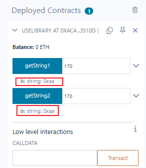

#### 总结

我们使用`ERC721`的引用库合约Strings介绍了`Solidity`中的库合约（`library`）。常用的有：

1. Strings: 将uint256转换成String。
2. Address: 判断某一个地址是否为合约地址。
3. Create2：更安全的使用`Create2 EVM opcode`。
4. Arrays：与数组相关的 库合约。


## 接收ETH


## 发送ETH


## 调用其他合约


## Call函数

### 使用规则

```shell
目标合约地址.call(字节码);
```

字节码是通过结构化编码函数`abi.encodeWithSignature`获得：

```solidity
abi.encodeWithSignature("函数签名", 逗号分隔的具体参数);
```

`函数签名`就死函数名:`abi.encodeWithSignature("f(uint256,address)", _x, _addr)`。

`call`在调用合约的时候可以指定交易发送的`ETH`的数额和`gas`数额。

```solidity
目标合约地址.call{value: 发送数额, gas: gas数额}(字节码);
```

看不懂对不对？举个例子。

先来一个目标合约

```solidity
contract OtherContract {
    uint256 _x = 0;
    // 定义Log事件，记录amount 和 gas 费用
    event Log(uint amount, uint gas);

    fallback() external payable{}

    // 返回合约余额ETH
    function getBalance() view public returns (uint) {
        return address(this).balance;
    }

    // 调整_x的函数
    function setX(uint256 x) external payable {
        _x = x;
        if (msg.value > 0) {
            emit Log(msg.value, gasleft());
        }
    }

    // 读取_x的函数
    function getX() external view returns(uint256) {
        return _x;
    }
}
```

#### 使用call函数调用目标合约

##### 1. Response事件

定义一个`Response`事件用来输出`call`函数返回的`success`和`data`，方便我们观察返回值。

```solidity
event Response(bool success, bytes data);
```

##### 2. 调用setX函数

我们的合约中调用目标合约的函数是:`callSetX()`，我们需要按照上述所说的进行处理，使用`abi.encodeWithSignature("", params)`进行调用函数。

```solidity
function callSetX(address _addr, uint256 x) external payable {
	(bool success, bytes memory data) = _addr.call{value: msg.value}(
		abi.encodeWithSignature("setX(uint256)", x);
	);
	// 调用事件
	emit Response(success, data);
}
```

接下来我们先部署目标合约，之后将目标合约的地址复制下来。

执行这个callsetX()函数，看看会发生什么？

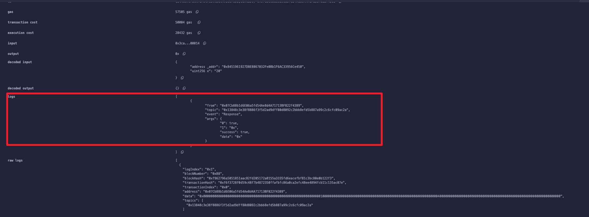

会发现data是：0x，为什么呢？其实是因为`setX()`函数是一个没有返回值的函数，因此`Response`事件输出的`data`就是`0x`，就是空。

##### 3. 调用getX函数

调用getX()函数，将会返回目标合约`_x`的值，类型是`uint256`。我们可以利用`abi.decode`进行解码操作，call返回值读取出来即可。

```solidity
function callGetX(address _addr) external returns(uint256) {
	(bool success, bytes memory data) = _addr.call(
		abi.encodeWithSignature("getX()");
	);
	emit Response(success, data);
	return abi.decode(data, (uint256));
}
```

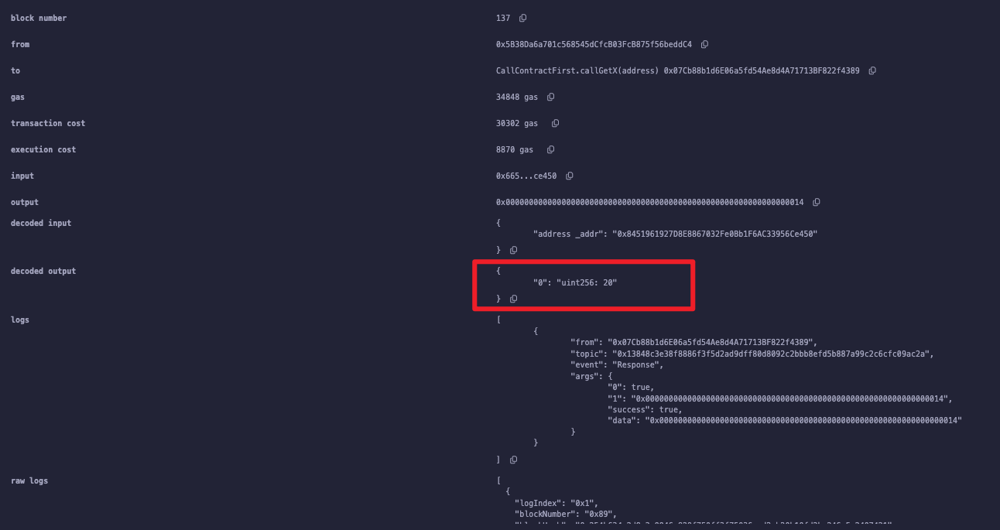


##### 4. 调用不存在的函数

如果我们给`call`函数输入不存在的函数名的话，最终执行的时候会触发`fallback`函数。这也是我们在目标合约加上`fallback`的作用。

```solidity
function callNonExist(address _addr) external {
	(bool success, bytes memory data) = _addr.call(
		abi.encodeWithSignature("foo()");
	);
	emit Response(success, data);
}
```

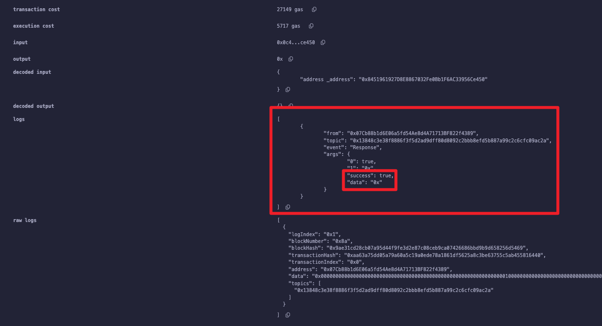

如果传入的是一个没有的函数名，那么最后也是会success:true的。但是实际上调用的是fallback函数。

## **Delegatecall**函数

`delefatecall`函数与`call`函数类似，是`solidity`中地址类型的低级成员变量。`deletegate`是代理、委托的意思。

比较一下`call`和`deletegatecall`的区别。

> 当用户`A`通过合约`B`来`call`合约`C`的时候，执行的是合约`C`的函数，`上下文`（就是状态变量等）是合约C的，`msg.sender`是`B`的地址，并且如果函数改变一些环境变量，产生的效果最终会作用于`C`合约上。
>
> 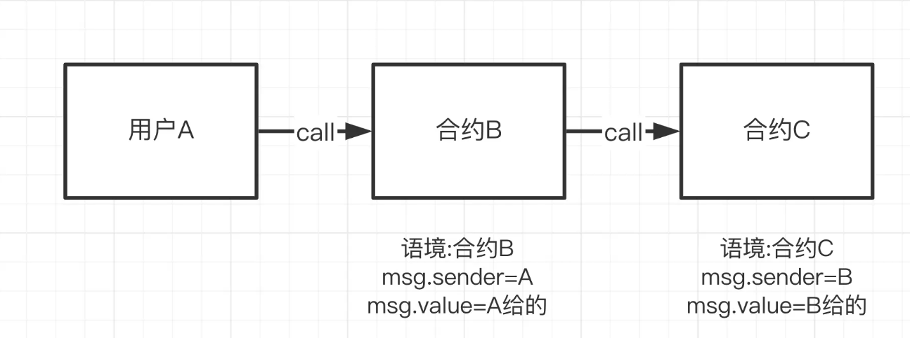
>
> 当用户`A`通过合约`B`来`delegatecall`合约`C`的时候，执行的是`C`的函数，`上下文`是合约`B`的，`msg.sender`是`A`的地址，如果改变了一些状态变量，产生的效果是作用于合约`B`变量上，不会影响到`C`。

使用方法也是和`call`函数类似。

```solidity
目标合约地址.delegatecall(二进制编码);
```

`二进制编码`和`call`是一样的获取方法：

```solidity
abi.encodeWithSignature("函数名", 具体参数);
```

`delegatecall`在调用合约的时候可以指定交易发送的`gas`，但是不能指定发送的`ETH`数额。

> 注意点：`delegatecall`有安全隐患，使用的时候必须要保证当前合约和目标合约的状态变量存储结构相同，并且目标合约安全，否则会造成损失。

##### 实例

我们先写一个十分简单的合约`C`，有两个状态变量:`num`和`sender`，分别是`uint256`和`address`类型。有一个函数可以将`num`设定为传入的`_num`，并且将`sender`设置成`msg.sender`。

```solidity
contract C {
    uint public num;
    address public sender;

    function setVars(uint _num) public payable {
        num = _num;
        sender = msg.sender;
    }
}
```

发起调用的合约`B`，同样是有两个状态变量（名字是可以更换的，类型一直即可)：num和sender。分别是`uint256`和`address`类型

```solidity
contract B {
    // 变量名称是可以不同的
    uint public num;
    address public sender;
}
```

接下来分别使用`call`和`delegatecall`来调用C合约的`setVars`函数。

```solidity
function callSetVars(address _addr, uint _num) external payable {
        (bool success, bytes memory data) = _addr.call(
            abi.encodeWithSignature("setVars(uint256)", _num)
        );
}
```

如上是通过`call`函数进行调用的。他会改变C合约的状态变量。

```solidity
function delegatecallSetVars(address _addr, uint _num) external payable {
        (bool success, bytes memory data) = _addr.delegatecall(
            abi.encodeWithSignature("setVars(uint256)", _num)
        );
    }
```

如上是通过`delegatecall`函数调用的，他不会改变C合约的状态变量，但是会改变B合约的状态变量。

OK，之后我们在remix上进行部署测试。

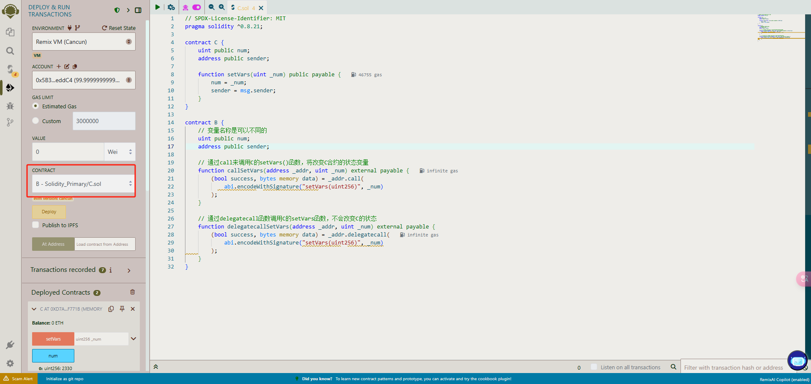

首先部署的是C合约，其次部署的是B合约，（其实没有顺序而言）。反正是互相调用。

C合约的初始状态全部都是0 NULL。

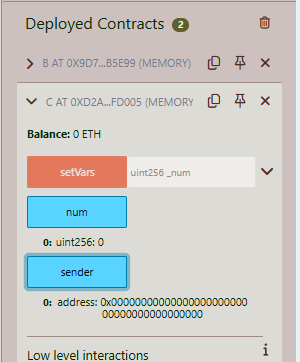

我们分别通过B合约调用`callSetVars`函数和`delegatecallSetVars`函数。

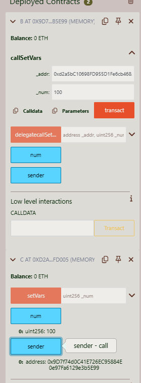

此时看出，C合约的num和sender都已经发生了改变，不再是零值。这是调用的`call`函数。

如果调用`deleatecall`函数，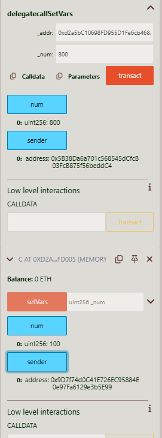

此时可以看到B合约的状态是发生了改变的，但是C合约的状态依旧是100，也就是之前执行过的。

## 合约中创建新的合约（create）

ETH中，外部用户可以创建合约，智能合约也可以创建合约。`Uniswap`就是利用工厂合约`PairFactory`创建了无数的比对合约(`Pair`)。

`create`

有两种方法可以在合约中创建新的合约，`create`和`create2`。先说`create`。

跟java相似，都是直接`Contract x = new Contract{value: _value}(params)`。

其中`Contract`是要创建的合约名字，`x`是合约对象。如果构造函数是`payable`，可以创建转入`value`数量的`ETH`，`params`是新合约的构造函数的参数。

我们使用案例来演示一下：

**Pair.sol**

```solidity
contract Pair {
    address public factory;
    address public token1;
    address public token2;

    constructor() {
        factory = msg.sender;
    }

    // 由调用合约手动调用初始化代币地址
    function initalize(address _token1, address _token2) external {
        require(factory == msg.sender, "Forbidden!!!");
        token1 = _token1;
        token2 = _token2;
    }
}
```

`Pair`合约十分简单，包含了3个状态变量，`factory`、`token1`、`token2`。

构造函数`constructor`在部署的时候将`factory`赋值成`msg.sender`也就是创建的合约地址。`initalize`函数是由工厂合约在手动调用完成初始化代币地址。将`token1`和`token2`更新成币对中两种代币地址。

> 有一个问题：为什么`uniswap`不在`constructor`中将`token1`和`token2`地址更新好。
>
> 因为`uniswap`使用的是`create2`创建合约，生成的合约地址可以实现预测。

**PairFactory.sol**

```solidity
// 工厂合约PairFactory
contract PairFactory {
    // 通过两个代币查Pair地址
    mapping (address => mapping (address => address)) public getPair;
    // 所有的Pair地址
    address[] public allPairs;

    function createPair(address _token1, address _token2) external returns (address pairAddr){
        Pair pair = new Pair();
        pair.initalize(_token1, _token2);

        pairAddr = address(pair);
        allPairs.push(pairAddr);
        getPair[_token1][_token2] = pairAddr;
        getPair[_token2][_token1] = pairAddr;
    }
}
```

工厂合约看起来更简单，一个用来记录代币查Pair代币对的地址`mapping`。一个保存所有代币对的变量`allPairs`。

我们使用的是new关键字来创建Pair合约。

在调用cratePair的时候需要测试的地址：

```shell
WBNB地址: 0x2c44b726ADF1963cA47Af88B284C06f30380fC78
BSC链上的PEOPLE地址: 0xbb4CdB9CBd36B01bD1cBaEBF2De08d9173bc095c
```

## create2

`create2`用来预测未来合约部署的地址。先来看看`create`和`create2`是怎么计算新地址的？

`create`

```solidity
新地址 = hash(创建者地址, nonce);
```

创建者的地址不会变，但是`nonce`可能会随着时间改变，因此用create不好预测地址。

`create2`

`create2`目的是让合约地址独立于未来的事件，不管未来区块链发生什么，这个合约都可以部署到事先计算好的地址，用`craete2`创建的合约地址由4个部分决定：

1. `0xFF`：一个常数，避免和`create`冲突
2. `createAddress`：调用create2的当前合约地址
3. `salt`：一个创建者指定的`bytes32`类型的值，目的是用来影响创建的合约地址
4. `initcode`：新合约的初始字节码（合约creationCode和构造函数的参数）

```solidity
新地址 = hash("0xff", 创建者地址, salt, initcode);
```

`create2`确保，如果创建者使用`create2`和提供的`salt`部署给定的合约`initcode`，将会存储到`新地址`中。

##### 如何使用`create2`

跟`create`类似，同样是new 一个合约，传入新合约构造函数所需要的参数，不过需要多传一个`salt`参数。

```solidity
Contract x = new contract{salt: _salt, value: _value}(params);
```

其中salt就是传入的盐值，如果构造函数是payable，那么创建的时候同时传入`value`，params是新合约构造函数的参数。

##### 案例

**Pair2.sol**

```solidity
contract Pair2 {
    address public factory;
    address public token0;
    address public token1;

    constructor() payable {
        factory = msg.sender;
    }

    function initialize(address _token0, address _token1) external {
        require(msg.sender == factory, "Forbidden!!!!");
        token0 = _token0;
        token1 = _token1;
    }
}
```

`Pair2`很简单，还是之前的`Pair`合约的内容。包含了三个状态变量：`factory`、`token0`、`token1`。

**PairFactory2.sol**

```solidity
contract PairFactory2 {
    // 通过两个代币地址获取到Pair币对地址
    mapping (address => mapping (address => address)) public getPair;
    address[] public allPairs;

    function createPair2(address _token0, address _token1) external returns (address pairAddr) {
        require(_token0 != _token1, "IDENTICAL ADDRESSES!");
        // 用_token0和_token1地址计算出salt
        (address tokenA, address tokenB) = _token0 < _token1 ? (_token0, _token1): (_token1, _token0);
        bytes32 salt = keccak256(abi.encodePacked(tokenA, tokenB));
        // 用create2部署新的合约
        Pair2 pair = new Pair2{salt: salt}();
        // 调用新的合约初始化方法
        pair.initialize(tokenA, tokenB);
        // 更新地址map
        pairAddr = address(pair);
        allPairs.push(pairAddr);
        getPair[_token0][_token1] = pairAddr;
        getPair[_token1][_token0] = pairAddr;
    }

    // 事先计算Pair地址
    function calculateAddr(address tokenA, address tokenB) public view returns (address predictedAddress) {
        require(tokenA != tokenB, "IDENTICAL ADDRESSES!!!");
        (address _tokenA, address _tokenB) = (tokenA < tokenB) ? (tokenA, tokenB): (tokenB, tokenA);
        bytes32 salt = keccak256(abi.encodePacked(_tokenA, _tokenB));
        // 计算合约方法
        predictedAddress = address(uint160(uint(keccak256(abi.encodePacked(
            bytes1(0xff),
            address(this),
            salt,
            keccak256(abi.encodePacked(type(Pair2).creationCode))
        )))));
    }
}
```

其中可以发现有两个方法：`createPair2`和`calculateAddr`，一个是创建Pair2的函数，另一个是提前预测创建合约的地址。

> 解释：`calculateAddr`函数，计算合约的方法中，uint160是ETH只有20字节的长度。uint(keccak())是将哈希值转化成一个无符号整数。

在remix上进行验证。分别部署：`Pair2`和`PairFactory2`合约。

在`PairFactory2`合约上执行：calculateAddr和createPair2函数。查看最终计算出来的地址和创建的地址是不是相同的？

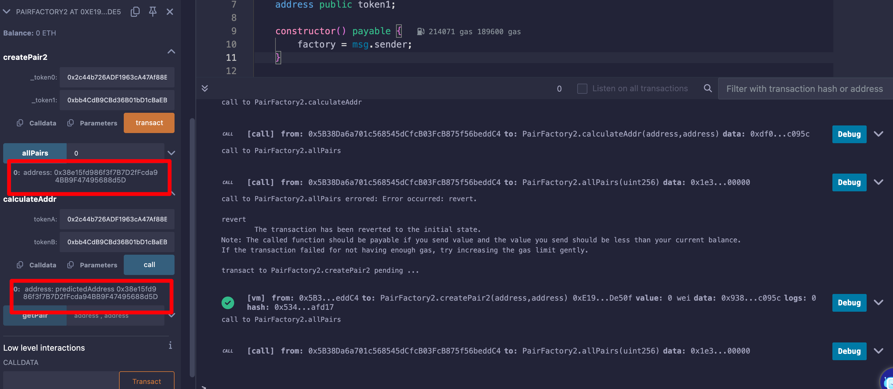

发现确实是相同的。证明了这个create2是可以预测未来的地址的。

## Try  catch

`try-catch`是现代编程语言几乎都存在的一种处理异常的标准方式，`Solidity`0.6版本也添加了。这一讲，我们介绍Try catch的使用方法。

在`solidity`中，`try-catch`只能被用于`external`函数或创建合约时`constructor`的调用。基本语法如下：

```solidity
try externalContract.f() {
	// call 成功的情况下，运行一下代码
} catch {
	// call 失败的情况下，运行一下代码
}
```

其中`externalContract.f()`是外部合约的函数调用，`try`模块在调用成功的情况下运行，而`catch`模块则在调用失败时运行。

同样可以使用`this.f()`来替代`externalContract.f()`，`this.f()`也被视为外部调用，但不可以在构造函数中使用，因为此时合约还没有创建。

如果调用的函数存在返回值，那么必须在`try`之后声明`returns(returnType val)`，并且在`try`模块中可以使用返回的变量；如果是创建合约，那么返回值新创建的合约变量。

```solidity
try externalContract.f() returns(returnType val) {
	// call 成功的情况下，运行以下代码
} catch {
	// call 失败的情况下，运行以下代码
}
```

try catch能够捕获特殊的异常原因：

```solidity
try externalContract.f() returns(returnType) {
	// call 成功的情况下，运行以下代码
} catch Error(string memory) {
	// 捕获revert和require的错误
} catch Panic(uint) {
	// 捕获Panic导致的错误，例如assert失败 溢出 数组越界
} catch (bytes memory) {
	// 如果发生了revert且上面两个异常类型匹配都失败了 会进入改分支
	// 例如revert()require(false) revert自定义的error
}
```

### `try catch`实践

#### OnlyEven

我们创建一个合约：

```solidity
// SPDX-License-Identifier: MIT
pragma solidity ^0.8.21;

contract OnlyEven {
    constructor(uint a) {
        require(a != 0, "invalid number");
        assert(a != 1);
    }

    function onlyEven(uint256 b) external pure returns (bool success) {
        // 输入奇数revert
        require(b % 2 == 0, "Ops! Reverting.");
        success = true;
    }
}
```

OnlyEven合约包含一个构造函数和一个`onlyEven`函数。

- 构造函数有一个参数`a` ，当`a=0`时，`require`会抛出异常；当`a=1`，assert会抛出异常；其他情况正常。
- `onlyEven`函数有一个参数`b`，当`b`为奇数时，`require`会抛出异常。

#### 处理外部函数调用异常

新建一个合约：`TryCatch`。在合约中定义一些事件和状态变量。

```solidity
// SPDX-License-Identifier: MIT
pragma solidity ^0.8.21;

import {OnlyEvent} from "./OnlyEvent.sol";
contract TryCatch {
    // 成功的event
    event SuccessEvent();

    event CatchEvent(string message);
    event CatchByte(bytes data);

    // 声明OnlyEvent变量
    OnlyEvent even;
    constructor() {
        even = new OnlyEvent(2);
    }
}
```

我们在新建一个方法用来表示处理调用外部函数`onlyEven`中的异常。

```solidity
function execute(uint amount) external returns (bool success) {
	try even.onlyEven(amount) returns(bool _success) {
		emit SuccessEvent();
		return _success;
	} catch Error(string memory reason) {
		// call不成功的话
		emit CatchEvent(reason);
	}
}
```

##### 在remix中进行验证，处理外部函数调用异常

当运行`execute(0)`的时候，因为`0`是偶数，所以并不会触发奇数的异常，会成功触发成功事件。

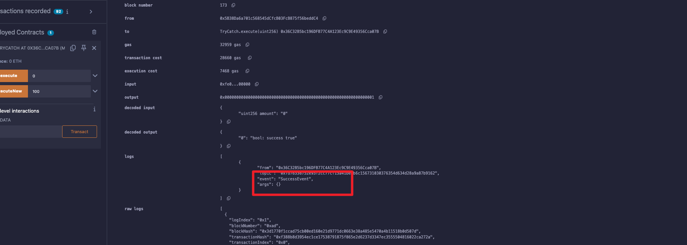

当运行`execute(1)`的时候，因为`1`是奇数，所以会触发错误。

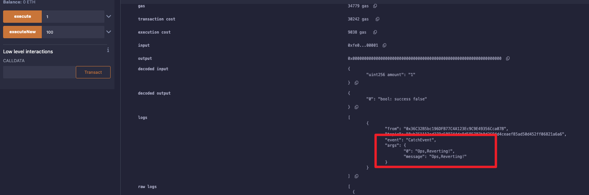

#### 处理合约创建异常

这里，我们利用`try-catch`来处理合约创建时异常，只需要将`try`模块改成`onlyEven`创建即可。

```solidity
function execute2(uint a) external returns(bool _success) {
	try new OnlyEven(a) returns(OnlyEven _even) {
		// call 成功的情况下
		emit SuccessEvent();
		success = _even.onlyEven(a);
	}catch Error(string memory reason) {
		// catch失败的 revert() 和 require()
		emit CatchEvent(reason);
	} catch (bytes memory data) {
		emit CatchByte(data);
	}
}
```

##### remix验证

如果我们输入的是100.结果是：

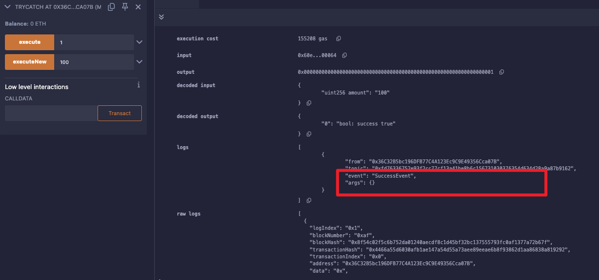

如果是0，结果是：

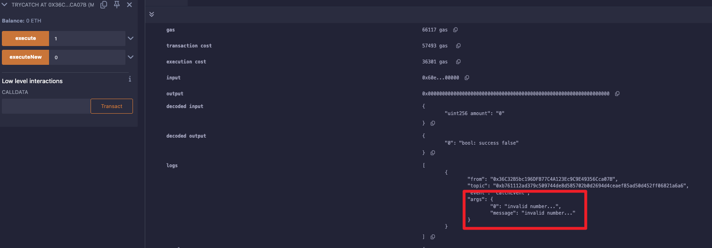

如果是1，结果是：

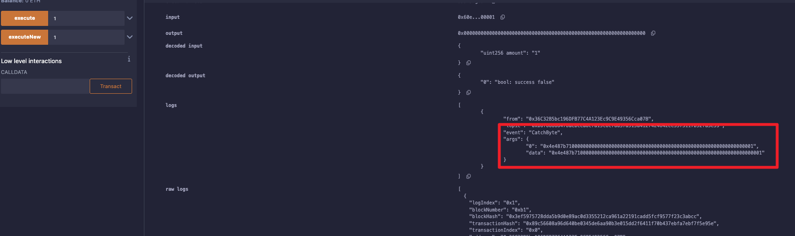

发现触发的是：CatchByte事件。

如果是奇数3的话，结果如下：

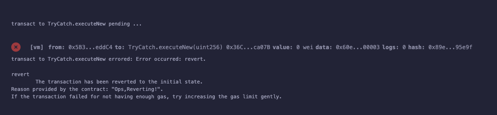

直接报错了。


## gas的部分优化

1. 在定义一些状态变量的时候，需要注意一下是否是常量，如果是的话考虑使用`constant`or `immutable`。
2. 在定义一些校验错误的时候，比如使用`reuqire(condition, "***failed")`换成自定义错误。Error ***.`revert ***`
3. 字符串的长度也会影响到gas费用的消耗，我们要在字符串上减少gas费用的消耗。


