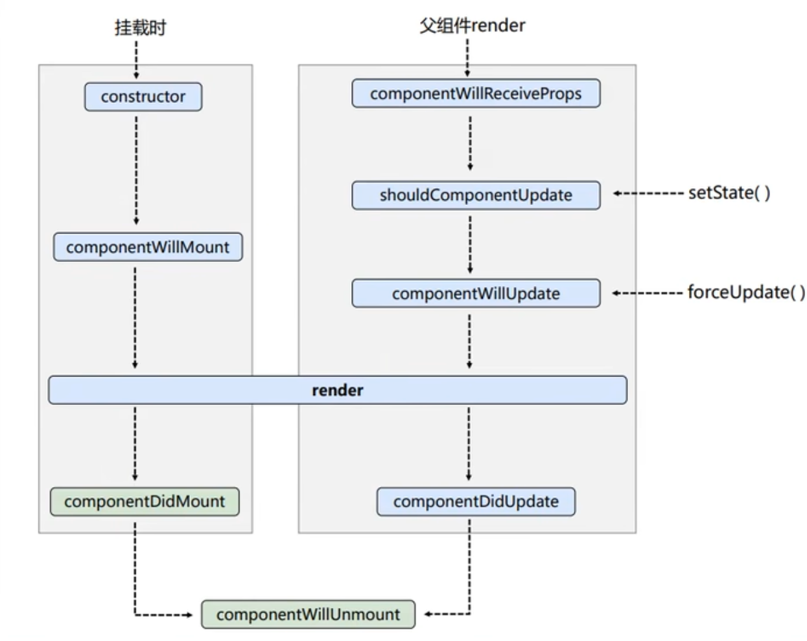

# React

## 概述

React的出现主要解决了传统的DOM的操作性能差和组件化开发的困难。通过虚拟DOM来优化页面提升效率，减少实际与DOM操作的频率。同时React提供了组件化的使用方式，使得前端开发更加模块化和可维护。

## 开始第一个React的学习

首先引入文件：babel.min.js、react-dom.development.js、react-development.js。

开始第一个程序的编写：

```html
<!DOCTYPE html>
<html lang="en">

<head>
  <meta charset="UTF-8">
  <meta name="viewport" content="width=device-width, initial-scale=1.0">
  <title>Hello_React</title>
</head>

<body>
  <div id="test">

  </div>

  <!-- 引入react核心库 -->
  <script type="text/javascript" src="../js/react.development.js"></script>
  <!-- 引入react的dom操作库 -->
  <script type="text/javascript" src="../js/react-dom.development.js"></script>
  <!-- 引入babel -->
  <script type="text/javascript" src="../js/babel.min.js"></script>

  <script type="text/babel">
    // 创建虚拟dom
    const VDOM = <h1>Hello React</h1>
    // 渲染虚拟dom到页面
    ReactDOM.render(VDOM, document.getElementById('test'))
  </script>
</body>

</html>
```

### JSX

模版我们使用的还是上面的这个例子。

JSX语法规则：

1. 定义虚拟DOM的时候，不要写引号
2. 标签中混入JS表达式的时候使用{}
3. 样式的类名不要使用class，要用className。
4. 内联样式，要用style = {{key: value}}的形式来写，要用fontSize驼峰命名类型。
5. 虚拟DOM只有一个根标签
6. 标签必须是闭合的
7. 标签首字母：
   1. 若是小写字母，则将该标签转换成html中同名元素，若HTML中无改标签那么报错。
   2. 若是大写字母，React会将这个标签认为是组件，没有定义的话会报错。

### 模块与组件、模块化与组件化的理解

#### 模块

1. 向外提供特定功能的JS程序，一般就是JS文件。
2. 拆成模块的原因是：随着业务的增加，代码越多越复杂。
3. 作用：复用JS，简化JS的编写，提升JS的运行效率。

#### 组件

1. 用来实现局部功能的代码和资源的集合。

2. 一个页面的功能更加复杂。
3. 复用代码，简化项目的代码编写，提升运行效率。

#### 模块化

当应用的JS都是以模块来编写的，这个应用就是一个模块化的应用。

#### 组件化

当应用是以多组件的方式实现的话，这个应用就是一个组件化的应用。

比如：


## 2. React面向组件编程

### 2.1 基本理解和使用

React主要是有两种方式：

1. 函数式组件（Functional Component）
2. 类式组件（Class Component）

#### 函数式组件

就是利用一个函数将组件进行return。

直接看代码:

```html
<!DOCTYPE html>
<html lang="en">

<head>
  <meta charset="UTF-8">
  <meta name="viewport" content="width=device-width, initial-scale=1.0">
  <title>函数式组件</title>
  <link rel="shortcut icon" href="../favicon.ico">
</head>

<body>
  <div id="test">

  </div>

  <!-- 引入react核心库 -->
  <script type="text/javascript" src="../js/react.development.js"></script>
  <!-- 引入react的dom操作库 -->
  <script type="text/javascript" src="../js/react-dom.development.js"></script>
  <!-- 引入babel -->
  <script type="text/javascript" src="../js/babel.min.js"></script>

  <script type="text/babel">
    // 1. 创建函数式组件
    function MyComponent() {
      console.log(this);// 此处的this是undifined，因为babel编译之后开启了严格模式
      return <h2>我是函数式组件(适用于简单组件的定义)</h2>
    }

    // 2. 渲染组件到页面
    ReactDOM.render(<MyComponent />, document.getElementById('test'))
    /*
      执行了React.render()方法之后，发生了什么？
       1. React解析组件的标签，找到MyComponent组件
       2. React调用组件，将组件的虚拟DOM转成真实DOM，在页面展示
    */
  </script>
</body>

</html>
```

定义一个函数式组件的方法：MyComponent，在函数中将组件进行返回。

> 注意：
>
> 1. 在进行渲染的时候，组件的名称是一个标签，并且需要首字母大写，同时需要有闭合。

#### 类式组件

类式组件是基于JS的ES6类定义的React组件，是React传统组件形式。

使用类式组件的话必须要使用两个东西:

1. 必须继承React.Component类。
2. 必须实现render()方法

看一下代码：

```html
<!DOCTYPE html>
<html lang="en">

<head>
  <meta charset="UTF-8">
  <meta name="viewport" content="width=device-width, initial-scale=1.0">
  <title>函数式组件</title>
  <link rel="shortcut icon" href="../favicon.ico">
</head>

<body>
  <div id="test">

  </div>

  <!-- 引入react核心库 -->
  <script type="text/javascript" src="../js/react.development.js"></script>
  <!-- 引入react的dom操作库 -->
  <script type="text/javascript" src="../js/react-dom.development.js"></script>
  <!-- 引入babel -->
  <script type="text/javascript" src="../js/babel.min.js"></script>

  <script type="text/babel">
    /*
      1. 必须要继承React.Component
      2. 必须实现render()方法
    */
    // 1. 创键类式组件
    class MyComponent extends React.Component {
      /*
        1. render()是放在哪里的？ -- 类的原型对象上，供实例使用
        2. 为什么我没有new Component()却能拿到这个方法呢？ -- 你不是在<MyComponent />中使用了吗，React自动给new了
      */
      render() {
        console.log('this指向对象:', this);
        return <h2>我是用类定义的组件(适用于【复杂组件】的定义)</h2>
      }
    }

    // 2. 渲染组件到页面
    ReactDOM.render(<MyComponent />, document.getElementById('test'))
    /*
      1. React解析组件标签，找到了MyComponent组件。
      2. 发现组件是使用类定义的，随后new出来该类的实例，并通过该实例调用到原型上的方法render()
      3. 将render()的返回的虚拟DOM转成真实DOM。
    */
  </script>
</body>

</html>
```

> 注意事项：
>
> 1. render()函数是放在类的原型对象上，供实例使用。
> 2. 为什么不需要使用new Component()进行声明呢？原因是在使用<MyComponent/>中React自动为我们创建了

> 看一下this对象里的属性：
>
> 

### 2.2 组件实例的三大属性

#### state

state是ReactUI数据模型，是组件渲染数据依据。

直接看代码：

```html
<!DOCTYPE html>
<html lang="en">

<head>
  <meta charset="UTF-8">
  <meta name="viewport" content="width=device-width, initial-scale=1.0">
  <title>Hello_React</title>
  <link rel="shortcut icon" href="../favicon.ico">
</head>

<body>
  <div id="test">

  </div>

  <!-- 引入react核心库 -->
  <script type="text/javascript" src="../js/react.development.js"></script>
  <!-- 引入react的dom操作库 -->
  <script type="text/javascript" src="../js/react-dom.development.js"></script>
  <!-- 引入babel -->
  <script type="text/javascript" src="../js/babel.min.js"></script>

  <script type="text/babel">
    class Weather extends React.Component {
      constructor(props) {
        super(props)
        // 初始化状态
        this.state = {
          isHot: true,
          wind: '微风'
        }
        this.changeWeather = this.changeWeather.bind(this)
      }

      // React中如何进行处理点击事件：
      // 1. 使用onClick()函数进行点击调用，记住是驼峰命名，React中很多都是onXxx()，都换成了驼峰命名。
      // 2. 在onClick()函数中，不能使用字符串类型，需要使用{}调用
      // 3. 在{}中，调用的方法不能是函数形式xxx()，需要是函数名xxx。

      render() {
        // 读取状态
        return <h1 onClick={this.changeWeather}>今天天气很{this.state.isHot ? '炎热' : '寒冷'}， {this.state.wind}</h1>
      }

      changeWeather() {
        // changeWeather()方法放在哪里？ -- Weather的原型对象上，供实例使用
        // 由于changeWeather是作为onClick的回调，所以不是通过实例调用的，是直接调用的。
        // 类中的方法默认开启了严格模式，所以说changeWeather()的this是undefined。

        // 获取原来的isHot值
        const isHot = this.state.isHot
        // React是非响应式的，需要手动设置状态
        this.setState({
          isHot: !isHot
        })
      }
    }

    ReactDOM.render(<Weather />, document.getElementById('test'))
  </script>
</body>

</html>
```

我们在constructor中拿到父级的props。拿到state状态值，可以在state中设置需要修改的变量。

设置初始化状态：

```javascript
// 初始化状态
        this.state = {
          isHot: true,
          wind: '微风'
        }
```

同时，我们在render函数中return 的<h1>标签需要调用onClick函数（此时需要注意，如果是onxxx方法，在React中一般都是会转换成驼峰命名）。

1. 使用onClick()函数进行点击调用，记住是驼峰命名，React中很多都是onXxx()，都换成了驼峰命名。
2. 在onClick()函数中，不能使用字符串类型，需要使用{}调用
3. 在{}中，调用的方法不能是函数形式xxx()，需要是函数名xxx。

在定义函数的情况下，也是需要在定义的类式组件中定义。

在使用这个方法的时候需要重新进行处理，使用bind()函数将this绑定到this.changeWeather函数中，那么我们就可以在render函数中使用this.changeWeather直接进行调用。

##### 简写一下

```html
<!DOCTYPE html>
<html lang="en">

<head>
  <meta charset="UTF-8">
  <meta name="viewport" content="width=device-width, initial-scale=1.0">
  <title>Hello_React</title>
  <link rel="shortcut icon" href="../favicon.ico">
</head>

<body>
  <div id="test">

  </div>

  <!-- 引入react核心库 -->
  <script type="text/javascript" src="../js/react.development.js"></script>
  <!-- 引入react的dom操作库 -->
  <script type="text/javascript" src="../js/react-dom.development.js"></script>
  <!-- 引入babel -->
  <script type="text/javascript" src="../js/babel.min.js"></script>

  <script type="text/babel">
    class Weather extends React.Component {

      // 初始化状态
      state = {
        isHot: true,
        wind: '微风'
      }

      render() {
        // 读取状态
        return <h1 onClick={this.changeWeather}>今天天气很{this.state.isHot ? '炎热' : '寒冷'}， {this.state.wind}</h1>
      }

      changeWeather = () => { // 使用() => {}的方式，this没有的话，直接去外层找this
        const isHot = this.state.isHot
        this.setState({
          isHot: !isHot
        })
      }
    }

    ReactDOM.render(<Weather />, document.getElementById('test'))
  </script>
</body>

</html>
```

> 主要修改部分：
>
> 1. 初始化状态时机不在构造函数中了，更换到原型对象属性的位置。
> 2. 自定义的方法需要使用箭头函数，因为箭头函数中不存在this指向，所以会自动向父层进行寻找this，最终成功调用这个自定义方法。

##### 总结

1. state是组件对象最为重要的属性，值是对象类型（可以包含多个key--value组合）
2. 组件又被称为”状态机“，通过更新组件的state来更新对应的页面显示（重新渲染组件）。
3. 组件中的render方法中的this为组件实例对象。
4. 组件自定义方法this是undefined
   1. 在构造函数中强制绑定bind()函数
   2. 箭头函数
5. 状态数据不支持直接修改，需要使用setState()

#### props

React组件之间使用props来进行互相通信，每一个父组件可以提供他们的props给它的子组件。props可以传递JSX标签的信息。例如：className、src、alt、width、height是一些可以进行传递的属性。

距离看说明:

```html
<!DOCTYPE html>
<html lang="en">

<head>
  <meta charset="UTF-8">
  <meta name="viewport" content="width=device-width, initial-scale=1.0">
  <title>Hello_React</title>
</head>

<body>
  <div id="test1"></div>

  <!-- 引入react核心库 -->
  <script type="text/javascript" src="../js/react.development.js"></script>
  <!-- 引入react的dom操作库 -->
  <script type="text/javascript" src="../js/react-dom.development.js"></script>
  <!-- 引入babel -->
  <script type="text/javascript" src="../js/babel.min.js"></script>

  <script type="text/babel">
    // 创建组件
    class Person extends React.Component {
      render() {
        console.log(this);
        const { name, sex, age } = this.props;
        return (
          <ul>
            <li>姓名: {name}</li>
            <li>年龄: {age}</li>
            <li>性别: {sex}</li>
          </ul>
        )
      }
    }

    // 渲染
    ReactDOM.render(<Person name="Tom" sex="男" age="20" />, document.getElementById('test1'))
  </script>
</body>

</html>
```

有上可以得到列表页面。

但是有一个问题：如果Person的属性真的非常多呢？难道我们需要一个一个纯手写吗？不现实。

所以React给我们提供了一个属性用来表示所有的属性。

```jsx
// 创建组件
    class Person extends React.Component {
      render() {
        console.log(this);
        const { name, sex, age } = this.props;
        return (
          <ul>
            <li>姓名: {name}</li>
            <li>年龄: {age}</li>
            <li>性别: {sex}</li>
          </ul>
        )
      }
    }

    // 渲染
    ReactDOM.render(<Person name="Tom" sex="男" age="20" />, document.getElementById('test1'))
    ReactDOM.render(<Person name="Jerry" sex="女" age="19" />, document.getElementById('test2'))
    ReactDOM.render(<Person name="Jack" sex="男" age="30" />, document.getElementById('test3'))
    // 1. 如果人的属性太多了，这样写是不是太猥琐了？react中可以直接使用 ...p
    const p = { name: '李白', age: 18, sex: '男' }
    ReactDOM.render(<Person {...p} />, document.getElementById('test4'))
```

由此一来，我们便可以利用这个属性直接将所有的对象属性进行页面赋值，`{...p}`，注意一点的是这个展开的运算符是React给提供的js解析表达式的运算符，不是JS中的展开数组的展开表达式。所以只能在标签中使用，如:`<Person`

`{...p}/>`。	

批量传递标签属性。

##### 标签属性类别的限制

```jsx
// 做出限制
Person.propTypes = {
      name: PropTypes.string.isRequired,
      sex: PropTypes.string,
      age: PropTypes.number,
      speak: PropTypes.func,
    }
// 设置默认值
    Person.defaultProps = {
      sex: '不男不女',
      age: 18,
    }
```

需要注意：由于prop-types.js是在React16之后就没了，需要手动导入。

使用的时候直接使用PropTypes.类型即可。如果需要添加必填项的话，直接在后缀加上isRequired属性即可。

##### 标签属性类别限制简化

```jsx
// 创建组件
    class Person extends React.Component {
      render() {
        const { name, sex, age } = this.props;
        return (
          <ul>
            <li>姓名: {name}</li>
            <li>年龄: {age}</li>
            <li>性别: {sex}</li>
          </ul>
        )
      }
      // React做出类型限制
      static propTypes = {
        name: PropTypes.string.isRequired,
        sex: PropTypes.string,
        age: PropTypes.number,
        speak: PropTypes.func,
      }

      // 如果没有值的话，设置默认值
      static defaultProps = {
        sex: '不男不女',
        age: 18
      }
    }

    // 渲染
    ReactDOM.render(<Person name="nigger" speak={speak} />, document.getElementById('test1'))
    ReactDOM.render(<Person name="Jerry" sex="女" age={19} />, document.getElementById('test2'))
    ReactDOM.render(<Person name="Jack" sex="男" age={30} />, document.getElementById('test3'))
    // 1. 如果人的属性太多了，这样写是不是太猥琐了？react中可以直接使用 ...p
    const p = { name: '李白', age: 18, sex: '男' }
    ReactDOM.render(<Person {...p} />, document.getElementById('test4'))

    function speak() {
      console.log('我说话了!!!!');
    }
```

只需要做到一点，就是React要认识是哪一个对象的。我们加上static即可，有点类似与java的属于类的静态变量。


#### refs

refs也是React的一个属性，同state和props一样。

我们使用refs是来获取组件标签中的ref对应的值。看代码：

```html
<!DOCTYPE html>
<html lang="en">

<head>
  <meta charset="UTF-8">
  <meta name="viewport" content="width=device-width, initial-scale=1.0">
  <title>1_ref</title>
</head>

<body>
  <div id="test"></div>

  <!-- 引入react核心库 -->
  <script type="text/javascript" src="../js/react.development.js"></script>
  <!-- 引入react的dom操作库 -->
  <script type="text/javascript" src="../js/react-dom.development.js"></script>
  <!-- 引入babel -->
  <script type="text/javascript" src="../js/babel.min.js"></script>
  <script type="text/babel">

    // 1 创建组件
    class Demo extends React.Component {
      showData = () => {
        const { input1 } = this.refs;
        alert(input1.value)
      }

      showData2 = () => {
        const { input2 } = this.refs;
        alert(input2.value)
      }

      render() {
        return <div>
          <input ref="input1" type="text" placeholder="请输入内容" /> &nbsp;
          <button ref="button1" onClick={this.showData}>点击</button> &nbsp;
          <input ref="input2" type="text" placeholder="请输入内容" onBlur={this.showData2} />
        </div>
      }
    }
    // 2 渲染组件
    ReactDOM.render(<Demo />, document.getElementById('test'))
  </script>
</body>

</html>
```

> 在使用Ref的时候，直接通过this.refs来获取所有的refs属性：
>
> 如图：
>
> 
>
> 通过const {input1, button1, input2} = this.refs来获取refs属性。

观察上述，发现ref是一个字符串类型。但是React已经不在推荐使用这个字符串类型的ref了。

##### 回调方式的ref

因为React使用字符串类型的ref会存在性能问题，所以React官方建议使用方法之一就是回调方式。还是ref，但是ref中的是一个回调函数，比如 ref = {  c => this.input1 = c   }。同时在使用这个ref的时候也需要注意，使用的是当前的对象实例。

```jsx
// 1 创建组件
    class Demo extends React.Component {
      showData = () => {
        console.log(this);
        // 使用的是当前的对象实例，this
        const { input1 } = this
        alert(input1.value)
      }

      showData2 = () => {
        const { input2 } = this;
        alert(input2.value)
      }

      render() {
        // 我们将input整个节点赋值给实例对象
        return <div>
          <input ref={(currentNode) => {
            this.input1 = currentNode;
          }} type="text" placeholder="请输入内容" /> &nbsp;
          <button ref="button1" onClick={this.showData}>点击</button> &nbsp;

          <input ref={(currentNode) => {
            this.input2 = currentNode;
          }} type="text" placeholder="失去焦点提示数据" onBlur={this.showData2} /> &nbsp;
        </div>
      }
    }
    // 2 渲染组件
    ReactDOM.render(<Demo />, document.getElementById('test'))
```

> 但是现在这种方式会存在问题：就是会存在一次null值的情况。但是影响不大。
>
> 修改之后的代码如下
>
> ```jsx
> // 1 创建组件
>     class Demo extends React.Component {
>       saveInput = (c) => {
>         this.input1 = c;
>         console.log('@', c);
>       }
> 
>       render() {
>         return <div>
>           <input ref={this.saveInput} type="text" placeholder="请输入内容" /> &nbsp;
>         </div>
>       }
>     }
>     // 2 渲染组件
>     ReactDOM.render(<Demo />, document.getElementById('test'))
> ```
>
> 可以看到，我们将内联函数放置到对象中。

##### 使用createRef API来创建

```jsx
    // 1 创建组件
    class Demo extends React.Component {
      // 使用React最为推荐的createAPI来创建Ref
      myRef = React.createRef();
      myRef2 = React.createRef();
      showData = () => {
        const input1 = this.myRef.current;
        alert(input1.value)
      }

      showData2 = () => {
        const input2 = this.myRef2.current;
        alert(input2.value)
      }

      render() {
        return <div>
          <input ref={this.myRef} type="text" placeholder="请输入内容" /> &nbsp;
          <button ref="button1" onClick={this.showData}>点击</button> &nbsp;

          <input ref={this.myRef2} type="text" placeholder="失去焦点提示数据" onBlur={this.showData2} /> &nbsp;
        </div>
      }
    }
    // 2 渲染组件
    ReactDOM.render(<Demo />, document.getElementById('test'))
```

> 解释：
>
> 使用React.createRef()来创建一个Ref，之后在组件中直接使用:ref = {this.myRef}。
>
> 如果有两个标签都需要用到Ref的话，不能直接使用同一个myref，一个标签对应一个，就如上边代码中的input标签中的ref = {this.myRef}，input标签中的ref = {this.myRef2}。

#### 事件处理

(1) 通过onXxx属性指定事件处理函数（注意大小写）

​	a. React使用的是自定义的合成事件，不是使用的原生DOM事件，为了更好的兼容性。

​	b. React中的事件是通过事件委托的方式处理的（委托给组件的最外层元素），为了高效。

(2) 通过event.target得到发生事件的DOM元素对象。如果事件发生在了自己的元素上，那么就可以不使用ref，直接使用event.target.value得到元素的值。

### 收集表单数据

#### 包含表单的组件分类

a. 受控组件

b. 非受控组件

非受控组件指的是直接在页面上操作DOM，不能使用组件的状态来定义表单元素的值。

```html
<!DOCTYPE html>
<html lang="en">

<head>
  <meta charset="UTF-8">
  <meta name="viewport" content="width=device-width, initial-scale=1.0">
  <title>1_非受控组件</title>
</head>

<body>
  <div id="test"></div>

  <!-- 引入react核心库 -->
  <script type="text/javascript" src="../js/react.development.js"></script>
  <!-- 引入react的dom操作库 -->
  <script type="text/javascript" src="../js/react-dom.development.js"></script>
  <!-- 引入babel -->
  <script type="text/javascript" src="../js/babel.min.js"></script>
  <script type="text/babel">
    // 创建组件
    class Login extends React.Component {
      handleSubmit = (event) => {
        // 1 如果是直接写的默认form表单，会有一个自动跳转的效果，这是不合适的
        // 2 使用event.preventDefault()阻止默认跳转
        event.preventDefault();
        const { username, password } = this;
        alert(`你输入的用户名是:${username.value}, 你输入的密码是:${password.value}`)
      }
      render() {
        return (
          <form action="https://www.baidu.com" onSubmit={this.handleSubmit}>
            用户名:<input type="text" name="username" ref={c => this.username = c} />
            密码:<input type="password" name="password" ref={c => this.password = c} />
            <button>登录</button>
          </form>
        )
      }
    }

    // 渲染组件
    ReactDOM.render(<Login />, document.getElementById('test'))
  </script>
</body>

</html>
```

我们想要在页面上进行元素的设置，最好的方式就是进行集中处理，state状态就是最好的方式，利用state将元素渲染。也就是`受控组件`。

代码如下：

```jsx
// 创建组件
    class Login extends React.Component {

      // 初始化状态
      state = {
        username: "",
        password: ""
      }

      // 保存用户名到状态
      saveUsername = (event) => {
        // event.targe获取到的是元素，不是值
        this.setState({
          username: event.target.value
        })
      }

      // 保存密码到状态state
      savePassword = (event) => {
        this.setState({
          password: event.target.value
        })
      }
      handleSubmit = (event) => {
        event.preventDefault();
        // 直接从state中取值，state中的值对应的都是具体的名字
        const { username, password } = this.state;
        alert(`输入的用户名是:${username}, 输入的密码是:${password}`)
      }
      render() {
        return (
          <form onSubmit={this.handleSubmit}>
            用户名:<input type="text" name="username" onChange={this.saveUsername} />
            密码:<input type="password" name="password" onChange={this.savePassword} />
            <button>登录</button>
          </form>
        )
      }
    }

    // 渲染组件
    ReactDOM.render(<Login />, document.getElementById('test'))
```

> event是React自动给我们设置的事件，拿到的浏览器事件对象。我们可以根据event.target.username拿到数据username。
>
> 我们根据拿到的数据赋值给state，之后便可以进行数据的处理。

但是难道这样的话就OK了吗？

并不是，如果表单中存在非常多的数据，难道要一个一个的写方法吗？

#### 高阶函数和函数柯里化

> 什么是高阶函数：
>
> 1. 若A函数接收的参数是一个函数，那么这个函数就是高阶函数。
> 2. 若A函数调用的返回值依然是一个函数，那么A就是高阶函数。
>
> 函数的柯里化：
>
> 通过函数调用继续返回函数的方式，实现多次接收参数最后统一处理的函数编码形式。

```jsx
// 创建组件
    class Login extends React.Component {

      // 初始化状态
      state = {
        username: "",
        password: ""
      }

      // 保存用户名到状态
      saveUsername = (event) => {
        // event.targe获取到的是元素，不是值
        this.setState({
          username: event.target.value
        })
      }

      // 保存密码到状态state
      savePassword = (event) => {
        this.setState({
          password: event.target.value
        })
      }
      handleSubmit = (event) => {
        event.preventDefault();
        // 直接从state中取值，state中的值对应的都是具体的名字
        const { username, password } = this.state;
        alert(`输入的用户名是:${username}, 输入的密码是:${password}`)
      }
      render() {
        return (
          <form onSubmit={this.handleSubmit}>
            用户名:<input type="text" name="username" onChange={this.saveUsername} />
            密码:<input type="password" name="password" onChange={this.savePassword} />
            <button>登录</button>
          </form>
        )
      }
    }
    // 渲染组件
    ReactDOM.render(<Login />, document.getElementById('test'))
```

可以看到，在render函数中，返回的input标签onChange()方法调用的是saveFormData，我们可以通过不同的参数进行不同的操作。

> 注意：此处的this.saveFormData函数返回的一定要是一个函数，什么意思呢？
>
> ```jsx
>   // 集中保存表单数据
>       saveFormData = (dataType) => {
>         // 注意：此时保存的一点要是一个函数，否则的话接收不到参数
>         return (event) => {
>           this.setState({
>             [dataType]: event.target.value
>           })
>         }
>       }
> ```
>
> 就是类似于上边代码中的，dataType是input标签调用传入的参数，可以是username，可以是password，也可以是address。return的一定是函数。因为onChange方法得到的是{this.saveFormData}的回调值，如果直接返回的是一个值，那么onChange就不会发生变化。
>
> 同时在设置state的时候也要记得加上JS的语法：[dateType]: event.target.value。这样的话就会将dataType真正的类型填入到state中。不加的话就是一个字符串，state就是：
>
> ```json
>  {
>    "dataType": "12121",
>    "username": "",
>    "password": ""
>  }
> ```

如果说不喜欢使用这种方式，还有简化版本：

```jsx
// 基本代码不变
saveFormData = (dataType, event) => {
  this.setState({
    [dataType]: event.target.value
  })
}

render() {
  return (
    <form>
    用户名:<input type="text" name="username" onChange={event => this.saveFormData('username', event)}></input>
    密码: <input type="password" name="password" onChange={event => this.saveFormData('password', event)}></input>
    <button>登录</button>
    </form>
  )
}
```

我们直接将方法传递到onChange中，其实onChange还是一个回调函数，只不过我们是在回调函数中调用了我们的saveFormData函数，最终结果是一样的。不会报错。

### 组件的生命周期

#### 效果

展示效果：

****

这个文字是可以渐变的。点击`去死吧`按钮的时候会将整个组件卸载掉。

#### 代码初始化

```jsx
// 创建组件
    class Life extends React.Component {

      state = {
        opacity: 1
      }

      death = () => {
        // 卸载组件√
        ReactDOM.unmountComponentAtNode(document.getElementById('test'))
      }

      // 初始化渲染、state状态改变
      render() {
        return (
          <div>
            <h2 style={{ opacity: this.state.opacity }}>React的生命周期</h2>
            <button onClick={this.death}>去死吧</button>
          </div>
        )
      }
    }

    // 渲染组件
    ReactDOM.render(<Life />, document.getElementById('test'))
```

> 我们在进行页面卸载的时候，会调用ReactDOM.unmountComponentAtNode(document.getElementById('test'))进行页面的卸载。
>
> 我们需要设置文本的渐变颜色。设置定时器：
>
> ```jsx
> setInterval(() => {
>           let { opacity } = this.state
>           opacity -= 0.1
>           if (opacity <= 0) opacity = 1
>           this.setState({ opacity })
>         }, 200)
> ```
>
> 放在哪里呢？render()函数中，
>
> ```jsx
>       render() {
>         // 如果是在render中调用的话，每一次setState都会引起render方法的调用，导致死循环。render(render(render(....)))。CPU消耗大大增加。同时页面显示会出现鬼畜。
>         setInterval(() => {
>           let { opacity } = this.state
>           opacity -= 0.1
>           if (opacity <= 0) opacity = 1
>           this.setState({ opacity })
>         }, 200)
>         return (
>           <div>
>             <h2 style={{ opacity: this.state.opacity }}>React的生命周期</h2>
>             <button onClick={this.death}>去死吧</button>
>           </div>
>         )
>       }
> ```
>
> 结果的话会出现页面渐变的越来越快，同时CPU温度会上涨的非常快。
>
> 为什么呢？
>
> render函数被调用的时机是什么时候呢？一个是页面初始化的时候，另一个是state修改的时候。也就是 1 + n 。如果是state调用一次，那么定时器就执行一次，所以，越来越多的定时器会被执行。导致出现鬼畜的现象。
>
> react提供了一个函数：componentDidMount()函数，组件挂载完毕之后调用。用来初始化加载数据。
>
> ```jsx
>   componentDidMount() {
>         this.timer = setInterval(() => {
>           let { opacity } = this.state
>           opacity -= 0.1
>           if (opacity <= 0) opacity = 1
>           this.setState({ opacity })
>         }, 200)
>       }
> ```
>
> 什么时候卸载定时器呢？
>
> 可以在death函数中执行。卸载组件之前执行。
>
> ```jsx
> death = () => {
>         // 关闭定时器
>          clearInterval(this.timer)
>         // 卸载组件√
>         ReactDOM.unmountComponentAtNode(document.getElementById('test'))
>       }
> ```
>
> 同时也可以选择React提供的函数:componentWillUnmount中。
>
> ```jsx
> 	// 组件将要卸载
>       componentWillUnmount() {
>         clearInterval(this.timer)
>       }
> ```

##### 理解

1. 组件从创建到死亡会经历一些特定的阶段。
2. React组件中包含了一系列的钩子函数（声明周期回调函数），会在特定的时刻调用。
3. 我们在定义组件的时候，会在特定的声明周期回调函数中，做特定的工作。

##### 声明周期流程图



> 左侧是挂载的部分，右侧是更新的部分。

##### 父组件流程

直接来代码：

```jsx
 class A extends React.Component {
      state = {
        carName: '奔驰'
      }

      changeCar = () => {
        this.setState({
          carName: '宝马'
        })
      }

      render() {
        return (
          <div>
            <h2>A组件</h2>
            <button onClick={this.changeCar}>换车</button>
            <B carName={this.state.carName} />
          </div>
        )
      }
    }

    class B extends React.Component {
      // 坑：第一次渲染的时候，不会执行这个函数。
      // 组件将要接收新的props的钩子
      componentWillReceiveProps(props) {
        console.log('B --- componentWillReceiveProps', props);
      }

      render() {
        return (
          <div>
            <h2>B组件, 车辆是:{this.props.carName}</h2>
          </div>
        )
      }
    }
    // 渲染组件
    ReactDOM.render(<A />, document.getElementById('test'))
```

A组件是父组件，B组件是子组件。

> 需要注意的是，B Class中componentWillReceiveProps第一次是不会调用的，之后之后的render渲染之后才会调用。

整体声明流程代码：

```jsx
class Count extends React.Component {

      // 构造器
      constructor(props) {
        console.log('Count --- constructor');
        super(props)

        // 初始化状态
        this.state = {
          count: 0
        }
      }

      // 组件将要挂载
      componentWillMount() {
        console.log('Count --- componentWillMount');

      }

      componentDidMount() {
        console.log('Count --- ComponentDidMount');
      }

      componentWillUnmount() {
        console.log('Count --- ComponentWillUnmount');
      }

      // 判断setState之后是否需要更新的函数，如果返回的是true，那么就继续找下一个声明周期函数，如果返回的是false，那么就在此处停止了。默认返回的是true。
      // 如果返回的是false，那么页面的渲染就不能执行了。
      shouldComponentUpdate() {
        console.log('Count --- shouldComponentUpdate');
        return true;
      }

      componentWillUpdate() {
        console.log('Count --- componentWillUpdate');
      }

      componentDidUpdate() {
        console.log('Count --- componentDidUpdate');
      }

      add = () => {
        // 获取原状态
        const { count } = this.state
        this.setState({
          count: count + 1
        })
      }

      death = () => {
        // 卸载组件
        ReactDOM.unmountComponentAtNode(document.getElementById('test'))
      }

      render() {
        console.log('Count --- render');

        return (
          <div>
            <h2>当前数字是:{this.state.count}</h2>
            <button onClick={this.add}>点我+1</button>
            <button onClick={this.death}>卸载组件</button>
          </div>
        )
      }
    }


    class A extends React.Component {
      state = {
        carName: '奔驰'
      }

      changeCar = () => {
        this.setState({
          carName: '宝马'
        })
      }

      render() {
        return (
          <div>
            <h2>A组件</h2>
            <button onClick={this.changeCar}>换车</button>
            <B carName={this.state.carName} />
          </div>
        )
      }
    }

    class B extends React.Component {

      // 坑：第一次渲染的时候，不会执行这个函数。
      // 组件将要接收新的props的钩子
      componentWillReceiveProps(props) {
        console.log('B --- componentWillReceiveProps', props);
      }

      render() {
        return (
          <div>
            <h2>B组件, 车辆是:{this.props.carName}</h2>
          </div>
        )
      }
    }
    // 渲染组件
    ReactDOM.render(<A />, document.getElementById('test'))
```


#### 新的生命周期

##### 对比


```jsx
    // 创建组件
    class Count extends React.Component {

      // 构造器
      constructor(props) {
        console.log('Count --- constructor');
        super(props)

        // 初始化状态
        this.state = {
          count: 0
        }
      }

      // 一般不会使用的，若state的值在任何时候都取决于props，那么可以使用这个函数
      static getDerivedStateFromProps(props, state) {
        console.log('Count --- getDerivedStateFromProps', props, state);
        // 返回状态对象
        return null;
      }

      componentDidMount() {
        console.log('Count --- ComponentDidMount');
      }

      componentWillUnmount() {
        console.log('Count --- ComponentWillUnmount');
      }

      // 判断setState之后是否需要更新的函数，如果返回的是true，那么就继续找下一个声明周期函数，如果返回的是false，那么就在此处停止了。默认返回的是true。
      // 如果返回的是false，那么页面的渲染就不能执行了。
      shouldComponentUpdate() {
        console.log('Count --- shouldComponentUpdate');
        return true;
      }

      // 在componentDidUpdate更新之前调用，将返回值传递给这个函数。更新之前获取快照
      getSnapshotBeforeUpdate() {
        console.log('Count --- getSnapshotBeforeUpdate');
        return 'caixukun'
      }

      componentDidUpdate(preProps, preState, snapshotValue) {
        console.log('Count --- componentDidUpdate', preProps, preState, snapshotValue);
      }

      add = () => {
        // 获取原状态
        const { count } = this.state
        this.setState({
          count: count + 1
        })
      }

      death = () => {
        // 卸载组件
        ReactDOM.unmountComponentAtNode(document.getElementById('test'))
      }

      render() {
        console.log('Count --- render');

        return (
          <div>
            <h2>当前数字是:{this.state.count}</h2>
            <button onClick={this.add}>点我+1</button>
            <button onClick={this.death}>卸载组件</button>
          </div>
        )
      }
    }
    // 渲染组件
    ReactDOM.render(<Count count={200} />, document.getElementById('test'))
```

详细说一下getSnapShotBeforeUpdate使用场景。

```jsx
    class NewsList extends React.Component {
      state = { newArr: [] }
      componentDidMount() {
        setInterval(() => {
          // 获取原本状态
          const { newArr } = this.state

          // 模拟数据
          const news = '新闻' + (newArr.length + 1)

          // 更新状态
          this.setState({
            newArr: [news, ...newArr]
          })
        }, 1000)
      }
      getSnapshotBeforeUpdate() {
        return this.refs.list.scrollHeight;
      }
      componentDidUpdate(preProps, preState, height) {
        // 我们做的就是将scrollTop加上中间的差值
        this.refs.list.scrollTop += this.refs.list.scrollHeight - height;
      }
      render() {
        return (
          <div className="list" ref="list">
            {this.state.newArr.map((n, index) => {
              return <div key={index} className="news">{n}</div>
            })}
          </div>
        )
      }
    }
    ReactDOM.render(<NewsList />, document.getElementById('test'))
```

> getSnapshotBeforeUpdate()函数是可以进行滚动条固定的，官网上也是这么说的，其实一般也用不到这个函数，只不过在设置的时候需要这个函数，有一个return，这个return的值可以传递到componentDidUpdate中。

## React脚手架

### 使用create-react-app创建react应用

#### React脚手架

1. xxx脚手架：快速创建项目的模板项目，有点像Vue中的脚手架。
   1. 包含了所有需要的配置（语法检查、jsx编译、devServer...）
   2. 下载好了所有的依赖
   3. 可以直接运行一个简单的效果
2. React提供了一个脚手架：create-react-app
3. 项目整个技术架构是：react + webpack + es6 + eslint
4. 使用脚手架的项目特点：模块化、组件化、工程化。

#### 创建项目并安装

**第一步**，全局安装，`npm install -g create-react-app`

**第二步**，切换到想创建的目录，执行：`create-react-app hello-react`

**第三步**，进入到项目的文件夹

**第四步**，启动项目，执行：`npm start`

#### 一个简单的Hello组件

假设我们已经将所有的组件内容文件全部删除了，现在我们的文件夹已经空无一物。

现在我们新建一个App.js，这个是一个组件文件。

```js
import React, {Component} from 'react'
export default class App extends React.Component {
  render() {
    return (<div>
            Hello React!!!
            </div>)
  }
}
```

index.js文件

```js
// 引入React核心库
import React from 'react'
// 引入ReactDOM
import ReactDOM from 'react-dom'
// 引入APP组件
import App from './App'
// 渲染APP组件到页面
ReactDOM.render(<App />, document.getElementById('root')) 
```

但是这是只有一个Hello React的组件，我们可以直接在App.js中使用，如果我们有很多组件呢？

我们需要将这个Hello 组件进行模块化。

新建一个components文件夹，专门用来存储组件的文件夹。

新建Hello组件的文件夹：

**Hello.jsx**

```jsx
import React, {Component} from 'react'
import './Hello.css'
export default class Hello extends Component {
  render() {
    return (
      <h2>Hello Rreact!!!</h2>
    )
  }
}
```

**Hello.css**

```css
.title {
  color: aqua;
}
```

之后重新渲染这个App.js。

```js
// 创建外壳组件
import React, { Component } from 'react'
import Hello from './components/Hello/Hello'
export default class App extends Component {
  render() {
    return (
      <div>
        <Hello></Hello>
      </div>
    )
  }
}
```

页面成功展示Hello React!!!

但是如果此时我加上一个Welcome组件，类似于Hello组件，并且我的Welcome组件的css样式文件也是title，那么就出现污染。

这是App.js

```js
// 创建外壳组件
import React, { Component } from 'react'
import Hello from './components/Hello/Hello'
import Welcome from './components/Welcome/Welcome'
export default class App extends Component {
  render() {
    return (
      <div>
        <Hello></Hello>
        <Welcome></Welcome>
      </div>
    )
  }
}
```

这是Welcome.css

```css
.title {
  background-color: antiquewhite;
}
```

这是效果：


现在需要对样式进行模块化处理：

将每一个组件的样式文件命名进行修改：index.module.css。

在每一个组件的jsx文件中进行修改：

```jsx
import React, {Component} from 'react';
import hello from './index.module.css'

export default class Hello extends Component {
  render() {
    return (
      <h2 className={hello.title}>
      	Hello React !!!
      </h2>
    )
  }
}
```

文件目录：


#### 接下来我们安装一个插件（ES7+ React/Redux/React-Native snippets）

这个插件是用来快速生成代码的：

具体的命令见：https://github.com/r5n-labs/vscode-react-javascript-snippets/blob/HEAD/docs/Snippets.md

```shell
rcc				------->  				生成class 的组件
rfc				------->				  生成function的组件
```

#### 功能界面的组件化编码流程

1. 拆分组件：拆分界面，抽取组件。
2. 实现静态组件：使用组件实现静态页面效果。
3. 实现动态组件：
   1. 动态显示初始化数据
      1. 数据类型
      2. 数据名称
      3. 保存在哪一个组件
   2. 交互（从绑定事件监听开始）

#### 接下来实现一个效果


在输入框中输入具体的内容，下边的列表便可以新增一项。可以选择具体的项目进行删除。

##### 先搭建基本的项目结构框架

输入框的位置就是Header组件，（我们先这样写着，虽然不符合真实的情况）。总的项目列表就是List组件，具体的项目是Item组件。下边的是Footer组件。

App.jsx

```jsx
import React, { Component } from 'react'
import Header from './components/Header'
import List from './components/List'
import Footer from './components/Footer'

import './App.css'
export default class App extends Component {

  // 初始化状态
  state = {
    todos: [
      { id: '001', name: '吃饭', done: true },
      { id: '002', name: '睡觉', done: false },
      { id: '003', name: '打代码', done: true },
    ]
  }
  render() {
    const { todos } = this.state
    return (
      <div className='todo-container'>
        <div className='todo-wrap'>
          <Header />
          <List todos={todos}></List>
          <Footer></Footer>
        </div>
      </div>
    )
  }
}
```

Index.js

```js
import React, { Component } from 'react'
import ReactDOM from 'react-dom'
import App from './App'

ReactDOM.render(<App />, document.getElementById('root'))
```

在components文件夹中新增一些组件：Header、Footer、Item、List。

**Footer**

```jsx
import React, { Component } from 'react'
import './index.css'

export default class Footer extends Component {
  render() {
    return (
      <div className='todo-footer'>
        <label>
          <input type="checkbox" />
        </label>
        <span>
          <span>已完成0</span>/ 全部2
        </span>
        <button className='btn btn-danger'>清除已完成的任务</button>
      </div>
    )
  }
}
```

```css
/*footer*/
.todo-footer {
  height: 40px;
  line-height: 40px;
  padding-left: 6px;
  margin-top: 5px;
}

.todo-footer label {
  display: inline-block;
  margin-right: 20px;
  cursor: pointer;
}

.todo-footer label input {
  position: relative;
  top: -1px;
  vertical-align: middle;
  margin-right: 5px;
}

.todo-footer button {
  float: right;
  margin-top: 5px;
}
```

**Header**

```jsx
import React, { Component } from 'react'
import './index.css'

export default class Header extends Component {
  render() {
    return (
      <div className='todo-header'>
        <input type="text" placeholder='请输入你的任务名称，按回车键确认' />
      </div>
    )
  }
}
```

```css
 /*header*/
 .todo-header input {
   width: 560px;
   height: 28px;
   font-size: 14px;
   border: 1px solid #ccc;
   border-radius: 4px;
   padding: 4px 7px;
 }

 .todo-header input:focus {
   outline: none;
   border-color: rgba(82, 168, 236, 0.8);
   box-shadow: inset 0 1px 1px rgba(0, 0, 0, 0.075), 0 0 8px rgba(82, 168, 236, 0.6);
 }
```

**Item**

```jsx
import React, { Component } from 'react'
import './index.css'

export default class Item extends Component {
  render() {
    const { id, name, done } = this.props
    return (
      <div>
        <li>
          <label>
            <input type="checkbox" defaultChecked={done} />
            <span>{name}</span>
          </label>
          <button className='btn btn-danger' style={{ display: 'none' }}>删除</button>
        </li>
      </div>
    )
  }
}
```

```css
/*item*/
li {
  list-style: none;
  height: 36px;
  line-height: 36px;
  padding: 0 5px;
  border-bottom: 1px solid #ddd;
}

li label {
  float: left;
  cursor: pointer;
}

li label li input {
  vertical-align: middle;
  margin-right: 6px;
  position: relative;
  top: -1px;
}

li button {
  float: right;
  display: none;
  margin-top: 3px;
}

li:before {
  content: initial;
}

li:last-child {
  border-bottom: none;
}
```

**List**

```jsx
import React, { Component } from 'react'
import Item from '../Item'
import './index.css'

export default class List extends Component {
  render() {
    const { todos } = this.props
    return (
      <ul className='todo-main'>
        {
          todos.map((todo, i) => {
            return <Item key={todo.id} {...todo} />
          })
        }
      </ul>
    )
  }
}

```

```css
/*main*/
.todo-main {
  margin-left: 0px;
  border: 1px solid #ddd;
  border-radius: 2px;
  padding: 0px;
}

.todo-empty {
  height: 40px;
  line-height: 40px;
  border: 1px solid #ddd;
  border-radius: 2px;
  padding-left: 5px;
  margin-top: 10px;
}
```

**App**

```css
/*base*/
body {
  background: #fff;
}

.btn {
  display: inline-block;
  padding: 4px 12px;
  margin-bottom: 0;
  font-size: 14px;
  line-height: 20px;
  text-align: center;
  vertical-align: middle;
  cursor: pointer;
  box-shadow: inset 0 1px 0 rgba(255, 255, 255, 0.2), 0 1px 2px rgba(0, 0, 0, 0.05);
  border-radius: 4px;
}

.btn-danger {
  color: #fff;
  background-color: #da4f49;
  border: 1px solid #bd362f;
}

.btn-danger:hover {
  color: #fff;
  background-color: #bd362f;
}

.btn:focus {
  outline: none;
}

.todo-container {
  width: 600px;
  margin: 0 auto;
}

.todo-container .todo-wrap {
  padding: 10px;
  border: 1px solid #ddd;
  border-radius: 5px;
}
```

> 如果我们想要进行组件之间的互相传值，只能进行父子之间的互相传值。很明显，Header组件和List组件都是同一层，所以说他们之间明显不能进行互相传值。所以我们需要将公共的属性放在App组件中，也就是todos放置到APP组件中，我们在使用List组件的时候，直接使用props进行属性的调用。
>
> 在List组件中，我们使用props直接调用todos，之后遍历todos，得到每一个todo。将每一个todo继续使用props的方式进行传递，传递到每一个Item中。

##### Header组件中向App传递值（子传父）

现在我们需要实现的效果是如果用户输入之后回车，那么会重新添加一条数据在List中。

在App组件中设置props属性是一个方法，之后Header组件接收这个方法进行处理，将属性的值设置到App组件。

App.jsx文件

```jsx
import React, { Component } from 'react'
import Header from './components/Header'
import List from './components/List'
import Footer from './components/Footer'

import './App.css'
export default class App extends Component {

  // 初始化状态
  state = {
    todos: [
      { id: '001', name: '吃饭', done: true },
      { id: '002', name: '睡觉', done: false },
      { id: '003', name: '打代码', done: true },
    ]
  }

  addTodo = (todoObj) => {
    // 获取到原来的state
    const { todos } = this.state
    // 追加一个ToDo
    const newTodos = [todoObj, ...todos]
    // 更新状态
    this.setState({
      todos: newTodos
    })
  }
  render() {
    const { todos } = this.state
    return (
      <div className='todo-container'>
        <div className='todo-wrap'>
          <Header addTodo={this.addTodo} />
          <List todos={todos}></List>
          <Footer></Footer>
        </div>
      </div>
    )
  }
}

```

Header组件

```jsx
import React, { Component } from 'react'
import { nanoid } from 'nanoid'
import './index.css'

export default class Header extends Component {

  handleKeyUp = (event) => {
    // 解构赋值
    const { keyCode, target } = event
    // 判断是否是回车按钮
    if (keyCode !== 13) return
    // 添加的todo不能是空
    if (target.value.trim() === '') {
      alert('输入不能为空')
      return
    }
    // 准备好一个todo对象
    // nanoid()生成唯一id
    const todoObj = { id: nanoid(), name: target.value, done: false }
    // 将todoObj传递给App
    this.props.addTodo(todoObj)
    // 清空输入
    target.value = ""
  }
  render() {
    return (
      <div className='todo-header'>
        <input onKeyUp={this.handleKeyUp} type="text" placeholder='请输入你的任务名称，按回车键确认' />
      </div>
    )
  }
}
```

> 在使用this.props.addTodo获取到App中的定义的addTodo方法属性，这个方法需要一个对象，属性包括：id、name、done。我们可以从event.target.value得到用户的输入值，之后我们将所有的值组成一个对象，传递到addTodo方法即可。判断输入的是否是空，同时在回车之后清空输入。

##### Item组件鼠标移入移出效果

两个事件：onMouseLeave（鼠标移出事件）、onMouseEnter（鼠标移入事件）。

```jsx
import React, { Component } from 'react'
import './index.css'

export default class Item extends Component {

  state = {
    mouse: false
  }

  handleMouse = (flag) => {
    return () => {
      console.log(flag);
      this.setState({
        mouse: flag
      })
    }
  }
  render() {
    const { id, name, done } = this.props
    const { mouse } = this.state
    return (
      <div>
        <li onMouseLeave={this.handleMouse(false)} onMouseEnter={this.handleMouse(true)} style={{ backgroundColor: mouse ? '#ddd' : 'white' }}>
          <label>
            <input type="checkbox" defaultChecked={done} />
            <span>{name}</span>
          </label>
          <button className='btn btn-danger' style={{ display: mouse ? 'block' : 'none' }}>删除</button>
        </li>
      </div>
    )
  }
}

```

需要注意的是在这个handleMouse方法中返回值是() => {}。

##### 选中多选框状态改变同时加上类型校验

首先考虑一个问题：就是我改变的是Item组件的内容，但是我的App组件中只有List组件。所以我们需要在App将方法传递到List组件，在List组件中传递到Item组件。

起个名字：updateTodo。

App.jsx

```jsx
  // 用于更新一个todo对象
  updateTodo = (id, done) => {
    // 获取状态的todos
    const { todos } = this.state
    // 匹配处理数据
    const newTodos = todos.map((todoObj) => {
      if (todoObj.id === id) {
        return { ...todoObj, done }
      }
      else {
        return todoObj
      }
    })
    this.setState({
      todos: newTodos
    })
  }
  
  render() {
    const { todos } = this.state
    return (
      <div className='todo-container'>
        <div className='todo-wrap'>
          <Header addTodo={this.addTodo} />
          <List todos={todos} updateTodo={this.updateTodo}></List>
          <Footer></Footer>
        </div>
      </div>
    )
  }
```

**List组件**

```jsx
import React, { Component } from 'react'
import PropTypes from 'prop-types'
import Item from '../Item'
import './index.css'

export default class List extends Component {

  static propTypes = {
    todos: PropTypes.array.isRequired,
    updateTodo: PropTypes.func.isRequired,
  }
  render() {
    const { todos, updateTodo } = this.props
    return (
      <ul className='todo-main'>
        {
          todos.map((todo, i) => {
            return <Item key={todo.id} {...todo} updateTodo={updateTodo} />
          })
        }
      </ul>
    )
  }
}
```

**Item组件**

```jsx
import React, { Component } from 'react'
import './index.css'

export default class Item extends Component {

  state = {
    mouse: false
  }

  handleMouse = (flag) => {
    return () => {
      this.setState({
        mouse: flag
      })
    }
  }

  // 勾选、取消勾选某一个ToDo的回调
  handleCheck = (id) => {
    return (event) => {
      this.props.updateTodo(id, event.target.checked)
    }
  }

  render() {
    const { id, name, done } = this.props
    const { mouse } = this.state
    return (
      <div>
        <li onMouseLeave={this.handleMouse(false)} onMouseEnter={this.handleMouse(true)} style={{ backgroundColor: mouse ? '#ddd' : 'white' }}>
          <label>
            <input type="checkbox" defaultChecked={done} onChange={this.handleCheck(id)} />
            <span>{name}</span>
          </label>
          <button className='btn btn-danger' style={{ display: mouse ? 'block' : 'none' }}>删除</button>
        </li>
      </div>
    )
  }
}
```

> 如何进行props的类型校验？使用props-types.
>
> ```jsx
> import PropTypes from 'prop-types'
> 
> static propTypes = {
>   addTodo: PropTypes.func.isRequired
> }
> ```
>
> ```jsx
> import PropTypes from 'prop-types'
> 
> static propTypes = {
>   todos: PropTypes.array.isRequired,
>   updateTodo: PropTypes.func.isRequired,
> }
> ```

##### 删除一个Item

和上面的类似，在App中定义方法，之后在Item组件中使用这个方法进行处理数据。

删除一个元素的话只需要他的id。

**App.jsx**

```jsx
  // deleteTodo用于删除一个todo对象
  deleteTodo = (id) => {
    const { todos } = this.state
    // 删除指定id的ToDo对象
    const newTodos = todos.filter((todoObj) => {
      return todoObj.id !== id
    })
    // 更新状态
    this.setState({
      todos: newTodos
    })
  }
  
  // 省略render()
  <List todos={todos} updateTodo={this.updateTodo} deleteTodo={this.deleteTodo}></List>
```

**List组件**

```jsx
  static propTypes = {
    todos: PropTypes.array.isRequired,
    updateTodo: PropTypes.func.isRequired,
    deleteTodo: PropTypes.func.isRequired
  }
  render() {
    const { todos, updateTodo, deleteTodo } = this.props
    return (
      <ul className='todo-main'>
        {
          todos.map((todo, i) => {
            return <Item key={todo.id} {...todo} updateTodo={updateTodo} deleteTodo={deleteTodo} />
          })
        }
      </ul>
    )
  }
```

**Item组件**

```jsx
  // 删除一个todo的回调
  handleDelete = (id) => {
    if (window.confirm('确定删除吗?')) {
      this.props.deleteTodo(id)
    }
  }
```

> 基础回顾：
>
> 如果使用confirm的话，需要使用window进行包裹。否则报错。

##### 结尾（完成全选和一键清空）

全选的话是存在两种状态，一种是全部完成，另一种是全部未完成，所以我们不能直接写死状态，需要传递状态。

App组件中：

```jsx
  // 用于全选
  checkAllTodo = (done) => {
    const { todos } = this.state
    const newTodos = todos.map((todoObj) => {
      return { ...todoObj, done }
    })
    this.setState({
      todos: newTodos
    })
  }
  
  <Footer todos={todos} checkAllTodo={this.checkAllTodo} clearAllDone={this.clearAllDone}></Footer>
```

**Footer组件**

```jsx
  handleCheckAll = (event) => {
    this.props.checkAllTodo(event.target.checked)
  }
  
  <input type="checkbox" onChange={this.handleCheckAll} checked={doneCount === totalCount && totalCount !== 0 ? true : false} />
```

我们使用的是checked属性进行设置，但是如果只是使用checked的话，会报错，用onChange属性进行处理。所以我们加上onChange属性进行处理，拿到状态，如果Footer组件的checked属性是true，那么所有的Item的checked都是true。反之同样。

> defaultChecked属性和checked属性对比：
>
> 加上default的属性是只会加载一次，其他的时候如果状态改变就不会再修改。
>
> 所以我们需要将Item组件中的defaultChecked属性换成checked属性。

同时我们在设置已完成未完成的个数的时候，最好用reduce函数，

```jsx
const doneCount = todos.reduce((pre, todo) => pre + (todo.done ? 1 : 0), 0);
```

pre指的是之前的值，todo指的是当前的对象。

完整的Footer代码

```jsx
import React, { Component } from 'react'
import './index.css'

export default class Footer extends Component {

  handleCheckAll = (event) => {
    this.props.checkAllTodo(event.target.checked)
  }

  render() {
    const { todos } = this.props
    // 已完成的个数
    const doneCount = todos.reduce((pre, todo) => pre + (todo.done ? 1 : 0), 0);
    // 总数
    const totalCount = todos.length;
    return (
      <div className='todo-footer'>
        <label>
          <input type="checkbox" onChange={this.handleCheckAll} checked={doneCount === totalCount && totalCount !== 0 ? true : false} />
        </label>
        <span>
          <span>已完成{doneCount}</span>/ 全部{totalCount}
        </span>
        <button className='btn btn-danger'>清除已完成的任务</button>
      </div>
    )
  }
}
```

清除所有已经完成的：

其实就是清空done状态是true的，我们还是在App.jsx中将true的对象值进行删除。

**App.jsx**

```jsx
  // 清除所有已完成的
  clearAllDone = () => {
    const { todos } = this.state
    const newTodos = todos.filter((todoObj) => {
      return !todoObj.done
    })
    this.setState({
      todos: newTodos
    })
  }
  
  <Footer todos={todos} checkAllTodo={this.checkAllTodo} clearAllDone={this.clearAllDone}></Footer>
```

**Footer组件**

```jsx
import React, { Component } from 'react'
import './index.css'

export default class Footer extends Component {

  handleCheckAll = (event) => {
    this.props.checkAllTodo(event.target.checked)
  }

  // 清除所有已完成的回调
  handleClearAllDone = () => {
    this.props.clearAllDone()
  }
  render() {
    const { todos } = this.props
    // 已完成的个数
    const doneCount = todos.reduce((pre, todo) => pre + (todo.done ? 1 : 0), 0);
    // 总数
    const totalCount = todos.length;
    return (
      <div className='todo-footer'>
        <label>
          <input type="checkbox" onChange={this.handleCheckAll} checked={doneCount === totalCount && totalCount !== 0 ? true : false} />
        </label>
        <span>
          <span>已完成{doneCount}</span>/ 全部{totalCount}
        </span>
        <button onClick={this.handleClearAllDone} className='btn btn-danger'>清除已完成的任务</button>
      </div>
    )
  }
}
```

### react ajax

#### 前置解释

1. React 本身是只关注界面，并不包含发送Ajax请求的代码。

2. 前端应用需要通过Ajax请求与后台进行交互。
3. react应用中需要集成第三方Ajax库或自己封装。

我们使用axios来进行发送前端的请求。

1. 封装XmlHttpRequest对象中的Ajax
2. Promise风格
3. 可以用在浏览器和node服务器端

```jsx
import React, { Component } from 'react'
import axios from 'axios'

export default class App extends Component {

  getStudentData = () => {
    axios.get('http://localhost:5001/students').then(
      response => { console.log('出来了', response.data) },
      error => { console.log('炸膛了', error) }
    )
  }
  render() {
    return (
      <div>
        <button onClick={this.getStudentData}>点击获取学生信息</button>
      </div>
    )
  }
}
```

上面是App.jsx文件。我们使用的是axios进行发送请求。

我们是提前准备了Node的服务器，开放的端口是5001。如果直接请求的话会出现跨域问题，所以我们需要处理一下。

##### 代理一

出现跨域的问题具体一下的话其实是在数据返回的时候被拦截了。但是发送是正常的。跨域原因不讲了，IP、端口等。

所以我们在package.json文件中直接加上：

```json
{
  "proxy": "http://localhost:5001"
}
```

之后需要将App.jsx中的请求地址更换成：

```jsx
http://localhost:3000/students
```

端口换成了3000，就是项目启动时候的端口，但是由于配置了代理，所以会将请求转到5001端口上。

请求一下，得到结果：


##### 代理二

上述的方式肯定是不符合常理的，我们如果有很多服务器的端口，对外暴露的是不同的接口对应的不同的数据，那么我们需要集中管理一下。

```js
const { createProxyMiddleware } = require("http-proxy-middleware");
module.exports = function (app) {
  app.use(
    "/api1", //遇见 /api前缀的请求，就会触发该代理配置
    createProxyMiddleware({
      target: "http://localhost:5001", //请求转发给谁
      changeOrigin: true, // 控制服务器收到的请求头中Host字段的值
      pathRewrite: {
        "^/api1": " ", // 重写请求路径
      },
    }),
  );

  app.use(
    "/api2",// 遇到/api2前缀的请求，会触发这个代理配置
    createProxyMiddleware({
      target: "http://localhost:5002",
      changeOrigin: true,
      pathRewrite: {
        "^/api2": " "
      }
    })
  )
};
```

上述的文件是适用于React18版本的。

> 如果配置的不正确的话出现的问题就是浏览器打不开localhost:3000端口了。

App.jsx

```jsx
import React, { Component } from 'react'
import axios from 'axios'

export default class App extends Component {

  getStudentData = () => {
    axios.get('http://localhost:3000/api1/students').then(
      response => { console.log('出来了', response.data) },
      error => { console.log('炸膛了', error) }
    )
  }

  getCarData = () => {
    axios.get('http://localhost:3000/api2/cars').then(
      response => { console.log('汽车数据:', response.data); },
      error => { console.log('汽车数据出错:', error) }
    )
  }
  render() {
    return (
      <div>
        <button onClick={this.getStudentData}>点击获取学生信息</button>
        <button onClick={this.getCarData}>点击获取汽车信息</button>
      </div>
    )
  }
}
```

### 案例（GitHub搜索）

我们需要的东西不多，需要一个入口文件App.jsx、一个List组件、一个Search组件即可。

**App.jsx**

```jsx
import React, { Component } from 'react'
import List from './components/List'
import Search from './components/Search'

export default class App extends Component {

  state = { // 初始化状态
    users: [], // users初始化成数组
    isFirst: true,// 标识是否是第一次打开页面
    isLoading: false, // 标识是否处于加载中
    err: ''
  }

  // 更新App的state
  updateAppState = (stateObj) => {
    this.setState(stateObj)
  }

  render() {

    return (
      <div className='container'>
        <Search updateAppState={this.updateAppState} />
        <List {...this.state} />
      </div>
    )
  }
}
```

> 观察代码，其中我们需要两个组件<Search>和<List>,我们的state状态是存储的四个属性，users是用来存储github返回的用户信息，isFirst用来代表是否是第一次进行打开页面，isLoading代表是否在加载中，err表示是否出错。
>
> 同时，我们的更新方法是updateAppState方法。

**List组件**

index.jsx如下：

```jsx
import React, { Component } from 'react'
import './index.css'

export default class List extends Component {
  render() {
    const { users, isFirst, isLoading, err } = this.props
    return (
      <div className="row">
        {
          isFirst ? <h2>欢迎使用，输入关键字，随后点击搜索</h2> :
            isLoading ? <h2>Loading....</h2> :
              err ? <h2 style={{ color: 'red' }}>{err}</h2> :
                users.map((userObj) => {
                  return (
                    <div className="card" key={userObj.id}>
                      <a href={userObj.html_url} rel="noreferrer" target="_blank">
                        
                      </a>
                      <p className="card-text">{userObj.login}</p>
                    </div>
                  )
                })
        }
      </div>
    )
  }
}
```

index.css

```css
.album {
  min-height: 50rem;
  /* Can be removed; just added for demo purposes */
  padding-top: 3rem;
  padding-bottom: 3rem;
  background-color: #f7f7f7;
}

.card {
  float: left;
  width: 33.333%;
  padding: .75rem;
  margin-bottom: 2rem;
  border: 1px solid #efefef;
  text-align: center;
}

.card>img {
  margin-bottom: .75rem;
  border-radius: 100px;
}

.card-text {
  font-size: 85%;
}
```

> 由于React中不能直接使用if来进行处理判断的逻辑，所以我们选择直接使用三目运算符，判断isFirst之后判断isLoading，之后判断err错误信息，如果都没有的话直接将users进行处理。

**Search组件**

```jsx
import React, { Component } from 'react'
import axios from 'axios'

export default class Search extends Component {
  search = () => {
    // 获取用户输入
    const { keyWordElement: { value } } = this
    // 发送请求前通知App更新状态
    this.props.updateAppState({ isFirst: false, isLoading: true })
    // 发送网络请求
    axios.get(`https://api.github.com/search/users?q=${value}`)
      .then(
        res => {
          this.props.updateAppState({ isLoading: false, users: res.data.items })
        },
        error => {
          this.props.updateAppState({ isLoading: false, err: error.message })
        })
  }
  render() {
    return (
      <div>
        <section className="jumbotron">
          <h3 className="jumbotron-heading">Search Github Users</h3>
          <div>
            <input ref={c => this.keyWordElement = c} type="text" placeholder="enter the name you search" />&nbsp;
            <button onClick={this.search}>Search</button>
          </div>
        </section>
      </div>
    )
  }
}
```

直接获取App组件的Search的updateAppState属性。之后进行修改。

#### 消息订阅和发布模型

父子组件传递数据是比较方便的，使用props即可。但是如果是两个同层级的组件进行通信的话是不可以的。

针对于这个问题，React中出现了消息的订阅和发布模型。

> 比喻一下，如果将这个模型比喻成订阅发布模型，那么订阅报纸就是很好的例子。
>
> 订阅报纸：
>
> 	1. 交钱，提前预定好地址，订阅哪一种报纸。
> 	1. 邮递员送报纸。
>
> 订阅消息：
>
> 1. 消息名。
> 2. 发布消息。

##### 消息订阅-发布机制

工具库：PubSubJS

安装：yarn add pubsub-js

由于我们之前是将所有的数据操作放在了App组件中，由此一来如果说许多的组件是嵌套的，那么操作起来数据会相当麻烦。这个消息发布订阅模型出来就是解决了这个问题。

我们之前的state都是在App组件中，我们已经采用了这个消息订阅发布模型的话，还需要在App组件中设置这么多的属性吗？当然不用。我们使用这些属性都是在List组件中，所以我们将操作的方法放在List组件中即可。

我们的App组件如下：

```jsx
import React, { Component } from 'react'
import List from './components/List'
import Search from './components/Search'

export default class App extends Component {
  render() {
    return (
      <div className='container'>
        <Search />
        <List />
      </div>
    )
  }
}
```

接下来就是消息的订阅者，我们的List组件内容如下：

```jsx
import React, { Component } from 'react'
import PubSub from 'pubsub-js'
import './index.css'

export default class List extends Component {
  state = {
    users: [],
    isFirst: true,
    isLoading: false,
    err: ""
  }

  // 在初始化加载的时候进行处理
  componentDidMount() {
    PubSub.subscribe('atguigu', (_, stateObj) => {
      this.setState(stateObj)
    })
  }

  // 在组件卸载之前进行取消订阅操作
  componentWillUnmount() {
    PubSub.unsubscribe('atguigu')
  }

  render() {
    const { users, isFirst, isLoading, err } = this.state
    return (
      <div className="row">
        {
          isFirst ? <h2>欢迎使用，输入关键字，随后点击搜索</h2> :
            isLoading ? <h2>Loading....</h2> :
              err ? <h2 style={{ color: 'red' }}>{err}</h2> :
                users.map((userObj) => {
                  return (
                    <div className="card" key={userObj.id}>
                      <a href={userObj.html_url} rel="noreferrer" target="_blank">
                        
                      </a>
                      <p className="card-text">{userObj.login}</p>
                    </div>
                  )
                })
        }
      </div>
    )
  }
}
```

接下来是消息的发布人，就是Search组件：

```jsx
import React, { Component } from 'react'
import PubSub from 'pubsub-js'
import axios from 'axios'

export default class Search extends Component {
  search = () => {
    // 获取用户输入
    const { keyWordElement: { value } } = this
    // 发送请求前通知List更新状态
    // this.props.updateAppState({ isFirst: false, isLoading: true })
    PubSub.publish('atguigu', { isFirst: false, isLoading: true })
    // 发送网络请求
    axios.get(`https://api.github.com/search/users?q=${value}`)
      .then(
        res => {
          // this.props.updateAppState({ isLoading: false, users: res.data.items })
          PubSub.publish('atguigu', { isLoading: false, users: res.data.items })
        },
        error => {
          // this.props.updateAppState({ isLoading: false, err: error.message })
          PubSub.publish('atguigu', { isLoading: false, err: error.message })
        })
  }
  render() {
    return (
      <div>
        <section className="jumbotron">
          <h3 className="jumbotron-heading">Search Github Users</h3>
          <div>
            <input ref={c => this.keyWordElement = c} type="text" placeholder="enter the name you search" />&nbsp;
            <button onClick={this.search}>Search</button>
          </div>
        </section>
      </div>
    )
  }
}
```

> 将this.props.updateAppState换成PubSub.publish。

##### fetch函数发送请求

Fetch是浏览器中自带的函数，不需要三方引入。

fetch函数是通过Promise形式来进行处理的。

```jsx
fetch(`https://api.github.com/search/users?q=${value}`).then(
	response => {
    console.log('成功:', response)
    return response.json();
  },
  error => {
    console.log('失败:', error)
    return new Promise(() => {})
  }
).then(
	response => {console.log('获取数据成功:', response)},
  error => {console.log('获取数据失败:', error)}
)
```

上述的写法太二逼了，简化一下：

```jsx
fetch(`https://api.github.com/search/users?q=${value}`).then(
	response => {
    console.log('成功:', response)
    return response.json()
  }
).then(
	response => {console.log('获取数据成功:', response)}
).catch(
	(error) => {
    console.log('error', error)
  }
)
```

以上是通过了catch进行了异常的统一处理。如果我们再使用await试试呢？

```jsx
try {
  const response = await fetch(`https://api.github.com/search/users?q=${value}`)
  const data = await response.json();
  console.log('data:', data);
} catch(error) {
  console.log('error', error)
}
```

使用await的时候需要注意加上async关键字。

## React 路由

### 相关理解

#### SPA的理解

1. 单页的Web应用（Single page web application， SPA）。
2. 整个应用只有一个完整的界面。
3. 点击页面中的链接不会发生刷新页面，只会做页面的局部更新。
4. 数据需要通过Ajax请求获取，并在前端异步进行展示。

#### 路由分类

前端路由

1. 浏览器端路由，value是Component，用于展示页面内容。
2. 注册路由：<Router path="/test" component={Test}>
3. 工作过程：当浏览器的path变成/test时，当前路由组件就会变成Test组件。

> 前端路由的原理：其实是根据浏览器的历史记录，
>
> 前端使用的是BOM对象来获取历史记录。

#### react-router-dom的理解

1. react 的一个插件库
2. 专门用来实现一个SPA应用
3. 基于React的项目基本都会用到

我们需要实现的是两个页面，也就是一个路由跳转到一个页面，所以说我们的两个页面也就是两个组件。

一个是Home，另一个是About组件。

导航区的a标签修改成Link标签。

<Link to="/xxxxx">Demo</Link>

展示区写Route标签进行路径的匹配。

<Route path="/x" component={Demo}></Route>

<App>的最外层包裹了一个<BrowserRouter></BrowserRouter>或者<HashRouter></HashRouter>标签。

代码如下：

App.jsx

```jsx
import React, { Component } from 'react'
import { Link, BrowserRouter, Route } from 'react-router-dom'
import Home from './components/Home'
import About from './components/About'

export default class App extends Component {
  render() {
    return (
      <div>
        <div className="row">
          <div className="col-xs-offset-2 col-xs-8">
            <div className="page-header"><h2>React Router Demo</h2></div>
          </div>
        </div>
        <div className="row">
          <div className="col-xs-2 col-xs-offset-2">
            <div className="list-group">
              {/* <a className="list-group-item active" href="./about.html">About</a>
              <a className="list-group-item" href="./home.html">Home</a> */}

              {/* 在React中靠路由链接实现切换组件 -- 编写路由链接*/}
              <Link className="list-group-item" to="/about">About</Link>
              <Link className="list-group-item" to="/home">Home</Link>
            </div>
          </div>
          <div className="col-xs-6">
            <div className="panel">
              <div className="panel-body">
                {/* 注册路由 */}
                {/* 整个路由需要一个路由链接 */}
                <Route path="/about" component={About}></Route>
                <Route path="/home" component={Home}></Route>
              </div>
            </div>
          </div>
        </div>
      </div>
    )
  }
}
```

About组件内容：

```jsx
import React, { Component } from 'react'

export default class About extends Component {
  render() {
    return (
      <div>
        <h3>我是About的内容</h3>
      </div>
    )
  }
}
```

Home组件内容：

```jsx
import React, { Component } from 'react'

export default class Home extends Component {
  render() {
    return (
      <div>
        <h3>
          我是Home页面的内容
        </h3>
      </div>
    )
  }
}
```

index.js

```js
import React from 'react'
import ReactDOM from 'react-dom'
import App from './App'
import { BrowserRouter } from 'react-router-dom/cjs/react-router-dom.min'

ReactDOM.render(
  <BrowserRouter>
    <App />
  </BrowserRouter>,
  document.getElementById('root')) 
```

> 我们将这个<BrowserRouter>标签包裹在App标签的外层原因是扩大影响范围，因为在<Route>跳转的组件时候必须和<Link>组件放在同一个<BrowserRouter>中。所以我们直接放在App标签外层即可。

我们在分包的时候将About和Home组件放在了components文件夹中，但是其实并不是最好的位置。毕竟是路由的组件。

> 路由组件和一般组件的区别：
>
> 1. 写法不同：
>    1. 一般组件：<Demo/>
>    2. 路由组件：<Route path="/demo" component={Demo}/>
> 2. 存放位置不同：
>    1. 一般组件：components
>    2. 路由组件：pages
> 3. 接收到的props不同：
>    1. 一般组件： 写组件标签时传递了什么，就能收到什么。
>    2. 路由组件： 接收到三个固定属性：history（go、goBack、goForward、push、replace）、location（pathname、search、state）、match（params、path、url）。

#### Switch

如果路径相同的话，不加以限制，那么会全部展示，但是如果我们只想要展示一个组件，那么<Switch>组件正好解决。

```jsx
import React, { Component } from 'react'
import { Route, Switch } from 'react-router-dom'
import Home from './pages/Home' // 路由组件
import About from './pages/About' // 路由组件
import Header from './components/Header' // Header是一般组件
import Test from './components/Test'
import MyNavLink from './components/MyNavLink'

export default class App extends Component {
  render() {
    return (
      <div>
        <div className="row">
          <div className="col-xs-offset-2 col-xs-8">
            <Header />
          </div>
        </div>
        <div className="row">
          <div className="col-xs-2 col-xs-offset-2">
            <div className="list-group">
              {/* <a className="list-group-item active" href="./about.html">About</a>
              <a className="list-group-item" href="./home.html">Home</a> */}

              {/* 在React中靠路由链接实现切换组件 -- 编写路由链接*/}
              {/* <NavLink activeClassName="atguigu" className="list-group-item" to="/about">About</NavLink>
              <NavLink activeClassName="atguigu" className="list-group-item" to="/home">Home</NavLink> */}
              <MyNavLink to="/atguigu/about" title="About" children="About" />
              <MyNavLink to="/atguigu/home" title="Home" children="Home" />
            </div>
          </div>
          <div className="col-xs-6">
            <div className="panel">
              <div className="panel-body">
                {/* 注册路由 */}
                {/* 整个路由需要一个路由链接 */}
                <Switch>
                  <Route path="/atguigu/about" component={About}></Route>
                  <Route path="/atguigu/home" component={Home}></Route>
                  <Route path="/atguigu/home" component={Test}></Route>
                </Switch>
              </div>
            </div>
          </div>
        </div>
      </div>
    )
  }
}
```

我们在<Switch>标签中加上对应的路由，但是有两个是相同的，最终只展示最先展示的组件。

#### 解决多级路径刷新页面样式丢失问题

1. public/index.html中引入样式时不写./ 换成 /（常用）
2. Public/index.html中引入样式时不写 ./ 换成 %PUBLIC_URL% （常用）
3. 使用HashRouter（不常用）。

#### 严格匹配和模糊匹配

默认采用的是模糊匹配，如果要开启严格匹配，需要在<Route>加上`exact={true}`。模糊匹配是按照最左匹配原则进行匹配的。所以说，如果你在<MyNavLink>中写的是`to="/home/a/a"`，在<Route>中用的是`path="/home"`，最终是可以获取到内容的，不会有问题；但是如果你在<MyNavLink>中写的是`to="/a/home/b"`，在<Route>中使用的是`path="/home"`，那么最终的结果其实就是有问题的，不会展示真正的效果。

**建议：严格匹配不要随便开启，需要的时候再开启，有些时候开启会导致无法继续匹配耳机路由。**

### 嵌套路由

#### 传递params参数

我们要实现的是在home组件中加上另两个组件：Message和News。

在Message组件中我们设置一下：

```jsx
import React, { Component } from 'react'

export default class Message extends Component {
  render() {
    return (
      <div>
        <div>
          <ul>
            <li>
              <a href="/message1">message001</a>&nbsp;&nbsp;
            </li>
            <li>
              <a href="/message2">message002</a>&nbsp;&nbsp;
            </li>
            <li>
              <a href="/message/3">message003</a>&nbsp;&nbsp;
            </li>
          </ul>
        </div>
      </div>
    )
  }
}
```

Home 组件修改：

```jsx
import React, { Component } from 'react'
import { Route, Switch, Redirect } from 'react-router-dom'
import MyNavLink from '../../components/MyNavLink'
import News from './News'
import Message from './Message'

export default class Home extends Component {
  render() {
    return (
      <div>
        <h3>
          我是Home页面的内容
        </h3>
        <div>
          <ul className="nav nav-tabs">
            <li>
              <MyNavLink to="/home/news">News</MyNavLink>
            </li>
            <li>
              <MyNavLink to="/home/message">Message</MyNavLink>
            </li>
          </ul>
          {/* 注册路由 */}
          <Switch>
            <Route path="/home/news" component={News}></Route>
            <Route path="/home/message" component={Message}></Route>
            <Redirect to="/home/news"></Redirect>
          </Switch>
        </div>
      </div>
    )
  }
}
```

> 注意：
>
> 由于是嵌套循环，同时我们使用的时候需要加上样式设置，最好使用的是我们之前设置的组件：<MyNavLink>。同时to的值必须是:"/home/news"，
>
> 之后需要注册路由，匹配到/home/news之后跳转到对应的组件，不要使用严格模式：strict = {true}。

News组件：

```jsx
import React, { Component } from 'react'

export default class News extends Component {
  render() {
    return (
      <ul>
        <li>news001</li>
        <li>news002</li>
        <li>news003</li>
      </ul>
    )
  }
}
```

**如果想要在Message组件中的展示列表中可以展示具体的Detail**

新增一个组件：Detail。我们肯定需要传递参数：此处我们使用params形式传递。

```jsx
import React, { Component } from 'react'

const DetailData = [
  { id: '01', content: '你好，nigger' },
  { id: '02', content: '你好，bitch' },
  { id: '03', content: '你好，fuck' }
]

export default class Detail extends Component {
  render() {
    const { id, title } = this.props.match.params
    const findResult = DetailData.find((detailObj) => {
      return detailObj.id === id
    })
    return (
      <ul>
        <li>ID:{id}</li>
        <li>TITLE:{title}</li>
        <li>CONTENT:{findResult.content}</li>
      </ul>
    )
  }
}
```

> DetailData是详情页具体的数据。

修改Message.jsx。

首先是message页面需要展示的数据：

```jsx
state = {
    messageArr: [
      { id: "01", title: "消息1" },
      { id: "02", title: "消息2" },
      { id: "03", title: "消息3" }
    ]
  }
```

我们的li标签就需要更换一下了，

```jsx
          <ul>
            {
              messageArr.map((msgObj) => {
                return (
                  <li key={msgObj.id}>
                    {/* 向路由组件传递params参数 */}
                    <Link to={`/home/message/detail/${msgObj.id}/${msgObj.title}`}>{msgObj.title}</Link>&nbsp;&nbsp;
                  </li>
                )
              })
            }
          </ul>
<hr/>
<Route path="/home/message/detail/:id/:title" component={Detail}/>
```

> 其中to的{`/home/message/detail/${msgObj.id}/${msgObj.title}`}指的是传递的参数值。

Message中的完整代码：

```jsx
import React, { Component } from 'react'
import { Link, Route } from 'react-router-dom'
import Detail from './Detail'

export default class Message extends Component {

  state = {
    messageArr: [
      { id: "01", title: "消息1" },
      { id: "02", title: "消息2" },
      { id: "03", title: "消息3" }
    ]
  }
  render() {
    const { messageArr } = this.state
    return (
      <div>
        <div>
          <ul>
            {
              messageArr.map((msgObj) => {
                return (
                  <li key={msgObj.id}>
                    {/* 向路由组件传递params参数 */}
                    <Link to={`/home/message/detail/${msgObj.id}/${msgObj.title}`}>{msgObj.title}</Link>&nbsp;&nbsp;
                  </li>
                )
              })
            }
          </ul>
          <hr />
          {/* 声明、接收params参数 */}
          <Route path="/home/message/detail/:id/:title" component={Detail}></Route>
        </div>
      </div>
    )
  }
}
```

需要注意的是params传递参数的时候，最主要的是要在props中传递，然而React已经将这个属性中自动设置好值了。

this.props.match.params获取的时候需要注意一下。

#### 传递Search参数

跳过，不好用。

#### state参数

路由链接（携带参数）：<Link to={{pathname:"/demo/test", state:{name: 'tom', age: '18'}}}>{msgObj.title}</Link>

注册路由（无需声明，正常注册即可）：<Route path="/demo/test" component={Test}/>

接收参数：this.props.location.state

备注：刷新也可以保留住参数。

## Redux

今天是2025年1月15号，先暂时暂停一段时间，之后会继续更新。

### redux是什么

1. redux是一个专门用于做状态管理的JS库（不是React插件库）
2. 他可以用在react、angular、Vue等项目中，但是基本上是和React联合使用
3. 作用：集中式管理React应用中多个组件共享的状态

### 什么情况下需要使用redux

1. 某一个组件的状态，需要让其他组件可以随时拿得到（共享）
2. 一个组件需要改变另一个组件的状态（通信）
3. 总体原则：能不用就不用，如果不用比较吃力才考虑使用


### redux三个核心概念

#### action

1. 动作对象
   1. type： 做的什么操作（比如加减乘除）
   2. data： 携带数据
2. Reducers
   1. 用于初始化状态、加工状态
   2. 加工时，根据旧的state和action，产生新的state的纯函数
3. Store
   1. 将state、action、reducer关联在一起的对象
   2. 如何得到该对象
      1. import {createStore} from 'redux'
      2. import reducer from './reducers'
      3. const store = createStore(reducer)
   3. 此对象的功能
      1. getState()：得到state
      2. dispatch(action)：分发action，触发reducer的调用，产生新的state
      3. Subscribe(listener)：注册监听，当产生了新的state时，自动调用

#### redux精简版

1. 去除Count组件本身的状态

2. .src下建立：

   1. -redux
      1. Store.js
      2. Count_reducer.js

3. store.js

   1. 引入的redux中的createStorage函数， 创建一个storage
   2. createStorage调用时要传入一个为其服务的reducer
   3. 暴露Storage对象

4. count_reducer.js

   1. reducer的本质是一个函数，接收：preState, action，返回加工之后的状态。
   2. reducer有两个作用：初始化状态、加工状态
   3. reducer被第一次调用时，是Storage自动触发的，传递的是preState是undefined

5. 在index.js中检测store中的状态是否改变，一旦发生改变需要重新进行渲染<App/>

   备注：redux只负责管理状态，至于状态的改变驱动着页面的展示，要靠着我们自己写

首先，index.html必不可少。

```html
<!DOCTYPE html>
<html lang="en">

<head>
  <meta charset="UTF-8">
  <meta name="viewport" content="width=device-width, initial-scale=1.0">
  <title>redux</title>
</head>

<body>
  <div id="root"></div>
</body>

</html>
```

我们既然需要使用到redux，所以我们在组件文件夹中创建一个redux文件夹。此文件夹中有两个文件：

**store.js**

```js
/*
  该文件专门用于暴露一个对象，整个应用只有一个Store对象
*/

// 创建redux中的Store对象
import { createStore } from 'redux'
import countReducer from './count_reducer'

const store = createStore(countReducer)

export default store
```

**count_reducer.js**

```js
/**
 * 该文件是用于创建一个为Count组件服务的reducer，reducer本质上就是一个函数
 */

const initState = 0
export default function countReducer(previousState = initState, action) {
  // 从action中获取type，data
  const { type, data } = action

  switch (type) {
    case 'increment':
      return previousState + data
    case 'decrement':
      return previousState - data
    default:
      return previousState
  }
}
```

> count_reducer.js是进行操作的，相当于厨师。

我们的Count组件：

**Count.jsx**

```jsx
import React, { Component } from 'react'
import store from '../redux/store'

export default class Count extends Component {

  state = {}

  // componentDidMount() {
  //   // 监听redux中state的变化
  //   store.subscribe(() => {
  //     // 只要redux中的状态发生任何的改变，都会执行
  //     // 我们自己调用this.render()是不会生效的
  //     // 当你setState的时候，就会自动触发this.render()
  //     this.setState({})
  //   })
  // }

  // 加法
  increment = () => {
    //函数体
    const { value } = this.selectNumber
    store.dispatch({ type: 'increment', data: value * 1 })
  }
  decrement = () => {
    //函数体
    const { value } = this.selectNumber
    store.dispatch({ type: 'decrement', data: value * 1 })
  }

  // 奇数再加
  incrementIfOdd = () => {
    //函数体
    const { value } = this.selectNumber
    // const { count } = this.state
    const count = store.getState()
    if (count % 2 !== 0) {
      store.dispatch({ type: 'increment', data: value * 1 })
    }
  }
  // 异步加
  incrementAsync = () => {
    //函数体
    const { value } = this.selectNumber
    const count = store.getState()
    setTimeout(() => {
      store.dispatch({ type: 'increment', data: value * 1 })
    }, 500)
  }
  render() {
    return (
      <div>
        <h1>当前求和为:{store.getState()}</h1>
        <select ref={c => this.selectNumber = c}>
          <option value="1">1</option>
          <option value="2">2</option>
          <option value="3">3</option>
        </select>&nbsp;&nbsp;&nbsp;

        <button onClick={this.increment}>+</button>&nbsp;
        <button onClick={this.decrement}>-</button>&nbsp;
        <button onClick={this.incrementIfOdd}>当前求和为奇数再加</button>&nbsp;
        <button onClick={this.incrementAsync}>异步加</button>&nbsp;
      </div>
    )
  }
}
```

> 需要注意：reducer在进行数据状态的填入时，并不能直接刷新render重新刷新组件，需要我们单独处理，最好的方式就是直接重新调用一下this.setState({})即可。因为这个函数可以直接进行处理render函数，重新刷新整个组件。但是如果我们在单独的组件中处理的话不够中心化。我们最好在index.js中进行包装。调用redux中的subscribe()函数。
>
> redux常用的API：
>
> - createStorage(xxxReducer) -- 创建Storage
> - storage.dispatch({type: '', data: ''}) -- 中转处理
> - store.getState() -- 获取redux中的state
> - store.subscribe(() => {....}) -- 用于监听状态变化，每一次变化都会触发这个方法


