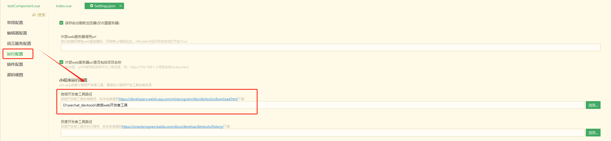
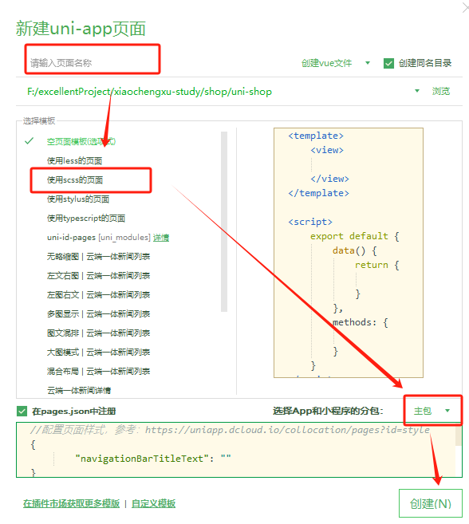

小程序

## 项目结构


1. pages用于存放小程序的页面
2. utils用来存放工具性质的模块
3. app.js是小程序的入口文件
4. app.json是小程序的全局配置文件
5. app.wxss是小程序的全局样式文件
6. project.config.json是项目的配置文件
7. sitemap.json用来配置小程序及其页面是否允许被微信索引

### JSON配置文件

#### app.json文件（全局配置文件）


1. pages：用来记录当前小程序所有页面的路径
2. Window：全局定义小程序所有页面的背景色、文本颜色等等。
3. style：全局定义小程序组件使用的样式版本，如果是新的就是"style":"v2"
4. sitemapLocation：指明sitemap.json的位置

#### project.config.json文件

project.config.json是项目 的配置文件，用来记录对小程序的个性化配置。

#### sitemap.json文件

由于微信已经开启了小程序内的索引，此文件用来配置小程序页面是否允许微信索引。

当开发者允许进行微信索引的时候，小程序的页面就会随着用户的搜索进行展示。

#### 每一个文件夹的json文件

可以对这个页面的效果进行个性化配置，如果是与app.json冲突了，那么会覆盖掉app.json。

> 如何去创建一个小程序的页面呢？
>
> 很简单，直接在app.json文件中添加一行pages路径即可。
>
> 如何去修改项目首页呢？
>
> 只需要调整app.json -> pages数组中页面路径的前后顺序，即可修改项目的首页，小程序会将第一位的页面当成项目首页进行渲染。

### WXML模版

#### 设么是WXML模版？

##### WXML和HTML区别

1. 标签名称不同

- HTML（div、span、img、a）
- WXML（view、text、image、navigator）

2. 属性节点不同

- <a href = '#'>超链接</a>
- <navigator url = '/pages/home/home'></navigator>

3. 提供了类似于Vue中的模版方法

- 数据绑定
- 列表渲染
- 条件渲染

#### 设么是WXSS模版？

##### WXSS和CSS区别？

1. 新增了rpx尺寸单位

- CSS需要手动进行像素单位换算，例如rem
- WXSS在底层支持新的尺寸单位rpx，在不同大小的屏幕会自动进行换算

2. 提供了全局样式和局部样式

- 项目根目录的app.wxss会作用于所有的小程序页面
- 局部页面 的.wxss仅对当前页面生效

3. WXSS仅支持部分CSS选择器（绝大多数的CSS选择器其实都是支持的，除非一些比较生僻的选择器）

#### JS逻辑交互

##### .js文件分类

1. app.js

- 是整个小程序项目的入口文件，通过调用App()函数来启动整个小程序

2. 页面的JS文件

- 是页面的 入口文件，通过调用Page()函数来创建并运行整个页面

3. 普通的JS文件

## 宿主环境介绍

### 1. 什么是宿主环境

Android和IOS是两个不同的宿主环境，安卓的应用在IOS中无法进行运行。

### 2. 小程序的宿主环境

手机微信是小程序的宿主环境，小程序是依托于微信所提供的能力。

### 3. 小程序宿主环境包含的内容

通信模型、运行机制、组件、API

### 4. 通信模型

小程序中的通信主体是渲染层和逻辑层，其中：WXML模版和WXSS样式工作在渲染层；JS脚本运行在逻辑层。


## 组件

小程序中的组件也是由宿主环境提供的。

### 视图容器类型组件

1. view

- 普通视图区域
- 类似于HTML中的div标签
- 常用来实现页面布局

2. scroll-view

- 可以滚动的视图区域
- 常用来实现滚动视图列表

3. swiper和swiper-item组件

- 轮播图组件和轮播图item组件

#### view组件的基本使用

实现如图的flex横向布局容器效果：


#### scroll-view组件的使用


#### swiper和swiper-item组件的基本使用


swiper常用属性：


### 常见的基础内容组件

1. text
2. rich-text

#### text组件使用

使用text组件的selectable属性，可以支持我们的text选中的样式。

#### rich-text组件使用

使用rich-text组件中的nodes属性可以将HTML标签进行渲染

### 其他常用组件

1. button 

- 按钮组件
- 功能比HTML中的button组件丰富
- 通过open-type属性就可以直接使用微信提供的各种功能（客服、转发、获取用户授权、获取用户信息）

2. image

- 图片组件
- image组件默认的宽度是300px、高度是240px

3. navigator

- 类似于a标签

#### button

```html
<view>············通过type属性指定按钮类型···········</view>
<button>普通按钮</button>
<button type="primary">主色调按钮</button>
<button type="warn">警告按钮</button>
<view>············通过size属性指定按钮大小···········</view>
<button size="mini">小型按钮</button>
<button size="mini" type="primary">按钮</button>
<button size="mini" type="warn">按钮</button>
<view>············plain镂空按钮···········</view>
<button size="mini" plain>小型按钮</button>
<button size="mini" type="primary" plain>按钮</button>
<button size="mini" type="warn" plain>按钮</button> 
```

> button组件中type 属性有primary是指的是主色调，warn是警告色调
>
> size属性中的mini指的是小型的按钮
>
> plain属性指的是镂空按钮

#### image

```html
<!--image 图片组件-->
<image></image>
<image src="/images/1.jpg" mode="widthFix" />
```

> image标签默认是有宽高的。mode属性可以提供图片的显示方式

image mode属性：


## API

官方已经分成了三大类

1. 事件监听API

- 特点：以on开头，用来监听某一些事件的触发
- 举例：wx.onWindowResize(function callback)监听窗口尺寸变化

2. 同步API

- 以Sync结尾的都是同步API。
- 同步函数的执行结果，都可以通过函数的返回值直接获取，如果执行出错会抛出异常
- wx.setStorageSync('key', 'value')向本地写入内容

3. 异步API

- 类似于Ajax函数，需要通过success、fail、complete接收调用的结果
- 比如：wx.request()发起网络请求，通过success进行回调，接收函数接受数据


# 模版与配置

## WXML模版语法 - 数据绑定

### 数据绑定的基本原则

1. 在data中定义数据
2. 在WXML中使用数据

### 在data中定义页面数据

```js
// index.js
Page({
  data: {
    info: 'hello world',
    imgSrc: 'https://img2.baidu.com/it/u=1028011339,1319212411&fm=253&fmt=auto&app=138&f=JPEG?w=500&h=313',
    randomNum1: Math.random() * 10,
    randomNum2: Math.random().toFixed(2) //得到两位小数的数字
  },
})

```

Page中单独包装一个data，类似于Vue的写法，同样的Mustache语法也类似于Vue的写法

### Mustache语法的格式

把data中的数据绑定到页面进行渲染，使用Mustache语法（双大括号）将变量包裹起来即可。（差值表达式）

```wxml
<view>{{ 要绑定的数据名称 }}</view>
```

```wxml
<view>{{info}}</view>

<image src="{{imgSrc}}" mode="widthFix"></image>

<view>{{randomNum1 >= 5 ? '数字大于等于5' : '数字小于5'}}</view>

<view>得到的随机数*100为：{{randomNum2 * 100}}</view>
```

语法支持直接通过data数据获取数据，同时支持在标签的属性值设置时设置具体的value，同时也支持三元运算符。

## WXML模版语法 - 事件绑定

### 小程序常用事件


### 事件对象的属性列表

当事件回调触发的时候，会收到一个事件对象event，它的详细属性如下：


> target和currentTarget的区别：
>
> Target是触发该事件的源头组件，而currentTarget是当前事件所绑定的组件。
>
> 
>
> 点击内部的按钮时，点击事件以冒泡的形式向外扩散，也会触发外层的view的tap事件处理函数。
>
> - e.target 指向的是button 
> - e.currentTarget 指向的是view组件

### bindtap语法格式

也有点类似于Vue中的属性。

```wxml
<!-- index.wxml -->
<!--事件绑定-->
<button type="primary" bindtap="btntapHandler">按钮</button>

<!-- index.js -->
btntapHandler(e) {
    console.log(e);
}
```

直接通过bindtap属性绑定事件方法，这个方法在index.js中定义。

这个方法中的回调参数是event,通常简写成e，打印一下这个e对象的话，结果是：


### 事件传参与数据同步

**事件绑定**

```wxml
<!--事件绑定-->
<button type="primary" bindtap="btntapHandler">按钮</button>
<button type="primary" bindtap="changeCount">按钮+1事件{{count}}</button>
```

```js
Page({
    data: {
        info: 'hello world',
        imgSrc: 'https://img2.baidu.com/it/u=1028011339,1319212411&fm=253&fmt=auto&app=138&f=JPEG?w=500&h=313',
        randomNum1: Math.random() * 10,
        randomNum2: Math.random().toFixed(2), //得到两位小数的数字
        count: 0,
        msg: '你好啊'
    },
	btntapHandler(e) {
        console.log(e);
    },
    changeCount() {
        this.setData({
            count: this.data.count + 1
        })
    },
    
})
```

> 通过this.setData函数来将具体的值进行赋值。

**事件传参**

```wxml
<!-- 事件传参 -->
<button type="primary" bindtap="btnTap2" data-info="{{2}}">+2{{count}}</button>
```

```js
 btnTap2(e) {
        this.setData({
            count: this.data.count + e.target.dataset.info
        })
    },
```

> 通过data-info来进行值的传递，微信小程序的具体的值跟Vue的值对应不一样，通过data-info属性将{{2}}转换成数字类型，传递给JS文件，之后便可以将值传递到方法中，使用e.target.dataset.info进行接收

**输入框事件**

```wxml
<!-- bindinput语法格式 -->
<input type="text" bindinput="inputHandler" />

<!-- 文本框和data之间的数据同步 -->
<input type="text" value="{{msg}}" bindinput="iptHandler" />
```

```js
 inputHandler(e) {
        console.log(e.detail.value);
    },
 iptHandler(e) {
        console.log(e);
        this.setData({
            msg: e.detail.value
        })
    },
```

> 通过e.detail.value便可以得到即时输入的内容进行展示。后台JS文件中的data中也会收到数据。

```wxss

input {
    border: 1px solid #eee;
    margin: 5px;
    padding: 5px;
    border-radius: 3px;
}
```

> 效果：
>
> 

### 条件渲染

```wxml
<!-- 条件渲染 -->
<view wx:if="{{type === 1}}">男</view>
<view wx:elif="{{type === 2}}">女</view>
<view wx:else>保密</view>
```

```js
   data: {
        info: 'hello world',
        imgSrc: 'https://img2.baidu.com/it/u=1028011339,1319212411&fm=253&fmt=auto&app=138&f=JPEG?w=500&h=313',
        randomNum1: Math.random() * 10,
        randomNum2: Math.random().toFixed(2), //得到两位小数的数字
        count: 0,
        msg: '你好啊',
        type: 1,
        flag: true
    },
```

> 当wx:if = true时，会展示效果

> 如果有很多组件想要同时进行展示和隐藏，可以使用block标签<bloack></block>

```wxml
<block wx:if="{{true}}">
    <view>view1</view>
    <view>view2</view>
</block>
```

> hideen属性的使用
>
> ```wxml
> <!-- hidden使用，直接使用hidden={{condition}}即可 -->
> <view hidden="{{!flag}}">条件为true的时候隐藏元素，否则就显示</view>
> <view wx:if="{{flag}}">这是使用 wx:if 控制的元素</view>
> ```
>
> 当condition是true的时候会进行隐藏，如果是false的话会进行展示。

#### wx:if 和hidden对比

运行方式不同，

- wx:if以动态创建和移除元素的方式，控制元素的展示与隐藏。
- hidden以切换样式的方式(display:none/block;)，控制元素的显示与隐藏

使用建议：频繁进行切换的时候，建议使用hidden；控制条件比较复杂的时候，建议使用wx:if搭配wx:elif来控制展示和隐藏。

### 列表渲染

语法是  wx:for 

```wxml
<!-- 列表渲染 -->
<!-- 通过wx:for可以根据指定的数组，循环渲染重复的组件结构，默认情况下，当前循环项的索引使用index表示，当前循环项用item表示 -->
<view wx:for="{{arr1}}">
    索引是：{{index}}， item项是:{{item}}
</view>
```

```js
    data: {
        info: 'hello world',
        imgSrc: 'https://img2.baidu.com/it/u=1028011339,1319212411&fm=253&fmt=auto&app=138&f=JPEG?w=500&h=313',
        randomNum1: Math.random() * 10,
        randomNum2: Math.random().toFixed(2), //得到两位小数的数字
        count: 0,
        msg: '你好啊',
        type: 1,
        flag: true,
        arr1: ['Apple', '华为', '小米'],
        userList: [
            { id: 1, name: "小红" },
            { id: 2, name: "小白" },
            { id: 3, name: "小懒" }
        ]
    },
```

> 可以使用wx:for进行将数组渲染，索引自动设置为index，item自动设置成对应 的项

```wxml
<!-- 通过了for-index指定了索引的位置和for-item的某一项的名字 -->
<view wx:for="{{arr1}}" wx:for-index="idx" wx:for-item="itemName">
    索引是：{{idx}}， item项是:{{itemName}}
</view>
```

> 多余的。如果想要设置名称，可以添加wx:for-index属性和wx:for-item属性。直接利用这个属性设置名称，在表达式中可以使用这个名称对应的属性。

```wxml
<view wx:for="{{userList}}" wx:key="id">{{item.name}}</view>
```

> 如果数组中是一个对象，key 值设置成对应的key值，value值是可以自己选择设置的。

# WXSS模版样式

## WXSS和CSS的关系

WXSS具有CSS绝大多数的特性，同时，WXSS还对CSS进行了扩充以及修改。

- rpx尺寸单位
- @import样式导入

### rpx尺寸单位

用来解决屏幕适配的尺寸单位。

原理非常简单，鉴于不同设备的屏幕大小不同，为了实现屏幕的自动适配。rpx将所有设备的屏幕在宽度上分成了750rpx。

- 在较小的屏幕上，1rpx代表的宽度较小。
- 在较大的屏幕上，1rpx代表的宽度较大。

小程序在不同的设备进行适配的时候，会自动将rpx的样式单位换算成对应的像素单位来进行渲染。从而实现屏幕适配。

### rpx和px单位换算

iPhone6上，1rpx = 0.5rpx。

> 

### 样式导入

**@import**

我们可以在一个WXSS文件中引入另一个WXSS文件。

```wxss
@import "/common/common.wxss"
```

```wxss
.userName {
    color: red;
}
```

在index.wxss文件中引入common.WXSS文件。

显示效果：


> 很明显能看到三个人的名字已经是变红了，这也是我们引入的common.wxss文件的效果。

# 全局配置

### 全局配置文件及常用的配置项

1. pages

- 记录当前小程序所有页面的存放路径

2. Window

- 全局设置小程序窗口的外观

#### window


了解window节点的常用配置项：


##### 设置导航栏的标题

> navigationBar是导航栏的样式。

```app.json
"window": {
    "navigationBarTextStyle": "white",
    "navigationBarTitleText": "坤你太美",
    "navigationBarBackgroundColor": "#2b4b6b"
  }
```

效果：


##### 设置导航栏的背景色

```app.json
"window": {
    "navigationBarTextStyle": "white",
    "navigationBarTitleText": "坤你太美",
    "navigationBarBackgroundColor": "#2b4b6b"
  }
```

背景色只支持16进制颜色。

##### 设置导航栏的标题颜色

```app.json
"window": {
    "navigationBarTextStyle": "white",
    "navigationBarTitleText": "坤你太美",
    "navigationBarBackgroundColor": "#2b4b6b"
  }
```

导航栏颜色只支持Black和white两种颜色。


**全局开启下拉刷新功能。**


<hr>

**设置下拉刷新时窗口的背景色**

当全局开启下拉刷新的时候，默认的窗口背景色是白色。如果要设置颜色的话，需要在backgroundColor中设置16进制的颜色值。

**设置下拉刷新时loading的样式**

设置属性backgroundTextStyle为dark，原本只有两种：light和dark。

**设置上拉触底的距离**

设置属性onReachBottomDistance设置新的值。

<hr>

什么是tabBar?

是移动端应用常见的页面效果，用于实现多页面的快速切换。通常分成底部tabBar和顶部tabBar。

> 注意：tabBar最少只能配置两个，最多只能是5个。当渲染顶部tabBar的时候，不会显示icon，只显示文本。


#### tabBar节点配置项


> 每一个tab项的配置选项
>
> 

案例：

我们需要将页面展示成首页、消息、联系我们三个tab页面

首先我们先准备三个页面

```json
"pages/home/home",
    "pages/message/message",
    "pages/contact/contact"
```

之后定义一个tabBar：

```json
"tabBar": {
    "list": [{
        "pagePath": "pages/home/home",
        "text": "首页",
        "iconPath": "/images/1.png",
        "selectedIconPath": "/images/1-active.png"
      },
      {
        "pagePath": "pages/message/message",
        "text": "消息",
        "iconPath": "/images/2-active.png",
        "selectedIconPath": "/images/2.png"
      },
      {
        "pagePath": "pages/contact/contact",
        "text": "联系我们",
        "iconPath": "/images/3.png",
        "selectedIconPath": "/images/3-active.png"
      }
    ]
  }
```

> list是必须的属性，代表着那几个 页面。
>
> 每一个list中pagePath属性指的是页面对应的路径值。
>
> text指的是展示的文本tab内容。
>
> iconPath指的是未选中状态的图片。
>
> selectedIconPath指的是选中状态的图片。

针对于每一个特定的页面，可能会存在特意化定制。


#### 发起数据请求

先来提醒:

> 微信其实对于安全的校验是十分严格的，所以一般要求在开发的时候也要开启校验https域名校验，实在感觉前后端交互比较复杂的话就需要将打开

微信中发起请求直接使用微信的组件即可：（接口竟然可以用我去）

```js
// 发起GET 数据请求
  getInfo() {
    wx.request({
      url: 'https://applet-base-api-t.itheima.net/api/get',
      method: 'get',
      data: {
        name: 'zs',
        age: 20
      },
      success: (res) => {
        console.log(res.data);
      }
    })
  },

  // 发起post数据请求
  postInfo() {
    wx.request({
      url: 'https://applet-base-api-t.itheima.net/api/post',
      method: "post",
      data: {
        name: 'ls',
        age: 22
      },
      success: (res) => {
        console.log(res.data);
      }
    })
  }
```

```home.wxml
<button bindtap="getInfo">发起GET请求</button>
<button bindtap="postInfo">发起POST请求</button>
```

效果：


有点像Ajax是吧，但是微信中其实是没有Ajax请求的，因为Ajax请求是基于浏览器的。

next

​    |

​	|

如果我想在页面加载的时候就进行发起请求，之后得到数据的话怎么做呢？

```js
 /**
   * 生命周期函数--监听页面加载 --> 在页面已加载的时候就会调用这个方法，然后调用GET和post请求，得到响应结果
   */
  onLoad(options) {
    this.getInfo();
    this.postInfo();
  }
```

# 页面事件

## 下拉刷新事件

启用下拉刷新的两种方式：

1. 全局开启下拉刷新

- 在app.json的window节点上将enablePullDownRefresh设置成true即可。

2. 局部开启下拉刷新

- 在页面的.json配置文件中，将enablePullDownRefresh设置成true即可。

配置下拉刷新窗口的样式

```json
{
    	"backgroundColor": "#efefef",
		"backgroundTextStyle": "dark"
}
```

以上便是设置背景颜色。

### 监听页面下拉刷新事件

onPullDownRefresh()函数是专门用来监听用户下拉动作的。

```js
	/**
	 * 页面相关事件处理函数--监听用户下拉动作
	 */
	onPullDownRefresh() {
		console.log('触发了message页面的下拉刷新');
		this.setData({
			count: 0
		})
		// 停止下拉刷新效果
		wx.stopPullDownRefresh()
	}

```


### 停止下拉刷新的效果

```js
		// 停止下拉刷新效果
		wx.stopPullDownRefresh()
```

## 上拉触底事件

页面上的上拉触底事件处理函数：onReachBottom()

```home.js
onReachBotoom(){
    console.log('触发了上拉触底事件')
}
```

```home.wxml
<view class="box"></view>
```

```home.wxss
/* pages/home/home.wxss */
.box {
	height: 2000rpx;
	background-color: lightblue;
}
```

```app.wxss
view {
  padding: 10rpx;
  margin: 10rpx;
  background-color: lightskyblue;
}
```

如此一来便可以实现下拉操作。

但是存在一个问题：

> 如果下拉完成之后再次下拉之后就会重新进行加载。

> 如何改善呢？添加节流操作。

```home.js
data: {
	isLoading: false
},

	/**
	 * 页面上拉触底事件的处理函数
	 */
	onReachBottom() {
		if (this.data.isLoading) return
		this.setData({
			isLoading: true
		})
		console.log('触发了上拉触底事件');
	},
```

> 在data中设置属性isLoading，在页面上拉触底函数中将isLoading设置成true。判断data.isLoading是否是true，如果是true，那么直接退出。

**问题解决~**

### 上拉触底的案例

我们要做的内容是在联系我们tab页中加上

```contact.js
// 只写比较重要的部分
data: {
	colorList: []
},

getColors() {
	wx.request({
		url: 'https://applet-base-api-t-itheima.net/api/color',
		method: 'get',
		success: ({ data: res }) => {
			console.log(res);
			this.setData({
				colorList: [...this.data.colorList, ...res.data]
			})
		}
	})
}
```

```contact.wxml
<view wx:for="{{colorList}}" wx:key="index" class="num-item" style="background-color: rgba({{item}});">{{item}}</view>
```

```contact.wxss
.num-item {
	border: 1rpx solid #efefef;
	border-radius: 8rpx;
	line-height: 200rpx;
	margin: 15rpx;
	text-align: center;
	text-shadow: 0rpx 0rpx 5rpx #fff;
	box-shadow: 1rpx 1px 6rpx #aaa;
}
```

#### 上拉触底时获取随机的颜色值

如果我想在上拉到底部的时候进行重新加载，重新生成新的随机颜色值？怎么做呢？

很明显，在onReachBottom函数中进行重新加载。

```contact.js
/**
   * 页面上拉触底事件的处理函数
   */
  onReachBottom() {
    this.getColors()
  },
```

> 小tips：
>
> 微信小程序中可以在普通编译部分设置启动的页面，比如可以直接调用contact的tab。

### 小程序的生命周期

#### 分类

1. 应用生命周期
2. 页面生命周期


#### 什么是声明周期函数

- 生命周期函数： 是由小程序框架提供的内置函数，会伴随着生命周期，自动按照次序进行。
- 生命周期函数的作用：允许程序员在特定的时间点，执行某一些特定的操作。例如，页面刚刚加载的时候，可以在onLoad函数中进行初始化页面的数据。

> 生命周期强调的 是时间段，生命周期函数强调的是时间点。

- 对于全局的app.js

```App.js
App({

  /**
   * 当小程序初始化完成时，会触发 onLaunch（全局只触发一次）
   */
  onLaunch: function () {
    console.log('onLaunch')
  },

  /**
   * 当小程序启动，或从后台进入前台显示，会触发 onShow
   */
  onShow: function (options) {
    console.log('onShow');
  },

  /**
   * 当小程序从前台进入后台，会触发 onHide
   */
  onHide: function () {
    console.log('onHide');
  },

  /**
   * 当小程序发生脚本错误，或者 api 调用失败时，会触发 onError 并带上错误信息
   */
  onError: function (msg) {

  }
})

```

> onShow函数只会在小程序启动或者后台进入前台的时候触发。
>
> 而onHide函数只会从前台进入后台的时候触发。

- 对于局部页面的Page（以contact.js）

```javascript
Page({
  data: {
    text: "This is page data."
  },
  onLoad: function(options) {
    // Do some initialize when page load.
  },
  onShow: function() {
    // Do something when page show.
  },
  onReady: function() {
    // Do something when page ready.
  },
  onHide: function() {
    // Do something when page hide.
  },
  onUnload: function() {
    // Do something when page close.
  },
  onPullDownRefresh: function() {
    // Do something when pull down.
  },
  onReachBottom: function() {
    // Do something when page reach bottom.
  },
  onShareAppMessage: function () {
    // return custom share data when user share.
  },
  onPageScroll: function() {
    // Do something when page scroll
  },
  onResize: function() {
    // Do something when page resize
  },
  onTabItemTap(item) {
    console.log(item.index)
    console.log(item.pagePath)
    console.log(item.text)
  },
  // Event handler.
  viewTap: function() {
    this.setData({
      text: 'Set some data for updating view.'
    }, function() {
      // this is setData callback
    })
  },
  customData: {
    hi: 'MINA'
  }
})
```

> 注意：设置小程序标题的时候需要注意在onReady函数之后执行。wx.setNavigationBarTitle()

### WXS脚本

#### wxs的应用场景

wxml中无法调用在页面的js中定义的函数。但是wxml可以调用wxs中定义的函数。wxs典型的应用场景就是“**过滤器**”

> wxs和JS 的关系：（本质上是两种不同的语言）
>
> 1. wxs有自己的数据类型
>
> - number、string、boolean、object、function、array、date、regexp（正则）
>
> 2. wxs不支持类似于ES6及以上的语法形式
>
> - 不支持ES6：let、const、解析赋值、展开运算符、箭头函数、对象属性简写
> - 支持：var 定义变量、普通function函数类似于ES5 语法
>
> 3. wxs遵循CommonJS规范
>
> - module对象
> - require()函数
> - module.exports对象

#### 内嵌wxs脚本

wxs代码可以编写在wxml文件中的<wxs>标签内，就像JavaScript代码可以直接编写在HTML文件中<script>标签中一样。

wxml文件中的每一个<wxs></wxs>标签，必须提供module属性，用来指定当前wxs模块名称，方便在wxml中访问各个模块中的成员。

```wxml
<view>{{m1.toUpper(username)}}</view>

<wxs module="m1">
	module.exports.toUpper = function (str) {
		return str.toUpperCase()
	}
</wxs>
```

#### 定义外联的wxs脚本

在外部定义wxs标签，在wxml文件中引入这个脚本文件之后便可以利用。

```tools.wxs
function toLower(str) {
	return str.toLowerCase()
}

module.exports = {
	toLower: toLower
}
```

#### 使用外联的wxs脚本

```message.wxml
<!-- 引用外联的tools.wxs脚本 -->
<wxs src="../../utils/tools.wxs" module="m2">
</wxs>
```


# 本地生活

之前没有进行记录。此处进行补充。

Home.wxml首页中的样式：

```home.wxml
<swiper indicator-dots circular indicator-color="white" indicator-active-color="gray" autoplay interval="2000">
	<swiper-item wx:for="{{swiperList}}" wx:key="id">
		<image src="{{item.image}}" mode="" />
	</swiper-item>
</swiper>

<view class="grid-list">
	<navigator class="grid-item" wx:for="{{gridList}}" wx:key="id" url="/pages/shoplist/shoplist?id={{item.id}}&title={{item.name}}">
		<image src="{{item.icon}}" mode="" />
		<text>{{item.name}}</text>
	</navigator>
</view>

<view class="img-box">
	<image src="/images/link-01.png" mode="" />
	<image src="/images/link-02.png" mode="" />
</view>
```

```home.js
// pages/home/home.js
Page({

	/**
	 * 页面的初始数据
	 */
	data: {
		isLoading: false,
		swiperList: [],
		gridList: []
	},

	/**
	 * 生命周期函数--监听页面加载 --> 在页面已加载的时候就会调用这个方法，然后调用GET和post请求，得到响应结果
	 */
	onLoad(options) {
		this.getSwiperList();
		this.getGridList();
		this.getInfo();
		this.postInfo();
	},

	/**
	 * 得到九宫格数据
	 */
	getGridList() {
		wx.request({
			url: 'https://applet-base-api-t.itheima.net/categories',
			method: 'get',
			success: (res) => {
				console.dir(res.data);
				this.setData({
					gridList: res.data
				})
			}
		})
	},
	/**
	 * 得到轮播图
	 */
	getSwiperList() {
		wx.request({
			url: 'https://applet-base-api-t.itheima.net/slides',
			method: 'get',
			success: (res) => {
				console.dir(res.data)
				this.setData({
					swiperList: res.data
				})
			}
		})
	},

	/**
	 * 生命周期函数--监听页面初次渲染完成
	 */
	onReady() {

	},

	/**
	 * 生命周期函数--监听页面显示
	 */
	onShow() {

	},

	/**
	 * 生命周期函数--监听页面隐藏
	 */
	onHide() {

	},

	/**
	 * 生命周期函数--监听页面卸载
	 */
	onUnload() {

	},

	/**
	 * 页面相关事件处理函数--监听用户下拉动作
	 */
	onPullDownRefresh() {

	},

	/**
	 * 页面上拉触底事件的处理函数
	 */
	onReachBottom() {
		if (this.data.isLoading) return
		this.setData({
			isLoading: true
		})
		console.log('触发了上拉触底事件');
	},

	/**
	 * 用户点击右上角分享
	 */
	onShareAppMessage() {

	},

	// 发起GET 数据请求
	getInfo() {
		wx.request({
			url: 'https://applet-base-api-t.itheima.net/api/get',
			method: 'get',
			data: {
				name: 'zs',
				age: 20
			},
			success: (res) => {
				console.log(res.data);
			}
		})
	},

	// 发起post数据请求
	postInfo() {
		wx.request({
			url: 'https://applet-base-api-t.itheima.net/api/post',
			method: "post",
			data: {
				name: 'ls',
				age: 22
			},
			success: (res) => {
				console.log(res.data);
			}
		})
	}
})
```

```home.wxss
/* pages/home/home.wxss */

swiper {
	height: 350rpx;
}

swiper image {
	width: 100%;
	height: 100%;
}

.grid-list {
	/* 开启flex布局 */
	display: flex;
	/* 允许换行 */
	flex-wrap: wrap;
	/* 添加左侧跟顶部之间的边框 */
	border-left: 1rpx solid #efefef;
	border-top: 1rpx solid #efefef;
}

.grid-item {
	width: 33.33%;
	height: 200rpx;
	/* 添加布局 */
	display: flex;
	flex-direction: column;
	/* 横向纵向的居中 */
	align-items: center;
	justify-content: center;
	/* 添加右侧跟底部之间的边框 */
	border-right: 1rpx solid #efefef;
	border-bottom: 1rpx solid #efefef;
	/* 改变box方式 */
	box-sizing: border-box;
}

.grid-item image {
	width: 60rpx;
	height: 60rpx;
}

.grid-item text {
	font-size: 24rpx;
	margin-top: 10rpx;
}

.img-box {
	display: flex;
	padding: 20rpx 10rpx;
	justify-content: space-around;
}

.img-box image {
	width: 45%;
}
```

此处的效果是：


## 美食栏

现在有一个需求，需要点击美食之后跳转到一个美食列表。进行展示。

之前将view标签转成navigator标签之后便可以实现页面的跳转，当然需要传递一些能够代表每一个模块部分的唯一的标识，也就意味着我们需要传递一些参数，比如item.id和item.name。代码如下：**home.wxml**

```wxml
<view class="grid-list">
	<navigator class="grid-item" wx:for="{{gridList}}" wx:key="id" url="/pages/shoplist/shoplist?id={{item.id}}&title={{item.name}}">
		<image src="{{item.icon}}" mode="" />
		<text>{{item.name}}</text>
	</navigator>
</view>
```

在美食栏部分： 

**shoplist.wxml**

```wxml
<view class="shop-item" wx:for="{{shopList}}" wx:key="id">
	<view class="thumb">
		<image src="{{item.images[0]}}" mode="" />
	</view>

	<view class="info">
		<text class="shop-title">{{item.name}}</text>
		<text>电话：{{item.phone}}</text>
		<text>地址：{{item.address}}</text>
		<text>营业时间：{{item.businessHours}}</text>
	</view>
</view>
```

> 注意：设置跳转到美食页面的title需要进行修改，那么在微信开放平台的官方文档中其实有提到过，设置这个属性需要在onReady方法中进行。即：
>
>  ```javascript
>  onReady() {
>  
>    wx.setNavigationBarTitle({
>  
>     title: this.data.query.title,
>  
>    })
>  
>   }
>  ```

我们在点击跳转的时候会通过URL传递参数，那么我们可以通过onLoad()函数进行处理。在data: {}中设置好参数。

```javascript
data: {
    isloading: false,
    query: {},
    shopList: [],
    page: 1,
    pageSize: 10,
    total: 0
  },

  /**
   * 生命周期函数--监听页面加载
   */
  onLoad(options) {
    this.setData({
      query: options
    })
    this.getShopList()
  },
```

在其他地方调用的时候便会变得很容易。

```javascript
getShopList(cb) {
    //展示loading效果
    wx.showLoading({
      title: '数据加载中',
    })

    wx.request({
      url: `https://applet-base-api-t.itheima.net/categories/${this.data.query.id}/shops`,
      method: 'GET',
      data: {
        _page: this.data.page,
        _limit: this.data.pageSize
      },
      success: (res) => {
        this.setData({
          shopList: [...this.data.shopList, ...res.data],
          total: res.header['X-Total-Count'] - 0
        })
      },
      complete: () => {
        wx.hideLoading()
      }
    })
  },
```

向后台发送请求，设置到对应参数。

> 注意：其中的total总数需要从响应头获取：
>
> 

### 设置上拉触底事件

设置JSON中的属性： "onReachBottomDistance": 200

```javascript
  /**
   * 页面上拉触底事件的处理函数
   */
  onReachBottom() {
    // 判断
    if (this.data.page * this.data.pageSize >= this.data.total) {
      // 没有下一页数据了
      return wx.showToast({
        title: '数据已加载完毕',
        icon: 'none'
      })
    }
    // 设置节流阀
    if (this.data.isloading) return
    this.setData({
      page: this.data.page + 1
    })
    this.getShopList()
  }
```

如果已经到了最终的数据页面，没有其他数据了，那么现在的请求会继续请求。这是一个问题。同时在节流阀方面也存在问题。

判断是否存在数据：page * pageSize >= total说明已经不存在数据了。

设置节流阀：需要在data中定义isLoading属性设置成false。在getShopList()中设置isLoading为true。在上拉事件中处理。

```javascript
 getShopList(cb) {
    this.setData({
      isloading: true
    })
    //展示loading效果
    wx.showLoading({
      title: '数据加载中',
    })

    wx.request({
      url: `https://applet-base-api-t.itheima.net/categories/${this.data.query.id}/shops`,
      method: 'GET',
      data: {
        _page: this.data.page,
        _limit: this.data.pageSize
      },
      success: (res) => {
        console.log(res);
        this.setData({
          shopList: [...this.data.shopList, ...res.data],
          total: res.header['X-Total-Count'] - 0
        })
      },
      complete: () => {
        wx.hideLoading()
        this.setData({
          isloading: false
        })
        cb && cb()// 短路运算符
      }
    })

  },
```

### 设置下拉刷新事件

在JSON文件中添加属性：

```json
  {
      "enablePullDownRefresh": true,
  	  "backgroundColor": "#efefef",
      "backgroundTextStyle": "dark"
  }
```

在下拉刷新事件中需要设置关键的数据为初始状态，之后需要重新发送请求。

```javascript
  onPullDownRefresh() {
    // 重置关键的数据
    this.setData({
      page: 1,
      shopList: [],
      total: 0
    })
    // 重新发请求
    this.getShopList(() => {
      wx.stopPullDownRefresh()
    })
  }
```

### 整体代码

> 需要在app.json中添加上页面的信息
>
> ```json
> "pages": [
>     "pages/home/home",
>     "pages/message/message",
>     "pages/contact/contact",
>     "pages/index/index",
>     "pages/test/test",
>     "pages/logs/logs",
>     "pages/list/list",
>     "pages/drugDetail/drugDetail",  
>     "pages/shoplist/shoplist"
>   ]
> ```

**shoplist.wxml**

```wxml
<view class="shop-item" wx:for="{{shopList}}" wx:key="id">
	<view class="thumb">
		<image src="{{item.images[0]}}" mode="" />
	</view>

	<view class="info">
		<text class="shop-title">{{item.name}}</text>
		<text>电话：{{item.phone}}</text>
		<text>地址：{{item.address}}</text>
		<text>营业时间：{{item.businessHours}}</text>
	</view>
</view>
```

**shoplist.js**

```javascript
// pages/shoplist/shoplist.js
Page({

  /**
   * 页面的初始数据
   */
  data: {
    isloading: false,
    query: {},
    shopList: [],
    page: 1,
    pageSize: 10,
    total: 0
  },

  /**
   * 生命周期函数--监听页面加载
   */
  onLoad(options) {
    this.setData({
      query: options
    })
    this.getShopList()
  },

  getShopList(cb) {
    this.setData({
      isloading: true
    })
    //展示loading效果
    wx.showLoading({
      title: '数据加载中',
    })

    wx.request({
      url: `https://applet-base-api-t.itheima.net/categories/${this.data.query.id}/shops`,
      method: 'GET',
      data: {
        _page: this.data.page,
        _limit: this.data.pageSize
      },
      success: (res) => {
        console.log(res);
        this.setData({
          shopList: [...this.data.shopList, ...res.data],
          total: res.header['X-Total-Count'] - 0
        })
      },
      complete: () => {
        wx.hideLoading()
        this.setData({
          isloading: false
        })
        cb && cb()// 短路运算符
      }
    })

  },

  /**
   * 生命周期函数--监听页面初次渲染完成
   */
  onReady() {
    wx.setNavigationBarTitle({
      title: this.data.query.title,
    })
  },

  /**
   * 生命周期函数--监听页面显示
   */
  onShow() {

  },

  /**
   * 生命周期函数--监听页面隐藏
   */
  onHide() {

  },

  /**
   * 生命周期函数--监听页面卸载
   */
  onUnload() {

  },

  /**
   * 页面相关事件处理函数--监听用户下拉动作
   */
  onPullDownRefresh() {
    // 重置关键的数据
    this.setData({
      page: 1,
      shopList: [],
      total: 0
    })
    // 重新发请求
    this.getShopList(() => {
      wx.stopPullDownRefresh()
    })
  },

  /**
   * 页面上拉触底事件的处理函数
   */
  onReachBottom() {
    // 判断
    if (this.data.page * this.data.pageSize >= this.data.total) {
      // 没有下一页数据了
      return wx.showToast({
        title: '数据已加载完毕',
        icon: 'none'
      })
    }
    // 设置节流阀
    if (this.data.isloading) return
    this.setData({
      page: this.data.page + 1
    })
    this.getShopList()
  },

  /**
   * 用户点击右上角分享
   */
  onShareAppMessage() {

  }
})
```

> 注意：如果直接在**getShopList()**方法中进行设置，可能导致不必要的带宽占用。所以我们设置一个短路运算符，在需要使用的地方进行调用。

**shoplist.wxss**

```wxss
/* pages/shoplist/shoplist.wxss */
.shop-item {
	display: flex;
	padding: 15rpx;
	border: 1rpx solid #efefef;
	border-radius: 8rpx;
	margin: 15rpx;
	box-shadow: 1rpx 1rpx 15rpx #ddd;
}

.thumb image {
	width: 250rpx;
	height: 250rpx;
	display: block;
	margin-right: 15rpx;
}

.info {
	display: flex;
	flex-direction: column;
	justify-content: space-around;
	font-size: 24rpx;
}

.shop-title {
	font-weight: bold;
}
```


# Components（自定义组件）

## 创建组件

> components ----> test ------> 创建test组件（test Component）

## 引用组件

分成了局部引用和全局引用。

局部引用是应用于局部页面的，全局引用是定义在全局，所有的页面都需要使用到这个页面。一般的定义方式：

在页面的.json文件中设置“usingComponents”属性。

```json
{
	"usingComponents": {
		"my-test1": "/components/test/test"
	},
	"onReachBottomDistance": 1500
}
```

页面使用：

```html
<view></view>
<my-test1><my-test1>
```

如果要定义在全局的话，直接在app.json文件中定义即可

```json
{
    "usingComponents": {
    "my-test1": "/components/test/test"
  	}
}
```

## 组件和页面的区别

从表面上来看，组件和页面都是由.js、.json、.wxml、.wxss这四个文件组成的。但是。组件和页面的.js不同。

- 组件的.json文件中需要声明"component": true属性。
- 组件的.js文件调用的是Component()函数
- 组件的事件处理函数需要定义到methods节点中。

## 组件样式

默认样式中，自定义组件的样式只对当前组件生效，不会影响到组件之外的UI 结构。

- app.wxss对组件的样式没有影响。
- 只有class选择器会有样式隔离的效果，id选择器、属性选择器、标签选择器不会受到隔离的影响 。

> 建议：在组件和引用组件的页面使用class选择器，不要使用id、标签、属性选择器。

## 修改组件的样式

在options:{styleIsolation: ‘isolated’}设置属性即可。属性可以选择下列：


## properties属性

properties属性是组件的对外属性，用来接收外界传递到组件的数据。

```html
<test max="8"></test>
```

```javascript
  /**
   * 组件的属性列表
   */
  properties: {
    // 简化方式：无法定义默认值
    // max: Number
    // 完整的定义方式
    max: {
      type: Number,
      value: 10
    }
  }
```

## data和properties的区别

在小程序组件中，properties属性和data数据用法基本相同。

- data更加倾向于存储组件的私有数据。
- properties更倾向于存储外界传递到组件中的数据。

## 使用setData修改properties的值

```javascript
methods: {
    // 点击事件处理函数，
    addCount() {
      if(this.data.count >= this.properties.max) return 
      this.setData({
        count: this.data.count + 1,
        max: this.properties.max + 1
      })

      this._showCount()
    },
    _showCount(){
      wx.showToast({
        title: 'count是' + this.data.count,
        icon: 'none'
      })
    }
  }
```

## 什么是数据监听器

用于监听和响应任何属性和数据字段的变化，从而执行特定的操作。作用类似于Vue中的watch监听器。

用法：

```javascript
Component({
	observers: {
		'字段A，字段B': function(字段A的新值, 字段B的新值) {
			// do something
		}
})
```

实操：

test2.js

```javascript
// components/test2/test2.js
Component({

  /**
   * 组件的属性列表
   */
  properties: {

  },

  /**
   * 组件的初始数据
   */
  data: {
    n1: 0,
    n2: 0,
    sum: 0
  },

  /**
   * 组件的方法列表
   */
  methods: {
    addN1() {
      this.setData({
        n1: this.data.n1 + 1
      })
    },
    addN2() {
      this.setData({
        n2: this.data.n2 + 1
      })
    }
  },
  observers: {
    'n1, n2': function(newN1, newN2) {
      this.setData({
        sum: newN1 + newN2
      })
    }
  }
})
```

test2.wxml

```html
<view>{{n1}} + {{n2}} = {{sum}}</view>
<button bindtap="addN1">n1 + 1</button>
<button bindtap="addN2">n2 + 1</button>
```

在页面直接调用这个组件即可。

<my-test2></my-test2>

> 我们通过直接对n1和n2进行监控，最终通过n1和n2的和计算出sum。对于这个sum我们对其进行渲染。即可得到我们想要的效果。

效果：


## 监听对象属性变化

```javascript
data: {
    rgb: {
      r: 0,
      g: 0,
      b: 0
    },
    fullColor: '0,0,0'
},


Component({
  observers: {
    // 监听 r 、 g 和 b 数据的变化
    'rgb.r, rgb.g, rgb': function(r, g, b){
      this.setData({
        fullColor: `${r},${g},${b}` // 注意：这里反引号
      });
    }
  },
})

```

> 可以同时监听data数据中的rgb对象中的属性。

## 实现案例 ： 实现点击RGB三个按钮，将颜色在页面显示出来

### 页面构建：此处省略了。直接贴代码

**test3.wxml**

```html
<view style="background-color: rgb({{fullColor}});" class="colorBox">颜色值:{{fullColor}}</view>
<button size="mini" type="default" bindtap="changeR">R</button>
<button size="mini" type="primary" bindtap="changeG">G</button>
<button size="mini" type="warn" bindtap="changeB">B</button>
```

**test3.wxss**

```css
.colorBox {
	line-height: 200rpx;
	font-size: 24rpx;
	color: white;
	text-shadow: 0rpx 0rpx 2rpx black;
	text-align: center;
}
```

### JS构建

先进行分析：如果我们要实现页面的颜色的变化，可以使用rgb对应的数值进行搭配。

首先先将data中的rgb属性设置r、g、b属性。最终进行展示的颜色设置：fullColor.

```javascript
 data: {
    rgb: {
      r: 0,
      g: 0,
      b: 0
    },
    fullColor: '0,0,0'
  }
```

页面中有三个按钮，我们需要对这三个按钮添加改变事件。

```javascript
  methods: {
    changeR() {
      this.setData({
        'rgb.r': this.data.rgb.r + 5 > 255 ? 255 : this.data.rgb.r + 5
      })
    },

    changeG() {
      this.setData({
        'rgb.g': this.data.rgb.g + 5 > 255 ? 255 : this.data.rgb.g + 5
      })
    },

    changeB() {
      this.setData({
        'rgb.b': this.data.rgb.b + 5 > 255 ? 255 : this.data.rgb.b + 5
      })
    }
  }
```

在添加完颜色的修改事件之后，此时其实真正的页面上的颜色是不会发生改变的。那么我们需要继续进行设置，将fullcolor进行设置。

```javascript
 observers: {
  'rgb.r, rgb.g, rgb.b': function(r, g, b) {
    this.setData({
      fullColor: `${r}, ${g},${b}`
    })
  }
}
```

如果对象属性太多了，那么可以简化操作：

```javascript
onservers: {
    'rgb.**': function(obj) {
        this.setData({
            fullColor: `${obj.r}, ${obj.g},${obj.b}`
        })
    }
}
```

## 自定义组件-- 纯数据字段

### 什么是纯数据字段？

不用于页面渲染的纯数据data字段。

某一些data中的字段既不会展示在页面上，也不会传递到其他组件，仅仅是在当前组件内部使用。带有这种特性的data字段适合被设置成纯数据字段。

好处：纯数据字段有助于提升页面更新的性能。

在Component构造器的options节点中，指定pureDataPattern为一个正则表达式，字段名符合这个正则表达式的字段将成为纯数据字段。

```javascript
 options: {
    pureDataPattern: /^_/
  },
 /**
   * 组件的初始数据
   */
  data: {
    _rgb: {
      r: 0,
      g: 0,
      b: 0
    },
    fullColor: '0,0,0'
  },

  /**
   * 组件的方法列表
   */
  methods: {
    changeR() {
      this.setData({
        '_rgb.r': this.data._rgb.r + 5 > 255 ? 255 : this.data._rgb.r + 5
      })
    },

    changeG() {
      this.setData({
        '_rgb.g': this.data._rgb.g + 5 > 255 ? 255 : this.data._rgb.g + 5
      })
    },

    changeB() {
      this.setData({
        '_rgb.b': this.data._rgb.b + 5 > 255 ? 255 : this.data._rgb.b + 5
      })
    }
  }
```

以上其实就是对于rgb对象的设置，我们设置的纯数据字段是以`_`开头的，如果Data中的属性有以`_`开头的，那么就会是纯数据字段。

## 组件的生命周期

小程序组件的可用全部生命周期如下表所示：


最主要的声明周期有三个，分别是created、attached、detached。

1. 组件实例刚刚被创建好的时候，created生命周期函数被触发

- 此时还不能调用setData。
- 通常在这个生命周期函数中，只应该用于给组件的this添加一些自定义的属性字段。

2. 在组件完全初始化完毕、进入页面节点树后，attached生命周期函数会被触发

- 此时，this.data已被初始化完毕。
- 在这个生命周期很有用，绝大多数的初始化工作可以在这个时间段完成。

3. 在组件离开节点树之后，detached生命周期函数会被触发。

- 退出一个页面时，会触发页面内每个自定义组件的detached生命周期函数
- 此时适合做一些清理性质的工作，比如之前设置的监听事件啊，就可以在此处进行事件解绑

> 最新的方式：使用lifetimes属性来进行设置。
>
> ```javascript
> 	created() {
>     console.log('created');
>   },
> 
>   attached() {
>     console.log('attached');
>   },
> 
>   lifetimes: {
>     created() {
>       console.log('created~~~~~~~');
>     },
>     attached() {
>       console.log("attached~~~~~~");
>     }
>   }
> ```
>
> 效果：
>
> 
>
> 可以看到打印的 是最新的创建方式。

### 组件生命周期函数

通常在页面调用组件的时候，组件可以监听三个页面行为。即：show、hide、resize。分别是：

- 页面展示时候
- 页面隐藏时候
- 页面尺寸发生变化时候

那么组件如何监听不同时期的函数呢?需要用到pageLifetimes节点。

```javascript
Component({
    pageLifetimes: {
        show: function() {},//页面被展示
        hide: function() {},// 页面被隐藏
        resize:function() {}// 页面尺寸发生变化
    }
})
```

### 插槽

#### 单个插槽

在小程序中，默认每个自定义组件中只允许使用一个<slot>进行占位，这种个数上的限制叫做单个插槽。

**test4.wxml(这是Component组件)**

```html
<view>
	<view>这是组件的内部结构</view>
	<slot></slot>
</view>
```

**home.wxml(这是主页面)**

```html
<my-test4>
	<view>这是通过插槽填充的内容</view>
</my-test4>
```

效果：


#### 多个插槽

在小程序的自定义组件当中，需要使用多个slot插槽时，可以在组件.js文件中，通过设置options属性的multipleSlots: true启用多个slot支持。

```javascript
  options: {
    multipleSlots: true
  },
```

#### 定义多个插槽

可以通过name来标志不同的slot。

test4.wxml

```html
<view>
	<slot name="before"></slot>
	<view>这是组件的内部结构</view>
	<slot name="after"></slot>
</view>
```

home.wxml

```html
<view slot="before">这是通过插槽填充的内容</view>

	<view slot="after">~~~~~~~~~~~~~~</view>
</my-test4>
```

### 父子组件之间的通信3种方式

- 属性绑定

​	父组件向子组件指定组件设置数据，仅仅能设置JSON兼容的数据。

- 事件绑定

​	用于子组件向父组件传递数据，可以传递任意数据。

- 获取组件实例

​	父组件还可以通过this.selectComponent()获取子组件实例对象。如此就可以直接访问子组件的任意数据和方法。

> 属性绑定：
>
> home.js
>
> ```javascript
> data:{
>     count: 0
> }
> ```
>
> home.wxml
>
> ```html
> <view>父组件中，count是：{{count}}</view>
> ```
>
> test5.js
>
> ```javascript
> // components/test5/test5.js
> Component({
>   /**
>    * 组件的属性列表
>    */
>   properties: {
>     count: Number
>   },
> 
>   /**
>    * 组件的初始数据
>    */
>   data: {
> 
>   },
> 
>   /**
>    * 组件的方法列表
>    */
>   methods: {
> 
>   }
> })
> 
> ```
>
> test5.wxml
>
> ```html
> <view>子组件中，count值是：{{count}}</view>
> ```
>
> 效果：
>
> 
>
> 

> 事件绑定：
>
> 用于实现子向父传值，可以传递任意类型的数据，
>
> 1. 在父组件的JS中，定义一个函数，这个函数即将通过自定义事件的形式，传递给子组件。
> 2. 在父组件的WXML中，通过自定义事件的方式，将步骤一中定义的函数引用，传递给子组件。
> 3. 在子组件的JS中，通过调用this.triggerEvent(‘自定义事件名称’, {/*参数对象*/})，将数据发送到子组件。
> 4. 在父组件的JS中，通过e.detail获取到子组件传递过来的数据。

> 获取组件实例：
>
> 用于父页面获取子页面的函数属性。
>
> 在父页面的组件中设置class选择器或者是id选择器。
>
> 在父页面的JS中可以选择这个组件的ID选择器：const child = this.selectComponent('.cA')。得到的是一个对象。
>
> 代码如下：
>
> **home.wxml**
>
> ```home.wxml
> <my-test5 count="{{count}}" bind:sync="syncCount" class="customA" id="cA"></my-test5>
> 
> <view>父组件中，count的值是：{{count}}</view>
> 
> <button bindtap="getChild">获取子组件的实例对象</button>
> ```
>
> **home.js**
>
> ```javascript
> 	getChild() {
> 		const child = this.selectComponent('#cA') // 或者是'.customA'
> 		console.log(child);
> 		// child.setData({
> 		// 	count: child.properties.count + 1
> 		// })
> 		child.addCount()
> 	},
> ```
>
> child的内容：
>
> 

## behaviors

### 创建behavior

定义Behavior构造器即可。

**my-behavior.js**

```javascript
module.exports = Behavior({
	data: {
		username: 'ls'
	},
	properties: {},
	methods: {}
})
```

组件中引用这个Behavior：**test5.js**

```javascript
const myBehavior = require('../../behaviors/my-behavior')

Component({
  behaviors: [myBehavior]
})
```

组件页面：

**test5.wxml**

```html
<view>在behavior中定义的用户名是：{{username}}</view>
```

效果：


### behavior中所有可用的节点


### 属性覆盖


# 初步安装和使用vant组件库

## 初步安装和使用vant组件库

小程序已经支持使用npm安装第三方包，从而提高小程序的开发效率。但是，在小程序中使用npm有如下3个限制。

1. 不支持依赖于Node.js内置库的包
2. 不支持依赖于浏览器内置对象的包
3. 不支持依赖于C++插件的包

## Vant Weapp

### 介绍

官方网址：https://vant-ui.github.io/vant-weapp

- 我们使用npm 进行包引入。

```shell
npm i @vant/weapp@1.3.3 -S --production
```

安装1.3.3版本的vant Weapp。

如果出现timeout，更换一下npm 的下载源：

```shell
npm config set registry https://registry.npmmirror.com/
```

下载好之后会出现node_modules。如果没有package.json，需要使用npm init进行初始化。

- 修改app.json

将app.json中的“style”: "v2"删除

- 构建npm包：工具 ----> 构建npm。由于微信开发者工具已经默认设置好使用npm模块了，所以不需要进行单独设置。

### 使用

**app.json**

```json
{
    "usingComponents": {
        "van-button": "@vant/weapp/button/index"
    }
}
```

**home.wxml**

```html
<van-button type="primary">按钮</van-button>

<van-button type="danger">按钮</van-button>
```

> 如果某一些小程序的样式不是我们所期盼的，那么可以根据元素的类型进行修改。比如：将红色的button按钮设置成深红色：
>
> **app.wxss**
>
> ```css
> page {
>     --button-danger-background-color: #c00000;
>     --button-danger-border-color: #d60000;
> }
> ```
>
> 为什么我们选择page标签呢，是因为这个微信小程序的根节点是page标签。
>
> 选择--button-danger-****是什么原因呢？
>
<<<<<<< Updated upstream
<<<<<<< HEAD
> 可以去官方文档进行查看：具体的配置网站：https://github.com/youzan/vant-weapp/blob/dev/packages/common/style/var.less

## API Promise化

### 基于回调函数异步API的缺点

默认情况下，微信小程序都是基于回调函数来实现的。很容易造成回调地狱的问题。

### 什么是API Promise化

API Promise化，指的是通过额外的配置，将官方提供的、基于回调函数的异步API，升级成基于Promise的异步API。

### 实现API Promise化

小程序中，实现API Promise化主要依赖于miniprogram-api-promise这个三方的npm包。

```shell
npm install --save miniprogram-api-promise@1.0.4
```

在app.js中引入依赖：

```javascript
import { promisifyAll } from 'miniprogram-api-promise'
const wxp = wx.p = {}
promisifyAll(wx, wxp)
```

在message.wxml中添加按钮

```html
<van-button type="primary" bindtap="getInfo">得到信息</van-button>
```

在message.js中添加getInfo函数

```javascript
	async getInfo() {
		const { data: res } =await wx.p.request({
			url: 'https://applet-base-api-t.itheima.net/api/get',
			data: {
				name: 'zs',
				age: 20
			},
			method: 'get'
		})
		console.log(res);
	}
```

> 可以去官方文档进行查看：具体的配置网站：https://github.com/youzan/vant-weapp/blob/dev/packages/common/style/var.less

## 全局数据共享

全局数据共享是为了解决组件之间的数据共享的问题。

常用的解决方案有：VueX、ReduX、MobX

### 小程序中的全局数据共享以及将Store成员绑定到页面上

小程序中，可使用mobx-miniprogram配合mobx-miniprogram-bindings实现全局数据共享。

- mobx-miniprogram用来创建Store实例对象
- mobx-miniprogram-bindings用来将Store中的共享数据或方法，绑定到组件或者是页面中使用

```shell
npm install --save mobx-miniprogram@4.13.2 mobx-miniprogram-bindings@1.2.1
```

新建一个文件夹：store:

```javascript
// JS中创建Store的实例对象
import { observable, action } from 'mobx-miniprogram'

export const store = observable({
	// 数据字段
	numA: 1,
	numB: 2,

	// 计算属性
	get sum() {
		return this.numA + this.numB
	},

	//actions 方法， 用来修饰 Store中的数据
	updateNum1: action(function (step) {
		this.numA += step
	}),
	updateNum2: action(function (step) {
		this.numB += step
	})
})
```

在message.wxml

```html
<van-button type="primary" bindtap="btnHandler1" data-step="{{1}}">numA + 1</van-button>
<van-button type="danger" bindtap="btnHandler1" data-step="{{-1}}">numA - 1</van-button>
```

```javascript
import { createStoreBindings } from 'mobx-miniprogram-bindings'
import { store } from '../../store/store'

onLoad(options) {
    this.storeBindings = createStoreBindings(this, {
        store,
        fields: ['numA', 'numB', 'sum'],
        actions: ['updateNum1']
    })
},
 onUnload() {
     this.storeBindings.destoryBindings()
 },
 btnHandler1(e) {
     this.updateNum1(e.target.dataset.step)
 }
```

### 将Store中成员绑定到组件中
新建一个组件：test6.在这个组件中我们需要设置一个按钮的模版：

```html
<view>{{numA}} + {{numB}} = {{sum}}</view>

<van-button type="primary" bind:tap="btnHandler2" data-step="{{1}}">numB + 1</van-button>
<van-button type="danger" bind:tap="btnHandler2" data-step="{{-1}}">numB - 1</van-button>
```

> 那么我们对于上述的知识点可以进行一个总结：（因为之前的知识点我忘了）
>
> 对于data-type，是通过data-之后跟着一个自定义的名字，然后将这个自定义的data-***的值通过Mustache语法进行传递。

那么对于这个组价的构建：

```json
"my-test6": "./components/test6/test6",
```

我们继续在message.wxml中使用，查看效果

```html
<my-test6></my-test6>
```

对应的组件的js文件：

```javascript
import { storeBindingsBehavior } from 'mobx-miniprogram-bindings'
import { store } from '../../store/store'

Component({
    behaviors: [storeBindingsBehavior],
    storeBindings: {
        // 数据源
        store,
        fields:{
            numA: 'numA',
        	numB: 'numB',
            sum: 'sum'
        },
        actions: {
            updateNum2: 'updateNum2'
        }
    },
    
    methods: {
        btnHandler2(e) {
            this.updateNum2(e.target.dataset.step)
        }
    }
})
```


# 小程序项目实战

## 初始化项目（uniapp）

> 建议使用HBuilderX来进行开发，因为其中包含了许多的官方适配插件。

1. 新建一个项目：

2. 新建之后配置小程序的appId。

3. HBuilderX中的运行配置设置。

4. 将微信小程序中的安全配置好

5. 可以直接在HBuilder中运行到小程序模拟器。即可查看效果。（如果是要修改某一些配置项，那么可以通过HBuilder中的manifest.json进行配置）


> Tips: 在设置HBuilder的页面时候，包括字体、间距等等。我们可以配置如下：
>
> ```json
> {
>     "editor.colorScheme" : "Default",
>     "editor.fontSize" : 12,
>     "editor.fontFamily" : "Consolas",
>     "editor.fontFmyCHS" : "微软雅黑 Light",
>     "editor.insertSpaces" : true,
>     "editor.lineHeight" : "1.5",
>     "editor.minimap.enabled" : false,
>     "editor.mouseWheelZoom" : true,
>     "editor.onlyHighlightWord" : false,
>     "editor.tabSize" : 2,
>     "editor.wordWrap" : true,
>     "explorer.iconTheme" : "vs-seti",
>     "editor.codeassist.px2rem.enabel" : false,
>     "editor.codeassist.px2upx.enabel" : false,
>     "weApp.devTools.path" : "D:\\wechat_devtools\\微信web开发者工具"
> }
> 
> ```

## TabBar页面

### 配置tabBar效果

我们需要创建的页面有四个：首页、分类、购物车、我的。分别新建tabBar页面。

在pages.json中进行设置tabBar操作。

```json
{
    "tabBar": {
        "selectedColor": "#c00000",
        "list": [
            {
                "pagePath": "pages/home/home",
                "text": "首页",
                "iconPath": "static/tabs/icon_home@3x.png",
                "selectedIconPath": "static/tabs/icon_home_active@3x.png"
            },
            {
                "pagePath": "pages/cate/cate",
                "text": "分类",
                "iconPath": "static/tabs/icon_category@3x.png",
                "selectedIconPath": "static/tabs/icon_category_active@3x.png"
              }, {
                "pagePath": "pages/cart/cart",
                "text": "购物车",
                "iconPath": "static/tabs/icon_cart@3x.png",
                "selectedIconPath": "static/tabs/icon_cart_active@3x.png"
              },
              {
                "pagePath": "pages/my/my",
                "text": "我的",
                "iconPath": "static/tabs/icon_user@3x.png",
                "selectedIconPath": "static/tabs/icon_user_active@3x.png"
              }
        ]
    }
}
```

### 删除默认的index文件夹

1. 在HBuilderX中，将pages中的index文件夹中的默认生成的index.vue删除。
2. 同时，在page.json对应的index的节点对象删除。
3. 为了防止小程序运行失败，手动删除index文件夹删除。
4. 将components组件的文件夹删除

### 效果


## 轮播图

### 封装请求

由于小程序平台的限制，所以我们并不能直接使用axios，但是原声的wx.request又太过于简单，不能满足我们项目中的拦截器等功能。建议在使用uniapp项目中用@escook/request-miniprogram第三方包发起网络请求。

> 下载地址以及说明：https://www.npmjs.com/package/@escook/request-miniprogram

在main.js中进行配置：

```javascript
import {
	$http
} from '@escook/request-miniprogram'

uni.$http = $http
// 配置url
$http.baseUrl = "https://api-hmugo-web.itheima.net"

// 在请求开始之前需要做一些事情
$http.beforeRequest = function(options) {
	uni.showLoading({
		title: "数据加载中..."
	})
}

// 请求完成之后做一些事情
$http.afterRequest = function() {
	uni.hideLoading()
}

```

> 我们将$http作为全局的请求发送处理。在进行数据请求的时候，需要进行一些提醒展示，比如我们在微信小程序中经常使用wx.showToast()方法，但是由于我们使用的是uniapp，所以我们将uni作为顶级父类，调用uni.showLoading()进行加载前的展示。

### 请求轮播图的数据

> url: https://api-hmugo-web.itheima.net/api/public/v1/home/swiperdata

实现步骤：

1. 在data中定义轮播图的数组。
2. 在onLoad生命周期中调用获取轮播图数据的方法。
3. 在methods中定义真正获取轮播图的方法

```javascript
export default {
		data() {
			return {
				swiperList: []
			};
		},
		onLoad() {
			// 在小程序刚开始加载的时候，调用获取轮播图的方法
			this.getSwiperList()
		},
		methods: {
			// 获取轮播图数据
			async getSwiperList() {
				// 发起请求：拿到数据起个别名
				const {
					data: res
				} = await uni.$http.get('/api/public/v1/home/swiperdata')
				// 请求失败的情况
				if (res.meta.status !== 200) {
					return uni.$showMsg()
				}
				// 请求成功
				this.swiperList = res.message;
			}
		}
	}
```

### 渲染页面的样式

**home.vue**

```html
<template>
	<view>
		<swiper :interval="3000" :indicator-dots="true" :autoplay="true" :duration="1000" :circular="true">
			<!-- 循环渲染item项 -->
			<swiper-item v-for="(item, i) in swiperList" :key="i">
				<view class="swiper-item">
					<!-- 动态绑定图片的 src 属性 -->
					<image :src="item.image_src"></image>
				</view>
			</swiper-item>

		</swiper>
	</view>
</template>

<style lang="scss">
	swiper {
		height: 330rpx;

		.swiper-item,
		image {
			height: 100%;
			width: 100%;
		}
	}
</style>
```

> Tips:swiper的部分属性解释：
>
> 1. interval： 自动切换图片的时间
> 2. indicator-dots： 是否显示图片的指示点
> 3. autoplay： 是否自动切换轮播图
> 4. duration： 滑动时间时长
> 5. circular： 是否进行循环轮播

## 配置小程序分包

1. 在项目的根目录中，创建分包的根目录，命名为subpkg。
2. 在pages.json中，和pages节点平级的位置subPackages节点，用来定义分包相关的结构

> 分包的好处：可以减少小程序加载的时候的加载时间。

我们的项目中，将tabBar放在主包中，其他的页面放在分包中（包含商品详情、商品列表）。创建步骤如下：

在subpkg右键，点击新建页面选项。



### Code修改

由于之前的小程序中只是用到了view进行展示，但是并没有跳转的功能，所以我们需要将view转化成navigator标签。

```html
		<swiper :interval="3000" :indicator-dots="true" :autoplay="true" :duration="1000" :circular="true">
			<!-- 循环渲染item项 -->
			<swiper-item v-for="(item, i) in swiperList" :key="i">
				<navigator class="swiper-item" :url="'/subpkg/goods_detail/goods_detail?goods_id=' + item.goods_id">
					<!-- 动态绑定图片的 src 属性 -->
					<image :src="item.image_src"></image>
				</navigator>
			</swiper-item>
		</swiper>
```

之后需要设置Url值。由于我们的轮播图数据中携带了goods_id，我们可以根据这个goods_id进行绑定到URL上。

### 封装uni.$showMsg()方法

我们要做封装方法的意义是为了减少方法内容的冗余，因为我们在判断请求失败的时候，需要将给用户一些提示：比如：

```javascript
return uni.showToast({
		title,
		duration,
		icon: 'none'
	})
```

但是如果一直写这些重复的代码会显得代码可视度狠狠下降。我们只能将这些重复代码封装起来。

在main.js中：

```javascript
uni.$showMsg = function(title = "数据请求失败", duration = 1500) {
	uni.showToast({
		title,
		duration,
		icon: 'none'
	})
}
```

home.vue中

```vue
<script>
	methods: {
			// 获取轮播图数据
			async getSwiperList() {
				// 发起请求：拿到数据起个别名
				const {
					data: res
				} = await uni.$http.get('/api/public/v1/home/swiperdata')
				// 请求失败的情况
				if (res.meta.status !== 200) {
                    // 此处将可能冗余的代码进行封装，直接调用封装后的方法即可
					return uni.$showMsg()
				}
				// 请求成功
				this.swiperList = res.message;
			}
		}
</script>
```

## 分类导航区域

> url：https://api-hmugo-web.itheima.net/api/public/v1/home/catitems

我们想要的效果图如下：

首先获取到这些数据信息：

```javascript
data() {
	// 分类导航数据列表
    navList: []
},
onload() {
    
}
```


## 楼层区域


## 分类

### 分类的基本结构

**cate.vue**

```html
<template>
  <view>
    <view class="scroll-view-container">
      <!-- 左侧的滚动视图区域 -->
      <scroll-view class="left-scroll-view" scroll-y :style="{height: wh + 'px'}">
        <view class="left-scroll-view-item active">xxx</view>
        <view class="left-scroll-view-item">xxx</view>
        <view class="left-scroll-view-item">xxx</view>
        <view class="left-scroll-view-item">xxx</view>
        <view class="left-scroll-view-item">xxx</view>
        <view class="left-scroll-view-item">多复制一些节点，演示纵向滚动效果...</view>
      </scroll-view>
      <!-- 右侧的滚动视图区域 -->
      <scroll-view class="right-scroll-view" scroll-y :style="{height: wh + 'px'}">
        <view class="left-scroll-view-item">zzz</view>
        <view class="left-scroll-view-item">zzz</view>
        <view class="left-scroll-view-item">zzz</view>
        <view class="left-scroll-view-item">zzz</view>
        <view class="left-scroll-view-item">多复制一些节点，演示纵向滚动效果</view>
      </scroll-view>
    </view>
  </view>
</template>

```

我们首先构建出整个的下拉滚动的样式。为了针对不同设备的不同显示高度，需要添加上wh属性

```javascript
<script>
  export default {
    data() {
      return {
        // 窗口的可用高度 = 屏幕高度 - navigationBar高度 - tabBar 高度
        wh: 0
      };
    },
    onLoad() {
      // 获取当前系统的信息
      const sysInfo = uni.getSystemInfoSync()
      // 为 wh 窗口可用高度动态赋值
      this.wh = sysInfo.windowHeight
    }
  }
</script>

```

利用uniapp的getSysteminfoSync方法得到系统的信息，设置到wh属性中。

继续进行页面的样式渲染：

```css
.scroll-view-container {
  display: flex;

  .left-scroll-view {
    width: 120px;

    .left-scroll-view-item {
      line-height: 60px;
      background-color: #f7f7f7;
      text-align: center;
      font-size: 12px;

      // 激活项的样式
      &.active {
        background-color: #ffffff;
        position: relative;

        // 渲染激活项左侧的红色指示边线
        &::before {
          content: ' ';
          display: block;
          width: 3px;
          height: 30px;
          background-color: #c00000;
          position: absolute;
          left: 0;
          top: 50%;
          transform: translateY(-50%);
        }
      }
    }
  }
}

```

### 从后台获取数据渲染到页面上。

> url: https://api-hmugo-web.itheima.net/api/public/v1/categories

我们尝试发送请求，得到的数据相应数据类型是：


除了相应状态码是200之外，这是我们的数据。

message中有children属性，children中还有children属性。


也就意味着我们有三层数据需要展示，第一层是左侧的滚动条，第二层是右侧的标题层，第三层是标题下对应的品牌分类。

拿到数据之后就很简单了。

首先构造两个数组，接收相应数据

```javascript
data() {
    return {
        cateList: [],
        cateLevel2: []
    }
},

onLoad(){
    // 为wh赋予可变的值
	const sysInfo = uni.getSystemInfoSync()
	this.wh = sysInfo.windowHeight

	this.getCateList()
},
methods: {
    async getCateList() {
        const {data:res} = await uni.$http.get('/api/public/v1/categories')
        if(res.meta.status !== 200) return uni.$showMsg()
        
        // 初始化左侧的滚动数据
        this.cateList = res.message
        // 初始化右侧的二级标题
        this.cateLevel2 = this.cateList[0].children
    }
}
```

之后我们需要记录用户点击的左侧滚动条对应的项目。添加一个属性active，用于表示被选中的索引值。

```javascript
data() {
	return {
		scrollTop: 0, // 设置滚动条距离顶部的距离
		wh: 0,
		cateList: [], // 分类数据的列表
		cateLevel2: [], // 二级分类列表：就是标题
		active: 0 // 表示被选中的索引
	};
},
methods: {
    async getCateList() {
		const {
			data: res
		} = await uni.$http.get('/api/public/v1/categories')

		if (res.meta.status !== 200) return uni.$showMsg()
		// 保存数据
		this.cateList = res.message
		// 初始化二级标题
		this.cateLevel2 = this.cateList[0].children
	},

	activeChanged(i) {
		this.active = i
		// 每一次改变状态的时候就会重新将数据填充到二级标题中
		this.cateLevel2 = this.cateList[i].children
	}
}
```

通过active记录用户的点击事件。

### 设计样式（包含了一级、二级、三级的所有CSS样式）

```css
<style lang="scss">
	.scroll-view-container {
		display: flex;

		.left-scroll-view {
			width: 120px;

			.left-scroll-view-item {
				line-height: 60px;
				background-color: #f7f7f7;
				text-align: center;
				font-size: 12px;

				// 激活样式
				&.active {
					background-color: #ffffff;
					position: relative;

					// 渲染激活项左边的红色指示边线
					&::before {
						content: ' ';
						display: block;
						width: 3px;
						height: 30px;
						background-color: #c00000;
						position: absolute;
						left: 0;
						top: 50%;
						transform: translateY(-50%);
					}
				}
			}
		}
	}

	.cate-lv2-title {
		font-size: 12px;
		font-weight: bold;
		text-align: center;
		padding: 15px;
	}

	.cate-lv3-list {
		display: flex;
		flex-wrap: wrap;

		.cate-lv3-item {
			width: 33.33%;
			margin-bottom: 10px;
			display: flex;
			flex-direction: column;
			align-items: center;

			image {
				width: 60px;
				height: 60px;
			}

			text {
				font-size: 12px;
			}
		}
	}
</style>
```

整体页面：

```html
<template>
	<view>
		<view class="scroll-view-container">
			<!-- 左侧的可以下滑的滚动视图区域 -->
			<scroll-view scroll-y="true" class="left-scroll-view" :style="{height: wh + 'px'}">
				<block v-for="(item, i) in cateList" :key="i">
					<view :class="['left-scroll-view-item', i === active ? 'active': '']" @click="activeChanged(i)">
						{{item.cat_name}}
					</view>
				</block>
			</scroll-view>
			<!-- 右侧的滚动视图区域 -->
			<scroll-view scroll-y="true" class="right-scroll-view" :scroll-top="scrollTop" :style="{height: wh + 'px'}">
				<view class="cate-lv2" v-for="(item2, i2) in cateLevel2" :key="i2">
					<view class="cate-lv2-title">
						/ {{item2.cat_name}} /
					</view>
					<!-- 接下来是三级的商品分类列表 -->
					<view class="cate-lv3-list">
						<view class="cate-lv3-item" v-for="(item3, i3) in item2.children" :key="i3"
							@click="gotoGoodsList(item3)">
							<image :src="item3.cat_icon" mode=""></image>
							<text>{{item3.cat_name}}</text>
						</view>
					</view>
				</view>
			</scroll-view>
		</view>
	</view>
</template>
```

那么针对于具体的品牌的商品的跳转，就好办了，添加点击事件：做点击事件的处理。

```javascript
gotoGoodsList(item) {
				// 来做页面跳转
				uni.navigateTo({
					url: '/subpkg/goods_list/goods_list?cid=' + item.cat_id
				})
			}
```

### 切换一级栏的时候重置滚动条的位置

在data中定义scrollTop，切换一级分类的时候，动态的设置scrollType的值。

```java
data() {
  return {
    // 滚动条距离顶部的距离
    scrollTop: 0
  }
},
// 选中项改变的事件处理函数
activeChanged(i) {
  this.active = i
  this.cateLevel2 = this.cateList[i].children

  // 让 scrollTop 的值在 0 与 1 之间切换
  this.scrollTop = this.scrollTop === 0 ? 1 : 0

  // 可以简化为如下的代码：
  // this.scrollTop = this.scrollTop ? 0 : 1
}

```

页面处理：

```html
<!-- 右侧的滚动视图区域 -->
<scroll-view class="right-scroll-view" scroll-y :style="{height: wh + 'px'}" :scroll-top="scrollTop"></scroll-view>

```


> 整体代码：
>
> ```vue
> <template>
> 	<view>
> 		<view class="scroll-view-container">
> 			<!-- 左侧的可以下滑的滚动视图区域 -->
> 			<scroll-view scroll-y="true" class="left-scroll-view" :style="{height: wh + 'px'}">
> 				<block v-for="(item, i) in cateList" :key="i">
> 					<view :class="['left-scroll-view-item', i === active ? 'active': '']" @click="activeChanged(i)">
> 						{{item.cat_name}}
> 					</view>
> 				</block>
> 			</scroll-view>
> 			<!-- 右侧的滚动视图区域 -->
> 			<scroll-view scroll-y="true" class="right-scroll-view" :scroll-top="scrollTop" :style="{height: wh + 'px'}">
> 				<view class="cate-lv2" v-for="(item2, i2) in cateLevel2" :key="i2">
> 					<view class="cate-lv2-title">
> 						/ {{item2.cat_name}} /
> 					</view>
> 					<!-- 接下来是三级的商品分类列表 -->
> 					<view class="cate-lv3-list">
> 						<view class="cate-lv3-item" v-for="(item3, i3) in item2.children" :key="i3"
> 							@click="gotoGoodsList(item3)">
> 							<image :src="item3.cat_icon" mode=""></image>
> 							<text>{{item3.cat_name}}</text>
> 						</view>
> 					</view>
> 				</view>
> 			</scroll-view>
> 		</view>
> 	</view>
> </template>
> 
> <script>
> 	export default {
> 		data() {
> 			return {
> 				scrollTop: 0, // 设置滚动条距离顶部的距离
> 				wh: 0,
> 				cateList: [], // 分类数据的列表
> 				cateLevel2: [], // 二级分类列表：就是标题
> 				active: 0 // 表示被选中的索引
> 			};
> 		},
> 		onLoad() {
> 			// 为wh赋予可变的值
> 			const sysInfo = uni.getSystemInfoSync()
> 			this.wh = sysInfo.windowHeight
> 
> 			this.getCateList()
> 		},
> 		methods: {
> 			async getCateList() {
> 				const {
> 					data: res
> 				} = await uni.$http.get('/api/public/v1/categories')
> 
> 				if (res.meta.status !== 200) return uni.$showMsg()
> 
> 				// 保存数据
> 				this.cateList = res.message
> 				// 初始化二级标题
> 				this.cateLevel2 = this.cateList[0].children
> 			},
> 
> 			activeChanged(i) {
> 				this.active = i
> 				// 每一次改变状态的时候就会重新将数据填充到二级标题中
> 				this.cateLevel2 = this.cateList[i].children
> 				// 
> 				this.scrollTop = this.scrollTop === 0 ? 1 : 0
> 			},
> 
> 			gotoGoodsList(item) {
> 				// 来做页面跳转
> 				uni.navigateTo({
> 					url: '/subpkg/goods_list/goods_list?cid=' + item.cat_id
> 				})
> 			}
> 		}
> 	}
> </script>
> 
> <style lang="scss">
> 	.scroll-view-container {
> 		display: flex;
> 
> 		.left-scroll-view {
> 			width: 120px;
> 
> 			.left-scroll-view-item {
> 				line-height: 60px;
> 				background-color: #f7f7f7;
> 				text-align: center;
> 				font-size: 12px;
> 
> 				// 激活样式
> 				&.active {
> 					background-color: #ffffff;
> 					position: relative;
> 
> 					// 渲染激活项左边的红色指示边线
> 					&::before {
> 						content: ' ';
> 						display: block;
> 						width: 3px;
> 						height: 30px;
> 						background-color: #c00000;
> 						position: absolute;
> 						left: 0;
> 						top: 50%;
> 						transform: translateY(-50%);
> 					}
> 				}
> 			}
> 		}
> 	}
> 
> 	.cate-lv2-title {
> 		font-size: 12px;
> 		font-weight: bold;
> 		text-align: center;
> 		padding: 15px;
> 	}
> 
> 	.cate-lv3-list {
> 		display: flex;
> 		flex-wrap: wrap;
> 
> 		.cate-lv3-item {
> 			width: 33.33%;
> 			margin-bottom: 10px;
> 			display: flex;
> 			flex-direction: column;
> 			align-items: center;
> 
> 			image {
> 				width: 60px;
> 				height: 60px;
> 			}
> 
> 			text {
> 				font-size: 12px;
> 			}
> 		}
> 	}
> </style>
> ```
>
> **over**

## 搜索

### 自定义搜索组件

#### 设置组件

由于我们的搜索部分是可以进行复用的，所以我们将搜索组件单独的放在一个components中。将大体的页面先画出来。

**my-search.vue**

```vue
<template>
	<view class="my-search-container" >
		<view class="my-search-box">
			<uni-icons type="search" size="17"></uni-icons>
			<text class="placeholder">搜索</text>
		</view>
	</view>
</template>
```

美化自定义search组件样式：

```css
.my-search-container {
  background-color: #c00000;
  height: 50px;
  padding: 0 10px;
  display: flex;
  align-items: center;
}

.my-search-box {
  height: 36px;
  background-color: #ffffff;
  border-radius: 15px;
  width: 100%;
  display: flex;
  align-items: center;
  justify-content: center;

  .placeholder {
    font-size: 15px;
    margin-left: 5px;
  }
}

```

由于我们之前对不同的设备进行的处理是不一样的，所以我们需要调整一下，将50px的高度缩减一下。

```javascript
onLoad() {
  const sysInfo = uni.getSystemInfoSync()
  // 可用高度 = 屏幕高度 - navigationBar高度 - tabBar高度 - 自定义的search组件高度
  this.wh = sysInfo.windowHeight - 50
}
```

#### 增加自定义组件的通用性

我们将背景颜色和圆角尺寸设置成可供使用者进行修改的模式。

通过props进行父子之间的传值。

```javascript
props: {
  // 背景颜色
  bgcolor: {
    type: String,
    default: '#C00000'
  },
  // 圆角尺寸
  radius: {
    type: Number,
    // 单位是 px
    default: 18
  }
}
```

```vue
<view class="my-search-container" :style="{'background-color': bgcolor}">
  <view class="my-search-box" :style="{'border-radius': radius + 'px'}">
    <uni-icons type="search" size="17"></uni-icons>
    <text class="placeholder">搜索</text>
  </view>
</view>
```

同时移除掉scss中的背景颜色

```scss
.my-search-container {
  // 移除背景颜色，改由 props 属性控制
  // background-color: #C00000;
  height: 50px;
  padding: 0 10px;
  display: flex;
  align-items: center;
}

.my-search-box {
  height: 36px;
  background-color: #ffffff;
  // 移除圆角尺寸，改由 props 属性控制
  // border-radius: 15px;
  width: 100%;
  display: flex;
  align-items: center;
  justify-content: center;

  .placeholder {
    font-size: 15px;
    margin-left: 5px;
  }
}
```

#### 为自定义组件封装click事件

在组件内部，给类名是.my-search-box的view设置click事件。

```vue
<view class="my-search-box" :style="{'border-radius': radius + 'px'}" @click="searchBoxHandler">
  <uni-icons type="search" size="17"></uni-icons>
  <text class="placeholder">搜索</text>
</view>
```

```javascript
methods：{
    searchBoxHandler() {
        // 触发外界通过@click 绑定的click事件处理函数
        this.$emit('click')
    }
}
```

在subpkg分包目录下新建search分包页面。

在使用页面的时候，可以通过@click为其绑定点击事件的处理函数。

```html
<!-- 使用自定义的搜索组件 -->
<my-search @click="gotoSearch"></my-search>

```

同时在分类页面上，定义gotoSearch事件函数如下：

```javascript
methods: {
   // 跳转到分包中的搜索页面
   gotoSearch() {
     uni.navigateTo({
       url: '/subpkg/search/search'
     })
   }
}
```

如果在组件内部不做处理，直接在分类页面为这个组件绑定点击事件的话可以发现gotoSearch事件是无效的。

那么这个this.$emit('click')就是调用click参数。比如可以起一个随便的名字：@myClick="gotoSearch"， emit('myClick')，只需要emit调用的参数和传过来的一致就可以了。

#### 美化搜索框的位置

```vue
<!-- 使用自定义的搜索组件 -->
<view class="search-box">
  <my-search @click="gotoSearch"></my-search>
</view>

```

```javascript
gotoSearch() {
  uni.navigateTo({
    url: '/subpkg/search/search'
  })
}
```

```scss
.search-box {
  // 设置定位效果为“吸顶”
  position: sticky;
  // 吸顶的“位置”
  top: 0;
  // 提高层级，防止被轮播图覆盖
  z-index: 999;
}
```

### 搜索建议

#### 渲染搜索页面的基本结构

定义如下的UI结构：

```vue
<template>
	<view>
		<view class="search-box">
			<uni-search-bar @input="input" :radius="100" cancelButton="none" :focus="true"></uni-search-bar>
		</view>
    </view>
</template>
```


### 搜索历史


