## Common

1、SimpleDateFormat不是线程安全的，要使用DateTimeFormatter来保证线程安全

2、DateTimeFormatter

- 第一个实例：

```java
public static void main(String[] args) throws ParseException {
        ZonedDateTime now = ZonedDateTime.now();
        var formatter = DateTimeFormatter.ofPattern("yyyy-MM-dd HH:mm:ss ZZZZ");
        System.out.println(formatter.format(now));
    }
```

”ZZZZ“指的是指定时区，比如上述结果是：

**2023-10-08 16:07:13 GMT+08:00**

- 第二个实例

```java
    public static void main(String[] args) throws ParseException {
        var zhFormatter = DateTimeFormatter.ofPattern("yyyy MM dd EE HH:mm", Locale.CHINA);
        System.out.println(zhFormatter.format(now));
    }
```

"EE"指的是周几，比如上述的结果是：

**2023 10 08 周日 16:10**

- 第三个实例

```java
public static void main(String[] args) throws ParseException {
        var usFormatter = DateTimeFormatter.ofPattern("E, MMMM/dd/yyyy HH:mm", Locale.US);
        System.out.println(usFormatter.format(now));
    }
```

"E"指的是周几，英文标识，比如上述的结果是：

**Sun, October/08/2023 16:15**

3、在使用FileInputStream流的时候注意关闭流操作，以免导致未知的错误，比如在调用Files.move()方法时，不关闭流会导致程序占用。

4、使用list.add()方法太繁琐？试试更换成Arrays.asList("one","two", "three", "four")；

5、Document接口

Document接口表示整个HTML或者XML文档。从概念上说，是文档树的根，提供了对文档最基本的访问。

6、SpringBoot中的日志系统

### Optional类


### IDEA中的序列化

正常创建对象的情况下，我们需要对这个对象进行序列化操作。

```java
public class Message implments Serializable{
    private static final long serialVersionUID = 1L;
    
    private String name;
    
    private String content;
    
    private Integer age;
}
```

但是我们还需要自己写serialVersionUID,太麻烦了。

IDEA中提供了一个自动生成序列化的选项。

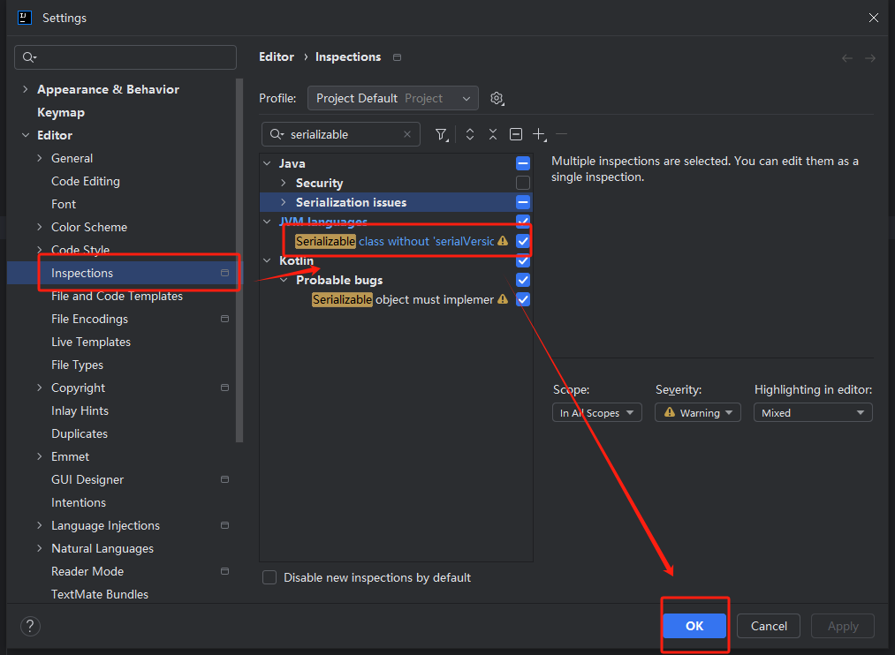

在代码中：

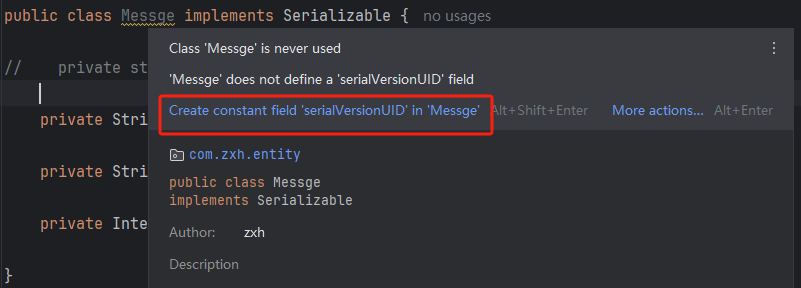

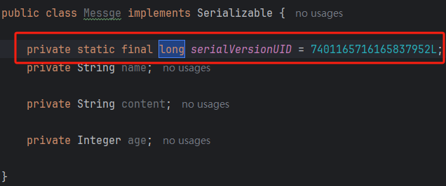

由此拿下。

### List迭代器

List在进行遍历的时候可以使用迭代器Iterator。

那么就有一个问题，在进行迭代器遍历的时候可以进行删除吗？答案是可以的。

先看一段代码：

```java
List<String> list = new ArrayList<>();
        list.add("A");
        list.add("B");
        list.add("C");
        list.add("D");
        list.add("E");

        Iterator<String> iterator = list.iterator();
        while(iterator.hasNext()) {
            String element = iterator.next();
            list.remove(element);
        }
        System.out.println(list);
```

此处汇报异常：ConcurrentModificationException

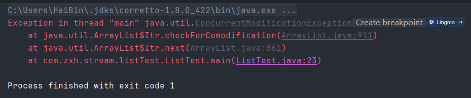

是因为ArrayList、LinkedList集合中内部维护了名称是modCount的字段，用于记录结构被修改的次数，当集合通过迭代器进行遍历的时候，迭代器会记录下这个modCount值，每一次调用这个next()方法之前会先检查modCount是否发生改变，如果已经修改，就会抛出异常。

但是如果我们在进行删除的时候使用迭代器自带的删除remove()方法，那么就不会报错。

```java
List<String> list = new ArrayList<>();
        list.add("A");
        list.add("B");
        list.add("C");
        list.add("D");
        list.add("E");

        Iterator<String> iterator = list.iterator();
        while(iterator.hasNext()) {
            String element = iterator.next();
            iterator.remove();
        }
        System.out.println(list);
```

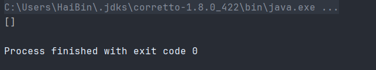

集合成功删除。

调用iterator.remove()方法其实就不仅会从集合中移除元素，还会相应的更新迭代器内部维护的预期修改记数，并不会触发异常。

同时如果使用foreach进行删除的时候也是会报这个异常，原因是foreach其实使用了迭代器进行遍历，那么如果直接删除的话还是同上原理。但是foreach是将iterator.next()方法进行隐藏了，所以说无法直接调用iterator进行删除。

```java
List<String> list = new ArrayList<>();
        list.add("A");
        list.add("B");
        list.add("C");
        list.add("D");
        list.add("E");
        list.forEach(list::remove);
        System.out.println(list);
```

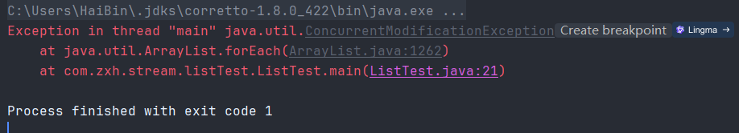

Over！

### 获取当前类的当前执行方法

```java
Thread.currentThread().getStackTrace()[1].getMethodName()
```

这可以打印出当前执行的方法名，比如：insertNurseUser。

扩展一下：

既然这个getStackTrace()[1]打印的是真正的方法名，那么[0]指的是什么呢？

```java
Thread.currentThread().getStackTrace()[0].getMethodName()  //获取的是getStackTrace方法
```

获取的是getStackTrace方法名。

继续，如果是[2]的话呢？

```java
Thread.currentThread().getStackTrace()[2].getMethodName();
```

获取的是当前方法的上一级方法名，如果没有会报错。

比如：

```java
public static void main(String[] args) {
    test1();
    System.out.println(Thread.currentThread().getStackTrace()[2].getMethodName());
}
public static void test1() {
    test2();
}
public static void test2() {
    System.out.println(Thread.currentThread().getStackTrace()[2].getMethodName());
}
```

### Mockito

Mock测试就是在测试过程中，对于某一些不容易构造或者不容易获取的复杂对象，用一个虚拟的对象进行测试的方法。

假设Class A 依赖于Class B，同时Class B依赖于 Class D和Class E，那么如果我们要对Class A进行测试，就需要将Class B 和Class D、E都构造出来。

#### Maven依赖引入

```xml
	<dependency>
            <groupId>org.springframework.boot</groupId>
            <artifactId>spring-boot-starter-test</artifactId>
        </dependency>

        <dependency>
            <groupId>org.junit.vintage</groupId>
            <artifactId>junit-vintage-engine</artifactId>
            <version>5.7.0</version>
            <scope>test</scope>
        </dependency>
```

#### 测试Hello World

> 例子是测试DemoService类，但是DemoService又依赖于DemoDao，这时候我们便可以mock出DemoDao的返回预期值，从而测试DemoService类。

```java
import com.zxh.mapper.impl.DemoDao;

/**
 * @author zxh
 * @Description
 * @date 2024/10/22
 */
public class DemoService {
    private DemoDao demoDao;

    public DemoService(DemoDao demoDao) {
        this.demoDao = demoDao;
    }

    public int getDemoStatus() {
        return demoDao.getDemoStatus();
    }
}
```

依赖于DemoDao。

```java
import java.util.Random;

/**
 * @author zxh
 * @Description
 * @date 2024/10/22
 */
public class DemoDao {
    public int getDemoStatus() {
        return new Random().nextInt();
    }
}
```

测试类:

```java
import com.zxh.mapper.impl.DemoDao;
import com.zxh.service.impl.DemoService;
import org.junit.Assert;
import org.junit.jupiter.api.Test;
import java.util.List;
import java.util.Random;
import static org.mockito.Mockito.mock;
import static org.mockito.Mockito.when;

/**
 * @author zxh
 * @Description
 * @date 2024/10/22
 */
public class HelloWorldTest {
    @Test
    public void helloWorldTest() {
        DemoDao mockDemoDao = mock(DemoDao.class);

        when(mockDemoDao.getDemoStatus()).thenReturn(1);

        Assert.assertEquals(1, mockDemoDao.getDemoStatus());
        System.out.printf("mockDemoDao.getDemoStatus: %d", mockDemoDao.getDemoStatus());

        DemoService mockDemoService = new DemoService(mockDemoDao);
        Assert.assertEquals(1, mockDemoService.getDemoStatus());
        System.out.printf("mockDemoServiceStatus: %d", mockDemoService.getDemoStatus());
    }
}
```

执行结果：

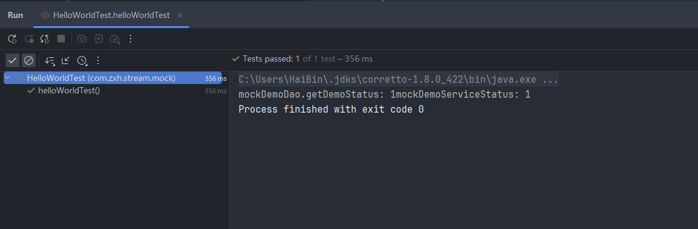

#### 测试：类和接口

```java
import com.zxh.mapper.impl.DemoDao;
import com.zxh.service.impl.DemoService;
import org.junit.Assert;
import org.junit.jupiter.api.Test;

import java.util.List;
import java.util.Random;

import static org.mockito.Mockito.mock;
import static org.mockito.Mockito.when;

/**
 * @author zxh
 * @Description
 * @date 2024/10/22
 */
public class HelloWorldTest {
    @Test
    public void mockClassTest() {
        Random mockRandom = mock(Random.class);
        // mock的数据的产生的值都是默认值，基础类型是0，引用类型是null
        System.out.println(mockRandom.nextInt());
        System.out.println(mockRandom.nextDouble());
        System.out.println(mockRandom.nextBoolean());

        // 指定调用的nextInt方法时，永远返回 100
        when(mockRandom.nextInt()).thenReturn(100);
        Assert.assertEquals(100, mockRandom.nextInt());
        Assert.assertEquals(100, mockRandom.nextInt());
    }

    @Test
    public void mockInterface() {
        List mockList = mock(List.class);

        // 接口的默认值，和类的方法一样，都是返回默认值
        Assert.assertEquals(0, mockList.size());
        Assert.assertEquals(null, mockList.get(0));

        // 注意：调用mock写方法，是无效的
        mockList.add("a");
        Assert.assertEquals(0, mockList.size());
        Assert.assertEquals(null, mockList.get(0));

        when(mockList.get(0)).thenReturn("a");
        Assert.assertEquals(0, mockList.size());
        Assert.assertEquals("a", mockList.get(0));
        Assert.assertEquals(null, mockList.get(1));
    }
}

```

执行结果：

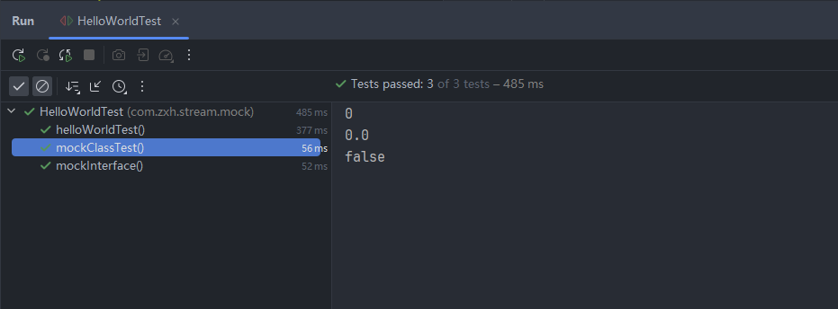

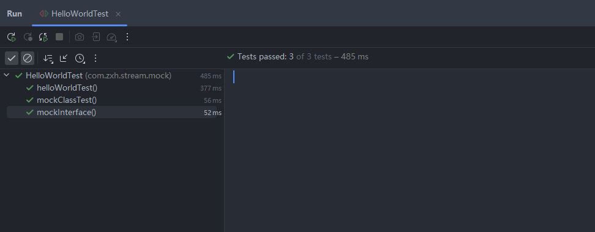

#### 测试：使用@Mock注解

> @Mock注解是对mock方法的替代。

使用这个注解的时候，需要注意需要使用MockitoAnnotations.initMocks 方法，让注解生效。为了简化这个操作，有一个MockitoJUnitRunner类，可以用来代替这个简单操作。

```java
import org.junit.Assert;
import org.junit.Test;
import org.junit.runner.RunWith;
import org.mockito.Mock;
import org.mockito.junit.MockitoJUnitRunner;
import java.util.Random;
import static org.mockito.Mockito.when;
/**
 * @author zxh
 * @Description
 * @date 2024/10/22
 */
// 比较优雅的写法就是使用 @RunWith(MockitoJUnitRunner.class)自动执行MockitoAnnotations.initMocks方法
@RunWith(MockitoJUnitRunner.class)
public class MockAnnotationTest {
    @Mock
    private Random random;

    @Test
    public void test() {
        when(random.nextInt()).thenReturn(100);
        Assert.assertEquals(100, random.nextInt());
    }
}
```

#### 测试：参数匹配

如果参数匹配既声明了精确匹配，有声明了模糊匹配；又或者是同一个值出现了两次，使用的时候匹配符合条件的最新声明的匹配。

```java
import org.junit.Assert;
import org.junit.Test;
import org.junit.runner.RunWith;
import org.mockito.Mock;
import org.mockito.junit.MockitoJUnitRunner;
import static org.mockito.ArgumentMatchers.anyInt;
import static org.mockito.Mockito.when;
import java.util.List;


/**
 * @author zxh
 * @Description
 * @date 2024/10/22
 */
@RunWith(MockitoJUnitRunner.class)
public class ParameterTest {
    @Mock
    private List<String> testList;

    @Test
    public void test01() {

        // 精确匹配
        when(testList.get(0)).thenReturn("a");
        Assert.assertEquals("a", testList.get(0));

        // 精确匹配
        when(testList.get(0)).thenReturn("b");
        Assert.assertEquals("b", testList.get(0));

        // 模糊匹配
        when(testList.get(anyInt())).thenReturn("c");
        Assert.assertEquals("c", testList.get(0));
        Assert.assertEquals("c", testList.get(1));
    }
}

```

anyInt()只是用来匹配参数的工具之一，目前mockito有多种匹配函数。

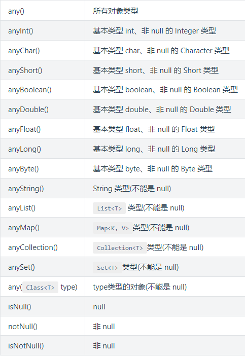

#### 测试：mock异常

> 使用`thenThrow`让方法抛出异常。

```java
import org.junit.Assert;
import org.junit.Test;
import org.junit.runner.RunWith;
import org.mockito.Mock;
import org.mockito.junit.MockitoJUnitRunner;
import static org.mockito.Mockito.doThrow;

/**
 * @author zxh
 * @Description
 * @date 2024/10/22
 */
@RunWith(MockitoJUnitRunner.class)
public class DoThrowTest {
    static class ExampleService {
        public void hello() {
            System.out.println("Hello");
        }
    }

    @Mock
    private ExampleService exampleService;

    @Test
    public  void test() {
        // 对应返回类型是void函数，thenThrow是无效的，
        doThrow(new RuntimeException("异常")).when(exampleService).hello();

        try {
            exampleService.hello();
            Assert.fail();
        } catch (Exception e) {
            Assert.assertEquals("异常", e.getMessage());
        }
    }
}
```


## Linux

### 设置权限

在使用docker启动应用程序的时候，可能会有一些错误：ERROR: Elasticsearch did not exit normally - check the logs at /usr/share/elasticsearch/logs/docker-。对此我们需要给与文件夹赋予chmod 777 -R ./*全读写权限

```shell
chmod 777 -R ./*
```

### 设置定时任务：

编辑crontab -e

在打开的文件中可以进行定时任务的编写：使用cron表达式：

```shell
0 1 * * * /home/user/script.sh
```

如上就是在每天的凌晨一点执行一个脚本/home/user/script.sh。

之后就可以进行保存了。

正常情况下，cron会自动加载新的定时任务。

- 查看当前用户的crontab文件：

  ```shell
  crontab -l
  ```

- 删除当前用户的crontab文件：

  ```shell
  crontab -r 
  ```

- 运行cron服务

  ```shell
  sudo service cron start
  # 或者
  sudo systemctl cron start
  ```

  

## 小程序

### <block>标签

<block>不是一个组件，只是一个包装元素，不会再页面做任何的渲染。只能接收控制属性。也就是wx:if。所以说如果直接在block标签上绑定事件是不会生效的。

### 排错记录

#### 微信WebSocket无法正常连接 Invalid HTTP status

错误码 {"errCode":1004,"errMsg":"open fail: _code:20,_msg:Invalid HTTP status."}

解决：

在app.js中添加encodeURIComponent(token)即可、。

原来解决方案的地址:https://developers.weixin.qq.com/community/develop/doc/0000c6e57ac67827b9dd8b5ec5b800?jumpto=comment&commentid=000a42d7f5c77027b9dde7c84514

#### cannot read property '2' of undefined

这个是由于本地环境中网络环境不通，关掉VPN即可。。

## 前端

### Promise

Promise是个什么东西呢？类？对象？数组？函数？

打印一下：`console.dir(Promise)`

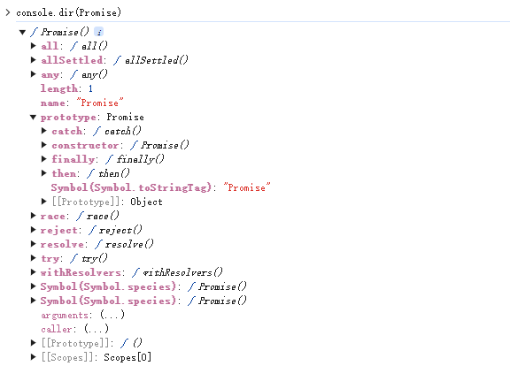

上述图片就是打印之后的结果。很明显，Promise是一个函数，本身是有all、any、reject、resolve方法的，原型上有then、catch等方法。那么 `new Promise()` 一定存在then、catch方法了？对的。

```html
<!DOCTYPE html>
<html lang="zh-CN">
<head>
    <meta charset="UTF-8">
    <meta name="viewport" content="width=device-width, initial-scale=1.0">
    <title>随机生成页面</title>
    <style>
        body {
            font-family: Arial, sans-serif;
            background-color: #f0f0f0;
            display: flex;
            justify-content: center;
            align-items: center;
            height: 100vh;
            margin: 0;
        }
        .container {
            text-align: center;
            background-color: #fff;
            padding: 20px;
            border-radius: 10px;
            box-shadow: 0 0 10px rgba(0, 0, 0, 0.1);
        }
        button {
            padding: 10px 20px;
            font-size: 16px;
            cursor: pointer;
            border: none;
            background-color: #007bff;
            color: #fff;
            border-radius: 5px;
        }
        button:hover {
            background-color: #0056b3;
        }
    </style>
</head>
<body>
<div class="container">
    <h1>Promise_Test</h1>
    <button onclick="promiseTest()">Promise_test</button>
</div>

<script>
    function promiseTest() {
        var p = new Promise(function(resolve, reject) {
            // 做一些异步操作
            setTimeout(function () {
                console.log('执行完成')
                resolve('这是数据：123')
            }, 2000);
        })
    }
</script>
</body>
</html>
```

> 上述的HTML只写一次，以下的代码只写JS部分。

#### resolve

Promise接收的是一个函数，接收的函数中需要做的是有两个参数：resolve、reject，表示异步执行成功之后的回调函数和异步操作执行失败的回调函数。按照标准来说的话，其实是resolve函数将Promise的状态设置成fullfiled，reject是将Promise的状态设置成rejected。

上述代码执行的结果是隔了两秒输出："执行完成",调用resolve方法。

我们使用Promise的时候一般是包裹在一个函数中，在需要的时候去调用这个函数即可。

```javascript
    function runAsync() {
        let p = new Promise(function (resolve, reject) {
            // 做一些异步操作
            setTimeout(function () {
                console.log('执行结束')
                resolve('这是数据：123')
            }, 2000)
        })

        return p
    }

    function promiseTest() {
        runAsync()
    }
```

包装这个函数有毛线用呢？resolve()是干啥的？

我们在包装了一个function之后，会return Promise对象，也就是我们执行了这个函数之后其实得到的是一个Promise对象。还记得Promise上有then、catch函数吗？这个就是精髓。

```javascript
runAsync().then(function(data) {
    console.log(data);
    // 后面可以用传过来的数据做一些其他的操作
    // ......
})
```

在runAsync返回值直接调用then方法，then接收一个参数，是函数，且会拿到我们在resolve函数中传递的参数。运行这一段代码，会在2秒输出"执行完成"，紧接着输出"这是数据:123"。

then方法就跟我们平时的回调函数是一个意思，能够在runAsync这个异步任务执行完成之后被执行。这就是Promise的作用了，简单来说，就是将原本的回调方法的写法分离出来。在异步操作执行完成之后，用链式调用的方法执行回调函数。

难道Promise就只是一个回调的作用吗？有个屁用！

再换一个场景，如果有多层回调，也就是我们说的回调地狱，那怎么办？then方法便提供了一个解决方案。

```javascript
function runAsync() {
        let p = new Promise(function (resolve, reject) {
            // 做一些异步操作
            setTimeout(function () {
                console.log('执行结束')
                resolve('这是数据：123')
            }, 2000)
        })

        return p
    }

    function runAsync1() {
        var p = new Promise(function (resolve, reject) {
            // 做一些异步的操作
            setTimeout(function () {
                console.log('异步任务1执行完成1')
                resolve('这是runAsync1')
            }, 1000)
        })

        return p;
    }

    function runAsync2() {
        var p = new Promise(function (resolve, reject) {
            // 做一些异步的操作
            setTimeout(function () {
                console.log('异步任务2执行完成2')
                resolve('这是runAsync2')
            }, 1000)
        })

        return p;
    }

    function runAsync3() {
        var p = new Promise(function (resolve, reject) {
            // 做一些异步的操作
            setTimeout(function () {
                console.log('异步任务3执行完成3')
                resolve('这是runAsync3')
            }, 1000)
        })

        return p;
    }

    function promiseTest() {
        runAsync().then(function (data) {
            console.log(data)
            return runAsync1()
        }).then(function (data) {
            console.log(data)
            return runAsync2()
        }).then(function (data) {
            console.log(data)
            return runAsync3()
        }).then(function (data) {
            console.log(data)
        })
    }
```

输出结果：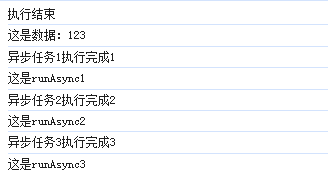

在then方法中，也可以直接return数据不是Promise对象，在后面的then中就可以接收到数据了，修改代码：

```javascript
runAsync1()
.then(function(data){
    console.log(data);
    return runAsync2();
})
.then(function(data){
    console.log(data)
    return "直接返回数据了";
})
.then(function(data){
    console.log(data) // 此处的输出就是："直接返回数据了"
})
```

#### reject

我们继续来看看ES6的Promise还有那一些功能。我们只使用了resolve，但是reject没有使用，很简单，就是处理失败的情况所调用的函数。

```javascript
    function getNumber() {
        let p = new Promise(function (resolve, reject) {
            // 做一些异步操作
            setTimeout(function () {
                var num = Math.ceil(Math.random() * 10); // 生成1-10的随机数
                if (num <= 5) {
                    resolve(num)
                } else {
                    reject('数字过大...')
                }
            }, 1000)
        });

        return p;
    }

    function promiseTest() {
        getNumber()
            .then(function (data) {
                console.log('resolved');
                console.log(data)
            }, function (reason, data) {
                console.log('rejected');
                console.log(reason);
            })
    }
```

getNumber用来异步获取一个数字，2秒后执行完成，如果数字小于等于5，我们认为是成功的，调用resolve修改Promise的状态，否则我们认为是"失败"的，调用"reject"并传递一个参数，作为失败的原因。

运行结果:

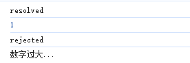

#### catch的用法

catch方法就是拿到reject的回调。

```javascript
getNumber()
            .then(function (data) {
                console.log('resolved');
                console.log(data)
            })
            .catch(function(reason) {
                console.log('rejected');
                console.log(reason);
            })
```

效果和写在then的第二个参数一样。不过还有其他作用：在执行resolve回调时，如果抛出异常了，不会直接报错卡死JS，而是会进到这个catch方法中：

```javascript
getNumber()
	.then(function(data) {
    console.log('resolved')
    console.log(data)
    console.log(someData) // 此处的someData没有定义
})
	.catch(function(reason) {
    console.log('reject')
    console.log(reason)
})
```

在resolve的回调中，我们console.log(someData)；会导致控制台报错，不在向下运行，但是在这里，我们可以通过catch进行拦截。其实就是try catch。

#### all的用法

Promise的all方法提供了并行执行异步操作的能力，并且在所有异步操作执行完成之后才执行回调。我们依旧使用上述的runAsync1、runAsync2、runAsync3来进行距离。

```javascript
Promise
            .all([runAsync1(), runAsync2(), runAsync3()])
            .then(function(results) {
                console.log(results);
            })
```

all用来接收一个数组参数，里面的值最终都算返回Promise对象。这样，三个异步操作是并行执行的，等到他们都执行完成之后才会进到then里面。resolve中的返回的数据都在那里呢？其实都是在then当中的，all 会将所有异步操作结果放在一个数组中传给then，就是上面的results。以上的输出结果就是：

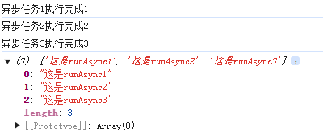

> 以上的all用在什么地方呢？一些游戏类的素材比较多的应用，打开网页时，需要预先加载需要用到的各种资源图片、flash以及各种静态文件。所有的都加载完成之后，我们再进行页面初始化。

#### race的用法

all方法实际上是【谁执行的慢，以谁的结果执行】，相对的方法就是这个race，【谁执行的更快，那么就以谁的结果执行】。

```javascript
Promise
            .race([runAsync1(), runAsync2(), runAsync3()]) //
            .then(function (results) {
                console.log(results);
            })
```

这三个异步操作同样是并行执行的。结果如下：

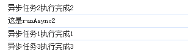

我们已经将任务2的执行时间换成500ms，所以说任务2是第一个执行玩的，所以最终的results是runAsync2。

> 这个race方法可以用在什么地方呢？最简单的场景是用race给某一个异步请求设置超时时间，并且超时之后执行响应的操作。
>
> ```javascript
> function requestMsg() {
>         let p = new Promise(function (resolve, reject) {
>             let img = new Image();
>             img.onload = function() {
>                 resolve(img);
>             }
>             img.src = "http://www.asdfh.com/getPic?pic_url=llllads";
>         });
>         return p;
>     }
> 
>     // 这是超时函数
>     function timeout() {
>         let p = new Promise(function (resolve, reject) {
>             setTimeout(function () {
>                 reject('图片资源请求超时!');
>             }, 5000) // 请求5S还没有的话就抛出
>         });
>         return p;
>     }
> 
>     function promiseTest() {
>         Promise
>             .race([requestMsg(), timeout()])
>             .then(function(results) {
>                 console.log(results)
>             })
>             .catch(function (reason) {
>                 console.log(reason)
>             })
>     }
> ```
>
> 如上，我们在请求某一个地址没有请求成功的时候，直接进入到reject当中。

Promise--Over！


## 数据库

### 锁表问题

PGSQL处理锁表：

1. 先查询某一张表的加锁状态:

   ```sql
    SELECT
       pg_stat_activity.pid,
       pg_stat_activity.query,
       pg_locks.locktype,
       pg_locks.mode,
       pg_locks.granted,
       pg_class.relname,
       pg_stat_activity.state,
       pg_stat_activity.query_start,
       age(now(), pg_stat_activity.query_start) as "age",
       pg_stat_activity.usename
   FROM
       pg_stat_activity
   JOIN
       pg_locks ON pg_stat_activity.pid = pg_locks.pid
   JOIN
       pg_class ON pg_locks.relation = pg_class.oid
   WHERE
       pg_class.relname = 'dict_user_role' -- 表名
       AND (pg_locks.granted IS FALSE OR pg_stat_activity.state = 'idle in transaction');
   ```

2. 解锁

   ```sql
   SELECT pg_terminate_backend(14955); -- （）里的是对应的锁住这张表的pid
   ```

## Redis

### Redis的事务

#### 介绍

官网中有这么一句话：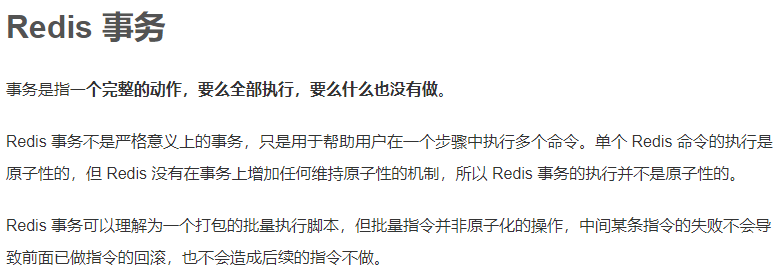

所以说，Redis的事务并不是一个真正意义上的事务。而是一些命令的集合。

multi、exec、discard三条指令构成了Redis的事务处理的基础。

- multi：用来组装一个事务，从输入的multi命令开始，这一些命令都会进入命令队列中，但是并不会执行，直到输入exec之后Redis才会将之前的命令执行。
- exec：用来执行一个事务
- discard：用来取消一个事务

案例一：

```shell
127.0.0.1:6379> set user_id 1
OK
127.0.0.1:6379> get user_id
"1"
127.0.0.1:6379> multi
OK
127.0.0.1:6379(TX)> incr user_id
QUEUED
127.0.0.1:6379(TX)> incr user_id
QUEUED
127.0.0.1:6379(TX)> incr user_id
QUEUED
127.0.0.1:6379(TX)> exec
1) (integer) 2
2) (integer) 3
3) (integer) 4
127.0.0.1:6379> get user_id
"4"
```

上述的命令是现在multi执行之后进行设置自增，但是不执行。之后执行exec之后一起执行。最终的结果是4。

案例二：

```shell
127.0.0.1:6379> keys *
(empty array)
127.0.0.1:6379> multi
OK
127.0.0.1:6379(TX)> set greeting "hello"
QUEUED
127.0.0.1:6379(TX)> set jjj aaa
QUEUED
127.0.0.1:6379(TX)> discard
OK
127.0.0.1:6379> keys *
(empty array)
```

在最后执行discard命令。放弃命令的执行。

#### 错误处理

1. 在命令进行排队的时候出现了错误警告，那么整个事务就会直接失败。

```shell
127.0.0.1:6379> multi 
OK
127.0.0.1:6379(TX)> set name ready
QUEUED
127.0.0.1:6379(TX)> set age 30
QUEUED
127.0.0.1:6379(TX)> set1 hhh 111
(error) ERR unknown command 'set1', with args beginning with: 'hhh' '111' 
127.0.0.1:6379(TX)> exec
(error) EXECABORT Transaction discarded because of previous errors.
127.0.0.1:6379> get name
(nil)
127.0.0.1:6379> keys *
(empty array)
```

2. 命令组队的过程中没有问题，但是执行中出错了会导致部分的命令执行失败

```shell
127.0.0.1:6379> multi 
OK
127.0.0.1:6379(TX)> set books insdfsdd
QUEUED
127.0.0.1:6379(TX)> set poorman me
QUEUED
127.0.0.1:6379(TX)> incr books
QUEUED
127.0.0.1:6379(TX)> exec
1) OK
2) OK
3) (error) ERR value is not an integer or out of range
127.0.0.1:6379> get books
"insdfsdd"
127.0.0.1:6379> get poorman
"me"
```

## Git

### 提交规范(公司用需要工单号 + 提交描述)

1. feat 增加新的功能
2. fix 修复问题
3. style 代码风格相关
4. perf 优化/性能提升
5. refactor 重构
6. revert 撤销修改
7. test 测试相关
8. docs 文档/注释
9. chore 依赖更新/脚手架配置修改
10. workFlow 工作流修改
11. ci 持续集成
12. types 类型定义文件的修改
13. wip 正在开发


## 记事本

deepseek API KEY:

```shell
sk-abacaef26bb34f40b6682b265cdb226b
```


